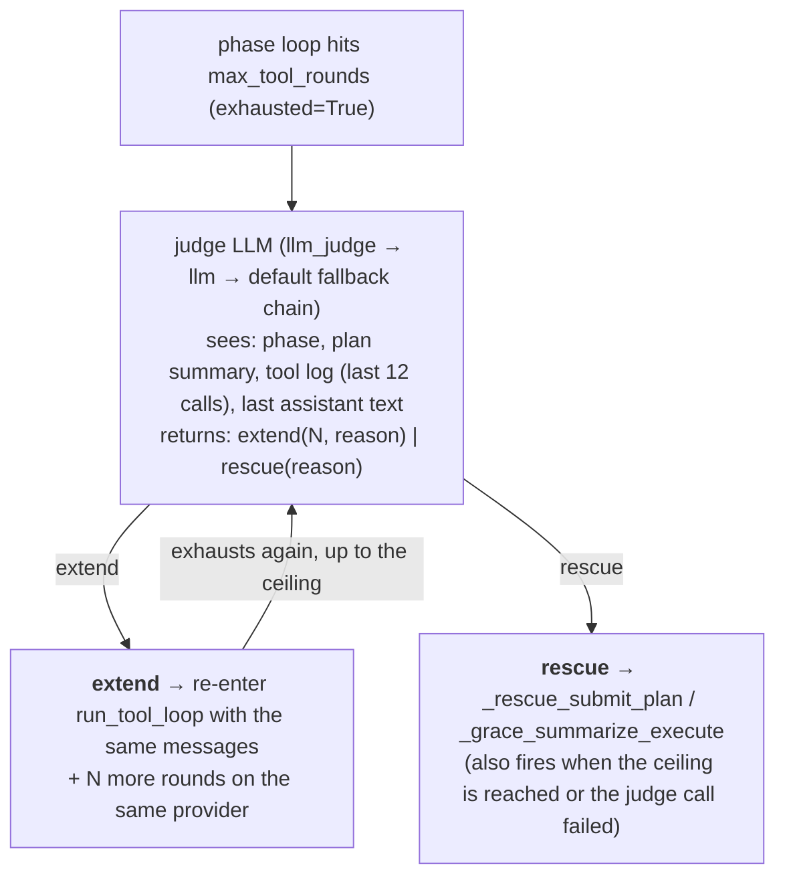

# Turn Engine

Each agent turn in Crewlet runs through a three-phase **Plan → Execute → Review** loop orchestrated by the `TurnEngine` (`src/crewlet/agent/turn.py`). Each phase is an LLM call with a different system prompt, a different tool surface, and optionally a different model. The turn engine also owns ephemeral sub-agent spawning and enforces the delegation-depth / stall / sub-agent allowlist invariants in code.

---

## Why three phases?

A single LLM call with a generic system prompt and every tool's schema loaded into `tools=[...]` is too thin for work that needs planning, tool selection, iteration, and structured self-review — and it bloats payloads when there are 50-150 MCP tools per role.

The turn engine instead splits the turn into phases with different purposes:

- **Onboarding** (first turn only, conditional) runs *before* Plan when the agent has no onboarding marker for its current org chain. It reads the team's `Onboarding` pages, captures conventions via `reflect_and_persist`, and calls `mark_onboarded`. It has its **own** round budget (`turn_engine.onboarding_max_tool_rounds`, default 10) so onboarding never competes with the Plan budget — if it ran inside Plan it could consume every Plan round before the planner ever called `submit_plan`, silently dropping a first-turn request. Skipped on resume turns and once the agent is marked. See [First-turn onboarding](#first-turn-onboarding).
- **Plan** decides *what* to do. Output: an `ExecutionPlan` Pydantic artifact with `reasoning`, ordered `steps`, `tools_needed`, and `success_criteria`. May short-circuit to `direct` for trivial tasks.
- **Execute** runs the plan. The tools the plan named (plus a small always-on set) are exposed as schemas upfront; Execute can additionally discover and activate tools the planner missed via the `activate_tool` / `list_mcp_server_tools` meta-tools — the executor is not locked to the planner's predictions.
- **Review** judges the outcome: `done` | `self_iterate`. No domain tools; a single `submit_review` structured-output tool forces the decision enum. There is no handoff decision: when the turn is blocked and needs a manager or peer, Review picks `self_iterate` and the note tells Plan to add an outreach step so Execute reaches the colleague with its own colleague-surface tools — the same tools a human teammate would use (there is no special escalation mechanism).

Sub-agents (`spawn_subagent`) are bespoke short-lived workers with a parent-chosen tool allowlist — ideal for web research, code execution, or other capability-focused subtasks that shouldn't count as colleague delegation. They start with the tools the parent named but can also discover and activate more *read-only* tools themselves (`list_mcp_server_tools` → `activate_tool`), so a sub-agent handed a vague "find X" task can locate the right read tool instead of failing when the parent guessed the tool name wrong. `spawn_subagent_batch` runs several such workers in parallel under one shared budget.

---

## Phase-specific tool surfaces

Each phase gets a filtered view over the shared `ToolRegistry` via `ToolSurface` (`src/crewlet/tools/surface.py`). This is the key constraint that keeps LLM payloads tight while still letting each phase recover from incomplete plans / under-specified catalogues.

| Phase | `tools=[...]` | System prompt | Notes |
|-------|---------------|---------------|-------|
| **Onboarding** | `reflect_and_persist`, `mark_onboarded`, `load_tool_skill` always-on, plus the `activate_tool` / `list_mcp_server_tools` discovery meta-tools | One-line identity + the onboarding instructions (which pages to read, persist conventions, then `mark_onboarded`) + slim discovery catalogue | Runs only on a first turn for an unmarked agent (`agent.onboarding_phase`), on its own budget. Discovers its knowledge-base tools via `list_mcp_server_tools` → `activate_tool` exactly like Plan. **No required-skill guard** — onboarding is a fixed read → persist → mark workflow and the prompt is its own guidance, so the load-before-use tax is skipped. Terminates on `mark_onboarded`; on budget exhaustion the agent stays unmarked and retries next turn. |
| **Plan** | `submit_plan`, `activate_tool`, `list_mcp_server_tools`, `load_tool_skill` meta-tools, plus any catalogue tool the planner has activated this turn | Identity + **full policy text** + role profile + skills metadata + roster (leads) + compact plan contract + **slim** tool catalogue (builtin tool names + MCP server names only) | The slim catalogue lists every builtin tool but only the names of MCP servers — individual MCP tool names (often 50–150 per role) stay out of the prompt. To use an MCP tool the planner calls `list_mcp_server_tools(server)` for discovery, then `activate_tool(name)` to promote it into `tools=[...]` so its schema arrives on the next round (in-Plan recon: reading threads, issues, or docs; agent lookup). Action / write tools should NOT be activated here — name them in `submit_plan`'s `tools_needed` and let Execute run them under Review. Mission, vision, backstory, full policy text, and behavioral guidelines render directly into the Plan prompt from the in-memory `Organization` model — no DB seed step. |
| **Execute** | `plan.tools_needed ∪ executor_always_on_tools ∪ {activate_tool, list_mcp_server_tools}` | One-line identity + plan summary + execute contract + same slim catalogue Plan sees | Execute carries the same discover-then-activate flow Plan does, so the executor can recover when the planner missed an action tool — call `list_mcp_server_tools(server)`, then `activate_tool(name)`, then call the activated tool normally on the next round. Successful mid-run activations fan out a `phase.tool_activated` event (with `phase="execute"`, plus `turn_id` / `iteration` for correlation with the surrounding phase events) so operators can see when plans are chronically under-specified. Activated tools are also appended to the parent's `parent_tool_names` snapshot so a sub-agent the parent spawns later in the same turn inherits them. Calls to names that are neither in the surface nor in the role's catalogue still fire `execute.missing_tool`; Review catches that as a true plan-incompleteness signal. |
| **Review** | `submit_review` meta-tool only | One-line identity + plan summary + Execute artifact + decision-enum contract | No catalogue, no policies. Policy-sensitive constraints ride on the plan's `success_criteria`. |
| **Sub-agent** | Parent-named allowlist minus the engine-control denylist (`spawn_subagent`, `a2a_ask`, the discovery meta-tools) **and** minus any tool whose [MCP annotations](tool-capabilities.md) mark it a write to a shared surface | Parent's task prompt + mandated preamble | Fresh context; asyncio timeout; runtime-clamped `max_turns`. Sub-agents have a fixed parent-chosen surface and cannot grow it via `activate_tool` / `list_mcp_server_tools` — those names are on the first-party control denylist. External-write tools are denied by *capability* (derived from MCP annotations), not by a hardcoded tool-name list, so the guard holds for any tool stack. |

---

## First-turn onboarding

A fresh agent (no onboarding marker for its current org chain) needs to read its team's `Onboarding` knowledge-base pages and internalise the conventions before doing real work. This runs as a **dedicated phase before Plan** (`src/crewlet/agent/onboarding_phase.py`), gated on the marker store (`agent_onboarding_markers`):

1. The engine checks the marker. The read is **tri-state**: `True` (marked for the current chain) skips; `False` (definitively unmarked) runs the pass; `None` (the lookup *failed* — state unknown) **skips this turn and retries the check next turn**. Collapsing a failed lookup into "not onboarded" would re-run a full onboarding pass for an already-marked agent on any transient DB error. Two further guards make onboarding strictly run-once per org chain: a **process-local latch** (`AgentInstance.onboarded_chain_hash`, set the moment a pass marks or a read confirms the marker) short-circuits before any DB read, and a **single-flight lock** (`AgentInstance.onboarding_lock`) holds a concurrent turn at the gate while a pass runs — turns are normally serialized per agent, but the sandbox busy-state transitions can free the agent while an earlier turn is still mid-flight, and without the lock both turns would read "unmarked" and run duplicate passes.
2. Otherwise it runs `run_onboarding_phase` with its **own** round budget (`turn_engine.onboarding_max_tool_rounds`, default 10). The agent discovers its knowledge-base tools (`list_mcp_server_tools` → `activate_tool`), reads the pages, captures conventions with `reflect_and_persist`, and calls `mark_onboarded` (which terminates the phase). Onboarding is a **discovery-capable phase** — its surface exposes the slim tool catalogue and supports `activate_tool` exactly like Plan/Execute. (Without that, the agent could *see* its knowledge-base tools via `list_mcp_server_tools` but every `activate_tool` would hit an "availability gate" — it would never read its pages, never mark, and the pass would re-fire every turn.) Its rounds are governed by the same round-cap **extension judge** as Plan/Execute: the base cap can be extended up to `onboarding_max_tool_rounds_ceiling` (default 20) when the agent is still making progress, so a near-done pass isn't cut off mid-read.
3. The turn then proceeds to Plan with the onboarding hint **suppressed for the rest of the turn** (`turn.onboarding_ran`), so onboarding can't also happen inside Plan and re-spend the Plan budget. The Plan-hint path applies the same tri-state + latch rules: the hint renders only when the agent is *definitively* unmarked — never on a failed lookup, which would otherwise trigger a repeat onboarding inside Plan for an already-marked agent.

**Why a separate phase.** If onboarding were only a hint injected into the Plan prompt, the planner would do the page-reads + `reflect_and_persist` + `mark_onboarded` inside the Plan phase — on a first turn that could burn the entire Plan round budget before the planner ever called `submit_plan`, and the turn would fall through to a silent skip (the request dropped). Giving onboarding its own budget means a first turn always has its full Plan budget for actual planning.

The marker invalidates itself when the org chain changes (`compute_chain_hash`), so a role move / reorg re-triggers onboarding for the new context. Set `onboarding_max_tool_rounds: 0` to disable the dedicated pass. When the marker store isn't wired (no DB), onboarding is skipped — there's no way to record completion, so it would otherwise run every turn.

On the dashboard, onboarding renders as its **own** group (a `book` label, no trigger chip), separate from the triggering turn — it's one-time setup that happens to ride the first turn, not part of that turn's task.

---

## ExecutionPlan artifact

```python
class ExecutionPlan(BaseModel):
    decision: Literal["plan", "direct", "skip"] = "plan"
    reasoning: str = ""
    steps: list[Step]
    tools_needed: list[str]
    success_criteria: list[str]
```

To hand a task off to a colleague the planner uses `decision="plan"` with a step that reaches them where the work lives (a chat mention, an issue comment / reassignment, or `a2a_ask`) and names that tool in `tools_needed`. There is no dedicated `delegate` decision — a handoff is just Execute calling the colleague-surface tool.

**Real code work** is the `run_sandbox` Execute tool, not a plan field. For a role gated with `role.sandbox.enabled`, the planner lists `run_sandbox` in `tools_needed` (alongside the tool it will report/act with); Execute calls it to run a coding agent (Claude Code / OpenCode) in an isolated sandbox. The call **suspends** the Execute tool-loop (detached run); when the run completes the engine **resumes the same loop** with the result spliced in as that call's reply, so the executor reports / acts in the same turn. See [Code Sandbox](code-sandbox.md).

When the planner and executor share a model, the plan can be free-text + termination decision. With per-phase model split enabled (see below) the planner emits a typed `ExecutionPlan` via the `submit_plan` tool so the cheaper executor doesn't need planner-level judgment at each step.

### Review is mandatory on `plan` decisions

Review runs after Execute on every `plan` decision. The planner cannot opt out — there is no `needs_review` field. Review is the only path that can `self_iterate` with broader tools (including looping back so Plan adds a colleague-outreach step when the turn is blocked), surface a delivery-gap to the dashboard, or catch stall conditions; skipping it removes the engine's only safety net. The cost of a Review pass on a truly mechanical task is a single confirmatory LLM call; the cost of skipping Review when it was needed is a silent half-finished turn (Execute fetches, writes "I should now ..." in plain text, terminates with nothing delivered — a failure shape seen repeatedly in real traces).

`direct` is the one branch that still skips Review: a direct plan has no explicit success criteria for Review to judge against, so letting Review run invites it to hallucinate criteria from the agent's role description and `self_iterate` — re-firing external side effects that already happened. The turn engine has a safety net for `direct` though: if **Execute** didn't successfully call any of the action tools listed in `tools_needed`, Review is forced anyway (`review_forced_execute_skipped_delivery` event logs the override). The safety net is intentionally Execute-only: `decision="direct"` is the planner committing to "Execute does the work in one shot" — Plan-phase recon calls that happen to overlap `tools_needed` (e.g. a `jira_get_issue` lookup before the reply) must not satisfy delivery and bypass the safety net.

After Review runs, the post-Review override that flips a hallucinated `done` → `self_iterate` uses a broader view: successful calls in either phase count, with the Plan-meta-tools (`submit_plan` / `activate_tool` / `load_tool_skill`) and failed calls (`success=False`) filtered out. Review has just seen the full `## What Plan did` log and judged with that context, so a Plan-delivered action is genuine delivery — demanding Execute repeat it would double-post. `turn.plan_tool_executions` is scoped to the current iteration so iter-1's Plan calls cannot satisfy iter-2's delivery check after a `self_iterate` loop.

Both delivery gates (the `direct` safety net and the post-Review override) have to cope with the planner's **wrong guesses**. The planner never sees MCP tool *names* — its catalogue lists MCP *servers* only — so it guesses the names it lists in `tools_needed`, and Execute recovers by discovering and activating the real tool (`list_mcp_server_tools` → `activate_tool`). The gate handles a guess two ways:

- **The guess resolves** in the catalogue → name-match precisely: the named tool must have been called.
- **All guesses are phantom** (none resolve — e.g. `slack_conversations_postMessage` for a server that exposes `slack_conversations_add_message`) → name-matching is impossible, so fall back to *capability*: the turn counts as delivered iff a phase actually called a **substantive** tool — one that isn't a meta / always-on tool and isn't a positively-known read (from its MCP [annotations](tool-capabilities.md)). That is the real delivery tool the phase discovered, whatever its name.

This avoids double-posting (a real delivery via the discovered tool reads as delivered, so the override doesn't re-fire the same side effect) **without** opening the opposite hole: if the gate simply dropped phantom names, then a turn whose named delivery tool was a phantom and whose Execute called **nothing** would read as "no action expected" and complete silently without ever posting — a direct reply that produced text but never reached the channel. Intent is therefore keyed off the **raw** `tools_needed` (phantom names included, `tools_needed_not_in_catalogue` debug log), so a wrong guess can never disable the gate. Execute is additionally *told* which of its plan-named tools don't resolve, so it discovers the real one (`list_mcp_server_tools` + `activate_tool`) instead of stopping at a text reply.

`skip` never runs Execute and therefore never runs Review.

`skip` is narrowly scoped: it means **"nobody was actually asking the agent to do anything"** — informational triggers, passing references, broadcasts where the addressee was clearly someone else. When the agent *was* directly asked / @mentioned / assigned but is declining (out of scope, wrong owner, already handled, deferring), the planner must instead emit `decision="plan"` with a single step that posts a brief explanation via the originating channel's reply tool. A direct request answered with silence looks like the ping was lost; the one-line decline closes the loop. `PLAN_HEADER` enforces this in prose, and the per-source notification prompts (`slack.py`, `jira.py`, `confluence.py`, `base.py`) carry the same rule on the triage side.

The Plan-phase prompt header (`PLAN_HEADER` in `src/crewlet/agent/prompts.py`) nudges planners to **list both recon and likely action tools** in `tools_needed` upfront so Execute can act in a single pass — a latency / token-cost optimisation, not a correctness requirement. Review→`self_iterate` is the slower fallback when the planner couldn't predict the action.

The per-phase headers are deliberately verbose — each rule traces to an observed turn-ending failure, and `test_prompts.py` holds them under explicit token budgets (Plan < 2400, Execute < 300, Review < 450) so the prose can't grow unchecked. The repeated cost of re-sending these static headers on every round of the tool loop is absorbed by **[provider prompt caching](overview.md#llm-provider)**, not by trimming the guidance: the `system + tools` prefix is byte-stable within a phase and across an agent's turns, so it is cached and re-read cheaply rather than re-billed each round. Slimming a header to save tokens is therefore the wrong trade — it re-opens the incidents the rules were added to close, for a saving caching already captures.

---

## ReviewOutcome

```python
class ReviewOutcome(BaseModel):
    decision: Literal["done", "self_iterate"]
    notes: str = ""
    completed_work: str = ""
    final_artifact: str = ""
```

- `done` → return `final_artifact` (fallback: Execute's text).
- `self_iterate` → record the round in the [prior-work ledger](#prior-work-ledger-across-self_iterate-rounds) and loop back to Plan. Capped at `turn_engine.max_iterations` (default 3); two unchanged-artifact rounds publish a `turn.guard_breach(kind="stall")` and terminate the turn as `failed` (engine-driven, not an LLM decision).

When a turn is blocked and needs a manager or peer — a capability gap requiring someone else's identity / credentials, or a decision above the agent's authority — Review chooses `self_iterate` and says so in `notes`. The next Plan pass adds an outreach step and Execute reaches the colleague directly with its own colleague-surface tools (a Slack mention, a Jira comment, `a2a_ask`) — the same way a human teammate asks for help, and the same way an agent reaches a [human seat](humans-in-the-org.md). The colleague replies asynchronously and that re-triggers the agent. There is **no** engine-side handoff dispatcher, **no** `ask_colleague` decision, and **no** `role.fallback` chain: escalation is ordinary tool use during Execute (no special escalation mechanism).

### Prior-work ledger across `self_iterate` rounds

Every phase rebuilds its LLM conversation from scratch on each iteration — Plan and Execute start from `[system, user]`, and `turn.plan_tool_executions` is deliberately reset per iteration so the delivery gate can't read iteration 1's calls as iteration 2's delivery. Without a record kept *outside* those conversations, a `self_iterate` round starts blind: it cannot tell that iteration 1 already posted to Slack, so it plans the post again and the side effect fires twice.

`TurnContext.iteration_history` is that record. The engine appends one `IterationRecord` (`src/crewlet/agent/iteration_log.py`) immediately before each loop-back, and `render_iteration_ledger` renders the accumulated records into three places:

| Consumer | Where | Why |
|---|---|---|
| **Plan** | `## Already done earlier in this turn` in the **user** message | Plan only the gap, not the whole task again |
| **Execute** | same block | Execute is what actually fires side effects, so it holds the evidence even if the planner re-lists a spent delivery tool |
| **Review** | `## Earlier iterations (already delivered)` in the system prompt | Makes the duplicate-delivery rule work turn-wide instead of only inside one iteration |

The block rides the **user** message in Plan and Execute, never the system prompt: the Plan system prompt is frozen at turn start (`TurnContext.plan_prefetch`) so its prefix stays byte-stable for provider prefix caching, and a section that grows each iteration would invalidate that cache on every loop. On iteration 1 the ledger is empty and the message is byte-identical to a single-pass turn.

**Two layers, deliberately.** The tool-call lists are *engine-recorded*, so they cannot be forgotten — which matters most on the post-Review `done` → `self_iterate` override, where Review decided `done` and therefore wrote no prose at all, yet a partial delivery may already have landed. `ReviewOutcome.completed_work` is the reviewer's gloss on top, expressing what the mechanical log cannot: *"the post landed and reads fine — follow up in that thread rather than re-posting."* Same trust order the reviewer already applies to `## What Execute did` over `## What Execute produced`.

**Reads are marked, not merged with writes.** Tool *results* are deliberately not carried across iterations, so a read the next round needs must be re-run — telling it "do not repeat" a `jira_get_issue` would push it to invent the data instead. Each record carries the positively-known read names the delivery gate already resolves from [MCP annotations](tool-capabilities.md), reads render as `→ success (read)`, and the prompt permits re-running exactly those. Failed calls stay marked `→ error`: they did not take effect and may be retried.

### What the ledger trims, and why

One principle decides every budget: **elide payloads, never structure.**

A *payload* — a message body, page HTML, a diff — is unbounded, gets re-authored from the plan next round, and can never answer "did this already fire". Carrying it only buries the two lines that can. *Structure* — the plan's steps, the draft under review, the reviewer's correction — is bounded in practice and is exactly what the next round must act on, so it is cut only as a guard against pathological output, never as routine trimming.

The budgets are guards, not a diet. Prompt caching keys on the system+tools prefix, which the ledger never touches, so a larger block costs little; the reason to bound it at all is that an unbounded one eats the turn's own `PhaseBudget` and drowns the signal.

| Budget | Value | Anchored on |
|---|---|---|
| `LEDGER_VALUE_LIMIT` | 200 | A Confluence/GitHub URL with query params runs ~180 chars, so the whole discriminator survives while bodies are cut by an order of magnitude |
| `LEDGER_BLOB_LIMIT` | 800 | ~12 identifier-shaped arguments — more than any real delivery tool takes |
| `LEDGER_PLAN_SUMMARY_LIMIT` | 1200 | A realistic 6-step plan renders ~850 chars; 1200 covers ~8 |
| `LEDGER_ARTIFACT_LIMIT` | 2000 | Matches `review.py`'s own `execute_summary[:2000]` — same content, same question |
| `LEDGER_NOTE_LIMIT` | 2000 | `notes` is the correction and the ledger is its only carrier, so it gets the artifact's budget |
| `LEDGER_MAX_READ_CALLS` | 12 | The recon a normal round does; only reads are ever dropped |

Arguments use **per-value** elision, never a cap on the serialised blob. `json.dumps` preserves key order, so capping the object would drop whichever keys sort last — and the discriminating argument (`channel`, `key`, `page_id`) is usually the *shortest* one. A line that kept a 400-char message body but lost `channel` would look precise while hiding which of two deliveries actually fired. When even fully elided values exceed `LEDGER_BLOB_LIMIT`, the backstop drops **whole keys** — shortest-value-first, so identifiers survive — and appends `+N more` rather than cutting mid-serialisation. The same priority governs the read-line cap: only reads are ever omitted, never a write.

**The ledger survives a sandbox suspend.** A detached `run_sandbox` ends the turn and the completion runs a *new* `run_turn`, so the records are serialised into `pending_sandbox_run.execute_state` and rehydrated onto the resumed `TurnContext`. Without that round-trip, a turn that self-iterated before suspending would forget those rounds and re-fire their deliveries after the resume. Rows written before the ledger existed decode to an empty record rather than raising, so an in-flight run started by an older engine still resumes.

`task_description` is **not** mutated by a `self_iterate` round. Appending review notes to it leaked `Review notes: …` into the knowledge-search query builders, the sandbox brief, and the `Episode` / `TurnCompleted` publishers — all of which want the user's actual ask.

### Engine-driven `failed` outcome

`failed` is not an LLM-emitted decision; it's set by the engine on guard breaches (stall, max-iter exhaustion, depth cap, unhandled exception, `LLMUnavailable`). Every `failed` turn publishes a `turn.guard_breach` event (with the specific `kind`) and an `AgentTurnCompleted(decision="failed")` carrying the classified `error` / `error_kind`.

**The phase that died publishes too.** A phase runner that raises never reaches its own `publish_phase_completed`, so a failed phase used to leave nothing behind but the `AgentPhaseStarted` that opened it — the dashboard showed an in-flight LLM call whose response never arrived, and read "No response text yet" where the error belonged. `phase_failure_guard` (installed once, at `TurnEngine._child_phase`, which every operator-visible phase goes through) publishes the missing `AgentPhaseCompleted` with `failed=True`, the classified `error_kind`, and whatever the loop managed before it died: the conversation, the tool calls that ran, the tokens already billed, the round it was on. It then re-raises the original exception untouched, so the `LLMChainExhausted` / wall-clock-timeout / guard-breach handling above is unchanged.

The dashboard renders that record as a failed invocation — error first, partial work beneath it — and keeps it on screen. AFK is sticky until the agent does real work again: the failure event and the `TaskFailed` that follows it land microseconds apart, so a projection that took the newest event at face value showed a healthy idle seat immediately after the failure that stopped it.

---

## Colleague-surface tools

Agents collaborate per surface through the upstream MCP tools directly, not a generic `ask_colleague` tool or engine-side wrappers (thin `slack_message` / `jira_comment`-style 1:1 MCP forwards would only accumulate maintenance debt). Each tool description encodes when to use that surface — workplace manners live in tool descriptions, not a routing layer. Agents call these tools during Execute for every kind of collaboration — questions, status updates, handoffs, and manager escalation alike.

The engine prompts never name these tools (see [Tool Capabilities](tool-capabilities.md)) — they describe the *capability* ("the reply tool for the channel the trigger arrived on") and the LLM picks the matching tool from its catalogue. The table below is an example for the common Slack + Atlassian + GitHub stack; a deployment on Linear / Teams / GitLab gets the same behaviour with its own tools.

| Tool (example) | Surface | Purpose |
|------|---------|---------|
| `slack_conversations_postMessage` | Slack | DM or channel post; conversational updates, questions, handoffs |
| `jira_add_comment` / `jira_update_issue` | Jira | In-ticket collaboration and reassignment |
| `confluence_add_footer_comment` / `confluence_add_comment` | Confluence | Page discussion; `@mention` uses the [platform-mentions skill](tool-skills.md) markup. The exact comment tool name is mcp-atlassian-version dependent; the LLM discovers whichever name the deployed server registered via `list_mcp_server_tools` |
| `request_copilot_review` | GitHub | Request an automated review on an existing PR (an un-promoted lightweight option; code authoring goes through the [code sandbox](code-sandbox.md), not here) |
| `a2a_ask` | Private A2A bus | The one engine builtin (`tools/colleague.py`). Narrowly scoped: tight-loop / mechanical sync only. See the tool description |

Every colleague-tool call publishes a `delegation.edge` event (`from_handle`, `to_handle`, `surface`, `context_id`, `reference`) so the dashboard can render a company-wide delegation graph.

---

## Per-phase LLM models

Roles can route each phase to a different provider:

```yaml
roles:
  - name: Senior Engineer
    handle: sarah-chen
    llm:
      default: claude-sonnet
      plan: claude-sonnet
      execute: claude-haiku
      review: claude-haiku
      subagent: claude-haiku
```

Or the shorthand string form (all phases use one model):

```yaml
roles:
  - name: Senior Engineer
    llm: claude-sonnet
```

Resolution order for a phase: `role.llm_<phase>` → `role.llm` → the provider keyed `"default"` → the first provider registered.

---

## Round-cap extension judge

Plan and Execute each have a tool-call round cap (`max_tool_rounds` for
Execute; 16 by default for Plan). When the LLM exhausts the cap before
finishing, the rescue paths (`_rescue_submit_plan` for Plan, the
no-tools grace summary for Execute) force a one-shot wrap-up. That
throws away in-progress work whenever the agent was actually close to
done — the cap is a static guess, not a progress check.

The **extension judge** interposes between exhaustion and rescue: a
cheap LLM call inspects the tool log and the last assistant message and
decides:

- `extend` — the agent is making meaningful progress; grant
  `additional_rounds` more rounds (bounded by the per-phase ceiling and
  `extension_round_step`).
- `rescue` — the agent is thrashing / stuck; fall through to the
  existing rescue path.

Extensions chain: when an extended run exhausts again, the judge fires
once more, up to the configured ceiling. Token budget cascade still
bounds the whole thing economically; the ceiling is a sanity check.



The judge is best-effort: any failure (timeout, provider error, parse
error) maps to a conservative `rescue` decision so a flaky judge can
never block the host phase. The judge's own LLM call is published as
an `AgentPhaseCompleted` event with `phase="judge"` so dashboards can
see how often it fires and which decisions it makes.

**Forced tool calls are enforced, not just requested.** The rescue
paths and the extension judge call the tool loop with
`tool_choice="required"` to force a structured-output call (the plan's
`submit_plan`, the judge's `submit_extension_decision`). Some endpoints
don't honor `tool_choice`, and some models "think then stop" — emitting
reasoning with no tool call. The loop treats a no-tool-call completion
on a `required` round as a non-terminal miss: it re-prompts with an
explicit corrective ("you must call `<tool>` now — no prose") and
retries within the round budget (bounded by `_MAX_FORCED_TOOL_RETRIES`
and `max_rounds`), instead of silently accepting the prose as a finish.
Without this, a single think-without-act response would defeat the
planner, the judge, *and* the rescue at once, and the turn would fall
through to a silent skip. Normal (`tool_choice="auto"`) rounds are
unaffected — a text answer there is a legitimate finish.

**No-submission never goes silent on a real conversation.** If Plan
still produces no `submit_plan` after the rescue (e.g. a persistently
non-compliant model), the fallback does not coerce `decision="skip"` —
that would drop a request the requester was waiting on. When the trigger
carried a reply destination (`notification_metadata`), the fallback
instead emits a one-step `decision="plan"` that acknowledges on the
originating channel and asks the requester to restate — Execute
discovers the channel's reply tool via its always-on discovery
meta-tools. With no reply destination (an internal trigger) it still
skips, since there is nowhere to acknowledge to.

**Configuration** (per `turn_engine`):

| Field | Default | Purpose |
|-------|---------|---------|
| `extension_enabled` | `true` | Master switch |
| `plan_max_tool_rounds_ceiling` | `32` | Hard cap on total Plan rounds with extensions (2x base 16) |
| `execute_max_tool_rounds_ceiling` | `40` | Hard cap on total Execute rounds with extensions (2x base 20) |
| `onboarding_max_tool_rounds_ceiling` | `20` | Hard cap on total onboarding rounds with extensions (2x base 10) |
| `extension_round_step` | `8` | Max rounds the judge may grant per call |

The judge covers **Plan, Execute, and onboarding**; each phase has its own base cap and ceiling. (Onboarding has no rescue path — a `rescue`/ceiling outcome just ends the pass unmarked and it retries next turn — so the judge is purely additive there.)

**Per-role provider**: set `role.llm_judge` to a small/fast model
(Haiku-class). Resolution follows the standard phase chain:
`role.llm_judge` → `role.llm` → `"default"` → first provider. If
unset, the judge runs on whatever the role's primary model is.

---

## Runtime invariants

Every invariant is enforced in code, not in prompts (`src/crewlet/agent/guards.py`, `src/crewlet/tools/surface.py`, `src/crewlet/agent/skills/guard.py`):

1. **Sub-agents cannot spawn sub-agents, contact colleagues, or write to shared surfaces.** Their `ToolSurface.for_subagent` denies the first-party control tools (`spawn_subagent`, `a2a_ask`) and any tool whose [MCP annotations](tool-capabilities.md) classify it a write to an external shared surface — regardless of the parent's allowlist. The latter is derived from capability, not a tool-name list, so it covers any tool stack. Sub-agents **can** discover and activate *read-only* tools themselves (see invariant 7): the discovery catalogue (`subagent_safe_tools`) is pre-filtered by these same rules, so a sub-agent can find the read tool it needs (e.g. a Jira JQL search) but can never widen itself into a write or a control tool.
2. **No recruitment.** Colleague tools require an explicit handle / channel / issue_key / PR URL. There is no "find someone to help me" primitive that would auto-create a role.
3. **Delegation depth cap.** The trigger event carries `delegation_depth`. When it meets `turn_engine.delegation_depth_limit` (default 3), the engine publishes a `turn.guard_breach(kind="depth_cap")` and terminates the turn as `failed` before any phase runs. This is the always-on backstop against runaway / circular delegation: it is checked at the top of every turn regardless of how the turn was triggered, and `a2a_ask` propagates the chain so the recipient's turn inherits the accumulated depth.
4. **Per-turn budget cascade.** Agent budget → phase budgets → sub-agent budget (default 20% of parent's remaining). Exhaustion publishes `budget_exhausted` and marks the turn failed. A *batched* `spawn_subagent` shares one fractional-budget wrapper across all children; the wrapper reserves tokens under a lock before charging, so concurrent children can't both pass the cap check and overshoot.
5. **Sub-agent timeout.** `asyncio.wait_for` with `turn_engine.subagent_timeout_seconds` (default 120 s). A batched call additionally has an aggregate `subagent_batch_timeout_seconds` cap and a `subagent_max_parallel` concurrency limit.
6. **Stall detection.** Two `self_iterate` decisions with the same artifact hash publish a `turn.guard_breach(kind="stall")` and terminate the turn as `failed`. Max-iteration exhaustion (Plan/Execute/Review loop hit `max_iterations` without `done`) publishes `turn.guard_breach(kind="max_iter")` with the same terminal effect.
7. **Tool surface isolation between phases.** Each phase builds its tool list from scratch. Plan, Execute, and Sub-agents carry the same *slim* catalogue (builtins + MCP server names) and the same `activate_tool` / `list_mcp_server_tools` discovery meta-tools — a sub-agent's catalogue is the safety-filtered `subagent_safe_tools` set (read-only / non-control / non-shared-write), so discovery cannot breach invariant 1. Review and Judge carry no catalogue and cannot discover tools.
8. **Required-skill guard (load-before-use).** A [tool skill](tool-skills.md) gates the tools its trigger covers (the `required: true` default; `required: false` opts out for advisory content): within one phase session, calls to those tools are rejected (with an instructive error and a `phase.tool_skill_blocked` event) until the LLM has loaded the skill body via `load_tool_skill`. Enforced at the shared dispatch gate (`execute_tool` consults `ToolSurface.skill_guard`); tracked per LLM session because Plan / Execute / Sub-agent run on separate message histories.
9. **A busy agent queues — it never drops.** `run_turn` on a `WORKING` agent **waits** for the current turn to finish (raced against the shutdown gate, which NAKs the trigger to the next engine), keeping per-agent turns strictly serialized without erroring: erroring instead would NAK the triggering event into bounded redelivery (3 fast retries) and then the dead-letter topic, silently losing events that arrived during a minutes-long turn. An agent parked on a detached sandbox job (`AWAITING_SANDBOX` — potentially hours) is handled differently: the inbox handler **requeues + acks** those deliveries (the coordinator keeps the topic paused), so nothing is held against a broker ack window. `CREATED`/`TERMINATED` still fail fast — that's a caller bug, not queuing.
10. **A suspended turn owns its busy transition.** A turn whose Execute suspended for a detached sandbox run flips its agent `WORKING → AWAITING_SANDBOX` in its own `finally` — the state never passes through `IDLE`, so a queued event cannot slip a turn in between the suspend and the coordinator's (asynchronous) `SandboxRunStarted` handling. The coordinator only pauses the inbox and re-enters the busy state after an engine restart; on completion the agent stays busy through result collection and is freed immediately before the resume dispatch, whose failure un-claims the run row so a redelivery can retry (the suspended Execute loop is never lost).

---

## Slack working status

A turn triggered by a Slack message raises a **working status** in that
thread — "*Agent SWE is thinking…*" under the composer — for as long as the
agent is on it. The turn engine owns the lifecycle:

| Point in the turn | Effect |
|---|---|
| Turn start (before the agent / concurrency gates) | Indicator raised, so a ping to a *busy* agent is acknowledged while the turn queues |
| Each phase boundary | Next line drawn from that phase's pool — *is getting crewleted in…* → *is crewleting…* → *is cracking on…* → *is marking its own homework…* (see [Slack § Behaviour](../integrations/slack.md#behaviour)) |
| Turn end (reply, `skip`, failure, budget exhaustion, shutdown refusal) | Indicator cleared |
| Execute suspended for a detached sandbox run | Indicator **held** — the agent has neither replied nor given up, and the same `turn_id` resumes when the job completes |

The mechanism is Slack's
[`assistant.threads.setStatus`](https://docs.slack.dev/reference/methods/assistant.threads.setStatus/)
(there is no public typing API for bots —
[slackapi/bolt-js#885](https://github.com/slackapi/bolt-js/issues/885)),
driven by `crewlet.notifications.typing_status` and posted with the
agent's own bot token. Sessions are keyed by `(handle, channel, thread_ts)`
and reference-counted by `turn_id`, so a suspend/resume pair shares one
heartbeat. Every call is best-effort — the indicator is cosmetic and can
never fail a turn — and a liveness probe drops it within one refresh if the
owning turn dies without clearing.

Whether it appears at all is the org-wide `integrations.slack.typing_status`
setting (`addressed` by default); the wording comes from per-phase pools
that `integrations.slack.status_phrases` can replace. See
[Slack § Working Status](../integrations/slack.md#working-status-is-thinking).

---

## Events and tracing

Every turn opens one `agent.turn` OTel span with child spans `agent.turn.plan`, `agent.turn.execute`, `agent.turn.review`, `agent.turn.judge` (one per extension-judge call, nested under the phase that fired it), and `agent.subagent`. The trigger event's OTel context is restored exactly once at the turn boundary so the span hierarchy is stable across agents.

The extension judge additionally emits an `AgentPhaseCompleted` event with `phase="judge"` carrying its system prompt, user prompt, response, token counts, and decision (`extend` / `rescue`) — the same shape as the Plan/Execute/Review phase events, so the dashboard's per-agent "LLM Invocations" view renders judge calls alongside the main phases without any frontend change.

### What streams during a turn

A phase is not one LLM call — it is a loop of them, and an operator
watching the dashboard is watching that loop. Two events carry it:

| Event | When | Persisted |
|---|---|---|
| `AgentTurnProgress` | Twice per tool-call round | No — stream only |
| `AgentPhaseCompleted` | Once, when the phase ends | Yes |

**Twice per round**, because a round has two moments worth showing. The
first fires the instant the model has answered, before any of that
round's tools run: the model's prose and its reasoning are what explain
the tool call that is about to happen, and holding them back until the
round's slowest tool returns is holding them back for exactly as long as
they are most useful. The second fires once that round's tool results are
in. A round that emits only a tool call and no text has nothing new to
show at the first moment and skips it, so a tool-only round still costs
one event. The final round — the one that ends the phase by making no
tool call — publishes at the first moment and then ends the loop, which
is how a phase's closing answer streams at all.

**The same text either way.** Both events build their `response` with
`crewlet.agent.llm_loop.assistant_text_with_reasoning` over the same
message list, so what streams live is what you read when you expand the
finished turn — not a second assembly of it that can disagree. Reasoning
from an extended-thinking model rides in that string wrapped in
`<think>...</think>` (the wire format is
`crewlet.events.types.format_reasoning_and_content`, shared with the
[auxiliary-LLM telemetry](agent-learning.md)); the dashboard parses the
markers and renders each one as a collapsible **Reasoning** block inline
with the tool badges. The three builders of that field used to be three
hand-written assemblies, and the live one omitted reasoning entirely: a
thinking model's live row streamed tool calls against an empty response
and only grew its reasoning once the phase was over.

On a **resumed** Execute phase — one that suspended on `run_sandbox` and
picked up when the detached run landed — both events are scoped to the
post-resume slice of the conversation, because the pre-suspend segment
was already published as its own record. The live row and the record
therefore still agree across a suspend.

### Turn source (the triggering event)

Every per-phase telemetry event (`AgentPhaseStarted`, `AgentPhaseCompleted`, `AgentTurnProgress`) and the `AgentTurnCompleted` aggregate carries a compact `trigger` descriptor — built by `crewlet.events.types.describe_trigger` from the turn's `TurnContext.trigger_event`. It records the `{id, type, summary, actor, timestamp}` of the event that *caused* the turn (a task assignment, notification, A2A request, or schedule tick). When the trigger is an external notification it additionally carries the originating `integration` (slack / jira / github / …), the human `sender`, and the `source_event_type`, so the dashboard labels the source with the actual integration — a branded Slack/Jira badge with the sender — instead of a generic "external notification". The dashboard's "LLM Invocations" view renders this as the invocation's **source**: a compact chip on each turn header and a labelled "Source" block in the per-phase detail, linking to the full event when the trigger was persisted (`#/events/{id}`). The descriptor is empty for engine-internal turns with no trigger.

Each phase row in that view is keyed to its **phase colour** (plan / execute / review / auxiliary / sub-agent / judge — the same hue as the phase pill): a left accent stripe identifies the phase at a glance even while the row is collapsed, and expanding a row tints its border, header, and body with that colour so several open sections stay visually distinct instead of blurring into one neutral stack. The standalone per-phase detail card carries the same accent.

| Event | Purpose |
|-------|---------|
| `task_started` / `task_completed` / `task_failed` | Task lifecycle markers around the turn |
| `agent_turn_completed` | Extended with top-level fields `turn_id`, `plan_model`, `execute_model`, `review_model`, `subagent_count`, `subagent_tokens`, `iterations`, `decision`, `trigger` (the turn's source descriptor) (inherits `delegation_depth` / `parent_turn_id` / `delegation_chain` from the `Event` base) |
| `delegation.edge` | Emitted on every successful colleague-tool call (`from_handle`, `to_handle`, `surface`, `context_id`, `reference`, `depth` = caller depth + 1) |
| `execute.missing_tool` | Executor's LLM asked for a tool not in its surface AND not in the role's catalogue (typo / hallucination; distinct from a tool the executor could have recovered by activating) |
| `phase.tool_activated` | Plan or Execute promoted a catalogue tool into its active surface via `activate_tool`. Plan activations are routine (in-Plan recon); Execute activations signal plan incompleteness — the planner missed a tool the executor needed and recovered mid-run |
| `phase.tool_skill_blocked` | The required-skill guard rejected a tool call: the session tried a tool covered by a required [tool skill](tool-skills.md) (the default; `required: false` opts out) before loading it via `load_tool_skill`. Carries the tool name and the missing skill keys; the LLM recovers by loading and retrying |
| `prompt.size` | Emitted at the start of each phase (Plan / Execute / Review / sub-agent) with `approximate_tokens`, `system_chars`, `user_chars` — tracks prompt-slimming progress over time |
| `budget_exhausted` | Unchanged; emitted by the shared tool-loop's budget check |

---

## Configuration

```yaml
turn_engine:
  max_iterations: 3
  max_tool_rounds: 20                    # base Execute-phase cap
  plan_max_tool_rounds: 16               # base Plan-phase cap
  onboarding_max_tool_rounds: 10         # dedicated first-turn onboarding pass (0 = disabled)
  subagent_max_turns: 20
  subagent_timeout_seconds: 120
  subagent_budget_fraction: 0.2          # for a batched call this is the TOTAL slice across children
  subagent_max_parallel: 3               # children a batched spawn_subagent runs concurrently
  subagent_batch_timeout_seconds: 120    # aggregate wall-clock cap for one batched call
  subagent_min_per_child_tokens: 500     # batch rejected if the per-child slice would fall below this
  executor_always_on_tools: []           # load_tool_skill is always-on independently
  delegation_depth_limit: 3
  extension_enabled: true                # round-cap extension judge (Plan + Execute + onboarding)
  plan_max_tool_rounds_ceiling: 32       # hard cap on total Plan rounds with extensions
  execute_max_tool_rounds_ceiling: 40    # hard cap on total Execute rounds with extensions
  onboarding_max_tool_rounds_ceiling: 20 # hard cap on total onboarding rounds with extensions
  extension_round_step: 8                # max rounds the judge may grant per call

roles:
  - name: Senior Engineer
    handle: alex-kim
    llm:
      default: claude-sonnet
      plan: claude-sonnet
      execute: claude-haiku
      review: claude-haiku
      subagent: claude-haiku
      judge: claude-haiku                # cheap model for the extension judge
```

All fields are optional; defaults apply when absent.

---

## Implementation map

| Module | Role |
|--------|------|
| `agent/turn.py` | `TurnEngine.run_turn` entry point and phase orchestrator |
| `agent/turn_context.py` | Per-turn state (ids, depth, chain, budgets, model keys) |
| `agent/phase_model.py` | `resolve_phase_provider(role, phase, providers)` |
| `agent/prompts.py` | `build_plan_prompt` / `build_execute_prompt` / `build_review_prompt` / `build_subagent_prompt` |
| `agent/plan.py` | Plan phase runner + `ExecutionPlan` model + `submit_plan` / `activate_tool` meta-tools |
| `agent/execute.py` | Execute phase runner + `ExecuteResult` |
| `agent/review.py` | Review phase runner + `ReviewOutcome` model + `submit_review` meta-tool |
| `agent/subagent.py` | `spawn_subagent` with its runtime invariants |
| `agent/guards.py` | Depth cap, stall detector |
| `agent/iteration_log.py` | Prior-work ledger: `IterationRecord`, `format_tool_calls`, `render_iteration_ledger` |
| `agent/skills/guard.py` | Required-skill guard: `SkillGuard`, `build_skill_guard` (load-before-use enforcement for `required: true` tool skills) |
| `agent/extension.py` | Round-cap extension judge: `ExtensionDecision`, `judge_extension`, `maybe_extend` |
| `agent/llm_loop.py` | Shared `run_tool_loop` (one call + tool-loop body across every phase) |
| `tools/surface.py` | Phase-specific `ToolSurface` (filter + catalogue) |
| `tools/colleague.py` | `a2a_ask` (the only surviving colleague wrapper — Slack/Jira/Confluence/GitHub outreach goes through the upstream MCP tools directly) |
| `notifications/typing_status.py` | Slack working-status sessions: conversation resolution, `addressed` gating, heartbeat + clear |

---

## Further reading

- [Agent Runtime](agent-runtime.md) — lifecycle, state machine, agent pool.
- [Organization Model](organization-model.md) — hierarchy, roles, handles.
- [Event System](event-system.md) — EventQueue, topics, routing.
- [Tools & MCP](../guides/tools-and-mcp.md) — tool registry, built-ins, MCP.
