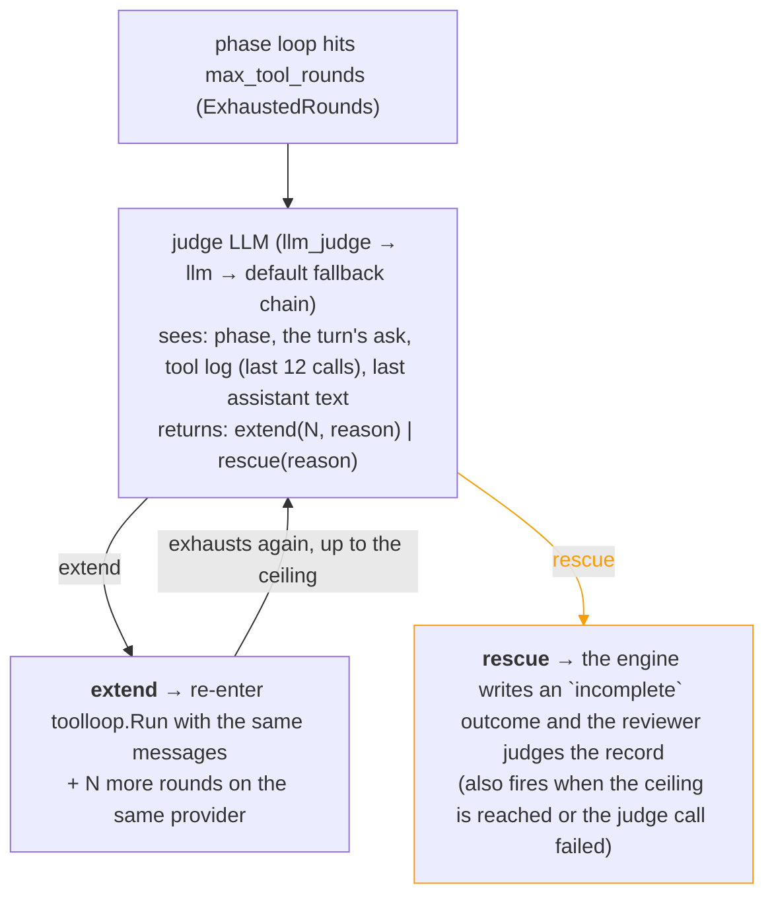

# Turn Engine

Each agent turn in Crewlet runs through a two-stage **Executor → Reviewer** loop orchestrated by the turn engine (`internal/agent/turn/loop.go`). Each stage is an LLM call with its own system prompt, its own tool surface, and optionally its own model. The turn engine also owns delegation to short-lived **workers** and enforces the delegation-depth / stall / worker-allowlist invariants in code.

---

## Why two stages?

The engine used to plan in one conversation and act in another. That split cost the actor everything the planner learned: tool RESULTS were not forwarded, so content had to be smuggled through the plan's own steps, and the planner had to NAME the tools it expected to call — against a catalogue it was never shown, so it guessed. Every guess that missed became a "phantom" the engine then had to reason about, and the delivery gate was built entirely out of reconciling those guesses with reality. Both recorded delivery incidents came from that reconciliation.

One agentic loop removes the reconciliation rather than improving it. What remains:

- **Onboarding** (first turn only, conditional) runs *before* the executor when the agent has no onboarding marker for its current org chain. It reads the team's `Onboarding` pages, captures conventions via `reflect_and_persist`, and calls `mark_onboarded`. It has its **own** round budget (`turn_engine.onboarding_max_tool_rounds`, default 10) so onboarding never competes with the turn's own budget — if it ran inside the executor it could consume every round before the agent ever called `submit_work`, silently dropping a first-turn request. Skipped on resume turns and once the agent is marked. See [First-turn onboarding](#first-turn-onboarding).
- **Executor** decides what to do and does it, in one conversation. It starts with every first-party tool and the *slim* catalogue (builtin names + MCP server names); it discovers and activates MCP tools as it turns out to need them. It ends by calling `submit_work` with an outcome, a summary, and the deliveries it claims.
- **Reviewer** judges the work. No domain tools; a single `submit_review` structured-output tool forces the decision enum. There is no handoff decision, and no *waiting* decision either. When the turn cannot finish without a manager or peer, the reviewer splits on whether they have been told — a fact the tool log settles, not the agent's prose. **Not yet** → `self_iterate`, and the note tells the next round to reach them with its own colleague-surface tools, the same tools a human teammate would use (there is no special escalation mechanism). **Already asked** → `done`: their reply is what re-triggers the agent, so no further round of *this* turn can produce it, and sending it back burns the iterations the real work needs while posting the same question a second time. Being blocked is the **executor's** word for what happened — the `blocked` outcome, whose `evidence` the schema demands — and `done` / `self_iterate` / `failed` are the **reviewer's** for whether that was good enough. One thing a handoff never buys: whoever triggered the turn is still owed a reply where *they* asked, which is why a turn that asks a colleague while the requester hears nothing is overturned (see [Who is waiting](#who-is-waiting-and-how-they-get-an-answer) below).

**Workers** (`delegate`) are short-lived helpers the executor hands narrowly-scoped work to — web research, a bounded read, summarising something large — without it counting as colleague delegation. See [Workers](#workers) below.

---

## Phase-specific tool surfaces

Each phase gets a filtered view over the shared `tools.Registry` through a `tools.Surface` (`internal/tools/surface.go`). This is the key constraint that keeps LLM payloads tight while still letting the executor recover from an under-specified catalogue.

| Phase | Tools | System prompt | Notes |
|-------|---------------|---------------|-------|
| **Onboarding** | `reflect_and_persist` and `mark_onboarded` active from the first round, plus the `activate_tool` / `list_mcp_server_tools` discovery meta-tools | One-line identity + the onboarding instructions (which pages to read, persist conventions, then `mark_onboarded`) + slim discovery catalogue | Runs only on a first turn for an unmarked agent, on its own budget. Discovers its knowledge-base tools via `list_mcp_server_tools` → `activate_tool` exactly like the executor. **No required-skill guard**: onboarding is a fixed read → persist → mark workflow and the prompt is its own guidance, so the load-before-use tax is skipped. Terminates on `mark_onboarded`; on budget exhaustion the agent stays unmarked and retries next turn. |
| **Executor** | Every first-party tool except `mark_onboarded`, plus `submit_work`, `activate_tool`, `list_mcp_server_tools`, and any MCP tool it has activated this turn | Identity + **full policy text** + role profile + skills metadata + roster (leads) + the executor's contract + prefetch blocks + **slim** tool catalogue (builtin tool names + MCP server names only) | The slim catalogue lists every builtin tool but only the NAMES of MCP servers; individual MCP tool names (often 50 to 150 per role) stay out of the prompt. To use one the agent calls `list_mcp_server_tools(server)` for discovery, then `activate_tool(name)` to promote it into the phase's active tool list so its schema arrives on the next round. Nothing is named in advance, so nothing has to be reconciled afterwards. Mission, vision, backstory, full policy text, and behavioral guidelines render directly into the prompt from the in-memory `Organization` model, with no database seed step. `mark_onboarded` is the whole phase-scoped denylist: a seat that could mark itself here would permanently skip orientation. |
| **Review** | `submit_review` meta-tool only | One-line identity + the round's intent, outcome, tool log and produced text + decision-enum contract | No catalogue, no policies, no prefetch. Whether anything was DELIVERED is settled before this prompt is built — the reviewer's question is whether the work is any good. |
| **Worker** | The task's (or its template's) allowlist minus the engine-control denylist (`delegate`, `run_sandbox`, `a2a_ask`, the discovery meta-tools) **and** minus any tool whose [MCP annotations](tool-capabilities.md) mark it a write to a shared surface, **and** minus anything the parent cannot itself call — plus `submit_result` always | Persona (template or inline) + mandated preamble + slim catalogue | Fresh context; a wall-clock timeout; runtime-clamped `max_turns`. A worker CAN discover and activate more *read-only* tools itself, against the safety-filtered universe its grant was cut from — so discovery cannot widen it into a write or a control tool. External writes are denied by *capability* (derived from MCP annotations), not by a hardcoded name list, so the guard holds for any tool stack. |

---

## First-turn onboarding

A fresh agent (no onboarding marker for its current org chain) needs to read its team's `Onboarding` knowledge-base pages and internalise the conventions before doing real work. This runs as a **dedicated phase before the executor** (`internal/agent/runner/onboarding.go`), gated on the marker store (`agent_onboarding_markers`):

1. The engine checks the marker (`Runner.Onboard`). The read has **three answers**: marked for the current chain skips; definitively unmarked runs the pass; a lookup that *failed* (`onboarding_state_unknown_skipping`) **skips this turn and retries the check next turn**. Collapsing a failed lookup into "not onboarded" would re-run a full onboarding pass for an already-marked agent on any transient database error. Two further guards make onboarding run once per org chain: a **process-local latch** (`runner.Latch`, the chain hash this process has seen marked, set the moment a pass marks or a read confirms the marker) short-circuits before any database read, and a **cross-process pass lease** (`Markers.Claim`, held for at most `runner.ClaimTTL`, 15 minutes, and released explicitly when the pass ends) lets exactly one turn run the pass when two turns for the same unmarked seat start at once, for example on two nodes during a rolling restart. A turn that loses the lease skips the pass (`onboarding_claimed_elsewhere_skipping`). The lease also excludes a concurrent pass inside one process, so there is no separate in-process lock.
2. Otherwise it runs the onboarding pass with its **own** round budget (`turn_engine.onboarding_max_tool_rounds`, default 10). The agent discovers its knowledge-base tools (`list_mcp_server_tools` → `activate_tool`), reads the pages, captures conventions with `reflect_and_persist`, and calls `mark_onboarded` (which terminates the phase). Onboarding is a **discovery-capable phase**: its surface exposes the slim tool catalogue and supports `activate_tool` exactly like the executor. (Without that, the agent could *see* its knowledge-base tools via `list_mcp_server_tools` but every `activate_tool` would hit an "availability gate", so it would never read its pages, never mark, and the pass would re-fire every turn.) Its rounds are governed by the same round-cap **extension judge** as the executor: the base cap can be extended up to `onboarding_max_tool_rounds_ceiling` (default 20) when the agent is still making progress, so a near-done pass isn't cut off mid-read.
3. The turn then proceeds to the executor with the onboarding hint **suppressed for the rest of the turn**, so onboarding can't also happen inside it and re-spend the turn's budget. The hint path applies the same rules: it renders only when the agent is *definitively* unmarked, never on a failed lookup, which would otherwise trigger a repeat onboarding for an already-marked agent.

**Why a separate phase.** If onboarding were only a hint injected into the executor's prompt, the agent would do the page-reads + `reflect_and_persist` + `mark_onboarded` inside its own round budget — on a first turn that could burn every round before it ever called `submit_work`, and the turn would fall through to a silent skip (the request dropped). Giving onboarding its own budget means a first turn always has its full budget for actual work.

The marker invalidates itself when the org chain changes (`learning.ChainHash`, a hash of the seat's path through the organization), so a role move or a reorganization re-triggers onboarding for the new context. Set `onboarding_max_tool_rounds: 0` to disable the dedicated pass. When no marker store is wired (a node with no store), onboarding is skipped, because there is no way to record completion and the pass would otherwise run every turn. A human seat never onboards.

On the dashboard, onboarding renders as its own phase within the turn it rode in on, with a neutral tag rather than one of the phase hues — it is one-time setup that happens to ride the first turn, not part of that turn's task, and colour is reserved for the phases a reader tracks across every screen.

---

## The work submission

The executor ends by calling `submit_work` (the tool and its decoder are in `internal/agent/runner/submit.go`), which is where the turn's account of itself becomes something the engine can act on. The submission decodes into `turn.Work` (`internal/agent/turn/loop.go`):

```go
type Work struct {
    // Outcome is the executor's own account: delivered | no_action |
    // blocked, or the engine-written `incomplete` when it never submitted.
    Outcome Outcome
    Summary string

    // Deliveries are the tools it cites as having delivered. Reported
    // rather than trusted — the engine's own record is what decides.
    Deliveries []string

    Evidence      string // required when blocked: what was tried, what stopped it
    OpenQuestions string

    Text  string        // the final prose
    Calls []ledger.Call // engine-recorded, not self-reported

    // Also engine-set: MissingTools (names called that the surface did
    // not have), ExhaustedRounds, Suspended and Rescued.
}
```

To hand a task off to a colleague the executor reaches them where the work lives — a chat mention, an issue comment or reassignment, or `a2a_ask` — and reports that as the delivery. There is no dedicated `delegate` outcome: a handoff is just a colleague-surface tool call.

**Real code work** is the `run_sandbox` tool. For a role gated with `role.sandbox.enabled`, the executor calls it to run a coding agent (Claude Code / OpenCode) in an isolated sandbox. The call **suspends** the tool loop (detached run); when the run completes the engine **resumes the same loop** with the result spliced in as that call's reply, so the agent reports and acts in the same turn. See [Code Sandbox](code-sandbox.md).

### Who is waiting, and how they get an answer

Whether a turn OWES an answer is derived by the engine at dispatch, from the trigger's own type, before any model runs (`engine.ReplyFor`). It is the half of the delivery question a model cannot get wrong — the old engine asked the planner to declare its own intent, and a turn that declared `skip` on a direct @mention read to the person who sent it exactly like the message never arriving.

| `Reply` | Trigger | What delivery means |
|---|---|---|
| `none` | A schedule fired, a broadcast mentioned the seat in passing, an internal event woke it | Nothing is owed. The turn may end having done nothing at all, which is what makes triage cheap |
| `tool` | An assignment, or a notification the source's own routing marks as an ask — a direct message, a personal mention | The answer only exists if a tool put it there |
| `engine` | A colleague asked over A2A | The engine returns the turn's artifact on the channel the ask opened; there is no tool to call |

A source's reading of its own routing is [`notify.Prompt.Addressed`](../index.md#integrations) — a tracker answers from its routing reason (assigned, mentioned), a chat backend from the channel type and whether the seat was named. The conservative answer is FALSE: a seat wrongly told nobody is waiting keeps the freedom to stay silent, while one wrongly told somebody is must post on every broadcast it observes. A coalesced trigger takes the STRONGEST obligation of its constituents — a merge must not be able to launder an ask.

**There is no fourth value, and no default.** A turn started without one is refused before any phase runs, because none of the three is a safe reading of "the caller did not say": permissive exempts a turn that owes somebody an answer, strict loops every unaddressed turn to exhaustion. That refusal exists because the omission shipped — the dispatch path derived the obligation correctly, handed it to the runner, and dropped it before the loop, so the decode-time check below stayed armed while **both** of the engine-side gates were skipped on every non-sandbox turn. Nothing about the result said so: the turn simply had no delivery gate.

### Three checks, in increasing cost

The turn engine checks the executor's account against its own record three times, and the order is the design (`internal/agent/turn/verify.go`):

1. **At decode time**, inside the loop. A `delivered` on a `tool`-awaited turn must cite a call the engine recorded that reached the surface the ask came from; a `no_action` on any awaited turn is refused outright ("silence is not a decline"); a `blocked` needs evidence. A wrong claim costs one bounced tool call the model can fix — not a review round, and not a silently accepted no-op. The refusal lists what IS citable, because the failure this catches is usually a model naming the tool it MEANT to call.
2. **Before the reviewer** (`Check`). Two of its three answers cost no model call: a `no_action` nobody asked for and nothing acted on ends the turn as skipped; a claim the record refutes loops back with an engine correction. What it cannot do is judge whether the work was any GOOD — everything that passes goes to the reviewer.
3. **After the reviewer** (`OverrideDone`). A `done` on a `tool`-awaited turn where nothing reached the party waiting is overturned to `self_iterate`. This is the recorded failure: the reviewer's model judges the produced TEXT, finds a good answer in it, and says done even though nothing put that answer anywhere a person can see. The engine's correction is appended LAST, because on this path the reviewer wrote none of its own — and where the turn did reach *somewhere*, just not the asker, the correction says so by name, because "no tool was called" reads as plainly false to a model looking at its own successful write and gets argued with rather than acted on.

**What counts as a delivery, and where it lands** is one rule, applied everywhere. A tool delivers (`turn.Deliverable`) when it is **MCP-served and not positively annotated read-only**, or when it is a **first-party tool the engine registered as one that reaches somebody** — the native tracker's writes and the knowledge base's do, `reflect_and_persist` and `use_skill` do not, and the flag is set at registration rather than derived from annotations, because a diary write and a work-item comment are annotated identically. "Not a known read" is POSITIVE: an unannotated MCP tool counts as a possible delivery, which is the fail-closed direction, since the alternative exempts every tool a server forgot to [annotate](tool-capabilities.md). Only SUCCESSFUL calls count — a failed post did not post, and counting it would close the check on exactly the turn that needs to iterate.

Each delivering tool also declares **which surface it reaches**: an MCP tool's is its own server (`mattermost`, `slack`, `github`), and an engine builtin's is the native feed's own source — `work` for the tracker, `page` for the knowledge base. Those are the same names an inbound notification reports its source under, and the gate compares the two — because "did this turn reach anybody" and "did the person waiting get told" are different questions, and only the second one matters to the asker. Asking the first is how a founder's Mattermost DM was closed out by a row in the tracker: the seat filed a work item instead of answering, every check passed, and the thread's last message stayed a clarification question the founder had already been answered out from under.

The surface check **narrows only where it can**, and the two fallbacks are the design rather than leniency:

- An obligation with **no named surface** is one the engine could not place. An assignment is the honest case: moving the item, commenting on the ticket and replying in the thread the work came from are all real answers, and nothing can pick between them. Only a notification names a surface, because only a notification knows one.
- A surface **this seat holds no tool for** leaves nothing to enforce. The seat could not have answered there however many rounds it spent, so insisting would turn an operator's missing integration into a seat that never finishes a turn.

That second fallback is also where the rule is currently weakest, and deliberately so rather than by oversight: a vendor's surface is its **MCP server's name**, which holds only while one server serves one source. The shipped Atlassian setup breaks that — one `atlassian` server serves both Jira and Confluence while inbound events carry `jira` or `confluence` — so those two obligations find no matching surface and take the fallback, which is the pre-existing "any delivery counts". Nothing regresses there; the check simply does not yet narrow for them. Closing it needs the server to declare which sources it serves, which is a config change rather than a derivation.

In both, the flat question is the answer — so the check is strictly stricter than the one it replaces, and never stricter than the seat can satisfy. The decode-time refusal uses the same rule and the same fallbacks, or a model would be told one thing at submission and judged by another.

`no_action` is narrowly scoped: it means **"nobody was actually asking the agent to do anything"** — informational triggers, passing references, broadcasts where the addressee was clearly someone else. When the agent *was* directly asked / @mentioned / assigned but is declining (out of scope, wrong owner, already handled, deferring), it must instead post a brief explanation via the originating channel's reply tool and report that as `delivered`. A direct request answered with silence looks like the ping was lost; the one-line decline closes the loop. The executor's contract enforces this in prose, the decoder enforces it in code, and each third-party app's notification prompt carries the same rule on the triage side.

The per-phase headers are deliberately verbose — each rule traces to an observed turn-ending failure, and `internal/agent/prompts/budget_test.go` holds them under explicit token budgets (executor < 2,200, review < 750, and the whole turn < 3,000) so the prose can't grow unchecked. The repeated cost of re-sending these static headers on every round of the tool loop is absorbed by **[provider prompt caching](overview.md#llm-provider)**, not by trimming the guidance: the `system + tools` prefix is byte-stable within a phase and across an agent's turns, so it is cached and re-read cheaply rather than re-billed each round. Slimming a header to save tokens is therefore the wrong trade — it re-opens the incidents the rules were added to close, for a saving caching already captures.

---

## The review

The reviewer's `submit_review` decodes into `turn.Review`:

```go
type Review struct {
    Decision phase.Decision // "done" | "self_iterate" | "failed"
    Notes    string

    // CompletedWork is what already landed, in the reviewer's own words.
    CompletedWork string

    // FinalArtifact is what the reviewer wants returned. Empty reuses the
    // executor's text.
    FinalArtifact string
}
```

- `done` → return `FinalArtifact` (fallback: the executor's text), unless the post-review override overturns it.
- `self_iterate` → record the round in the [prior-work ledger](#prior-work-ledger-across-self_iterate-rounds) and loop back. Capped at `turn_engine.max_iterations` (default 3); two unchanged-artifact rounds publish a `turn.guard_breach(kind="stall")` and terminate the turn as `failed` (engine-driven, not an LLM decision).
- `failed` → the reviewer's own judgement that another round would not change the answer. No guard fired, so none is reported.

When a turn cannot finish without a manager or peer — a capability gap requiring someone else's identity / credentials, or a decision above the agent's authority — the reviewer asks **whether they have been told**. The tool log settles that, not the agent's prose:

- **Not asked yet** → `self_iterate`, naming who to reach in `notes`. The next round reaches them directly with its own colleague-surface tools (a Slack mention, a Jira comment, `a2a_ask`) — the same way a human teammate asks for help, and the same way an agent reaches a [human seat](humans-in-the-org.md).
- **Already asked** → `done`. The colleague replies asynchronously and that reply re-triggers the agent, so no further round of *this* turn can produce it. Sending it back spends the iterations the real work needs and posts the same question a second time at somebody who has not had a chance to answer.
- **Nothing anyone replies would finish it** → `failed`.

Being blocked is the **executor's** word for what happened — `submit_work`'s `blocked` outcome, whose `evidence` the schema demands — and `done` / `self_iterate` / `failed` are the **reviewer's** for whether that was good enough. There is deliberately no fourth decision meaning *blocked, and rightly so*: it would copy one axis onto the other, and the next kind of blocked would want a fifth. What the turn was blocked on is carried forward on the [conversation entry](conversation-sessions.md) instead, so the seat's next turn on that thread can tell a question it asked from work it finished.

A handoff never excuses leaving the requester in silence: whoever triggered the turn is owed a reply where *they* asked, so a turn that asks a colleague on one surface while the requester hears nothing on another is overturned to `self_iterate`.

There is **no** engine-side handoff dispatcher, **no** `ask_colleague` decision, and **no** `role.fallback` chain: escalation is ordinary tool use.

### Prior-work ledger across `self_iterate` rounds

Every phase rebuilds its LLM conversation from scratch on each round — the executor starts from `[system, user]` every time. Without a record kept *outside* that conversation, a `self_iterate` round starts blind: it cannot tell that round 1 already posted to Slack, so it does it again and the side effect fires twice.

The turn's iteration ledger is that record. The engine appends one `ledger.Iteration` (`internal/agent/ledger/iteration.go`) immediately before each loop-back, and renders the accumulated records into two places:

| Consumer | Where | Why |
|---|---|---|
| **Executor** | `## Already done earlier in this turn` in the **user** message | Do the gap, not the whole task again — and it is what actually fires side effects, so it holds the evidence |
| **Review** | `## Earlier rounds (already delivered)` in the system prompt | Makes the duplicate-delivery rule work turn-wide instead of only inside one round |

The block rides the **user** message for the executor, never its system prompt: that prompt is frozen at turn start (the prefetch blocks) so its prefix stays byte-stable for provider prefix caching, and a section that grows each round would invalidate that cache on every loop. The boundary is what a value VARIES WITH, not how big it is: the chat thread a turn was woken in is the largest block the prefetch renders — up to 30 messages and 8000 characters — and it sits in the *system* prompt, because it is resolved once at turn start and never moves again, while a three-line ledger that grows each round sits in the user message. (The trigger's own `## Thread context` guidance still rides the user message, inside the notification body — a different section under a deliberately different name from the system prompt's `## The thread so far`, so the model is never shown two sections with one heading saying different things.) On round 1 the ledger is empty and the message is byte-identical to a single-pass turn.

**ONE call list per round**, because one phase makes the calls. It was two while the turn planned in one conversation and acted in another, and the split was load-bearing then: the delivery gate took a different view of each. Nothing takes two views of one list. (A row written by the three-phase engine still resumes — see `internal/agent/execstate/compat_v1.go`, which concatenates the two in the order they ran.)

**Two layers, deliberately.** The tool-call list is *engine-recorded*, so it cannot be forgotten — which matters most on the post-review `done` → `self_iterate` override, where the reviewer decided `done` and therefore wrote no prose at all, yet a partial delivery may already have landed. `Review.CompletedWork` is the reviewer's gloss on top, expressing what the mechanical log cannot: *"the post landed and reads fine — follow up in that thread rather than re-posting."* Same trust order the reviewer already applies to `## What the agent did` over `## What the agent produced`.

**Reads are marked, not merged with writes.** Tool *results* are deliberately not carried across rounds, so a read the next round needs must be re-run — telling it "do not repeat" a `jira_get_issue` would push it to invent the data instead. Each record carries the positively-known read names the delivery check resolves from [MCP annotations](tool-capabilities.md), reads render as `→ success (read)`, and the prompt permits re-running exactly those. Failed calls stay marked `→ error`: they did not take effect and may be retried. Only the reads the round actually CALLED are recorded, not the whole surface's annotation set: the row is persisted across a sandbox suspend, and carrying every read-only tool on a large MCP surface makes it grow with the catalogue rather than with what the round did.

### What the ledger trims, and why

One principle decides every budget: **elide payloads, never structure.**

A *payload* is a tool **argument** — a message body, page HTML, a diff. It is unbounded, gets re-authored next round, and can never answer "did this already fire", so carrying it whole only buries the two lines that can. *Structure* is everything else — the round's own account of what it set out to do, the draft under review, the reviewer's correction, the trigger, the reply that was sent — and it is carried **verbatim**: it is exactly what the next round must act on, and the ledger is its only carrier.

It used not to be. Six further limits sat beside the two below, cutting each of those at 400–2000 runes — the principle above applied to the half it excludes. A reviewer's correction trimmed mid-instruction loses the engine-critical part of the only carrier it has, and unlike a chat message or an issue comment there is no surface to go back and re-read: on the cross-turn ledger the cut was applied at **write** time, so the stored row was the only copy.

What is left bounds arguments and the read-call list, and both say when they cut. Prompt caching keys on the system+tools prefix, which the ledger never touches, so a larger block costs little.

| Budget | Value | Anchored on |
|---|---|---|
| `ValueLimit` | 200 | A Confluence/GitHub URL with query params runs ~180 chars, so the whole discriminator survives while bodies are cut by an order of magnitude |
| `BlobLimit` | 800 | ~12 identifier-shaped arguments — more than any real delivery tool takes |
| `MaxReadCalls` | 12 | The recon a normal round does; only reads are ever dropped, and the line says how many |

A prior round's **produced text** is kept whole in the record and elided at `RenderedArtifactLimit` (4000 runes) when *rendered* into the next round's block — from the TAIL, because `Work.Text` is that round's whole tool loop concatenated (thinking included) and its deliverable is at the end. The block accumulates one of those per `self_iterate` and is re-sent on every round of both phases that follow, so the product is what the bound answers.

A failed call's *result* is elided at `ValueLimit` too. It is tool output — authored outside the engine and unbounded, so a failed HTTP call would otherwise put a whole error document on one ledger line, re-sent on every round of every later phase. The full text is on the phase event that line summarises.

Arguments use **per-value** elision, never a cap on the serialised blob. `json.Marshal` sorts map keys, so capping the object would drop whichever keys sort last — and the discriminating argument (`channel`, `key`, `page_id`) is usually the *shortest* one. A line that kept a 400-char message body but lost `channel` would look precise while hiding which of two deliveries actually fired. When even fully elided values exceed `BlobLimit`, the backstop drops **whole keys** — shortest-value-first, so identifiers survive — and appends `+N more` rather than cutting mid-serialisation. The same priority governs the read-line cap: only reads are ever omitted, never a write.

**The ledger survives a sandbox suspend.** A detached `run_sandbox` ends the turn and its completion resumes it in another process, so the records are serialised into the pending run's `execute_state` (`internal/agent/execstate`) and rehydrated onto the resumed turn. Without that round-trip, a turn that self-iterated before suspending would forget those rounds and re-fire their deliveries after the resume. That blob carries an explicit version and a permanent reader for the previous one, because a parked run can outlive the build that suspended it and nothing rewrites a parked row.

**So does the round count.** The parked round travels in the same blob and the
resumed loop starts its counter there rather than at one, so `max_iterations`
bounds the **turn** rather than each half of it: a turn that suspended at round
three of three comes back with that round to finish and no more. The counter
restarted at one before, which handed every resumed turn a second full budget
and re-used iteration numbers the suspended half had already spent — so the
resumed phases' records collided with the pre-suspend rounds' on the
`turn_id` + phase + iteration key every screen files a phase under, and the
prior-work block rendered two sections numbered the same. The one round the cap
cannot refuse is the re-entered one itself: it is the second half of a round
whose executor pass already ran and whose `run_sandbox` call is still
unanswered, so it runs even where `max_iterations` has been lowered past it
while the box worked — refusing it would throw away a coding run that has
already been paid for and leave that conversation answered by nobody.

The **task description** is not mutated by a `self_iterate` round: the correction is prefixed to the user MESSAGE instead. Appending review notes to the task leaked them into the knowledge-search query builders, the sandbox brief, and the episode / turn-completed publishers — all of which want the requester's actual ask.

### The same ledger, one scope wider

Everything above is scoped to a single turn. The cross-turn counterpart —
what this seat already said in *this Slack thread / issue / pull request*,
carried into that conversation's next turn — is
[Conversation Sessions](conversation-sessions.md). It inherits this section's
doctrine wholesale (elide arguments never structure, writes never dropped,
reads marked so they are re-run rather than trusted) and rides the same user
message, immediately above `## Task`. The executor receives it; the reviewer does
not, because the reviewer judges *this* turn's work and the ledger above already
carries its duplicate-delivery rule.

### Engine-driven `failed` outcome

A turn can also end `failed` without the reviewer choosing it. Every failed turn publishes `agent_turn_completed` with `failed: true` and a classified `error` / `error_kind`, and the engine publishes one dedicated event beside it naming the cause (`Engine.publishFailure`):

| Cause | Dedicated event | `error_kind` on the summary |
|---|---|---|
| A turn guard fired: `stall`, `max_iter`, `depth_cap`, or a scheduled turn's `scheduled_timeout` | `turn.guard_breach` with that `kind` | the guard's kind |
| A panic, in a phase or around one | `turn.guard_breach` with `unhandled_exception` | `unhandled_exception` |
| The token budget refused a charge | `budget_exhausted` | `error` |
| Every member of the provider chain failed retryably | `llm_unavailable`, with the chain it tried | `error` |
| Any other broken phase | none | `error` |

Those dedicated events are what the dashboard's `afk` state is derived from. A reviewer's own `failed` fired no guard, so it publishes none of them.

A panic is the one cause that is both an error and a breach: the error says what broke and names the phase and round, the breach names the guard. The summary carries both, keeping the error's own text and taking the guard as its `error_kind`.

**The phase that died publishes too.** A phase that returns an error never reaches its ordinary completion record, so a failed phase used to leave nothing behind but the `agent_phase_started` that opened it: the dashboard showed an in-flight LLM call whose response never arrived, and read "No response text yet" where the error belonged. Every operator-visible phase runs through one body (`Runner.runPhase`), and its failure path publishes the missing `agent_phase_completed` with `failed: true`, the error, and whatever the loop managed before it died: the conversation, the tool calls that ran, the tokens already billed, the round it was on, folded onto the rounds of any earlier extension. It then returns the original error unchanged, so the failure classification above is unaffected.

**A panic is an unhandled exception, not a crash and not a retry.** A panic in a phase (a provider SDK, an MCP client, a tool handler) is recovered at the turn loop, logged as `turn_phase_panicked` with its stack, and ends the turn as `failed` with `turn.guard_breach(kind="unhandled_exception")`. The published detail carries the panic's value and never its stack, because the event store is readable by anyone the dashboard serves. A panic outside a phase, in the dispatcher's own stages or in a turn's set-up and tear-down, is recovered one frame further out (`dispatch_panicked`, or `sandbox_resume_panicked` on the resume path) and publishes the same breach. Either way the trigger is recorded and acknowledged rather than redelivered: a redelivery runs the same defect on the same input. Only what the delivery still holds is recorded: when a partition that would not merge has already requeued its tail, a panic in the head's turn records the head, and the tail's copies still run. See [A turn that broke halfway](seat-ownership.md#a-turn-that-broke-halfway).

A delegated worker is the one exception, and it is contained one frame nearer. `delegate` runs its workers on goroutines of their own, where a panic the turn loop cannot see would end the whole process, so each worker recovers its own and hands it back to the executor as that worker's result, with status `failed` and the panic's value as its error, logged as `subagent_panicked` with its stack. The executor reads it beside its siblings' answers and the turn goes on.

The dashboard renders that record as a failed invocation (error first, partial work beneath it) and keeps it on screen. AFK is sticky until the agent does real work again: the projection leaves `afk` only on a new phase or turn activity, so the `agent_turn_completed` published beside the failure cannot flip a stopped seat back to a healthy idle one.

---

## Workers

An executor hands narrowly-scoped work to short-lived **workers** with the `delegate` tool. A worker runs its own tool loop with a slice of the parent's tools, cannot delegate further, cannot contact colleagues, cannot write to any shared surface, and reports back inside the same turn — the parent still finishes the job itself.

Use it for work that is genuinely separable: several independent reads, a bounded research task, summarising something large, or a gather-then-synthesise shape. Do **not** use it for something one or two of your own tool calls would do — a worker costs a whole prompt and a model call — and do not use it to reach a colleague. That is what the [colleague-surface tools](#colleague-surface-tools) are for.

### One call, a graph of tasks

`delegate` takes one shape: a `tasks` array. Each task carries an `id`, a `prompt`, and either a `worker` template or an inline `system_prompt`; optionally `tools`, `model`, `max_turns`, `output`, and `after`.

```json
{"tasks": [
  {"id": "api",  "worker": "researcher", "prompt": "What does the billing API expose for refunds?"},
  {"id": "docs", "worker": "researcher", "prompt": "What do our runbooks say about refund failures?"},
  {"id": "plan", "worker": "synthesist", "prompt": "Draft the fix", "after": ["api", "docs"]}
]}
```

Tasks with no `after` run concurrently, bounded by `max_parallel`. A task with `after` waits for those tasks and is given their **submitted answers** in its own first user message — so the parent writes the shape of the work once instead of making two calls and re-typing the first call's results into the second's prompts.

Execution is by **topological wave**: everything whose dependencies have settled runs, then the next wave. It is not the tightest possible schedule — a long task in wave one holds back a short one in wave two — and that is deliberate: a wave boundary is a barrier, and a barrier is checkable, where a per-task readiness queue's failure modes (a task started while its dependency was mid-write; a deadlock when a wave's last worker is queued behind a dependent) are the ones nobody finds in review.

The whole graph is validated **before anything runs**: unique ids, resolvable `after`, no cycles, no more than `max_tasks_per_call` tasks, every named worker visible to this seat, every named model configured. A graph that cannot run must not run half of itself — three workers' tokens spent on work whose consumer will never execute is a report the parent cannot act on. Every refusal names the task and says what to write instead, including the members of a cycle.

### A worker submits, it does not narrate

A worker ends by calling `submit_result` with typed arguments, the same way every other phase in this engine ends. What comes back is **fields the parent can index** rather than prose it has to re-parse with another model call. The shape is the worker template's `output` schema, or a default `{result, notes}` when none is declared.

A worker that produced prose and never submitted reports `no_result` **with its prose attached**. Nothing is synthesised from the transcript: that would put words in the worker's mouth on the one question the parent asked, and a dependent fed a fabricated answer produces a confident wrong one. A task whose `after` did not **succeed** is `skipped_dependency_failed`, and the skip names which dependency broke the chain and how.

Statuses: `ok`, `no_result`, `skipped_dependency_failed`, `never_started`, `timed_out`, `budget_exhausted`, `cancelled`, `failed`. A skip is classified **before** the deadline is consulted, so the same graph under the same deadline reports the same statuses — a call that ran out of time reports the broken chain rather than a scattering of timeouts. Results always come back in the order the parent wrote the tasks.

### Worker templates

The stable half of a worker — persona, tool set, model, answer shape — lives in top-level `workers:` config, where a founder can read it, edit it live and version it with the rest of the company. What stays per call is the only thing that genuinely varies: the task.

```yaml
workers:
  researcher:
    description: reads sources and reports findings with citations   # what the executor reads
    system_prompt: |
      You research things carefully and report only what you can point at.
    tools: [confluence_search, confluence_get_page]
    model: fast              # a providers.llm key; omit to take the seat's llm_subagent chain
    max_turns: 12            # omit to take turn_engine.delegation.max_turns
    output:                  # omit for the default {result, notes}
      type: object
      properties:
        findings:  {type: string}
        citations: {type: array, items: {type: string}}
      required: [findings]

roles:
  - name: Senior Engineer
    handle: alex-kim
    workers: [researcher]    # omit to see EVERY template
```

Visible templates render as a sorted `## Your workers` block in the executor's prompt and are named in the `delegate` tool's own description, so a model choosing one mid-loop does not have to scroll back.

**A template is a request, not a grant.** Naming a tool in `workers:` confers nothing: every name still passes the same filter as a task's own list — the parent's live tools, minus the engine-control denylist, minus shared-surface writes. `workers:` is founder-owned Tier B config, and Tier B is never a privilege-escalation path.

Templates are validated at **load**, not at spawn: a description and a system prompt are required, the model key must exist, `max_turns` must fit `max_turns_ceiling`, and an `output` schema must be an object with at most 12 named properties, at most 3 levels deep, whose `required` entries are properties it actually has. A keyword the engine does not read is passed through untouched — the provider implements JSON Schema, not the engine.

---

## Colleague-surface tools

Agents collaborate per surface through the upstream MCP tools directly, not a generic `ask_colleague` tool or engine-side wrappers (thin `slack_message` / `jira_comment`-style 1:1 MCP forwards would only accumulate maintenance debt). Each tool description encodes when to use that surface — workplace manners live in tool descriptions, not a routing layer. Agents call these tools during Execute for every kind of collaboration — questions, status updates, handoffs, and manager escalation alike.

The engine prompts never name these tools (see [Tool Capabilities](tool-capabilities.md)) — they describe the *capability* ("the reply tool for the channel the trigger arrived on") and the LLM picks the matching tool from its catalogue. The table below is an example for the common Slack + Atlassian + GitHub stack; a deployment on Linear / Teams / GitLab gets the same behaviour with its own tools.

| Tool (example) | Surface | Purpose |
|------|---------|---------|
| `slack_conversations_postMessage` | Slack | DM or channel post; conversational updates, questions, handoffs |
| `jira_add_comment` / `jira_update_issue` | Jira | In-ticket collaboration and reassignment |
| `confluence_add_footer_comment` / `confluence_add_comment` | Confluence | Page discussion; `@mention` uses the [platform-mentions skill](tool-skills.md) markup. The exact comment tool name is mcp-atlassian-version dependent; the LLM discovers whichever name the deployed server registered via `list_mcp_server_tools` |
| `request_copilot_review` | GitHub | Request an automated review on an existing PR (an un-promoted lightweight option; code authoring goes through the [code sandbox](code-sandbox.md), not here) |
| `a2a_ask` | Private A2A channel | The one engine builtin (`internal/agent/builtin/a2a.go`). Narrowly scoped: tight-loop or mechanical sync only, one ask and one answer, then the channel closes. The answering turn's final response *is* the reply; there is no send/close tool. See the tool description |

### What a delegation records

Delegation bookkeeping rides on the event envelope (`events.Event`, `internal/events/event.go`) rather than on an event of its own: `delegation_depth`, `parent_turn_id` and `delegation_chain` are stamped onto every event the turn engine publishes for a turn, so each one names the turn it descends from and the handles the work has already passed through. A chain that reaches `turn_engine.delegation_depth_limit` ends the turn with `turn.guard_breach(kind="depth_cap")` before any phase runs.

`a2a_ask` is the only colleague call the engine itself mediates, so it is the only one that also records the *edge*: `a2a.Service.Open` publishes `a2a_channel_opened` (`channel_id`, `requester`, `target`, `participants`) and an `a2a_message_sent` for the brief, then wakes the target with an `a2a_request` carrying `delegation_depth + 1` and the requester appended to the chain. The answer is a second `a2a_message_sent` plus an `a2a_message` wake on the asker's inbox (`Service.Reply`), and `a2a_channel_closed` records the channel ending with its message count, its duration and the participant who closed it.

All three audit records carry the `turn_id` and `work_key` of the turn that **published** them — the asking turn for the channel and the brief, the answering turn for the reply and the close. That is what puts an ask on its turn's own page: the Turn screen reads `WHERE turn_id = ?`, so a record without the key is in no turn's answer however the client bands it. It is a separate idea from the envelope's `parent_turn_id`, which the two *wakes* carry to point back at what asked for them; they hold the same value because the frame calling the service is both the turn writing the record and the parent of the wake it triggers.

A delegation graph drawn from this is therefore an **A2A graph, not a company-wide one**. Every other row above is an upstream MCP tool called like any other: the engine records that `jira_update_issue` ran, not who now holds the ticket, so a handoff across a shared surface is observed at neither end. It comes back as an inbound webhook, and no shipped integration round-trips the delegation metadata through the external surface, so that trigger arrives at depth 0 with an empty chain — a cross-surface hop breaks the chain rather than extending it.

---

## Per-phase LLM models

`llm` IS the executor's chain — the seat's model, and what its own work runs
on. There is no `llm_execute` beside it: the turn's work happens in one
conversation, so a second field naming the model that conversation runs on
would be two spellings of one setting.

What a role CAN route separately are the satellites, each of which an operator
may point somewhere cheaper:

```yaml
roles:
  - name: Senior Engineer
    handle: sarah-chen
    llm:
      default: claude-sonnet   # the executor
      review: claude-haiku
      subagent: claude-haiku
      auxiliary: claude-haiku  # memory / knowledge / summary passes
      judge: claude-haiku      # the round-cap extension judge
      sandbox: claude-sonnet   # the coding agent inside a box
```

Or the shorthand string form (everything runs on one model):

```yaml
roles:
  - name: Senior Engineer
    llm: claude-sonnet
```

Resolution order for a satellite (`phase.Registry.Chain`): the role's per-phase chain, which is the flat `role.llm_<phase>` field (`llm_review`, `llm_subagent`, `llm_auxiliary`, `llm_judge`, `llm_sandbox`) or else the same key inside the `llm` mapping → the role's own `llm` chain (the mapping's `default`, or the plain string or list) → the provider keyed `"default"` → the first provider configured. The flat field wins over the same key inside the mapping, so a seat can take a shared mapping and override one phase without restating the block.

---

## Round-cap extension judge

The executor has a tool-call round cap (`max_tool_rounds`, 24 by default);
onboarding has its own. When the LLM exhausts the cap before finishing, the
rescue path synthesises an `incomplete` outcome and hands the round to the
reviewer as-is. That throws away in-progress work whenever the agent was
actually close to done — the cap is a static guess, not a progress check.

The **extension judge** interposes between exhaustion and rescue: a
cheap LLM call inspects the tool log and the last assistant message and
decides:

- `extend`: the agent is making meaningful progress; grant the
  rounds it asked for (`AdditionalRounds`, advisory, bounded by the
  per-phase ceiling and `extension_round_step`).
- `rescue` — the agent is thrashing / stuck; fall through to the
  existing rescue path.

Extensions chain: when an extended run exhausts again, the judge fires
once more, up to the configured ceiling. Token budget cascade still
bounds the whole thing economically; the ceiling is a sanity check.



The judge is best-effort: any failure (timeout, provider error, parse
error) maps to a conservative `rescue` decision so a flaky judge can
never block the host phase. The judge's own LLM call is published as
an `AgentPhaseCompleted` event with `phase="judge"`, `host_phase` and
`host_iteration` naming the round that asked, the verdict in `decision`
and the judge's own wording in `notes` — so a dashboard groups it under
that round and an operator can see how often it fires and what it
decides. **A judge that was never asked publishes nothing**: the policy
declining to ask and the judge saying no are different facts, and an
event for the first would claim a model call that did not happen.

**And it is charged.** The judge runs outside the tool loop, which is
where every other model call is metered, so its tokens go through the
turn's shared budget explicitly. A refusal there does not fail the
turn — the extension is a generosity on a phase that has already run
out of rounds, so a seat at its cap simply stops extending, which is
the same outcome as the judge saying no. Its spend is reported apart
from the turn's own totals for the same reason a worker's is: it is
already counted once by the meter, and folding it in would stop the
phase events summing to the turn's number.

**Forced tool calls are enforced, not just requested.** A phase whose
whole contract is one submission calls the tool loop with
`llm.ToolChoiceRequired`: the **reviewer**, whose surface carries no
catalogue at all so "call a tool" and "submit the review" are the same
instruction, and **onboarding**, whose every round discovers, activates,
reads or reflects and whose last one marks. Some endpoints don't honor
`tool_choice`, and some models "think then stop" — emitting reasoning
with no tool call. The loop treats a no-tool-call completion on a
`required` round as a non-terminal miss: it re-prompts with an explicit
corrective naming the tool ("you must call `<tool>` now — no prose") and
retries within the round budget (bounded by `maxForcedToolRetries` = 2
and the call's `MaxRounds`), instead of accepting the prose as a finish. Without
it a reviewer that thought and stopped fell through to the rescue, which
sends the whole turn back for another executor round — a whole extra
turn spent on the one failure a model reliably fixes when it is asked
again. The reviewer's budget (`reviewRounds` = 4) is that arithmetic: one
submission, two correctives, one spare.

**A round that said nothing at all is not a finish either.** The other
half of "think then stop" is a round with **no tool call and no prose** —
a model that spent its whole output budget on hidden reasoning. It costs
real tokens (Claude Code on `haiku` bills hundreds for one) and reaches
nobody, and the loop used to take the same branch it takes for a model
that answered. It now re-prompts once, naming what went wrong, on any
caller that did *not* force a tool call — the **executor** and
**sub-agent workers**. A `required` caller gets the tool corrective
above instead: "call one of these tools" is the better instruction for a
phase whose only output *is* a call, and it already covers the same
model, so the reviewer's and onboarding's round budgets are untouched.

The bound is **one**, not two, and the asymmetry is deliberate. Naming
the tools is a genuinely new instruction to a model that misread the
surface, so a second attempt earns its round; a second identical nudge
after an empty answer is the same prompt against the same model, which is
the retry [the provider contract](subscription-llm-backends.md) refuses
to do. One also fits inside the smallest budget any caller declares —
`workers.max_turns` is validated at ≥ 1 — so the corrective can never eat
a delegated task's whole allowance.

Both allowances bound a **run** of rounds that produced nothing, not the
phase's lifetime: a round that emits a tool call clears them, so the
model's next stall is a new stall and earns its own nudge. Counted for
the phase instead, they bound a different quantity — how many times a
model may *ever* stall — and one stall early disarms the corrective for
every round after it. That was the shape of a real incident: an executor
on a 24-round budget stalled at round 2, filed a work item at round 3,
had a submission bounced at round 4, and broke on the stall at round 5
with nineteen rounds unspent, one round before the message it had just
said it was about to send. The allowance clears on the **call**, not on
the call's success — a tool that returned an error is a round the model
has to read and answer, which is the opposite of one that has stopped
responding.

Rounds that reached nobody are still counted on the phase record as
`empty_answer_rounds` — that stays a phase **total**, since it measures
what the turn cost rather than what the loop will tolerate — and the
dashboard badges them.

The **executor** stays on `auto`, and the **judge** takes no tools at
all — it answers in two lines of text, and a tool on its surface would
invite a model to call it and answer nothing. A text answer on an `auto`
round is a legitimate finish.

**No submission never goes silent.** An executor that ran out of rounds, or
simply stopped, has produced text and no account of itself. Discarding the
turn wastes everything it did; calling it delivered puts words in its mouth on
the one question that matters. So the engine writes the outcome `incomplete`
and marks the round RESCUED — both load-bearing. `incomplete` is its own value
rather than a defaulted `delivered` because the two must stay
distinguishable: an engine-written word carries none of the model's
commitment. The mark is what makes the pre-review checks stand down (there is
nothing anybody committed to) and what tells the reviewer, in prose, that the
word it is reading is the engine's.

**Configuration** (per `turn_engine`):

| Field | Default | Purpose |
|-------|---------|---------|
| `extension_enabled` | `true` | Master switch |
| `execute_max_tool_rounds_ceiling` | `48` | Hard cap on total executor rounds with extensions (2x base 24) |
| `onboarding_max_tool_rounds_ceiling` | `20` | Hard cap on total onboarding rounds with extensions (2x base 10) |
| `extension_round_step` | `8` | Max rounds the judge may grant per call |

The judge covers **the executor and onboarding**; each has its own base cap and ceiling. (The reviewer has no knob: it holds one submission tool, so its budget is a structural fact rather than an operator preference.) (Onboarding has no rescue path — a `rescue`/ceiling outcome just ends the pass unmarked and it retries next turn — so the judge is purely additive there.)

**Per-role provider**: set `role.llm_judge` to a small/fast model
(Haiku-class). Resolution follows the standard phase chain:
`role.llm_judge` → `role.llm` → `"default"` → first provider. If
unset, the judge runs on whatever the role's primary model is.

---

## Runtime invariants

Every invariant is enforced in code, not in prompts (`internal/agent/turn/guards.go`, `internal/tools/surface.go`, `internal/agent/skills/guard.go`):

1. **Workers cannot delegate, contact colleagues, or write to shared surfaces.** `subagent.Permit` denies the first-party control tools (`delegate`, `run_sandbox`, `a2a_ask`, the discovery pair) and any tool whose [MCP annotations](tool-capabilities.md) classify it a write to an external shared surface — regardless of what the task or its template named. It also denies anything the parent cannot itself call, read LIVE: a tool the executor activated mid-phase is inheritable, and one it never had is not. The latter is derived from capability, not a tool-name list, so it covers any tool stack. **A `workers:` template is subject to every one of these**, which is what keeps founder-owned Tier B config out of the privilege-escalation path. Workers **can** discover and activate *read-only* tools themselves (see invariant 7): the discovery catalogue is built from the same three filters as the grant, so a worker can find the read tool it needs (e.g. a Jira JQL search) but can never widen itself into a write or a control tool.
2. **No recruitment.** Colleague tools require an explicit handle / channel / issue_key / PR URL. There is no "find someone to help me" primitive that would auto-create a role.
3. **Delegation depth cap.** The trigger event carries `delegation_depth`. When it meets `turn_engine.delegation_depth_limit` (default 3), the engine publishes a `turn.guard_breach(kind="depth_cap")` and terminates the turn as `failed` before any phase runs. This is the always-on backstop against runaway / circular delegation: it is checked at the top of every turn regardless of how the turn was triggered, and `a2a_ask` propagates the chain so the recipient's turn inherits the accumulated depth.
4. **Per-turn budget cascade.** Agent budget → phase budgets → the delegation slice (default 20% of the parent's remaining). Exhaustion publishes `budget_exhausted` and marks the turn failed. ONE slice covers a whole `delegate` call whatever its task count, so a fan-out cannot multiply the operator's fraction by N; the wrapper reserves tokens under a lock before charging, so concurrent workers can't both pass the cap check and overshoot. A call whose slice divided by its task count falls below `min_tokens_per_task` is refused UP FRONT — N workers that each die mid-round have spent the whole slice and produced nothing.
5. **Worker timeouts.** A per-task deadline from `turn_engine.delegation.task_timeout_seconds` (default 300 s) and an aggregate `call_timeout_seconds` (default 900 s) over the whole call, waves included, plus a `max_parallel` concurrency limit. Hitting the aggregate cap does *not* discard the workers that already finished — they come back with their real answers, and only the ones still running are reported as timed out. Their tokens were spent either way.
6. **Stall detection.** Two `self_iterate` decisions with the same artifact hash publish a `turn.guard_breach(kind="stall")` and terminate the turn as `failed`. The threshold is a constant, not a knob: two identical rounds is the earliest point at which "unchanged" is a fact rather than a single sample, and the round cap already bounds how long a turn that IS changing may run. Max-iteration exhaustion (the executor/reviewer loop hit `max_iterations` without `done`) publishes `turn.guard_breach(kind="max_iter")` with the same terminal effect.
7. **Tool surface isolation between phases.** Each phase builds its tool list from scratch. The executor and its workers carry the same *slim* catalogue (builtins + MCP server names) and the same `activate_tool` / `list_mcp_server_tools` discovery meta-tools — a worker's catalogue is the safety-filtered universe the grant was cut from (read-only / non-control / non-shared-write), so discovery cannot breach invariant 1. Review and Judge carry no catalogue and cannot discover tools. A `self_iterate` builds a fresh surface, which is correct: its LLM context started over too. A RESUMED executor is the exception — it replays the surface and the skill-guard state it suspended with, because it is re-entering the same conversation.
8. **Required-skill guard (load-before-use).** A [tool skill](tool-skills.md) gates the tools its trigger covers (the `required: true` default; `required: false` opts out for advisory content): within one phase session, calls to those tools are rejected (with an instructive error and a `phase.tool_skill_blocked` event) until the LLM has loaded the skill body via `load_tool_skill`. Enforced at the shared dispatch gate; tracked per LLM session because the executor and each worker run on separate message histories — and replayed across a sandbox suspend, since the resumed executor is the same session and the bodies it loaded are still in its transcript.
9. **A busy seat queues, it never drops.** A seat's inbox is one pull consumer that fetches again only after its handler returns, so a trigger that arrives during a minutes-long turn waits on the broker rather than erroring. Erroring instead would NAK it into bounded redelivery (25 deliveries, then the dead-letter topic) and spend that budget on events whose only problem is when they arrived. A seat HELD by a detached sandbox job (potentially hours, `sandbox.Coordinator.SeatHeldBySandbox`) is handled differently: the dispatcher **parks** those deliveries, requeuing them onto the inbox and then acking (`inbox.ActionPark`), so nothing is held against a broker ack window. The one delivery it answers instead of requeuing is a person's reply to a clarification question one of that seat's runs asked. A run waiting on such an answer holds nothing at all, so its seat keeps working and every delivery is simply offered to that match before it becomes a turn. The offer answers one of three things — the delivery was **consumed** by the run it answers, is **still owed** to a run this node could not resume just now, or is **nobody's**, so it becomes an ordinary turn. A delivery still owed to a run is NAK'd back to the broker (never deferred: one parked run's failing resume must not stop a free seat consuming at all; and never requeued, because a republish lands back on the inbox instantly and spaces nothing), so it returns on the queue's own backoff — bounded by three clauses, whichever ends first: the deliveries the *message* has left (the offer stops with five of them in reserve for the ordinary route, which is the only clause a seat handoff does not reset), 10 spaced attempts within one process, and the run's own `pause_ttl_seconds`. A held seat's mail is still parked rather than NAK'd: that wait outlasts any ack window. See [Mid-run clarification](code-sandbox.md#mid-run-clarification-crewlet-ask).

> **Known gap.** Nothing takes a pause hold on the seat's inbox while it is parked on a sandbox run. The requeued copies therefore land back on a topic the seat is still consuming and are re-parked immediately, so a seat parked on a long run spins on republish-and-ack for the length of the run. The work is not lost (the same-id dedupe and the completion ledger hold) but the loop is real. Fixing it means a pause taken at the park AND released when the run settles; a pause without the release is strictly worse, because a seat that never resumes is deaf until the process restarts. `ResumeTopic` has no caller today, so both halves land together or neither does. The no-provider park is the model: it pauses the inbox, and the apply that adds a provider releases it.
10. **A phase that breaks is not one case.** `turn.Run` returns an error only when a *phase itself* broke; a failed turn, an exhausted round budget and a not-done review are all results. What the dispatcher does with that error depends on what broke and on what the turn's own record proves it already did: a turn that **panicked** is **recorded and acked** whatever its record says, because a redelivery runs the same defect on the same input; a turn that reached outside the engine (an MCP write, a colleague ask, a coding run) is **recorded and acked** too, because a redelivery would repeat writes it cannot take back; one that proved nothing is **redelivered** exactly as before, which keeps the retry for every pre-effect failure. `turn.Abandon` is that one rule, read by the dispatcher and by the sandbox resume alike. See [A turn that broke halfway](seat-ownership.md#a-turn-that-broke-halfway) for the predicate and why it is deliberately narrow.

11. **A suspended turn's seat is marked busy from the store.** A turn whose executor suspended for a detached sandbox run writes its conversation to the run's row before its frame unwinds (`Engine.persistSuspension`, which is also what opens the run to the completion poll). The launch publishes `sandbox_run_started` to the seat's control topic, and the coordinator sets the seat's busy count from the pending store's own list of the seat's active runs (`Coordinator.syncBusy`), so a redelivered start, a restart and a seat takeover converge on the same answer. That handling is asynchronous, and nothing orders it before the suspended turn returns, so a delivery the inbox hands out in that window can start a turn beside the run. A run parked on a clarification question does not hold the seat at all, because the answer arrives on its inbox. On completion the coordinator claims the row and marks the seat busy through result collection; a resume that fails un-claims the row so a redelivery can retry (the suspended executor loop is never lost), unless the resumed turn must not be resumed again (`sandbox.ErrResumeAbandoned`: it had already written outside the engine, or it panicked), in which case the run is settled instead of un-claimed (its box reclaimed, its record deleted and the seat's busy count recounted), so the completion is not redelivered into a conversation a retry must not re-enter and the seat is not left parked on a turn that is over. **A claim that cannot be given back is settled too**, and for a reason that has nothing to do with repeated writes: a row left in the claim is read by no completion poll, re-claimed by no redelivery, matched by no answer and expired by no pause reaper, so "leave it for the next attempt" is a turn destroyed in silence with its box paused and billed until the seat happens to change hands. That covers both writes the claim is given back for — the park a completion asked for and the revert a failed resume makes — and it is announced as `sandbox_run_failed` with reason `claim_unreverted`.

---

## The working status

A turn triggered by a chat message raises a **working status** in that
thread — "*Agent SWE is thinking…*" under the composer — for as long as the
agent is on it. The turn engine owns the lifecycle, and it is the same on both
chat backends; what differs is only what the indicator can *say* (see
[Mattermost § Working status](../integrations/mattermost.md#working-status),
whose indicator carries no text):

| Point in the turn | Effect |
|---|---|
| Turn start, before the turn assembles anything | Indicator raised, so the thread read, the knowledge search and the runner build all happen with the agent visibly on it. Not while the trigger is still queued behind a busy agent: nothing is running yet, and the indicator says one is |
| Each phase opening | Next line drawn from that phase's pool — *is getting crewleted in…* → *is crewleting…* → *is marking its own homework…* (see [Slack § Behaviour](../integrations/slack.md#behaviour)) |
| Turn end (a reply, a skipped turn, a failure, a guard breach, budget exhaustion, a runner that could not be built) | Indicator cleared |
| The executor suspended for a detached sandbox run, and the run's row landed | Indicator **held** — the agent has neither replied nor given up, and the same `turn_id` resumes when the job completes |
| A suspension the engine could not record | Indicator cleared: the run is settled and its box reclaimed on the spot, so nothing is coming back. A store that could not say whether the write landed keeps it instead, because a run it moved to running is one the completion poll resumes |
| That run parked on a clarification question | Indicator cleared — the agent has stopped and a person may take days to answer. One turn's hold, so a second turn working in the same thread keeps its own |
| A park the engine could not record | **Held where the claim went back, cleared where it could not.** A park arrives holding the run's claim, and the claim is the promise that a tail will run: given back, the completion is polled, collected and parked again, so the box really is still working and the indicator is honest. Unable to go back, the row would sit in a claim nothing re-takes — no poll, no redelivery, no answer, no reaper — so the run is settled like any other lost turn and the hold goes down with it |
| That run settled instead of resuming — its box could not be read back, its row carried no suspended conversation, or a claim it took could not be given back | Indicator cleared: the record is deleted and the box reclaimed, so the suspended turn is never resumed. The same hold and the same rule as a park; only the reason differs |
| The resumed turn came back, the run's record could not be READ to find out which box to settle, and the store ended the run anyway | Indicator cleared. The store is asked to end the run while it is still the claim the tail took, and a claim it does end is a turn nothing will resume. Staying quiet would leave the row in a claim no poll, redelivery, answer or reaper picks up, with the indicator over it |
| That same settle DECLINED, because the resumed turn had called `run_sandbox` again before it returned | Indicator **left standing**, and what it now describes is the relaunched job. The ending is licensed for the claim alone, so a row the relaunch took back through launching is left to whoever moved it, no stop is reported, and that turn is coming back after all: the relaunched job's completion resumes the same `turn_id`, exactly as the suspended-for-a-run row above says |
| The seat is removed from the company and not restored within the retirement grace | Indicator cleared as each of its runs is ended. The hold has usually gone down with the seat already; this covers the order in which it has not |
| That run's resume | The hold taken back, never a second indicator over the first — and cleared when the resumed turn ends. A resume driven by a person's ANSWER has no hold left to take back and raises a fresh indicator off the answer's own thread |
| A resume that never reached its turn — a reply this build cannot read, a runner it could not build — or one whose turn broke without writing outside the engine | **Held where a box's completion drove it, cleared where a person's answer did.** The claim reverts to exactly where it was taken from, and the two routes came from opposite facts: a live run, so the retry finds a box still working and nothing could put a cleared indicator back; or a question still open, so the run is awaiting that same person again — and nothing is left claiming otherwise, because this frame is the only thing that clears it: the coordinator's revert reports no stop (the same revert on the completion route puts a run back to a box that *is* still working), and the message that carried the answer is **handed back rather than run**, so no fresh turn comes along to raise an indicator in its place. The next attempt at that message raises its own. It used to fall through and be worked as an ordinary chat message, which answered the person with a turn instead of with the coding run they were replying to. Where the revert itself cannot be written there is no retry on either route — the row is stuck in the claim — so the run is settled and the indicator cleared |
| This node hands the seat to a peer, or shuts down | Indicator cleared, because a kept-alive one would otherwise be re-asserted by a node that is no longer running the turn |

A trigger that is not a chat message raises nothing at all: a schedule tick, an
`a2a_ask`, a work-item assignment and a sandbox completion carry no channel and
no thread, so there is no composer for an indicator to appear under.

The mechanism is Slack's
[`assistant.threads.setStatus`](https://docs.slack.dev/reference/methods/assistant.threads.setStatus/)
(there is no public typing API for bots —
[slackapi/bolt-js#885](https://github.com/slackapi/bolt-js/issues/885)),
driven by `internal/notify` and posted with the
agent's own bot token. Sessions are keyed by `(handle, channel, thread_ts)`
and reference-counted by `turn_id`, so two *different* turns for one agent in
one thread — a queued follow-up, a colleague's ask arriving mid-conversation —
share one heartbeat and the indicator comes down when the last of them
finishes. A suspend/resume pair is one `turn_id` rather than two, so the
resumed half takes that single hold back instead of counting it twice.

Every call is best-effort — the indicator is cosmetic and can never fail a
turn, and it never delays one either: a raise and a phase change write the
session's state and wake its own goroutine, so a chat instance that is slow to
answer costs the agent's work nothing. What bounds an indicator whose turn
never came back is the backend's own expiry (about two minutes on Slack) plus
the points above where this node takes its own down — a run that parked or was
settled, a seat handed to a peer, and shutdown. A process that is killed
outright leaves the last one to lapse.

Taking an indicator down stops its heartbeat **between** posts rather than in
the middle of one: a request already sent is finished, and only then is the
clear sent. Abandoning it instead would not withdraw it — the chat server
still holds it, and could apply it after the clear, leaving "is thinking…" over
a turn that had ended (or, on Mattermost, a typing indicator shown after the
reply). Each request — the raise, a re-assertion, the clear — has five seconds,
so a teardown waits at most one of each however many indicators it takes down,
and the clear goes out even when the turn, the drain or the shutdown that asked
for it has already been cancelled. A request that runs out of time is the one
case left that can land late, and the backend's own expiry then takes it down.

Whether it appears at all is the org-wide `typing_status` setting on the chat
block that triggered the turn (`always` by default, and the only other value is
`addressed` — there is no `off`, because a reader who sees nothing cannot tell
an agent working from an agent that is dead). The decision is the backend
driver's, not the turn's: the turn says who it is and what woke it, and each
chat surface answers for its own conversations, so a company running both is
one wiring rather than two. On Slack the wording comes from per-phase pools
that `integrations.slack.status_phrases` can replace. See
[Slack § Working Status](../integrations/slack.md#working-status-is-thinking)
and [Mattermost § Working status](../integrations/mattermost.md#working-status).

---

## A turn's two identities

A turn carries **two ids, and they are not the same value**. Getting this
round the right way is what stops a retry being invisible.

| | What it names | Reproduced by a redelivery? |
|---|---|---|
| **run id** (`turn_id` on every event) | ONE execution of a turn | **No** — minted per dispatch |
| **work key** (`work_key`) | the unit of work: the trigger events the dispatch derived it from | **Yes** — that is what it is for |

A turn that breaks *before* it reached outside the engine is not abandoned:
its trigger is NAK'd and the broker redelivers it, backing off from one second
to thirty across twenty-five attempts (invariant 10 above). **So one unit of
work legitimately runs more than once** — a seat whose LLM credentials were
missing fails, an operator fixes them, and the next redelivery succeeds.

Each of those runs is its own turn: its own `turn_id`, its own phase records,
its own row in **Turns**, its own outcome and its own token count. That is why
a turn that failed and then recovered shows as two rows rather than one row
that is somehow both — and the dashboard marks the second one `re-run` so the
two read as what they are. The work key is what relates them: ask for
`work_key` on `/events` or on the turns list to get every attempt at one
trigger.

Everything that must happen **once per unit of work however many times it
runs** keys on the work key, never on the run: the completion ledger, the
[episode row](agent-learning.md), the counterparty interaction count, the
[conversation entry](conversation-sessions.md), and the derived ids that make
a re-run's tracker comment and work-item update land once. Everything that
describes **one execution** keys on the run: the phase records, the live view,
a [detached sandbox run](code-sandbox.md) and its MCP bridge session.

Those derived ids name the **call** as well as the work: the unit of work, the
verb, the item, and a digest of the tool call's own arguments. So a re-run that
makes the same call writes once, while two different calls in one turn — an
item moved to `in_progress` and later to `done`, two comments on one item —
are two writes. Each id also carries **how many different calls to the same
tool the run made before it**, so a call made again after a different one is a
new write: an item moved to `in_progress`, then `done`, then back to
`in_progress` ends `in_progress`, where the third move used to be answered as
the first one's retry and the item stayed `done`. A call repeated with nothing
different in between — an executor that asks twice, a retry after `unknown` —
keeps its count and stays one write. Each id also carries **when the unit of
work began** (the earliest trigger it was derived from), which a re-run
reproduces exactly; that instant is what lets a node whose operation ledger may
have lost the first run's row since answer a re-run `unknown` rather than apply
it twice (see
[Replication](../guides/replication.md#what-a-retry-is-judged-by-the-instant-its-operation-was-minted)).
A wake the engine's own tracker or knowledge base produces is stamped with the
instant of the change it announces rather than the moment it was delivered, so
every copy of it — a change-feed redelivery, a delivery retried after a failed
publish — carries the same instant as well as the same id, and a re-run woken
by a later copy derives the first run's ids.

**A re-run is recognised call for call, and only when its calls are the same.**
Everything a derived id is made of — the work, the verb, the item, the
arguments, the count — is something a re-run reproduces only by making the
same calls, with the same arguments, in the same order. The model behind a
re-run is sampled again, and where it words a title or a comment differently,
that call is a different write: the re-run files a second item or posts a
second comment beside the first run's. Nothing can soundly tell a reworded
call from a new one — the arguments *are* the write, and two different sets of
them may be one intent phrased twice or two intents — and a run that crashed
leaves nothing a re-run could compare against: what it had called lived in
that process, and only a *suspended* run's calls are written down. A call the
re-run makes identically is still collapsed onto the first run's, and a
re-run's `update_work_item` that sets fields to values they already hold
changes nothing either way.

A **resumed** turn is not a re-run. A detached coding job re-enters the run
that parked it, carrying that run's id, its work key and when that work began
on its own row, so a suspend/resume pair is one turn on every screen and
writes under the same ids in both halves. The resume also starts from what the
run already called — the rounds before the suspension, the parked round's own
calls and whatever an agent-mode run called over the bridge — so the counts in
its ids continue rather than start again. A delegated worker counts from the
run's calls and its own, never a sibling's, and the run counts every worker's
calls once their wave is done.

Where that shows on the screens:

| Screen | What a re-run looks like |
|---|---|
| **Turns** | two rows, the later one tagged `re-run` |
| A seat's **Turns** tab | two cards, the later one tagged `attempt 2/2` |
| A **turn's own page** | the badge, plus a button to each other attempt saying whether it failed |
| **Cost** and a seat's spend | two rows with their own real bills, each tagged `re-run` — the tokens are not summed, because each attempt genuinely spent them |

`adr/0017` records the decision and what folding the two into one value cost.

---

## Events and tracing

Every turn opens one `agent.turn` OTel span with child spans `agent.turn.execute`, `agent.turn.review`, `agent.turn.judge` (one per extension-judge call, nested under the phase that fired it). A worker does not open a span of its own; it reports as an `agent_phase_completed` event with `phase=subagent`, `host_phase=execute`, its `task_id` and its `worker` template, so a dashboard groups it under the executor round that delegated it and can pair it with a node of the graph. Each call also emits one `subagent_batched` carrying that graph and every task's status. The trigger event's OTel context is restored exactly once at the turn boundary so the span hierarchy is stable across agents.

The extension judge additionally emits an `AgentPhaseCompleted` event with `phase="judge"` carrying its system prompt, user prompt, response, token counts, and decision (`extend` / `rescue`) — the same shape as the executor / review phase events, so **Turns** and the seat's own transcript render judge calls alongside the main phases without any frontend change.

### What streams during a turn

A phase is not one LLM call — it is a loop of them, and an operator
watching the dashboard is watching that loop. Two events carry it:

| Event | When | Persisted |
|---|---|---|
| `AgentTurnProgress` | Once before the first call, then twice per tool-call round | No — stream only |
| `AgentPhaseCompleted` | Once, when the phase ends | Yes |

**Before the first call**, because the phase's prompt exists before its
answer does. `AgentPhaseStarted` cannot carry it — every phase runner
publishes that event and only then builds its prompt — so the projection
seeds a placeholder call with no messages, and a live row showed "No
prompt recorded" for the whole of the phase's first and largest LLM call.
The opening update carries `prompt_messages` and nothing else, tagged
`round_num = -1` (consumers read `round_num + 1` as "rounds so far", so
the sentinel keeps it at zero rather than claiming a round).

**Twice per round**, because a round has two moments worth showing. The
first fires the instant the model has answered, before any of that
round's tools run: the model's prose and its reasoning are what explain
the tool call that is about to happen, and holding them back until the
round's slowest tool returns is holding them back for exactly as long as
they are most useful. The second fires once that round's tool results are
in. A round that emits only a tool call and no text has nothing new to
show at the first moment and skips it, so a tool-only round still costs
one event. The final round — the one that ends the phase by making no
tool call — publishes at the first moment and then ends the loop, which
is how a phase's closing answer streams at all.

**The same text either way.** Both events build their `response` with
`internal/agent/toolloop` over the same
message list, so what streams live is what you read when you expand the
finished turn — not a second assembly of it that can disagree. Reasoning
from an extended-thinking model rides in that string wrapped in
`<think>...</think>` (the wire format is
`internal/events/types`, shared with the
[auxiliary-LLM telemetry](agent-learning.md)).

**A round is published while it is being written.** `llm.Request.OnDelta`
asks a backend to stream; the tool loop accumulates the fragments into the
round in flight and republishes at most five times a second, which is below
the rate at which appearing text stops reading as live and well inside what
the socket hub can carry. The fragment rides `partial_round` on
`agent_turn_progress` — live-only, so nothing persists a half-written
sentence — and is cleared the instant the round commits, because from then on
its narration is authoritative. Streaming is opt-in per CALL, not a property
of a backend: only the tool loop sets `OnDelta`, because every other provider
call in the engine (reflection, summaries, the extension judge) wants an
answer rather than a running commentary. An endpoint that accepts a streaming
request and answers without streaming is negotiated down to the unary call,
once per process.

**`response` is a join, so the split travels beside it.** That string is
every round's assistant turn joined with a blank line, and the join cannot
be undone — its parts are separated by a blank line and prose contains
blank lines. A reader that split it on the leading `<think>` tag therefore
showed the FIRST round's thinking as "the reasoning" and every later
round's thinking as "the answer", tags and all. So both events also carry
`round_narration`: one `{round, reasoning, content}` per round, recorded
where the round's assistant message is appended, which is the last frame
that knows which round the turn belongs to. Its `round` matches
`tool_executions[].round`, and that shared number is the whole contract —
it is what lets a consumer interleave the two lists into one ledger of
"what it thought, what it said, what it called" without a second ordering
rule. The reasoning stays collapsed by default: it is long, it is not the
answer, and a reader scanning a turn for what it DID should not have to
scroll past what it considered. The three builders of that field used to be three
hand-written assemblies, and the live one omitted reasoning entirely: a
thinking model's live row streamed tool calls against an empty response
and only grew its reasoning once the phase was over.

**Every phase, workers included.** A [delegated worker](#workers) publishes
the same `subagent` phase event with the same pair, because its card is the
same round ledger and reads it the same way. Publishing its executions alone
left every worker's ledger as bare tool rows with nothing that asked for them,
and pushed its reasoning into the consumer's pre-narration fallback — where
it renders under a heading saying the record predates rounds being kept
apart, which for a record this build just wrote is simply false.

**And one scale per phase, not per loop invocation.** The tool loop numbers
its rounds from 1 each time it is *entered*, and an extended phase enters it
again — so every publisher folds the invocation onto the rounds behind it.
All three do it through one function, because they were three places that had
to agree and did not: the live frame carried the invocation alone (an
extension's first frame collapsed a twenty-round ledger to one), the round in
flight was never renumbered (its streaming text overwrote the block of a
committed round twenty rounds earlier), and the completed record took the
invocation's token counters (every round before the extension billed, then
dropped from the report).

**Never load-bearing.** Every phase telemetry publish is a live view of
the phase, not part of it: a failure is logged
(`phase_telemetry_publish_failed`) and not returned, so a broker hiccup
cannot kill an otherwise healthy turn, and cannot stand in for the real
error when the phase is already dying. This matters most for the opening
update, which fires before the provider is called at all: a publish error
returned there would end a phase that had not yet run.

On a **resumed** executor phase — one that suspended on `run_sandbox` and
picked up when the detached run landed — both events are scoped to the
post-resume slice of the conversation, because the pre-suspend segment
was already published as its own record. The live row and the record
therefore still agree across a suspend.

### Turn source (the triggering event)

Every per-phase telemetry event (`AgentPhaseStarted`, `AgentPhaseCompleted`, `AgentTurnProgress`) and the `AgentTurnCompleted` aggregate carries a compact `trigger` descriptor, built by `types.DescribeTrigger` from the turn's trigger event. It records the `{id, type, summary, actor, timestamp}` of the event that *caused* the turn (a task assignment, notification, A2A request, or schedule tick). When the trigger is an external notification it additionally carries the originating `integration` (slack, jira, github and so on), the human `sender`, and the `source_event_type`, so the dashboard labels the source with the actual integration (a branded Slack or Jira badge with the sender) instead of a generic "external notification". **Turns** renders this as the turn's own header line (what woke it, and the integration badge when one did) and the seat's transcript carries the same, linking to the full event when the trigger was persisted (`#/activity/events/{id}`). The descriptor is empty for engine-internal turns with no trigger.

Each phase row in that view is keyed to its **phase colour** (execute / review / auxiliary / worker / judge — the same hue as the phase pill): a left accent stripe identifies the phase at a glance even while the row is collapsed, and expanding a row tints its border, header, and body with that colour so several open sections stay visually distinct instead of blurring into one neutral stack. The standalone per-phase detail card carries the same accent.

| Event | Purpose |
|-------|---------|
| `agent_turn_completed` | Extended with top-level fields `turn_id`, `execute_model`, `review_model`, `subagent_count`, `subagent_tokens`, `iterations`, `decision`, `trigger` (the turn's source descriptor) (inherits `delegation_depth` / `parent_turn_id` / `delegation_chain` from the `Event` base) |
| `turn.guard_breach` | A runtime invariant stopped the turn; `kind` names which one (`depth_cap`, `stall`, `max_iter`, `scheduled_timeout`, `unhandled_exception`) and `detail` carries its message |
| `a2a_channel_opened` / `a2a_message_sent` / `a2a_channel_closed` | The channel an `a2a_ask` opened and its traffic, the only *recorded* delegation edge (see [What a delegation records](#what-a-delegation-records)). The target's `a2a_request` wake carries `delegation_depth + 1` and the requester appended to `delegation_chain`. Each record names the turn that published it in `turn_id` / `work_key`, which is what draws the exchange on that turn's page; a close performed by the idle sweep carries neither, because no turn finished it |
| `prompt.size` | The size of one phase's OPENING prompt — the system and user text, the conversation a resumed phase re-enters instead of them, and the **tool-definition array** (as compact JSON, with its count), plus a ~4-bytes-per-token approximation over all of it — so prompt growth is measurable across builds without reading every phase payload back. The figures are **bytes** whatever the keys say: that is what the engine can measure without a tokenizer and what a vendor bounds a request body in, and the two agree on ASCII while diverging on a prompt carrying non-Latin names, emoji or CJK. The keys are frozen by [ADR-0006](https://github.com/crewlet/crewlet/blob/main/adr/0006-event-evolution-is-additive-only.md) — renaming them would read back as a rendered `0` on every row already stored. The array is counted because both HTTP providers bill it as input and the `cli-agent` text backend writes it into the prompt literally; the figure is **round one's**, since a mid-phase `activate_tool` adds to what later rounds send. It is measured in one **canonical** shape (`{name, description, parameters}` per tool) rather than in any backend's own, so that one number is comparable across providers — which makes it a **floor**: OpenAI wraps each entry in `{"type":"function","function":{…}}`, Anthropic spells the schema `input_schema` and adds a cache breakpoint, and the `cli-agent` catalogue is larger again, so every backend sends more than the row says. A resumed phase's conversation is counted with the **reasoning** each parked round carries and the arguments of its tool calls, for the same reason: Anthropic hands every thinking block back into the request and is billed for it, and the `cli-agent` text backend writes the reasoning prose into the prompt. The reasoning counts **once** per round — the structured blocks where a round has them, the prose where it does not — because on Anthropic the prose is a rendering of those same blocks |
| `phase.tool_skill_blocked` | The required-skill guard rejected a tool call: the session tried a tool covered by a required [tool skill](tool-skills.md) (the default; `required: false` opts out) before loading it via `load_tool_skill`. Carries the tool name and the missing skill keys; the LLM recovers by loading and retrying |
| `budget_exhausted` | A charge the token budget refused ended the turn; published by the engine beside `agent_turn_completed` when the tool loop's budget check returns `toolloop.BudgetError` |
| `llm_unavailable` | Every member of the seat's provider chain failed retryably; carries the chain it tried and the last error |

---

## Configuration

```yaml
turn_engine:
  max_iterations: 3
  max_tool_rounds: 24                    # base executor cap
  onboarding_max_tool_rounds: 10         # dedicated first-turn onboarding pass (0 = disabled)
  delegation:                            # bounds on every `delegate` call
    max_parallel: 3                      # workers running at once
    max_tasks_per_call: 8                # tasks one call may contain
    max_turns: 20                        # tool rounds one worker may run
    max_turns_ceiling: 40                # highest max_turns a template may declare
    budget_fraction: 0.2                 # ONE slice for the whole call, not per task
    min_tokens_per_task: 500             # call refused if the per-task share falls below this
    task_timeout_seconds: 300            # wall-clock cap on one worker
    call_timeout_seconds: 900            # wall-clock cap on the whole call, waves included
  sandbox_min_budget_tokens: 2000        # refuse a coding run below this remaining budget
  delegation_depth_limit: 3
  extension_enabled: true                # round-cap extension judge (executor + onboarding)
  execute_max_tool_rounds_ceiling: 48    # hard cap on total executor rounds with extensions
  onboarding_max_tool_rounds_ceiling: 20 # hard cap on total onboarding rounds with extensions
  extension_round_step: 8                # max rounds the judge may grant per call

roles:
  - name: Senior Engineer
    handle: alex-kim
    llm:
      default: claude-sonnet             # the executor's chain — `llm` IS the seat's model
      review: claude-haiku
      subagent: claude-haiku
      judge: claude-haiku                # cheap model for the extension judge
      sandbox: claude-sonnet             # the coding agent inside the box
```

All fields are optional; defaults apply when absent.

---

## Implementation map

| Package / file | Role |
|--------|------|
| `internal/agent/turn/loop.go` | The turn entry point and phase orchestrator |
| `internal/agent/turnctx/` | Per-turn state (ids, depth, chain, budgets, model keys), carried as a context value |
| `internal/agent/phase/registry.go` | Which provider chain serves a role's phase — `Chain` and `Head` |
| `internal/agent/turn/verify.go` | Who is waiting, what counts as a delivery, and the two engine checks around the reviewer |
| `internal/agent/prompts/` | The per-phase prompt builders: `executor.go`, `review.go`, `subagent.go`, `onboarding.go`, and `sections.go` for the org detail every one of them shares |
| `internal/agent/runner/phases.go` | The executor and reviewer runners, and the one `runPhase` body they share |
| `internal/agent/runner/submit.go` | The `submit_work` / `submit_review` meta-tools and what a valid submission IS |
| `internal/agent/structured/` | How a phase gives a typed answer at all: schema → tool → decoder, and the three rules that travel with it |
| `internal/agent/runner/discovery.go` | The `activate_tool` / `list_mcp_server_tools` meta-tools |
| `internal/agent/runner/resume.go` | Re-entering a suspended executor loop when a detached run completes |
| `internal/agent/execstate/` | The wire format that suspended loop is serialised into, and the permanent reader for the previous version of it |
| `internal/agent/subagent/` | `delegate`: the worker boundary (`subagent.go`), the task graph (`workflow.go`), how a worker answers (`result.go`), the tool (`tool.go`) |
| `internal/agent/turn/guards.go` | Depth cap, stall detector, and the breach kinds the engine publishes |
| `internal/agent/ledger/iteration.go` | Prior-work ledger: the iteration record and how it renders into the next round |
| `internal/agent/ledger/conversation.go` | The cross-turn ledger — what this seat already said in one thread |
| `internal/agent/skills/guard.go` | Required-skill guard: load-before-use enforcement for `required: true` tool skills |
| `internal/agent/extension/` | Round-cap extension judge |
| `internal/agent/toolloop/` | The shared tool loop — one call plus its tool round-trips, across every phase — and the suspend primitive a detached run returns through |
| `internal/tools/surface.go` | Phase-specific tool surface (filter + catalogue) |
| `internal/agent/builtin/a2a.go` | `a2a_ask`, the only colleague wrapper; outreach to a third-party app goes through that app's MCP tools directly (`colleague.go` beside it is `lookup_colleague`) |
| `internal/notify/status.go` | Working-status sessions: conversation resolution, `addressed` gating, heartbeat + clear |

---

## Further reading

- [Agent Runtime](agent-runtime.md): the seat lifecycle, its states and graceful shutdown.
- [Organization Model](organization-model.md): hierarchy, roles, handles.
- [Event System](event-system.md): the queue contract, topics, routing.
- [Tools & MCP](../guides/tools-and-mcp.md): the tool registry, built-ins, MCP.
