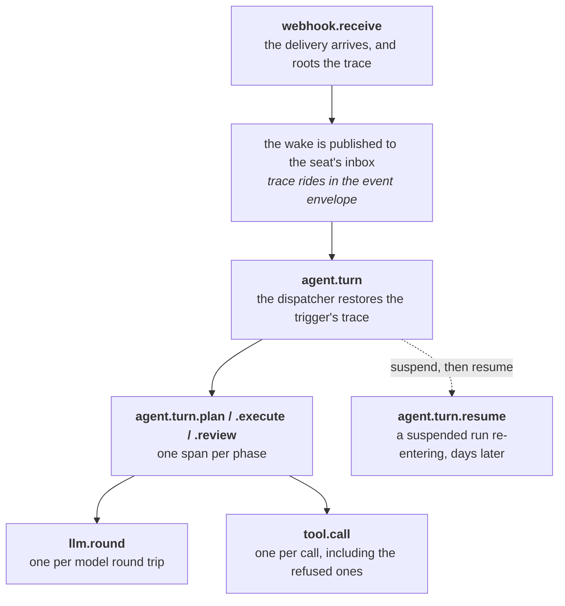

# Deployment

**Crewlet requires no infrastructure services.** The engine is one
binary: its event stream is a NATS JetStream server it embeds, and its store
is a local file it creates and owns exclusively. A single host runs a whole
company with nothing else installed.

One slot changes when a deployment outgrows one node — the stream, which
becomes either a cluster of the members the nodes already embed or a NATS
cluster somebody else runs — and this page is mostly about that path. The
coordination KV is not a second address: it rides the stream's own
connection, deliberately, so that a node cannot end up holding live leases
over a link that still works while the one carrying its inbox has dropped —
alive to its peers, deaf to its work. The store never becomes shared either:
it stays one file per node, which is why everything genuinely shared between
nodes lives in the KV instead. See [Running a Fleet](fleet.md) and
[Scaling Out](../concepts/scaling.md).

---

## The single host

```yaml
# config.yaml (Tier A)
stream:
  type: embedded              # a JetStream server inside this process
  store_dir: "/var/lib/crewlet/stream"   # empty = in-memory, nothing survives a restart

store:
  path: "/var/lib/crewlet/company.db"    # ONE file, this process only

coordination:
  type: local                 # one node holding its own seat leases
```

```bash
crewlet run -config config.yaml -company company.yaml
```

That is the deployment. Point a reverse proxy at the API port for inbound
webhooks and the dashboard, and there is nothing else to operate.

---

## The compose stack starts nothing

`docker-compose.yml` in a repo checkout is for the things *around* the
engine — the local integration loops, and nothing else. There is no broker
service in it, because there is nothing to run: the engine embeds its own.
Every service is behind a profile, so a bare `docker compose up` brings up
nothing at all:

```bash
cp .env.example .env                              # first time only
docker compose --profile gitlab up -d             # GitLab (code host)
docker compose --profile mattermost up -d --wait  # Mattermost (chat)
```

| Service | Port | Details |
|---------|------|---------|
| GitLab | 8929 / 2424 | `gitlab/gitlab-ee`, configured `external_url http://gitlab.local:8929` — the published port and the URL GitLab builds its own links from are deliberately the same number. 2424 is git-over-SSH and optional; HTTPS plus a token is the path the engine takes |
| Mattermost | 8065 | `${MATTERMOST_LISTEN_PORT:-8065}`. Mattermost accepts a websocket upgrade only from a browser whose `Origin` matches `MM_SERVICESETTINGS_SITEURL` exactly, host and scheme, so move the port and the site URL together or the page loads with the event stream silently dead |

---

## The stream beyond one host

The stream slot has a default and one alternative, and they differ in who
runs the broker rather than in what the engine speaks: `embedded` starts a
NATS JetStream server inside this process, `nats` dials one somebody else
runs. The client code is identical either way — one implementation, with the
connection as the only branch — so nothing above the queue can tell which is
in use, and no company config mentions it.

A single host needs neither shape below. A fleet needs exactly one of them,
because two nodes each embedding a *solo* server are two companies that
cannot see each other: the solo server binds no socket at all, which is a
security property as much as a convenience.

### Every node embeds a member of one cluster

The fleet still ships as one binary and there is still no broker to deploy.
Three nodes, each naming itself, its route port and the other two:

```yaml
# config.yaml (Tier A) on the first node. The other two differ only in
# node.id and in which peers they name.
node:
  id: crewlet-1

stream:
  type: embedded
  store_dir: "/var/lib/crewlet/stream"
  cluster:
    name: crewlet                      # identical on every member
    port: 6222                         # this member's route port
    peers:                             # the others' route URLs
      - "nats://crewlet-2.internal:6222"
      - "nats://crewlet-3.internal:6222"
  replicas: 3                          # a publish is committed by a quorum
                                       #   before Publish returns

coordination:
  type: embedded-kv                    # the leases ride the stream's own
                                       #   connection; nothing else to set
```

**`node.id` is this member's identity in the cluster, and it has to survive a
restart.** The engine passes it as the NATS server name, which must be unique
— a route from a server whose name the cluster already knows is rejected —
and stable, because **JetStream places replicas by server name**. A node that
comes back under a fresh name is a new peer: its old replicas are orphaned on
a member that no longer exists, and the stream sits short of quorum waiting
for a server that will never return. That is why a clustered member with no
name is refused at startup rather than given a generated one — a generated
name is unique, which is only half the requirement.

**It is the resolved id, so the environment is enough.** The name follows the
same precedence as everything else that identifies this node — `node.id` in
the file, then `CREWLET_NODE_ID`, then the default — so an orchestrator
injecting a pod name needs no `node:` block at all. Writing
`node.id: "${CREWLET_NODE_ID}"` (or `"${HOSTNAME}"`) works too, and means the
same thing: Tier A expands `${VAR}` references before it decodes.

**One node or three, never two.** Two embedded-KV members have no quorum
without each other, so the fleet stops serving the moment either restarts —
and a rolling upgrade restarts them one at a time, which makes the outage
certain rather than unlucky. Tier A refuses a two-member config by name.

**A fresh cluster takes seconds to form, and the engine waits it out rather
than hanging.** Accepting connections is not the same as being able to serve
JetStream: a member answers its client port as soon as it is listening, while
the metadata group takes seconds to elect a leader — measured at around eight
on a quiet three-member cluster — and until it has one, creating a replicated
stream *blocks* instead of failing. So a node waits for its own JetStream to
become current, up to 60 seconds, and then retries placement for as long as
the cluster answers "no suitable peers", inside a 30-second provisioning
deadline per stream. Every other error is returned at once: a bad subject or
a conflicting retention does not clear by waiting, and retrying would turn a
config mistake into a half-minute hang with the same message at the end.

**Set `store_dir`, or the fleet forgets.** Empty selects an in-memory member,
which is right for a test and for a stateless ingress-only node and wrong for
anything else: a restart loses that member's replicas, and the same server
holds the KV buckets carrying the fleet's shared records — the token counter,
the completion ledger, open agent-to-agent asks, claimed scheduled fires,
detached (and billed) sandbox runs.

> **The clustered embedded broker has no authentication and no TLS. Run it on
> a trusted network.**
>
> A clustered member listens on two ports, on every interface: the route port
> named in the config, and a client port the server picks for itself. Neither
> carries a credential or a certificate. `credentials`, `token` and
> `stream.tls` are **dial-side** options — they configure this process
> connecting *out* to a URL — and an embedded server has no server-side
> counterpart in Tier A at all. Anything that can reach those ports can
> publish onto a seat's inbox, read every event the company produces, and
> take its leases.
>
> A private subnet, a security group or a WireGuard mesh between the nodes is
> what makes this shape safe, and no configuration substitutes for one. A
> deployment that needs the brokers themselves mutually authenticated runs
> `stream.type: nats` against a NATS cluster it secures itself.

### An external NATS server

The other multi-node shape, and the one to reach for when the broker has to
be secured, operated, or shared on a schedule of its own:

```yaml
# config.yaml (Tier A)
stream:
  type: nats
  url: "nats://nats-1.internal:4222,nats://nats-2.internal:4222,nats://nats-3.internal:4222"
  credentials: "/etc/crewlet/engine.creds"   # an NKey/JWT creds file
  # token: "${CREWLET_NATS_TOKEN}"           # or a bearer token
  tls:
    ca: /etc/crewlet/ca.pem                  # the private CA to trust
    cert: /etc/crewlet/client.pem            # this engine's own certificate
    key: /etc/crewlet/client.key

coordination:
  type: embedded-kv
```

**The URL goes to the NATS client verbatim**, so a comma-separated list of a
cluster's members is one value as far as this config is concerned and the
client fails over between them. `store_dir` is refused here by name: it is
where an *embedded* server persists, and an external cluster keeps its own
storage.

**Authentication is `credentials` or `token`.** `credentials` is a path to a
NATS credentials file, the NKey/JWT pair a NATS account setup issues per
user; `token` is a bearer token, and takes a `${VAR}` reference so the
secret stays out of the file and out of the config revision history. Set
whichever the broker asks for; both are dial options, and the engine stores
neither.

**`stream.tls` is the transport underneath that authentication**, and it is a
separate question from who you are: a broker configured `tls { verify: true }`
— the hardened default every NATS guide recommends — refuses a connection
presenting no client certificate, whatever credentials would have followed.
`ca` is the bundle the server's certificate is verified against, and empty
means the host's root pool, which is right for a public CA and wrong for the
self-signed certificate most internal estates use. `cert` and `key` are this
engine's own certificate: both or neither, because validation refuses half a
keypair rather than letting it dial and be rejected by the broker with an
error naming neither file. There is deliberately **no way to skip
verification** — that switch is set once during a bring-up and never unset,
and the connection it leaves behind carries every event this company
publishes to whoever answers on that address.

**Those files are opened before the dial, and the error names the field.** A
missing `ca` reports `tls.ca /etc/crewlet/ca.pem: no such file or directory`,
not a connection failure. Left to the NATS client, an unreadable certificate
surfaces as a dial error that reads exactly like *the broker is
unreachable* — and sends an operator to debug a network path that is fine,
for a file that is simply not there.

**A broker blip is not a node restart.** The engine dials with unlimited
reconnects and a one-second wait between attempts, and never gives up on the
URL: the coordination layer already distinguishes "unreachable" from "not
mine", and a node that keeps its seats through a two-second outage is the
entire point of that distinction. The coordination KV rides this same
connection on purpose — one connection, one fate. An outage that outlasts the
lease TTL (45 s unless `coordination.lease_ttl_seconds` says otherwise) does
hand this node's seats to a peer, and that is the intended behaviour rather
than something a reconnect policy should paper over.

**The account needs more than publish and subscribe.** A node creates what it
uses, on every start and idempotently: the five engine streams
(`CREWLET_AGENT`, `CREWLET_EVENTS`, `CREWLET_NOTIFICATIONS`,
`CREWLET_CONFIG`, `CREWLET_DLQ`), a stream per extra subject namespace a
company publishes under, one durable consumer per seat mailbox — an ordinary
API call, measured at 1.7 ms — and the twelve `crewlet_*` KV buckets holding
the leases, the fencing epochs and the fleet's shared records. A credential
scoped to publishing and consuming fails at boot, on the first stream it
tries to create.

**Replication is asked for, not assumed.** `stream.replicas` is the replica
count the engine requests for each of those streams and buckets, and it
applies to an external cluster exactly as it does to an embedded one — set it
to `3` against a cluster of three or more, or the engine asks for one copy and
gets what it asked for: streams and a lease bucket that survive a process
restart but not the loss of the single server holding them.

Tier A cannot check this number for you here. It refuses `replicas` above 1
on an *embedded* stream that names no peers, because that file contradicts
itself — but `stream.url` names an address rather than a member list, so how
many servers answer behind it is yours to know. Asking for more replicas than
the cluster has members fails at boot, on the first stream the engine tries to
create.

---

## Running the Engine + API

### Single Process (embedded API — the single-host default)

Any `api.port > 0` in the Tier A YAML makes `crewlet run` start an **embedded API server inside the engine process** — one process runs the engine, the dashboard, and every webhook route:

```yaml
api:
  port: 80       # 0 (the default) disables the embedded API
```

```bash
crewlet run -config config.yaml    # engine + embedded API on :80
```

(`-api-port 80` on the command line does the same.) This is the shape every single-host walkthrough in these docs uses — the bundled `examples/nimbus.config.yaml` ships `api.port: 80`, and that embedded server **is** the webhook target the integrations register (e.g. `http://host.docker.internal:80/webhooks/gitlab`). Binding 80 as a non-root process needs privileged-port access on Linux: `sudo sysctl net.ipv4.ip_unprivileged_port_start=80` (persist in `/etc/sysctl.d/`) or grant the binary `CAP_NET_BIND_SERVICE`. Make sure nothing else already owns the port you pick.

Do **not** also start a second node on the same host with such a file — both read the same `api.port`, and the second binder hits `EADDRINUSE` and kills whichever server came second.

**The listener comes up before the seats do.** `crewlet run` binds the HTTP surface first and only then starts claiming seats, so `/dashboard`, `/health` and every webhook route answer within a second of boot even on a company whose agents take much longer to come up. That ordering matters because claiming a seat starts that seat's per-role MCP servers — one subprocess per server per seat, each a spawn, a handshake and a `tools/list` — and a company with seven seats and three vendors is twenty-one children. Serving after them made the whole inbound edge dark for as long as the slowest vendor took, which reads exactly like a hung process.

While seats are still being claimed the node reports what is true rather than pretending: `/health` lists the seats it holds so far, and nothing is lost in the meantime because every seat's mailbox is created before any claiming (see [Event System](../concepts/event-system.md#a-seats-mailbox-exists-before-the-seat-is-running)). A seat's own children still start before its mailbox is attached, so a turn never begins without its tools — that ordering is unchanged; what changed is that they start **concurrently** rather than one after another, so a seat attaches in the time its slowest server takes rather than the sum of all of them.

### Separate processes (a split deployment)

Run ingress as its own node when you want the webhook receiver to stay up
across engine restarts, or the two on separate hosts.

**Two processes need a stream they can both reach**, which a solo embedded
one is not — it binds no socket, so each would have its own. Either shape
from [the section above](#the-stream-beyond-one-host) works: a *clustered*
embedded stream (`stream.cluster`), or an external NATS server
(`stream.type: nats` plus `stream.url`). They also need shared coordination:
Tier A refuses `coordination.type: local` alongside either of them, by name,
rather than letting two nodes each claim every seat.

Both nodes can read the same Tier A file: against an external NATS server
nothing in it is per-node except `node.id`, and `CREWLET_NODE_ID` injects
that without templating anything. A clustered embedded stream is the one
exception — each member also names its own route port and its own peers. So
give each node its roles at the command line, and its own `-api-port`, since
only the ingress node should bind one:

```bash
# Terminal 1: the agents and the fleet duties, no HTTP
crewlet run -config config.yaml -roles seats,workers -api-port 0

# Terminal 2: the webhook receiver and the dashboard
crewlet run -config config.yaml -roles ingress -api-host 0.0.0.0 -api-port 8000
```

Give each node a distinct `node.id` (or `CREWLET_NODE_ID`) — two nodes sharing an id miscount the fleet. See [Running a Fleet](fleet.md).

`crewlet migrate` is idempotent and safe to re-run. Each node also
auto-migrates its own store file on boot, and two nodes starting together
cannot race, because they are not migrating the same file — every node owns
its own. Running the explicit step first turns a schema change into an
observable step rather than a side effect of startup.

Both take the **Tier A** bootstrap file (`crewlet.yaml`) — the founder-owned company YAML is seeded separately (`crewlet config import`, or `crewlet run -company`).

- **`-roles seats`** runs the agents — claims seat leases, boots the instances, processes their turns
- **`-roles ingress`** serves the REST API — receives webhooks (Slack, GitLab, Jira, GitHub, Confluence) and publishes them to the event queue
- **`-roles workers`** runs the company-wide duties — the scheduler tick, the retention sweeps, the sandbox waiter

They are one command, and they build the **same** application: every node learns the company from the active config revision and the live picture from the broadcast event stream. Point `CREWLET_SANDBOX_OTEL_RECEIVER_URL` at whichever node is externally reachable — an `ingress` one, which serves the `/otlp/{token}/v1/{signal}` receiver (sandbox tokens are signed, so the node that mints and the node that verifies need no shared memory). Signing uses the Tier A keyring, so a split deployment needs one configured (`crewlet secrets keygen`); without it each process signs with an ephemeral key and logs a warning.

Point liveness probes at `/health` (stays `200` through a drain) and load-balancer readiness at `/ready` (`503` while draining or before the first config revision applies).

Both communicate through the stream, and through the coordination KV riding
the same connection — never with each other. Both accept `-debug` for verbose
logging.

### Replica count

**Run one `crewlet run`, and scale up before you scale out.** A single
engine handles many concurrent turns — agent handlers are
goroutines, so the practical ceiling is LLM provider rate limits and host
memory, not process count. One node is the design's degenerate case, not
a lesser path: it holds every lease, and everything a fleet does works
exactly the same way.

Multi-node is supported and certified by a chaos suite that kills nodes
mid-turn under load. Reach for it when a node's failure is not acceptable
downtime, when you need to terminate traffic separately from running
agents, or when some seats have to run somewhere specific — not as a
throughput lever, because `max_concurrent` is per process and N nodes is
N × that ceiling whether you wanted it or not.

**[Running a Fleet](fleet.md)** is the guide: node roles, seat placement,
draining, and rolling upgrades. The two things that bite hardest:

> **A fleet needs shared coordination.**
>
> Seat leases live in the coordination slot. `coordination.type: local` is a
> per-process store, so every node then believes it owns the whole company —
> the engine logs `seat_placement_is_process_local` at boot. A fleet needs
> `coordination.type: embedded-kv`; see [Running a Fleet](fleet.md). The slot
> governs the *leases* only — the fleet's shared records are on the KV
> regardless, because they have to survive a restart as much as a peer, and
> the KV rides the stream's own connection whichever value the slot holds.
>
> **And, when the nodes *are* the broker, a quorum to keep it on.**
>
> One node or three, never two: two embedded members have no quorum without
> each other, so the fleet stops serving the moment either restarts, and Tier
> A refuses that config by name, counting `stream.cluster.peers`.
> `stream.replicas: 3` is the other half — one replica count covers the
> engine's streams *and* the coordination buckets, because both live on the
> same broker, and at 1 the loss of a member takes a seat's mailbox or the
> fleet's leases with it. Against an external NATS cluster the quorum is that
> cluster's to provide rather than the engine's to count; see
> [An external NATS server](#an-external-nats-server).

Give each node a distinct id — `node.id` in the Tier A file, or the
`CREWLET_NODE_ID` environment variable, which is how a container orchestrator
injects a pod name without templating the config. Two nodes sharing an id
miscount the fleet and each compute too small a share.

Each node migrates its **own** store file at boot; there is no shared schema
to bring up first, and no migration lock, because no two processes share a
file. [`crewlet migrate`](../reference/cli.md#crewlet-migrate) applies them
ahead of time when you would rather not do it on the startup path.

What a fleet gets right, each of which was a real defect before:

- *Duplicate Slack posts, duplicate Jira comments, two contradictory plans for one webhook.* A seat's inbox is attached only by the node holding its lease, admission is gated on a renew fresh enough to prove exclusivity, and the turn loop re-checks the fence before every round and every write-capable tool. A turn that finished but whose delivery was never acked is not re-run, because the [completion ledger](../concepts/seat-ownership.md#the-completion-ledger) records what shipped.
- *Live coding sandboxes torn down mid-run.* Recovery is a per-seat step inside the acquire hook, fenced on the claiming node's epoch, instead of a fleet-wide scan that treated every in-flight run as abandoned.
- *Config activation.* Delivered by the [control plane](../concepts/control-plane.md) — a shared activation pointer whose own revision is the epoch, polled by every node — rather than the competing-consumer subscription that used to let exactly one replica apply a revision while the rest ran the previous company.
- *Token budgets.* A shared counter in the coordination slot, so an org cap of 500 k is 500 k across the fleet — and it covers **every** completion the engine makes on a seat's behalf, the turn loop, the coding sandbox and the auxiliary learning passes alike.
- *Duplicate auto-drafted skill pages and N× LLM spend on synthesis.* Skill clustering, skill curation and episode compaction are [singleton duties](../concepts/seat-ownership.md#singleton-duties) — they share one `worker:` lease, so a fleet runs each of them on exactly one node — along with the scheduler tick, the sandbox waiter, the seat-subscription walk and the retention sweeps. Each lease is claimed per tick, so a node that dies mid-duty hands it back by lapsing.
- *Unbounded table growth.* `scheduled_runs`, `conversation_sessions` and `chat_thread_follows` all answer a short-horizon question and are written on every event that asks it. The migrations always said they were swept on a TTL; the sweep exists, behind the `maintenance` duty. Most fleet-shared records — the delivery dedupe, the rate valve, the completion ledger, the credential cooldowns and each node's apply status — are not swept here at all: each lives in a [coordination](../concepts/coordination.md) bucket whose own age is its retention, so the broker expires them. Agent-to-agent channels are the exception and *are* swept by the duty, because a bucket age cannot tell an open ask from an answered one. The apply status is the one that hides: it is keyed by *node* rather than by event, so it does not look short-horizon — but a node that is scaled in, redeployed or crashed would leave its last report behind, which under generated pod names is one per pod that ever ran, and the bucket's one-minute age is what makes that node *vanish* instead.

The one thing that is still per-process: `max_concurrent`. Tier A's
`node.max_concurrent` (default 32) is the gate every agent turn takes a slot
from, and it is per node — so an org's ceiling becomes N × the configured
value. Size it per node, not per company.

For the model underneath all of this — what a node is, what the fleet shares,
and where the constants come from — see
[Scaling Out](../concepts/scaling.md).

---

## The store

One local file per node, opened by **Turso** — the only driver. There was a
second, mainline SQLite behind `store.driver` / `CREWLET_STORE_DRIVER`, and
both the field and the variable are retired: a config that still sets the field
is refused with a message saying so, and the variable is read by nothing. The
file format did not change, so an existing store opens untouched and any
SQLite-compatible client still reads it.

**Turso keeps a native library cache, and the engine prepares it before the
first query.** The driver is pure Go in the sense that matters — no cgo, no C
toolchain — but its engine ships as a ~20 MB native library embedded in the
driver, extracted on first use into `$TURSO_GO_CACHE_DIR` (default
`~/.cache/turso-go`) and loaded from there. That cache is shared by every
process on the host and is written without a rename, so two engines starting at
once could leave a half-written file behind that fails verification for good.
Crewlet therefore extracts under a lock in `<cache>/turso-go/`, and clears and
re-extracts a cache entry that will not verify. Two consequences worth knowing:

- **Point `TURSO_GO_CACHE_DIR` at a writable, persistent path** in an ephemeral
  container. A read-only or per-restart cache costs a 20 MB extraction on every
  start; a cache root that cannot be created at all fails the store open with an
  error naming the directory.
- **A cache that cannot be repaired names the way out**, and there is no
  second driver to fall back to any more: delete that directory by hand, or
  point `TURSO_GO_CACHE_DIR` at a writable directory of its own.
- **The linux binaries need glibc, and there is no musl build.** The database
  engine is a native library loaded with `dlopen`, which makes the binary
  dynamically linked against `libc.so.6` even though it is pure Go and built
  with `CGO_ENABLED=0`. On Alpine and other musl systems it fails at `execve`,
  reported as `no such file or directory` about a file that plainly exists.
  Use a glibc base image — the published one is `debian:trixie-slim` for
  exactly this reason — or run the engine on a glibc host. macOS is
  unaffected.

**The engine owns the file exclusively.** A second process pointed at the same
path is not a degraded configuration, it is corruption waiting for a schedule
to collide — so nothing that genuinely needs to be shared between nodes lives
here. Seat leases, the activation pointer and per-node apply status, the
completion ledger, webhook dedupe, the rate valve and credential cooldowns are
all in the [coordination slot](../concepts/coordination.md) instead.

The load-bearing tables:

- **`agent_diary`** — vector-indexed, each agent's private observation log. Written by the reflect path, which embeds content on write. The `## Personal memory` prefetch reads it via hybrid candidate selection (vector top-50 ∪ recency top-50, deduped by row id) handed to an aux-LLM relevance filter. Shared knowledge is **not** stored here — the knowledge base is searched live at query time; see [knowledge system](../concepts/knowledge-system.md).
- **`episodes`** — vector-indexed, one row per completed turn, raw and LLM-compacted shapes in the same table. Drained by the episode-lifecycle duty.
- **`synthesized_skills`** + **`synthesized_skill_versions`** — auto-drafted skills the agent can load, plus their refinement history.
- **`counterparty_profiles`** — per-`(observer, subject, platform)` profiles built from observed interactions.
- **`agent_onboarding_markers`** — onboarding bookkeeping, one row per agent.
- **`crewlet_events`** — the observability event store. A phase completion's token counts are promoted out of its payload into columns, so the spend rollup reads nine narrow values a row instead of hauling every prompt and response across the driver — which is what lets it fold the whole window rather than a capped prefix of it.
- **`crewlet_event_parties`** — which agents each event involves, one row per pair. It is an *index* of the table above rather than state of its own: the dashboard's per-seat activity filter matches on it, and it exists because the engine's planner does no OR-optimization, so the same predicate spread across five columns would scan the log instead of seeking. Swept on the same horizon as the events it points at.
- **`conversation_sessions`** — the [conversation ledger](../concepts/conversation-sessions.md): what this seat already said in one thread, rendered back into that conversation's next turn.
- **`chat_thread_follows`** — per-agent chat thread-follow state, keyed by backend.
- **`company_config`** — the revision payloads. Which one is *current* is the fleet's business, and lives in coordination; see the [control plane](../concepts/control-plane.md).
- **`secret_values`** — the bootstrap half of the [secret store](../concepts/secret-store.md). The company's credentials live on the coordination KV; rows written here while the engine was stopped are migrated there at its next start.

Migrations are **forward-only**: each file in `internal/store/schema/` is applied once and recorded by filename, and there are no downgrade scripts. Downgrading the binary below the schema it already migrated is not supported; restore a [backup](backup.md) instead. There is no migration lock and no advisory-lock protocol, because one process owns the file — the whole idiom disappears.

Everything else is either:

- **YAML config** — the org structure and every seat's definition
- **In-memory** — agent runtime state, the execution tracker
- **An external tool** — task state (Jira, GitLab issues)
- **The event stream** — routing, with a durable per-subscription backlog

---

## Observability

### The event store

Crewlet persists every engine event (LLM invocations, task lifecycle, agent
states) to the `crewlet_events` table in the same file as everything else.

There is **nothing to set up**: the table is created by the engine's own
migrations on first start, on whichever path `store.path` names. No extension
to enable, no managed service to configure, no separate retention system.

The engine registers the event-store writer as a **publish listener** on the
event queue. Every event is written at publish time, inline on the node that
published it — no queue round-trip and no consumer group, which is precisely
why two nodes can never write the same row and a group rebalance can never
lose one. Events land with dedicated columns for the common filterable
dimensions (`event_type`, `source`, `category`, `agent_id`, `agent_role`,
`task_id`, `channel_id`, `sender`, `trace_id`) plus a JSON column for
everything else.

That inline write is also why a fleet's event store is *per node*: each holds
what it published. The dashboard reads the node it is served by. A deployment
that wants one queryable history across a fleet exports to an external sink
over OTLP rather than pointing the nodes at one database, which the exclusive
file ownership rules out by construction.

#### What gets stored, and under which category

`category` is the one column with a closed vocabulary, and it is what the
dashboard's filter and `GET /events?category=` group by. It is a property of
the **event type**, fixed in `internal/events`, and this table is generated
from that map — a guard test fails if the two drift.

| Category | Event types |
|---|---|
| `a2a` | `a2a_channel_closed`, `a2a_channel_opened`, `a2a_message_delivered`, `a2a_message_sent` |
| `communication` | `message_sent` |
| `decision` | `contribution_received`, `contribution_requested`, `decision_requested`, `decision_resolved` |
| `knowledge` | `document_created`, `document_updated` |
| `learning` | `compaction_completed`, `compaction_requested`, `counterparty_profile_updated`, `episode_written`, `persist_decider_completed`, `plan_prefetch_summary`, `reflection_completed`, `relevant_knowledge_refetched`, `skill_archived`, `skill_promoted`, `skill_refined`, `skill_revived`, `skill_staled`, `skill_synthesized`, `skill_used`, `turn_completed` |
| `lifecycle` | `agent_reassigned`, `agent_spawned`, `agent_terminated`, `config_revision_activated`, `config_revision_applied`, `org_started`, `org_stopped`, `role_updated` |
| `notification` | `external_notification`, `notification_skipped`, `notifications_coalesced`, `turn_trigger_skipped` |
| `system` | `agent_phase_completed`, `agent_phase_started`, `agent_turn_completed`, `budget_exhausted`, `execute.missing_tool`, `llm_unavailable`, `phase.tool_activated`, `phase.tool_skill_blocked`, `prompt.size`, `provider_fallback`, `skill_telemetry_write_failed`, `subagent_batched`, `turn.guard_breach` |
| `task` | `sandbox_clarification_requested`, `sandbox_run_completed`, `sandbox_run_started`, `scheduled_task_fired`, `task_assigned`, `task_completed`, `task_created`, `task_delegated`, `task_failed`, `task_started` |
| `webhook` | *No event type.* The [webhook receiver](../reference/api-endpoints.md) writes the delivery's row itself, under its own id with the provider's exact bytes as the payload |

**The map is also the admission list.** A type that is not in it is not written
and does not reach the activity feed — so the three exclusions below are
deliberate and each one says why, and a *new* type that nobody placed fails a
test rather than vanishing quietly.

| Excluded type | Why |
|---|---|
| `agent_turn_progress` | Fires once per LLM round as a live-only signal; the matching `agent_phase_completed` is its durable record, so persisting this would fill the log with intermediate states of rows it also holds finished. It still drives the live projection. |
| `budget_reported` | A snapshot of **live**, in-memory meters whose values mean nothing outside the engine run that produced them. Persisting it lets a dashboard hydrate a dead process's counters and render them as the current ones — a number that is not merely stale but describes a different run. It still drives the live projection. |
| `raw_webhook` | The delivery is **already** a row (the `webhook` category above). This event is the wake the receiver publishes onto a seat's inbox, so categorising it too would store every delivery twice — once as what arrived and once as what was forwarded. |
| `a2a_request` | The ask is **already** a row: `a2a_channel_opened` and `a2a_message_sent` record the same exchange under the ids the audit trail is keyed on. This event is the wake it puts on the target seat's inbox — same reason as `raw_webhook`. |
| `a2a_message` | The answer is **already** a row (`a2a_message_sent`, plus `a2a_message_delivered` for the read). This event is the wake it puts on the requester's inbox. |

#### Querying events

The dashboard's [Event log](../reference/dashboard-design.md#information-architecture) is the
intended reader — filters, traces and event detail, over the same
`/ws/stream` query channel the REST routes use, so both surfaces answer from
one implementation.

For ad-hoc SQL, point any SQLite-compatible client at `store.path` while the
engine is stopped, or use the read-only endpoints under
[`/events`](../reference/api-endpoints.md) while it runs. Do **not** open the
file with a second writer against a running engine.

### Tracing

Crewlet uses **OpenTelemetry** for distributed tracing. Every event carries W3C Trace Context fields (`trace_id`, `span_id`, `parent_span_id`) that propagate automatically through the system.

#### How Traces Flow



**Five span names, and that is the whole set.** `webhook.receive`,
`agent.turn` (plus `agent.turn.resume`), `agent.turn.<phase>`, `llm.round` and
`tool.call`, alongside `schedule.fire` for cron-started work.

Span attributes are deliberately thin: the seat, the phase, the model, the
round, the tool and its outcome, and token counts. Everything about what a turn
*did* — prompts and responses verbatim, tool arguments and results, the
decision — is already in the [event store](#the-event-store), and a span
carries what no event does, which is **duration**.

Only the LLM *round* is spanned, not the fallback chain, each member's backend
and the credential pool beneath it — on a three-member chain over a four-key
pool that would nest a dozen spans per round and tell you nothing you could act
on. Which member and which credential answered is on the phase event.

**A suspended run is two spans, not one.** A [code sandbox](../concepts/code-sandbox.md)
run detaches: the phase returns, the process may exit, the seat may move node,
and the resume can be days later. A live span cannot survive that, so the
suspending span ends and the resume opens a new one under a reconstructed
parent — the wait shows up as the gap it actually is.

#### Dashboard Trace View

The dashboard groups a trace's events into a tree — reach one from any row that carries a `trace_id`, or paste the id into the search box:

- Root event (e.g., webhook) shown as the trace header
- Child events nested underneath with connecting lines
- Click `inspect →` on LLM turn events to view the full prompt/response
- Notification skip reasons shown inline (e.g., "not following this thread")

#### OTLP Export

To export traces to Jaeger, Grafana Tempo, or any OTLP-compatible backend:

```bash
export OTEL_EXPORTER_OTLP_ENDPOINT=http://localhost:4318
```

That is the collector's **base** URL — the engine appends `/v1/traces` itself.
Do not include the signal path here; use `OTEL_EXPORTER_OTLP_TRACES_ENDPOINT`
when you need to give the full URL. Getting this wrong also reaches the sandbox
forwarder, which appends a signal path of its own, and the collector sees
`/v1/traces/v1/traces`.

When either is set the engine installs a batching exporter at startup and
flushes it during shutdown, after the drain, so the spans a shutdown itself
produces are exported rather than dropped. Without it, spans are still created
and their ids still reach every event, the event store and the dashboard's
trace view — there is simply nothing shipping them anywhere.

The full set of variables, including the protocol, the service name and the
sampling ratio, is in
[Environment Variables](../reference/environment-variables.md#opentelemetry-optional).
The engine's exporter and the sandbox OTLP forwarder read the **same** endpoint
and headers on purpose: a coding agent's spans land in the same backend as the
turn that started them, nested underneath it.

#### Correlating logs with traces

Every log line emitted inside a span carries `trace_id` and `span_id`, in all
three [log formats](#logging). So a span you are looking at in Jaeger and the
lines the engine wrote while it was open are joined by the same identifier:

```bash
crewlet run -log-format json | jq 'select(.trace_id == "4bf92f35…")'
```

Lines emitted outside any span carry neither field rather than carrying an
empty one, so a shipper indexing `trace_id` never sees a placeholder.

#### Querying Traces in the Event Store

The `crewlet_events` table stores `trace_id`, `span_id`, and `parent_span_id` as first-class columns, so trace queries are a direct column filter:

```sql
-- All events in a specific trace
SELECT event_time, event_type, source, summary, payload
FROM crewlet_events
WHERE trace_id = '<trace-id>'
ORDER BY event_time ASC;
```

The dashboard API also provides `GET /events/trace/{trace_id}` which returns all events in a trace ordered by timestamp.

### Logging

How loud a node is, and in what shape, is Tier A:

```yaml
# crewlet.yaml (Tier A)
logging:
  level: info       # debug, info (default), warn, error
  format: console   # console (default), text, json
```

That block is the only way the file says it. A `debug: true` boolean used to
sit beside it; it was retired rather than wired up, because two keys setting
one value is a state where they can disagree and something has to arbitrate.
A file that still carries it is refused with the line that replaces it, not
with a spelling check.

The same settings, on the command line, for one run:

```bash
crewlet run -debug                             # shorthand for -log-level debug
crewlet run -log-level debug                   # what -debug is shorthand for
crewlet run -log-level info -log-format json   # for a log shipper
```

**A flag overrides the file only when it is actually given.** A flag carries
its default whether or not anyone typed it, so `crewlet run` distinguishes
"the operator asked for `info`" from "nobody said anything" — otherwise
`logging.level: warn` in a file would be dead on arrival behind the flag's own
default. `-debug` only ever *raises*: to quieten a node whose file says
`logging.level: debug`, pass `-log-level info`.

**The first lines of a run come out in the flag's shape, not the file's.**
The `${VAR}` warnings a Tier A document produces are emitted while it is being
read, so a node configured `format: json` writes those few lines as `console`
before switching. That is the best a process can do about a file it has not
opened yet, and it is the right way round: `-debug` is turned on most often to
watch the config load itself fail, so the flags have to take effect first.

A value the build does not recognise is treated differently in the two
places, on purpose. In a **flag** it resolves to the default — a bad log level
must never be why a company will not boot. In the **file** it is refused, with
the field path, by `crewlet validate` and at boot: a flag is typed by someone
watching the process start, and a file is written once and deployed for
months, so a misspelled level there would run quietly at `info` for as long as
nobody looked. Either way the fallback is never *silent*: an unrecognised
`-log-level` / `-log-format`, or `$CREWLET_LOG_LEVEL` / `$CREWLET_LOG_FORMAT`,
logs a `log_level_unrecognised` / `log_format_unrecognised` warning naming what
was written, what the build used instead, and what it accepts.

#### The three formats

| Format | For | Shape |
|---|---|---|
| `console` (default) | A person watching a terminal | Fixed columns — time, level, component, event — with attributes dimmed, and ANSI colour when the stream is a live terminal |
| `text` | Grepping without a parser | slog's `key=value`: `time=… level=INFO msg=seat_claimed component=seat.host seat=eng.alice` |
| `json` | A log shipper | One JSON object per line |

`console` adapts to its sink. Colour appears only on a live terminal, so a
redirected stream carries no escape codes it cannot render — and because a
redirected stream is read *later*, its lines carry the full date where a
terminal's carry the wall-clock time alone. `CREWLET_LOG_COLOR=always|never`
overrides the detection (for a CI viewer that renders ANSI without being a
terminal), and `NO_COLOR` suppresses it the way it does for every other tool.

Every line is structured whichever format is installed, and carries a
`component` attribute naming the subsystem that emitted it (`agent.turn`,
`mcp.client`, `seat.host`) — the field `console` promotes into its own column
— so a debug run stays filterable rather than becoming a wall.

The operator commands are quiet by default: they open a store, which logs a
line per migration, and that is noise on a one-shot command whose output is
meant to be piped or diffed. They take no logging flags — only `crewlet run`
does — so `CREWLET_LOG_LEVEL` and `CREWLET_LOG_FORMAT` are their levers. See
[Environment Variables](../reference/environment-variables.md#logging).
Nothing silences a warning.

### Per-Agent Token Tracking

Every LLM completion records prompt, completion and total tokens plus a call
count, per agent and per model, with cache reads and writes broken out so
cached prefixes are visible rather than folded into the total.

Read them from the **Spend & budgets** screen in the dashboard, or over the
socket's query channel — `tokens` for the rollup and `budgets` for the caps
beside the durable counters the engine enforces against. Both are the same
functions the REST routes call, so the two surfaces cannot disagree.

```bash
crewlet budgets show      # the durable counters, read from a running node
crewlet budgets reset     # -scope org, or -scope agent:<id>
```

Both talk to a node rather than to a file: the counter is the fleet's, and on
the default topology it lives inside the running engine. `-url` and `-token`
name another node; without them they are taken from the `api` block of the
config on the command line.

### Token Budgets

Set budgets at two levels:

- **Org-wide** — `token_budget` in the top-level YAML config
- **Per-agent** — `token_budget` on each Role definition

When exceeded, the shared tool loop emits a `BudgetExhausted` event, stops the
turn and marks the task failed. The check is atomic: if the agent's budget
fails, the org-level consumption it had already charged is rolled back. In a
fleet the counters live in the coordination slot, so an org cap of 500 k is
500 k across every node rather than per process.

### Structured Logging

Every significant operation emits structured log entries:

```json
{
  "timestamp": "2026-03-12T10:30:00Z",
  "level": "info",
  "component": "agent.turn",
  "agent_id": "abc-123",
  "role": "Senior Engineer",
  "event": "turn_completed",
  "task_id": "def-456",
  "llm_input_tokens": 1200,
  "llm_output_tokens": 647,
  "duration_ms": 3200,
  "trace_id": "4bf92f3577b34da6a3ce929d0e0e4736",
  "span_id": "00f067aa0ba902b7"
}
```

`trace_id` and `span_id` are present on any line emitted inside a span — which
is every line a turn produces — and absent entirely on lines that are not, so a
shipper indexing them never sees an empty placeholder. They are the same ids the
[tracing](#tracing) section exports, which is what lets you pivot from a slow
span in Jaeger to the lines the engine wrote while it was open.

Note the JSON key for the message is `msg`, slog's own; `event` above is
illustrative of the *value* — the short, machine-parsable event name every line
carries in place of a sentence.

### Reacting to events

Every state change in the engine is an event on the stream, so anything that
wants to react — dashboards, alerting, an external audit sink — subscribes
rather than polls. `/ws/stream` is the read surface for a client; nothing runs
inside the process to hook them, because the engine loads no plugins.

---

## Security Boundaries

- **Scope isolation** — agents can only access knowledge within their permitted scopes
- **Tool availability** — all registered tools available; per-role MCP tools carry role-specific credentials
- **Communication permissions** — agents can only post to channels they're members of
- **Manager handoffs** — agents identify their manager from their identity prompt and reach them through the colleague-surface tools (Slack/Jira/Confluence/A2A); engine-detected failures surface to the operator dashboard as `afk` state
- **LLM sandboxing** — tool execution results are validated before returning to the agent
