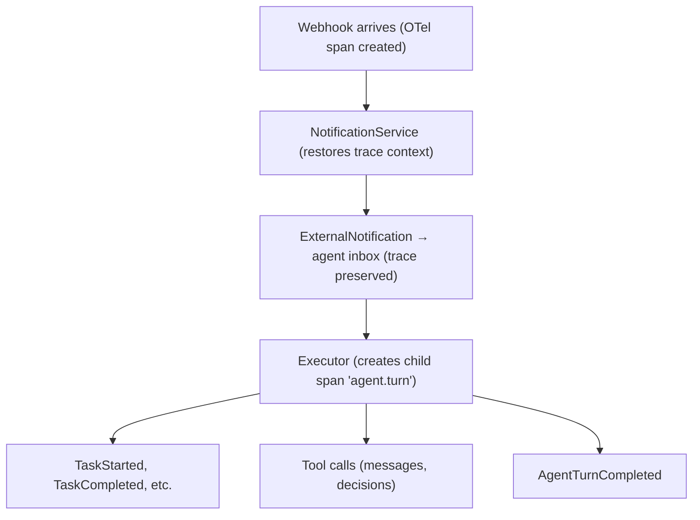

# Deployment

**Crewlet requires no infrastructure services.** The engine is one static
binary: its event stream is a NATS JetStream server it embeds, and its store
is a local file it creates and owns exclusively. A single host runs a whole
company with nothing else installed.

Two slots take an external address when a deployment outgrows one node — the
stream and the coordination KV — and this page is mostly about that path. The
store never becomes shared: it stays one file per node, which is why
everything genuinely shared between nodes lives in the KV instead. See
[Running a Fleet](fleet.md) and [Scaling Out](../concepts/scaling.md).

---

## The single host

```yaml
# config.yaml (Tier A)
stream:
  type: embedded              # a JetStream server inside this process
  store_dir: "/var/lib/crewlet/stream"   # empty = in-memory, nothing survives a restart

store:
  path: "/var/lib/crewlet/company.db"    # ONE file, this process only

coordination:
  type: local                 # one node holding its own seat leases
```

```bash
crewlet run -config config.yaml -company company.yaml
```

That is the deployment. Point a reverse proxy at the API port for inbound
webhooks and the dashboard, and there is nothing else to operate.

---

## The compose stack starts nothing

`docker-compose.yml` in a repo checkout is for the things *around* the
engine — the local integration loops and the external stream backend. Every
service in it is behind a profile, so a bare `docker compose up` brings up
nothing at all:

```bash
cp .env.example .env                              # first time only
docker compose --profile plane up -d              # Plane (tracker + knowledge)
docker compose --profile gitlab up -d             # GitLab (code host)
docker compose --profile mattermost up -d --wait  # Mattermost (chat)
docker compose --profile pulsar up -d             # Pulsar + Dekaf
```

---

## Apache Pulsar as the stream

Pulsar is one of the two external options for the stream slot (an external
NATS server is the other, and is the simpler one). Everything in this
section applies to a deployment that has chosen it; a single-host company
needs none of it.

```bash
docker compose --profile pulsar up -d
```

| Service | Port | Details |
|---------|------|---------|
| Apache Pulsar | 6650 / 8080 | `apachepulsar/pulsar:latest` standalone — 6650 binary protocol (the engine connects here), 8080 admin/REST (the engine needs BOTH: subscription lifecycle runs over admin REST) |
| Dekaf (Pulsar UI) | 8090 | Pulsar web UI — topics, subscriptions, backlog, message browse |

The Pulsar web UI is [Dekaf](https://pulsar.apache.org/docs/next/administration-dekaf-ui/) (the UI the Pulsar docs recommend — Apache-2.0, no account/license), auto-wired to the broker. The CLI works too, e.g. `docker compose exec pulsar bin/pulsar-admin topics list public/default`. Dekaf is just a UI; remove the `dekaf` service from `docker-compose.yml` if you don't want it.

**Local vs remote access.** Dekaf renders an absolute `<base href>` from `DEKAF_PUBLIC_BASE_URL` (default `http://localhost:8090`), so the SPA's own API calls target that URL. Locally, just open <http://localhost:8090>. **When Dekaf runs on a remote server**, set `DEKAF_PUBLIC_BASE_URL` to the address you actually open in the browser — e.g. in `.env`:

```bash
DEKAF_PUBLIC_BASE_URL=http://<server-ip-or-host>:8090
```

Otherwise the page loads but every API call goes to the *browser machine's* `localhost:8090`, which fails.

**`upstream connect error ... connection failure ... 111`.** That's Dekaf's Envoy (on 8090) reporting its backend was unreachable. Most often it's the remote-access case above (calls hitting the wrong host); it can also mean you opened the UI before Dekaf finished starting, or its backend was starved on a RAM-pressured host. The service has a healthcheck — wait until `docker compose ps` shows `dekaf` as `healthy` (or use `docker compose up --wait`), make sure the broker/host is healthy (see the JVM-memory note above), and if it persists check `docker logs crewlet-dekaf-1` and `docker stats`.

**JVM memory (most important).** The `apachepulsar/pulsar` image defaults to `PULSAR_MEM="-Xms2g -Xmx2g -XX:MaxDirectMemorySize=4g"` — the standalone JVM commits 2 GB of heap *at startup* and can grow direct memory to 4 GB (~6 GB total). On a host without that much free RAM (alongside the engine itself), the box starts **swapping**, which presents as a sustained 100+ MB/s disk-read storm and high load right when you start the project, and can make the host itself unresponsive (you can lose SSH). No disk/retention setting fixes this — it's a memory problem. The bundled `docker-compose.yml` caps it to `-Xms512m -Xmx1g -XX:MaxDirectMemorySize=512m` (~800 MB idle, stays bounded under load) and sets `mem_limit: 2g` as a hard container ceiling so it can never swap the host. Raise these if you run a heavier workload and have the RAM. (Pulsar's own [docker-compose guide](https://pulsar.apache.org/docs/next/getting-started-docker-compose/) assumes ≥ 8 GB for a full cluster; the capped standalone here needs far less.)

**Orphaned subscriptions.** Pulsar keeps a message until *every* subscription has acked it, so a durable subscription left behind by an unclean shutdown — e.g. one of the dashboard's per-tab broadcast consumers after a crash — would otherwise pin events on disk indefinitely. The bundled `docker-compose.yml` sets `subscriptionExpirationTimeMinutes=30`, which reaps a subscription that has had no connected consumer for 30 minutes (releasing its backlog). This is non-lossy for live work — the engine's own subscriptions have a connected consumer the whole time it runs. We deliberately do **not** set an aggressive message TTL or backlog-eviction quota here: those apply uniformly to the engine's durable inboxes too and would silently drop legitimately-queued tasks (e.g. for an agent that's briefly down). Genuine send/queue pressure is handled at the application layer (the Pulsar backend retries transient publish failures with backoff) and the JVM memory cap is what actually protects the host.

If a broker has already bloated (e.g. from repeated unclean kills on a broker running without the JVM memory cap), clear the accumulated state: `docker compose rm -sf pulsar && docker volume rm crewlet_pulsar-data`, then bring the profile back up. The engine's own store is a separate file and is untouched by this. If you want acknowledged events kept for longer queue-side replay, set a namespace retention policy, e.g. `docker compose exec pulsar bin/pulsar-admin namespaces set-retention public/default --time 7d --size -1`.

**Custom tenant / namespace.** By default all crewlet topics live under Pulsar's built-in `public/default`, which exists on every broker. To isolate crewlet on a shared cluster, set `stream.tenant` / `stream.namespace` in the Tier A config — topics then become `persistent://<tenant>/<namespace>/<subject>`.

The engine **does** use the admin API, and needs `admin_url` reachable: seat
subscriptions are created over admin REST rather than by subscribing, because
creating one by subscribing joins a Shared subscription a peer already owns
and steals its traffic — measured. What it never does is create *tenants or
namespaces*: Pulsar auto-creates topics and nothing else, so provision those
out-of-band before starting the engine:

```bash
# one-time, by the operator (or your IaC):
docker compose exec pulsar bin/pulsar-admin tenants create crewlet
docker compose exec pulsar bin/pulsar-admin namespaces create crewlet/prod
```

```yaml
# config.yaml (Tier A)
stream:
  type: pulsar
  url: "pulsar://localhost:6650"
  admin_url: "http://localhost:8080"
  tenant: crewlet
  namespace: prod
```

If the tenant/namespace doesn't exist, the engine fails at startup with the broker's "namespace/tenant not found" error on its first subscription — create it and restart.

**Authentication.** The bundled compose runs the broker **unauthenticated**, which is fine on a laptop and wrong anywhere else. For a broker reachable beyond localhost, enable Pulsar's token authentication and authorization: the engine authenticates as its own *role* (the JWT's `sub` claim), and you grant that role produce/consume on its namespace only, so a stolen or stray client gets `AuthorizationError` instead of your agents' inboxes.

1. Generate a secret key and tokens, and copy the key to the host
   `./pulsar-keys/` directory that step 2 mounts — generating it straight
   into `/pulsar/keys/` would strand it in the container's ephemeral
   filesystem, and the broker recreated in step 2 (with the mount) would
   come up without its signing key. These are credentials; the repo's
   default `.gitignore` covers `pulsar-keys/`:

   ```bash
   docker compose exec pulsar bin/pulsar tokens create-secret-key --output /pulsar/secret.key
   docker compose exec pulsar bin/pulsar tokens create --secret-key file:///pulsar/secret.key --subject admin   # operator
   docker compose exec pulsar bin/pulsar tokens create --secret-key file:///pulsar/secret.key --subject engine  # the engine
   mkdir -p pulsar-keys
   docker compose cp pulsar:/pulsar/secret.key pulsar-keys/secret.key
   ```

2. Enable auth on the broker (compose `pulsar` service; mount the key dir and update the healthcheck, which must now authenticate too):

   ```yaml
   environment:
     PULSAR_PREFIX_authenticationEnabled: "true"
     PULSAR_PREFIX_authenticationProviders: "org.apache.pulsar.broker.authentication.AuthenticationProviderToken"
     PULSAR_PREFIX_authorizationEnabled: "true"
     PULSAR_PREFIX_superUserRoles: "admin"
     PULSAR_PREFIX_tokenSecretKey: "file:///pulsar/keys/secret.key"
     PULSAR_PREFIX_brokerClientAuthenticationPlugin: "org.apache.pulsar.client.impl.auth.AuthenticationToken"
     PULSAR_PREFIX_brokerClientAuthenticationParameters: "token:${PULSAR_ADMIN_TOKEN}"
   volumes:
     - ./pulsar-keys:/pulsar/keys:ro
   healthcheck:
     test: ["CMD-SHELL", "curl -fsS -H \"Authorization: Bearer ${PULSAR_ADMIN_TOKEN}\" http://localhost:8080/admin/v2/brokers/health"]
   ```

3. Create the namespace and grant the engine's role — and only that role — access (operator, one-time):

   ```bash
   A="--auth-plugin org.apache.pulsar.client.impl.auth.AuthenticationToken --auth-params token:$PULSAR_ADMIN_TOKEN"
   docker compose exec pulsar bin/pulsar-admin $A tenants create crewlet
   docker compose exec pulsar bin/pulsar-admin $A namespaces create crewlet/prod
   docker compose exec pulsar bin/pulsar-admin $A namespaces grant-permission crewlet/prod --role engine --actions produce,consume
   ```

4. Point the engine at that namespace with its token (Tier A config; tokens are bearer secrets — use `pulsar+ssl://` plus `tls_trust_certs` whenever the broker isn't on localhost):

   ```yaml
   stream:
     type: pulsar
     url: "pulsar://broker:6650"
     admin_url: "https://broker:8080"
     tenant: crewlet
     namespace: prod
     token: "${CREWLET_PULSAR_TOKEN}"
   ```

5. Dekaf needs credentials too once auth is on — give it a token via `DEKAF_DEFAULT_PULSAR_AUTH: '{"type":"jwt","token":"<token>"}'`.

Verified end-to-end: with the grant in place the engine completes a full publish/subscribe roundtrip in its own namespace, is refused with `AuthorizationError` on any namespace it was not granted, and anonymous connections are rejected outright.

---

## Plane (the local profile)

A local [Plane](../integrations/plane.md) fork instance ships in the main `docker-compose.yml` under the **`plane` profile** — one compose file for everything, profile-gated like everything else, so a plain `docker compose up` leaves the thirteen-service stack out:

```bash
docker compose --profile plane up -d   # no --wait: the migrator is a one-shot job
scripts/plane-dev-bootstrap.sh
```

On a **remote host**, set `PLANE_PUBLIC_URL` (e.g. `http://<server-ip>:8091`) on both commands — it feeds Plane's `WEB_URL`/CORS (where redirects and shared links come from) and is written into `.env.plane` as `${PLANE_URL}`, the reference the shipped company config resolves. The UI lands on `http://localhost:8091` otherwise; budget **~2–2.5 GB RAM** for the whole stack (no per-service `mem_limit`s — none of these small services has the multi-GB-single-process pathology the Pulsar/GitLab caps exist for). The S3 store is [RustFS](https://github.com/rustfs/rustfs) (MinIO's community image is de-facto deprecated), behind the `plane-minio` network alias the proxy's baked Caddyfile expects; RabbitMQ 4.x runs with a compose-shipped permit for the deprecated transient queues Celery's control plane still declares (without it the worker crash-loops and webhook deliveries never run). The bootstrap steps, each idempotent: **(1)** polls the API healthy (migrations included), **(2)** creates the founder (instance admin) plus their personal API token and writes `PLANE_FOUNDER_USER_ID` + `PLANE_URL` into `.env.plane`, **(3)** creates the `nimbus` workspace, **(4)** archives the workspace-named demo project Plane seeds (a decoy agents otherwise wander into), **(5–6)** with `COMPANY=` set runs `crewlet plane provision -create-projects -public-url …` then `crewlet plane import` for the example docs + tool skills, and **(7)** prints the engine next steps (the engine's [embedded API](#single-process-embedded-api--the-single-host-default) is the webhook receiver). The full walkthrough and the end-to-end webhook loop live in [Plane § Local testing](../integrations/plane.md#local-testing); it is not duplicated here.

---

## Running the Engine + API

### Single Process (embedded API — the single-host default)

Any `api.port > 0` in the Tier A YAML makes `crewlet run` start an **embedded API server inside the engine process** — one process runs the engine, the dashboard, and every webhook route:

```yaml
api:
  port: 80       # 0 (the default) disables the embedded API
```

```bash
crewlet run -config config.yaml    # engine + embedded API on :80
```

(`-api-port 80` on the command line does the same.) This is the shape every single-host walkthrough in these docs uses — the bundled `examples/nimbus.config.yaml` ships `api.port: 80`, and that embedded server **is** the webhook target the integrations register (e.g. `http://host.docker.internal:80/webhooks/plane`). Binding 80 as a non-root process needs privileged-port access on Linux: `sudo sysctl net.ipv4.ip_unprivileged_port_start=80` (persist in `/etc/sysctl.d/`) or grant the binary `CAP_NET_BIND_SERVICE`. Avoid 8080 (Pulsar's admin port in the bundled `docker-compose.yml`) and make sure nothing else owns 80 — keep Plane's `PLANE_LISTEN_PORT` at its 8091 default.

Do **not** also start a second node on the same host with such a file — both read the same `api.port`, and the second binder hits `EADDRINUSE` and kills whichever server came second.

**The listener comes up before the seats do.** `crewlet run` binds the HTTP surface first and only then starts claiming seats, so `/dashboard`, `/health` and every webhook route answer within a second of boot even on a company whose agents take much longer to come up. That ordering matters because claiming a seat starts that seat's per-role MCP servers — one subprocess per server per seat, each a spawn, a handshake and a `tools/list` — and a company with seven seats and three vendors is twenty-one children. Serving after them made the whole inbound edge dark for as long as the slowest vendor took, which reads exactly like a hung process.

While seats are still being claimed the node reports what is true rather than pretending: `/health` lists the seats it holds so far, and nothing is lost in the meantime because every seat's mailbox is created before any claiming (see [Event System](../concepts/event-system.md#a-seats-mailbox-exists-before-the-seat-is-running)). A seat's own children still start before its mailbox is attached, so a turn never begins without its tools — that ordering is unchanged; what changed is that they start **concurrently** rather than one after another, so a seat attaches in the time its slowest server takes rather than the sum of all of them.

### Separate processes (a split deployment)

Run ingress as its own node when you want the webhook receiver to stay up
across engine restarts, or the two on separate hosts.

**Two processes need a stream they can both reach**, which an embedded
single-node one is not: each would have its own. Any of three works — a
*clustered* embedded stream (`stream.cluster.peers`), an external NATS
server, or Pulsar. They also need shared coordination: Tier A refuses
`coordination.type: local` alongside any of them, by name, rather than
letting two nodes each claim every seat.

Both nodes read the same Tier A file, so give each its roles — and its own
`-api-port`, since only the ingress node should bind one:

```bash
# Terminal 1: the agents and the fleet duties, no HTTP
crewlet run -config config.yaml -roles seats,workers -api-port 0

# Terminal 2: the webhook receiver and the dashboard
crewlet run -config config.yaml -roles ingress -api-host 0.0.0.0 -api-port 8000
```

Give each node a distinct `node.id` (or `CREWLET_NODE_ID`) — two nodes sharing an id miscount the fleet. See [Running a Fleet](fleet.md).

`crewlet migrate` is idempotent and safe to re-run. Each node also
auto-migrates its own store file on boot, and two nodes starting together
cannot race, because they are not migrating the same file — every node owns
its own. Running the explicit step first turns a schema change into an
observable step rather than a side effect of startup.

Both take the **Tier A** bootstrap file (`crewlet.yaml`) — the founder-owned company YAML is seeded separately (`crewlet config import`, or `crewlet run -company`).

- **`-roles seats`** runs the agents — claims seat leases, boots the instances, processes their turns
- **`-roles ingress`** serves the REST API — receives webhooks (Slack, Plane, GitLab, Jira, GitHub, Confluence) and publishes them to the event queue
- **`-roles workers`** runs the company-wide duties — the scheduler tick, the retention sweeps, the sandbox waiter

They are one command, and they build the **same** application: every node learns the company from the active config revision and the live picture from the broadcast event stream. Point `CREWLET_SANDBOX_OTEL_RECEIVER_URL` at whichever node is externally reachable — an `ingress` one, which serves the `/otlp/{token}/v1/{signal}` receiver (sandbox tokens are signed, so the node that mints and the node that verifies need no shared memory). Signing uses the Tier A keyring, so a split deployment needs one configured (`crewlet secrets keygen`); without it each process signs with an ephemeral key and logs a warning.

Point liveness probes at `/health` (stays `200` through a drain) and load-balancer readiness at `/ready` (`503` while draining or before the first config revision applies).

Both communicate through Pulsar. Both accept `--debug` for verbose logging.

### Replica count

**Run one `crewlet run`, and scale up before you scale out.** A single
engine handles many concurrent turns — agent handlers are
goroutines, so the practical ceiling is LLM provider rate limits and host
memory, not process count. One node is the design's degenerate case, not
a lesser path: it holds every lease, and everything a fleet does works
exactly the same way.

Multi-node is supported and certified by a chaos suite that kills nodes
mid-turn under load. Reach for it when a node's failure is not acceptable
downtime, when you need to terminate traffic separately from running
agents, or when some seats have to run somewhere specific — not as a
throughput lever, because `max_concurrent` is per process and N nodes is
N × that ceiling whether you wanted it or not.

**[Running a Fleet](fleet.md)** is the guide: node roles, seat placement,
draining, and rolling upgrades. The two things that bite hardest:

> **A fleet needs shared coordination and, on Pulsar, the right broker settings.**
>
> Seat leases live in the coordination slot. `coordination.type: local` is a
> per-process store, so every node then believes it owns the whole company —
> the engine logs `seat_placement_is_process_local` at boot. A fleet needs a
> shared one; see [Running a Fleet](fleet.md). The slot governs the *leases*
> only — the fleet's shared records are on the KV regardless, because they have
> to survive a restart as much as a peer.
>
> On Pulsar, its two reapers must also be turned off, because an unowned seat's
> subscription has no connected consumer and both reapers delete exactly that:
> set `subscriptionExpirationTimeMinutes` to `0` and
> `brokerDeleteInactiveTopicsEnabled` to `false` (or
> `brokerDeleteInactiveTopicsMode` to `delete_when_subscriptions_caught_up`).
> The repo's `docker-compose.yml` ships these values under its `pulsar`
> profile, and CI certifies the backend against a broker configured this way.
> Nothing in the engine can detect a broker that is quietly deleting a quiet
> seat's mail.

Give each node a distinct id — `node.id` in the Tier A file, or the
`CREWLET_NODE_ID` environment variable, which is how a container orchestrator
injects a pod name without templating the config. Two nodes sharing an id
miscount the fleet and each compute too small a share.

Each node migrates its **own** store file at boot; there is no shared schema
to bring up first, and no migration lock, because no two processes share a
file. [`crewlet migrate`](../reference/cli.md#crewlet-migrate) applies them
ahead of time when you would rather not do it on the startup path.

What a fleet gets right, each of which was a real defect before:

- *Duplicate Slack posts, duplicate Jira comments, two contradictory plans for one webhook.* A seat's inbox is attached only by the node holding its lease, admission is gated on a renew fresh enough to prove exclusivity, and the turn loop re-checks the fence before every round and every write-capable tool. A turn that finished but whose delivery was never acked is not re-run, because the [completion ledger](../concepts/seat-ownership.md#the-completion-ledger) records what shipped.
- *Live coding sandboxes torn down mid-run.* Recovery is a per-seat step inside the acquire hook, fenced on the claiming node's epoch, instead of a fleet-wide scan that treated every in-flight run as abandoned.
- *Config activation.* Delivered by the [control plane](../concepts/control-plane.md) — a shared activation pointer whose own revision is the epoch, polled by every node — rather than the competing-consumer subscription that used to let exactly one replica apply a revision while the rest ran the previous company.
- *Token budgets.* A shared counter in the coordination slot, so an org cap of 500 k is 500 k across the fleet — and it covers **every** completion the engine makes on a seat's behalf, the turn loop, the coding sandbox and the auxiliary learning passes alike.
- *Duplicate auto-drafted skill pages and N× LLM spend on synthesis.* Skill clustering, skill curation and episode compaction are [singleton duties](../concepts/seat-ownership.md#singleton-duties) — they share one `worker:` lease, so a fleet runs each of them on exactly one node — along with the scheduler tick, the sandbox waiter, the seat-subscription walk and the retention sweeps. Each lease is claimed per tick, so a node that dies mid-duty hands it back by lapsing.
- *Unbounded table growth.* `scheduled_runs`, `conversation_sessions` and `chat_thread_follows` all answer a short-horizon question and are written on every event that asks it. The migrations always said they were swept on a TTL; the sweep exists, behind the `maintenance` duty. Most fleet-shared records — the delivery dedupe, the rate valve, the completion ledger, the credential cooldowns and each node's apply status — are not swept here at all: each lives in a [coordination](../concepts/coordination.md) bucket whose own age is its retention, so the broker expires them. Agent-to-agent channels are the exception and *are* swept by the duty, because a bucket age cannot tell an open ask from an answered one. The apply status is the one that hides: it is keyed by *node* rather than by event, so it does not look short-horizon — but a node that is scaled in, redeployed or crashed would leave its last report behind, which under generated pod names is one per pod that ever ran, and the bucket's one-minute age is what makes that node *vanish* instead.

The one thing that is still per-process: `max_concurrent`. Tier A's
`node.max_concurrent` (default 32) is the gate every agent turn takes a slot
from, and it is per node — so an org's ceiling becomes N × the configured
value. Size it per node, not per company.

For the model underneath all of this — what a node is, what the fleet shares,
and where the constants come from — see
[Scaling Out](../concepts/scaling.md).

---

## The store

One local file per node, opened through one of two certified pure-Go drivers —
`turso` by default and `sqlite` (mainline SQLite) as the escape hatch, selected
with `CREWLET_STORE_DRIVER`. Every statement in the engine parses on both, and
CI runs the store suites twice to keep that true.

**Turso keeps a native library cache, and the engine prepares it before the
first query.** The driver is pure Go in the sense that matters — no cgo, no C
toolchain — but its engine ships as a ~20 MB native library embedded in the
driver, extracted on first use into `$TURSO_GO_CACHE_DIR` (default
`~/.cache/turso-go`) and loaded from there. That cache is shared by every
process on the host and is written without a rename, so two engines starting at
once could leave a half-written file behind that fails verification for good.
Crewlet therefore extracts under a lock in `<cache>/turso-go/`, and clears and
re-extracts a cache entry that will not verify. Two consequences worth knowing:

- **Point `TURSO_GO_CACHE_DIR` at a writable, persistent path** in an ephemeral
  container. A read-only or per-restart cache costs a 20 MB extraction on every
  start; a cache root that cannot be created at all fails the store open with an
  error naming the directory.
- **A cache that cannot be repaired names the way out.** Clear that directory,
  or run with `CREWLET_STORE_DRIVER=sqlite` — the certified fallback needs no
  native library at all, which is exactly what makes it the escape hatch.

**The engine owns the file exclusively.** A second process pointed at the same
path is not a degraded configuration, it is corruption waiting for a schedule
to collide — so nothing that genuinely needs to be shared between nodes lives
here. Seat leases, the activation pointer and per-node apply status, the
completion ledger, webhook dedupe, the rate valve and credential cooldowns are
all in the [coordination slot](../concepts/coordination.md) instead.

The load-bearing tables:

- **`token_usage`** — per-agent cumulative token consumption. The shared tool loop (used by every phase of the [Turn Engine](../concepts/turn-engine.md) — Plan, Execute, Review, sub-agent) writes to it after every LLM completion that passes the budget check, giving durable audit totals. The *enforced* counter is the shared one in coordination; this is the record.
- **`agent_diary`** — vector-indexed, each agent's private observation log. Written by the reflect path, which embeds content on write. The `## Personal memory` prefetch reads it via hybrid candidate selection (vector top-K ∪ recency top-K, deduped, capped at 100) handed to an aux-LLM relevance filter. Shared knowledge is **not** stored here — the knowledge base is searched live at query time; see [knowledge system](../concepts/knowledge-system.md).
- **`episodes`** — vector-indexed, one row per completed turn, raw and LLM-compacted shapes in the same table. Drained by the episode-lifecycle duty.
- **`synthesized_skills`** + **`synthesized_skill_versions`** — auto-drafted skills the agent can load, plus their refinement history.
- **`counterparty_profiles`** — per-`(observer, subject, platform)` profiles built from observed interactions.
- **`agent_onboarding_markers`** — onboarding bookkeeping, one row per agent.
- **`crewlet_events`** — the observability event store.
- **`conversation_sessions`** — the [conversation ledger](../concepts/conversation-sessions.md): what this seat already said in one thread, rendered back into that conversation's next turn.
- **`chat_thread_follows`** — per-agent chat thread-follow state, keyed by backend.
- **`company_config`** — the revision payloads. Which one is *current* is the fleet's business, and lives in coordination; see the [control plane](../concepts/control-plane.md).
- **`secret_values`** — the bootstrap half of the [secret store](../concepts/secret-store.md). The company's credentials live on the coordination KV; rows written here while the engine was stopped are migrated there at its next start.

Migrations are **forward-only**: each file in `internal/store/schema/` is applied once and recorded by filename, and there are no downgrade scripts. Downgrading the binary below the schema it already migrated is not supported; restore a backup instead. There is no migration lock and no advisory-lock protocol, because one process owns the file — the whole idiom disappears.

Everything else is either:

- **YAML config** — the org structure and every seat's definition
- **In-memory** — agent runtime state, the execution tracker
- **An external tool** — task state (Plane, GitLab issues)
- **The event stream** — routing, with a durable per-subscription backlog

---

## Observability

### The event store

Crewlet persists every engine event (LLM invocations, task lifecycle, agent
states) to the `crewlet_events` table in the same file as everything else.

There is **nothing to set up**: the table is created by the engine's own
migrations on first start, on whichever path `store.path` names. No extension
to enable, no managed service to configure, no separate retention system.

The engine registers the event-store writer as a **publish listener** on the
event queue. Every event is written at publish time, inline on the node that
published it — no queue round-trip and no consumer group, which is precisely
why two nodes can never write the same row and a group rebalance can never
lose one. Events land with dedicated columns for the common filterable
dimensions (`event_type`, `source`, `category`, `agent_id`, `agent_role`,
`task_id`, `channel_id`, `sender`, `trace_id`) plus a JSON column for
everything else.

That inline write is also why a fleet's event store is *per node*: each holds
what it published. The dashboard reads the node it is served by. A deployment
that wants one queryable history across a fleet exports to an external sink
over OTLP rather than pointing the nodes at one database, which the exclusive
file ownership rules out by construction.

#### What gets stored, and under which category

`category` is the one column with a closed vocabulary, and it is what the
dashboard's filter and `GET /events?category=` group by. It is a property of
the **event type**, fixed in `internal/events`, and this table is generated
from that map — a guard test fails if the two drift.

| Category | Event types |
|---|---|
| `a2a` | `a2a_channel_closed`, `a2a_channel_opened`, `a2a_message_delivered`, `a2a_message_sent` |
| `communication` | `message_sent` |
| `decision` | `contribution_received`, `contribution_requested`, `decision_requested`, `decision_resolved` |
| `knowledge` | `document_created`, `document_updated` |
| `learning` | `compaction_completed`, `compaction_requested`, `counterparty_profile_updated`, `episode_written`, `persist_decider_completed`, `plan_prefetch_summary`, `reflection_completed`, `relevant_knowledge_refetched`, `skill_archived`, `skill_promoted`, `skill_refined`, `skill_revived`, `skill_staled`, `skill_synthesized`, `skill_used`, `turn_completed` |
| `lifecycle` | `agent_reassigned`, `agent_spawned`, `agent_terminated`, `config_revision_activated`, `config_revision_applied`, `org_started`, `org_stopped`, `role_updated` |
| `notification` | `external_notification`, `notification_skipped`, `notifications_coalesced`, `turn_trigger_skipped` |
| `system` | `agent_phase_completed`, `agent_phase_started`, `agent_turn_completed`, `budget_exhausted`, `execute.missing_tool`, `llm_unavailable`, `phase.tool_activated`, `phase.tool_skill_blocked`, `prompt.size`, `provider_fallback`, `skill_telemetry_write_failed`, `subagent_batched`, `turn.guard_breach` |
| `task` | `sandbox_clarification_requested`, `sandbox_run_completed`, `sandbox_run_started`, `scheduled_task_fired`, `task_assigned`, `task_completed`, `task_created`, `task_delegated`, `task_failed`, `task_started` |
| `webhook` | *No event type.* The [webhook receiver](../reference/api-endpoints.md) writes the delivery's row itself, under its own id with the provider's exact bytes as the payload |

**The map is also the admission list.** A type that is not in it is not written
and does not reach the activity feed — so the three exclusions below are
deliberate and each one says why, and a *new* type that nobody placed fails a
test rather than vanishing quietly.

| Excluded type | Why |
|---|---|
| `agent_turn_progress` | Fires once per LLM round as a live-only signal; the matching `agent_phase_completed` is its durable record, so persisting this would fill the log with intermediate states of rows it also holds finished. It still drives the live projection. |
| `budget_reported` | A snapshot of **live**, in-memory meters whose values mean nothing outside the engine run that produced them. Persisting it lets a dashboard hydrate a dead process's counters and render them as the current ones — a number that is not merely stale but describes a different run. It still drives the live projection. |
| `raw_webhook` | The delivery is **already** a row (the `webhook` category above). This event is the wake the receiver publishes onto a seat's inbox, so categorising it too would store every delivery twice — once as what arrived and once as what was forwarded. |

#### Querying events

The dashboard's [Activity room](../reference/dashboard-design.md) is the
intended reader — filters, traces and event detail, over the same
`/ws/stream` query channel the REST routes use, so both surfaces answer from
one implementation.

For ad-hoc SQL, point any SQLite-compatible client at `store.path` while the
engine is stopped, or use the read-only endpoints under
[`/events`](../reference/api-endpoints.md) while it runs. Do **not** open the
file with a second writer against a running engine.

### Tracing

Crewlet uses **OpenTelemetry** for distributed tracing. Every event carries W3C Trace Context fields (`trace_id`, `span_id`, `parent_span_id`) that propagate automatically through the system.

#### How Traces Flow



Each Event's `trace_id`/`span_id` fields are auto-populated from the active OTel span at creation time. When events cross async boundaries (EventQueue → handler), the receiving component calls the context restore to reconnect the trace.

#### Dashboard Trace View

The dashboard (`/dashboard` → Traces) groups events by `trace_id` into collapsible trace trees:

- Root event (e.g., webhook) shown as the trace header
- Child events nested underneath with connecting lines
- Click `inspect →` on LLM turn events to view the full prompt/response
- Notification skip reasons shown inline (e.g., "not following this thread")

#### OTLP Export

To export traces to Jaeger, Grafana Tempo, or any OTLP-compatible backend:

```bash
export OTEL_EXPORTER_OTLP_ENDPOINT=http://localhost:4318/v1/traces
```

When this env var is set, the engine configures a `BatchSpanProcessor` with an `OTLPSpanExporter` at startup. Without it, spans are still created (for trace context propagation) but not exported.

#### Querying Traces in the Event Store

The `crewlet_events` table stores `trace_id`, `span_id`, and `parent_span_id` as first-class columns, so trace queries are a direct column filter:

```sql
-- All events in a specific trace
SELECT event_time, event_type, source, summary, payload
FROM crewlet_events
WHERE trace_id = '<trace-id>'
ORDER BY event_time ASC;
```

The dashboard API also provides `GET /events/trace/{trace_id}` which returns all events in a trace ordered by timestamp.

### Debug Mode

Set `debug: true` in the Tier A bootstrap file to raise the log level to
DEBUG, or pass it on the command line:

```yaml
# config.yaml (Tier A)
debug: true
```

```bash
crewlet run -debug                       # the same thing
crewlet run -log-level debug             # what -debug is shorthand for
crewlet run -log-level info -log-format json   # for a log shipper
```

Every line is structured and carries a `component` attribute naming the
subsystem that emitted it (`agent.turn`, `mcp.client`, `seat.host`), so a
debug run stays filterable rather than becoming a wall.

The operator commands are quiet by default: they open a store, which logs a
line per migration, and that is noise on a one-shot command whose output is
meant to be piped or diffed. Only `crewlet run` takes its level from these
flags; nothing silences a warning.

### Per-Agent Token Tracking

Every LLM completion records prompt, completion and total tokens plus a call
count, per agent and per model, with cache reads and writes broken out so
cached prefixes are visible rather than folded into the total.

Read them from the **Spend & Budgets** room in the dashboard, or over the
socket's query channel — `tokens` for the rollup and `budgets` for the caps
beside the durable counters the engine enforces against. Both are the same
functions the REST routes call, so the two surfaces cannot disagree.

```bash
crewlet budgets show      # the durable counters, read from a running node
crewlet budgets reset     # -scope org, or -scope agent:<id>
```

Both talk to a node rather than to a file: the counter is the fleet's, and on
the default topology it lives inside the running engine. `-url` and `-token`
name another node; without them they are taken from the `api` block of the
config on the command line.

### Token Budgets

Set budgets at two levels:

- **Org-wide** — `token_budget` in the top-level YAML config
- **Per-agent** — `token_budget` on each Role definition

When exceeded, the shared tool loop emits a `BudgetExhausted` event, stops the
turn and marks the task failed. The check is atomic: if the agent's budget
fails, the org-level consumption it had already charged is rolled back. In a
fleet the counters live in the coordination slot, so an org cap of 500 k is
500 k across every node rather than per process.

### Structured Logging

Every significant operation emits structured log entries:

```json
{
  "timestamp": "2026-03-12T10:30:00Z",
  "level": "info",
  "component": "agent.turn",
  "agent_id": "abc-123",
  "role": "Senior Engineer",
  "event": "turn_completed",
  "task_id": "def-456",
  "llm_input_tokens": 1200,
  "llm_output_tokens": 647,
  "duration_ms": 3200
}
```

### Reacting to events

Every state change in the engine is an event on the stream, so anything that
wants to react — dashboards, alerting, an external audit sink — subscribes
rather than polls. `/ws/stream` is the read surface for a client; nothing runs
inside the process to hook them, because the engine loads no plugins.

---

## Security Boundaries

- **Scope isolation** — agents can only access knowledge within their permitted scopes
- **Tool availability** — all registered tools available; per-role MCP tools carry role-specific credentials
- **Communication permissions** — agents can only post to channels they're members of
- **Manager handoffs** — agents identify their manager from their identity prompt and reach them through the colleague-surface tools (Slack/Jira/Confluence/A2A); engine-detected failures surface to the operator dashboard as `afk` state
- **LLM sandboxing** — tool execution results are validated before returning to the agent
