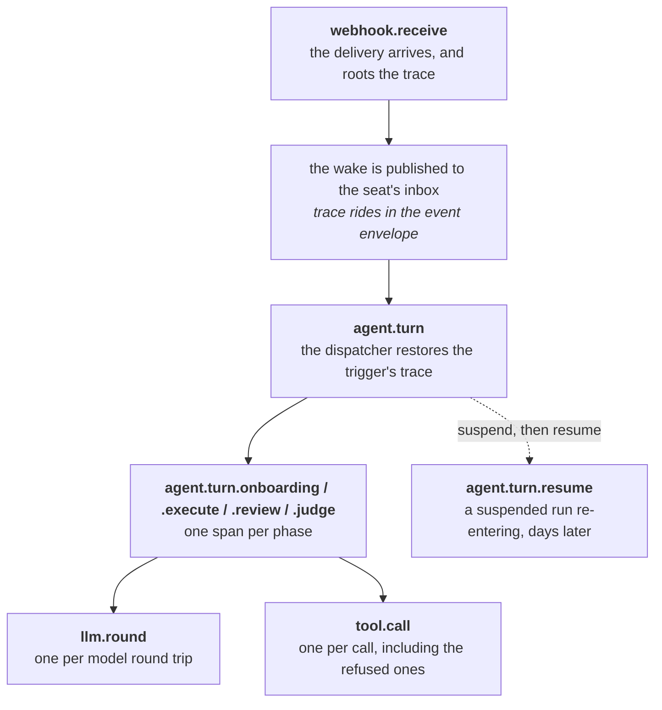

# Deployment

**Crewlet requires no infrastructure services.** The engine is one
binary: its event stream is a NATS JetStream server it embeds, and its store
is a local file it creates and owns exclusively. A single host runs a whole
company with nothing else installed.

One slot changes when a deployment outgrows one node — the stream, which
becomes either a cluster of the members the nodes already embed or a NATS
cluster somebody else runs — and this page is mostly about that path. The
coordination KV is not a second address: it rides the stream's own
connection, deliberately, so that a node cannot end up holding live leases
over a link that still works while the one carrying its inbox has dropped —
alive to its peers, deaf to its work. The store never becomes shared either:
it stays one file per node, which is why everything genuinely shared between
nodes lives in the KV instead. See [Running a Fleet](fleet.md) and
[Scaling Out](../concepts/scaling.md).

---

## The single host

```yaml
# crewlet.yaml (Tier A)
stream:
  type: embedded              # a JetStream server inside this process
  store_dir: "/var/lib/crewlet/stream"   # empty = in-memory, nothing survives a restart

store:
  path: "/var/lib/crewlet/company.db"    # ONE file, this process only

coordination:
  type: local                 # one node holding its own seat leases
```

```bash
crewlet run -config crewlet.yaml -company company.yaml
```

That is the deployment. Point a reverse proxy at the API port for inbound
webhooks and the dashboard, and there is nothing else to operate.

### The room the stream's volume needs

The engine's own tracker, knowledge base and vector index each keep an ordered
log on the stream, and each log's byte ceiling is **reserved** on the volume
holding `stream.store_dir` when its stream is created: the embedded broker
grants a ceiling in full, up front, or refuses to create the stream at all.
Its limit is three quarters of that volume's free space.

The node sizes the three ceilings together to fit half of that limit, and
never below 1 GiB each, so:

- **A first boot needs at least 4 GiB free on that volume.** Three quarters of
  4 GiB is the three 1 GiB floors. Below it the node refuses to boot with an
  error naming the log it could not reserve, the bytes it needed, the bytes
  the broker had left, and the Tier A field that sets the ceiling.
- **More room buys longer logs, up to a point.** Unset, the mutation log asks
  for a quarter of the free space (4..64 GiB), the knowledge base's log for a
  quarter of that, and the vector changelog for 16 GiB capped by the same
  quarter. They are scaled down together whenever they ask for more than that
  half, which on a first boot is every volume with less than 256 GiB free;
  from there up each log gets what it asked for.
- **The ceilings are fixed when the streams are created.** Moving the node to
  a bigger volume, or setting `stream.tracker_log_max_bytes`,
  `stream.tracker_vectors_max_bytes` or `stream.pages_log_max_bytes` later,
  changes nothing about streams that already exist; `crewlet retention
  set-capacity` is what changes a running log's ceiling.

[Replication](replication.md#how-the-byte-ceilings-are-sized) has the whole
arithmetic and the refusal's text.

---

## The compose stack starts nothing

`docker-compose.yml` in a repo checkout is for the things *around* the
engine — the local integration loops, and nothing else. There is no broker
service in it, because there is nothing to run: the engine embeds its own.
Every service is behind a profile, so a bare `docker compose up` brings up
nothing at all:

```bash
cp .env.example .env                              # first time only
docker compose --profile gitlab up -d             # GitLab (code host)
docker compose --profile mattermost up -d --wait  # Mattermost (chat)
```

| Service | Port | Details |
|---------|------|---------|
| GitLab | 8929 / 2424 | `gitlab/gitlab-ee`, configured `external_url http://gitlab.local:8929` — the published port and the URL GitLab builds its own links from are deliberately the same number. 2424 is git-over-SSH and optional; HTTPS plus a token is the path the engine takes |
| Mattermost | 8065 | `${MATTERMOST_LISTEN_PORT:-8065}`. Mattermost accepts a websocket upgrade only from a browser whose `Origin` matches `MM_SERVICESETTINGS_SITEURL` exactly, host and scheme, so move the port and the site URL together or the page loads with the event stream silently dead |

---

## The stream beyond one host

The stream slot has a default and one alternative, and they differ in who
runs the broker rather than in what the engine speaks: `embedded` starts a
NATS JetStream server inside this process, `nats` dials one somebody else
runs. The client code is identical either way — one implementation, with the
connection as the only branch — so nothing above the queue can tell which is
in use, and no company config mentions it.

A single host needs neither shape below. A fleet needs exactly one of them,
because two nodes each embedding a *solo* server are two companies that
cannot see each other: the solo server binds no socket at all, which is a
security property as much as a convenience.

### Every node embeds a member of one cluster

The fleet still ships as one binary and there is still no broker to deploy.
Three nodes, each naming itself, its route port and the other two:

```yaml
# crewlet.yaml (Tier A) on the first node. The other two differ only in
# node.id and in which peers they name.
node:
  id: crewlet-1

stream:
  type: embedded
  store_dir: "/var/lib/crewlet/stream"
  cluster:
    name: crewlet                      # identical on every member
    port: 6222                         # this member's route port
    peers:                             # the others' route URLs
      - "nats://crewlet-2.internal:6222"
      - "nats://crewlet-3.internal:6222"
    host: 10.0.0.11                    # bind the route port to the private
                                       #   interface, not to all of them
  replicas: 3                          # a publish is committed by a quorum
                                       #   before Publish returns

coordination:
  type: embedded-kv                    # the leases ride the stream's own
                                       #   connection; nothing else to set
```

**Bind the route port to the network the peers are on.** `cluster.host` is the
interface the route listener binds, and leaving it unset binds every
interface. A route port is how a member JOINS — and a member that joins reads
and writes every stream and every coordination bucket — so on a host with a
public interface an unset `host` publishes unauthenticated access to the
company's whole event history. Set it to the private address, or keep the port
off the public interface with a firewall; the engine cannot tell which of a
host's addresses is the private one, so it does not guess.

**A cluster block without a name is refused, because it would do nothing.**
The embedded server takes its route port, its bind interface, its advertise
address and its peer list only from a *named* cluster, so anything under
`cluster:` with no `cluster.name` starts a solo node that binds no route
listener and forms no cluster — while every other reading of the same file
(the provisioning budgets, the topology validation) calls it clustered. Tier A
names the missing field instead.

**A route port something else already holds is refused at startup, by name.**
This is the one clustering failure with no other symptom: NATS does not fail
when its route listener cannot bind — it logs the error and carries on serving
clients, so the node comes up, answers `/health`, and simply never forms a
route to a peer. Left to report itself, that surfaced two minutes later as a
readiness timeout blaming peer reachability, which is a network path that is
fine. The engine now probes the port before it starts the server and refuses:

```
stream.cluster.port 6222 is already in use on 10.0.0.11, so this member's
route listener cannot bind and it could never form a route to a peer — free
that port or give this node a different one
```

**`cluster.advertise` is for when what a member binds is not what its peers can
dial.** Members learn about each other from the members they already have: when
node 1 accepts a route from node 2 it tells node 3 where to find node 2, and
node 3 dials that address itself. With nothing configured that address is
derived from the connection's own remote address, which is correct on a flat
network and wrong wherever the address a member is seen from is not one anybody
else can use — a container with a mapped port, a NAT, a member behind a load
balancer. There, set `advertise` to the address peers should dial (host and
port, or a bare host to keep this member's own route port):

```yaml
stream:
  cluster:
    host: 0.0.0.0                      # inside the container, bind everything
    advertise: "crewlet-1.internal:6222"  # outside it, this is the address
```

**`node.id` is this member's identity in the cluster, and it has to survive a
restart.** The engine passes it as the NATS server name, which must be unique
— a route from a server whose name the cluster already knows is rejected —
and stable, because **JetStream places replicas by server name**. A node that
comes back under a fresh name is a new peer: its old replicas are orphaned on
a member that no longer exists, and the stream sits short of quorum waiting
for a server that will never return. That is why a clustered member with no
name is refused at startup rather than given a generated one — a generated
name is unique, which is only half the requirement.

**It is the resolved id, so the environment is enough.** The name follows the
same precedence as everything else that identifies this node — `node.id` in
the file, then `CREWLET_NODE_ID`, then the default — so an orchestrator
injecting a pod name needs no `node:` block at all. Writing
`node.id: "${CREWLET_NODE_ID}"` (or `"${HOSTNAME}"`) works too, and means the
same thing: Tier A expands `${VAR}` references before it decodes.

**One node or three, never two.** Two embedded-KV members have no quorum
without each other, so the fleet stops serving the moment either restarts —
and a rolling upgrade restarts them one at a time, which makes the outage
certain rather than unlucky. Tier A refuses a two-member config by name.

**A fresh cluster takes seconds to form, and the engine waits it out rather
than hanging.** Accepting connections is not the same as being able to serve
JetStream: a member answers its client port as soon as it is listening, while
the metadata group takes seconds to elect a leader — measured at around eight
on a quiet three-member cluster — and until it has one, creating a replicated
stream *blocks* instead of failing.

There are therefore two waits at boot, in order, and they fail for different
reasons:

| Wait | Budget | What is happening |
|---|---|---|
| **Accepting connections** | 30s solo, **2 min clustered** | The member recovers its file store and, in a cluster, stands up its route listener while its peers are booting too |
| **JetStream current** | 60s | The metadata group elects a leader and this member catches up with it |

Then placement retries for as long as the cluster answers "no suitable
peers", inside the per-create provisioning budget — **30 seconds** on a solo
node and **2 minutes** on a member with peers, because the two creates are not
the same call underneath. See *A clustered node is given longer to create
them* below.

The clustered accept budget is four times the solo one because a member
starting alongside its peers is competing with them for the same disk and the
same scheduler, and the asymmetry is stark: failing this wait fails the
**whole boot**, so a budget that is too short turns a busy host into a node
that refuses to start and then works on the retry — which during a rolling
restart is how one slow member takes out the restart. Too long only means a
genuinely broken server is reported later, and the wait is cancellable, so
Ctrl-C returns immediately. Every other error is returned at once: a bad subject or
a conflicting retention does not clear by waiting, and retrying would turn a
config mistake into a half-minute hang with the same message at the end.

**Set `store_dir`, or the fleet forgets.** Empty selects an in-memory member:
a restart loses that member's replicas, and the same server holds the KV
buckets carrying the fleet's shared records — the token counter, the
completion ledger, open agent-to-agent asks, claimed scheduled fires, detached
(and billed) sandbox runs. No node is an exception for its roles, an
ingress-only one included: every node runs the engine, and an in-memory member
creates every stream it provisions in memory. That is tolerable only for a
company whose tracker and knowledge base are both a vendor's; on either native
backend the engine refuses it outright, as the next paragraph describes.

**On the native backends it is the company's own record, and it is
refused.** With `tracker.backend: native` or `knowledge.backend: native` (the
defaults), every work item and every page lives in a log on that stream. An
unset `store_dir` would mean the first restart recreates those logs empty, and
a node whose rows are ahead of a log that restarted from nothing stops serving
for good. So the engine refuses to boot that pairing, and `crewlet validate`
refuses it when given both documents, naming `stream.store_dir`. Either
backend is enough: a company on Jira whose knowledge base is the engine's own,
which is the default without Confluence, is refused the same way. Only a
company on vendors for both can run an in-memory member.

**Divide `store_max_bytes` when several engines share a filesystem.** Every
stream ceiling on the embedded broker is a *reservation*: the broker refuses to
create a stream whose ceiling it cannot back, and the number it compares
against is this limit. Unset, the broker sizes itself from the free space on
`store_dir` when its JetStream comes up — three quarters of it, measured once —
which is right when it is the volume's only tenant and wrong the moment it is
not, because free space bounds the *sum* of the engines on a disk rather than
each of them. Two engines each taking what they can see over-commit the volume;
three over-commit it by half again. The failure is not a disk-full message: on
a single node it is `insufficient storage resources available`, and on a fleet
— where the limit is applied by the metadata leader placing the stream rather
than by the member creating it — it is `no suitable peers for placement,
insufficient storage`. Either way it names whichever stream that node happened
to provision last, which reads as a problem with that subsystem. So on
a host running N engines against one filesystem — a test runner, a
multi-tenant box, several companies on one machine — give each of them its own
share:

```yaml
stream:
  store_dir: "/var/lib/crewlet/acme/stream"
  store_max_bytes: 68719476736   # 64 GiB of the volume, this engine's share
```

It is measured once, at boot, on both paths: a volume that later grows or
shrinks does not move the limit, and a node that should see a resized disk is
restarted. Half of whatever is in force is what the state logs' derived
ceilings may reserve between them; the other half is for the streams that
reserve nothing and simply grow against it — the seats' mailboxes, the event
log, the dead-letter stream, the memory changelog and every coordination
bucket. A refusal names the ceiling that did not fit and the Tier A field
that sets it on either topology; it adds the limit in force and what is already
reserved only where this node can read them, which is the standalone one. On a
fleet the room that refused is another member's disk, and no member can read
another's.

> **The clustered embedded broker has no authentication and no TLS. Run it on
> a trusted network.**
>
> A clustered member listens on two ports, on every interface: the route port
> named in the config, and a client port the server picks for itself. Neither
> carries a credential or a certificate. `credentials`, `token` and
> `stream.tls` are **dial-side** options — they configure this process
> connecting *out* to a URL — and an embedded server has no server-side
> counterpart in Tier A at all. Anything that can reach those ports can
> publish onto a seat's inbox, read every event the company produces, and
> take its leases.
>
> A private subnet, a security group or a WireGuard mesh between the nodes is
> what makes this shape safe, and no configuration substitutes for one. A
> deployment that needs the brokers themselves mutually authenticated runs
> `stream.type: nats` against a NATS cluster it secures itself.

### An external NATS server

The other multi-node shape, and the one to reach for when the broker has to
be secured, operated, or shared on a schedule of its own:

```yaml
# crewlet.yaml (Tier A)
stream:
  type: nats
  url: "nats://nats-1.internal:4222,nats://nats-2.internal:4222,nats://nats-3.internal:4222"
  credentials: "/etc/crewlet/engine.creds"   # an NKey/JWT creds file
  # token: "${CREWLET_NATS_TOKEN}"           # or a bearer token
  tls:
    ca: /etc/crewlet/ca.pem                  # the private CA to trust
    cert: /etc/crewlet/client.pem            # this engine's own certificate
    key: /etc/crewlet/client.key

coordination:
  type: embedded-kv
```

**The URL goes to the NATS client verbatim**, so a comma-separated list of a
cluster's members is one value as far as this config is concerned and the
client fails over between them. `store_dir` is refused here by name: it is
where an *embedded* server persists, and an external cluster keeps its own
storage.

**Authentication is `credentials` or `token`.** `credentials` is a path to a
NATS credentials file, the NKey/JWT pair a NATS account setup issues per
user; `token` is a bearer token, and takes a `${VAR}` reference so the
secret stays out of the file and out of the config revision history. Set
whichever the broker asks for; both are dial options, and the engine stores
neither.

**`stream.tls` is the transport underneath that authentication**, and it is a
separate question from who you are: a broker configured `tls { verify: true }`
— the hardened default every NATS guide recommends — refuses a connection
presenting no client certificate, whatever credentials would have followed.
`ca` is the bundle the server's certificate is verified against, and empty
means the host's root pool, which is right for a public CA and wrong for the
self-signed certificate most internal estates use. `cert` and `key` are this
engine's own certificate: both or neither, because validation refuses half a
keypair rather than letting it dial and be rejected by the broker with an
error naming neither file. There is deliberately **no way to skip
verification** — that switch is set once during a bring-up and never unset,
and the connection it leaves behind carries every event this company
publishes to whoever answers on that address.

**Those files are opened before the dial, and the error names the field.** A
missing `ca` reports `tls.ca /etc/crewlet/ca.pem: no such file or directory`,
not a connection failure. Left to the NATS client, an unreadable certificate
surfaces as a dial error that reads exactly like *the broker is
unreachable* — and sends an operator to debug a network path that is fine,
for a file that is simply not there.

**A broker blip is not a node restart.** The engine dials with unlimited
reconnects and a one-second wait between attempts, and never gives up on the
URL: the coordination layer already distinguishes "unreachable" from "not
mine", and a node that keeps its seats through a two-second outage is the
entire point of that distinction. The coordination KV rides this same
connection on purpose — one connection, one fate. An outage that outlasts the
lease TTL (45 s unless `coordination.lease_ttl_seconds` says otherwise) does
hand this node's seats to a peer, and that is the intended behaviour rather
than something a reconnect policy should paper over.

**The account needs more than publish and subscribe.** A node creates what it
uses, on every start and idempotently: the six engine streams
(`CREWLET_AGENT`, `CREWLET_EVENTS`, `CREWLET_NOTIFICATIONS`,
`CREWLET_CONFIG`, `CREWLET_MEMORY`, `CREWLET_DLQ`), the three state-log
domain streams (`CREWLET_TRACKER_LOG`, `CREWLET_TRACKER_VECTORS`,
`CREWLET_PAGES_LOG`), a stream per extra subject namespace a company
publishes under, one durable consumer per seat mailbox (an ordinary API
call, measured at 1.7 ms), and the eighteen `crewlet_*` KV buckets:
three in the lease store, holding the seat and presence leases, the duty
leases and the fencing epochs, and fifteen in the fleet store holding the
shared records. A credential
scoped to publishing and consuming fails at boot, on the first stream it
tries to create.

**A coordination read costs one ordered pass, and an account needs the
consumer API.** A node reads a whole coordination bucket constantly — several
fifteen-second duty loops on every tick, and the state-log write fence on every
first write to a subject — and each of those is one pass over a temporary
consumer, which on a replicated bucket is two metadata-raft proposals. The
engine deliberately does **not** use the batched direct get that would avoid
the consumer: it is served by any replica, and this estate has reads whose
answer is acted on with nothing to arbitrate them. So a credential scoped only
to publishing and consuming is not enough; the account needs the consumer API
alongside the rest of `$JS.API`. If the broker's own debug logging is on, that
consumer churn is what produces a steady stream of `JetStream connection
closed: Client Closed` lines — see `stream.debug`, which is off by default for
exactly this reason.

**A clustered node is given longer to create them than a solo one.** Every
one of those creates is a local file-store setup on a solo node and a raft
round trip on a member of a cluster, against a metadata group whose peers are
themselves still booting — so the budget branches: **30 seconds** per create
solo, **2 minutes** clustered, with the whole coordination bring-up bounded at
**2 minutes** and **5 minutes** respectively. The flat 30 seconds these replaced was
measured failing: a fleet booting together would lose one create, and because
each object discovers a slow cluster independently the failure landed on a
different stream or bucket every time. A node that exhausts the budget fails
to start rather than running against a group it cannot reach, and the error
names the object it was creating.

**A request the broker never answers is asked again, not waited on.** A
clustered metadata request does not always come back late — sometimes the
reply is never sent at all. nats-server drops a routed request outright in
more than one ordinary situation during a bring-up: a member that is not the
metadata leader and holds no assignment for the object returns without
replying, and the routed API queue is discarded wholesale when it reaches its
limit. A node waiting on one of those is waiting for something nobody will
send, so a longer budget buys nothing — measured buying nothing, at two
minutes a time, on a different object every attempt.

So the engine now distinguishes three answers to "does this object exist",
not two: it is there, it is *not* there, and **nobody said**. The first two
are answers and are acted on; the third is silence, and silence is re-asked —
at a new leader, or past a queue that has drained. An existence probe that
goes unanswered for its whole term also simply falls through to the create,
which settles the question either way: absent and it is made, present and it
comes back as a peer having won the race. A node no longer fails to start
because it could not hear.

**A create that is taking a while says so while it is happening.** Provisioning
was otherwise silent — a node opens eighteen buckets and several streams in a
row and logged nothing between them, so one that hung emitted nothing at all
until its budget expired and the log could not say which object it was on. Any
create still running after 10 seconds now writes one `WARN` naming it
(`coord_kv_bucket_slow`, `jetstream_stream_slow`, `jetstream_consumer_slow`),
and so does the lookup that precedes it
(`jetstream_stream_lookup_slow`, `jetstream_consumer_lookup_slow`) — that
lookup is the first call to reach the metadata group, so a member stalled
against a group that has not settled waits there, where nothing used to
report it at all. A probe that went unanswered is named as such
(`jetstream_stream_lookup_unanswered`, `jetstream_consumer_lookup_unanswered`,
`coord_kv_bucket_lookup_unanswered`) rather than failing the boot.
One line per object, deliberately: whether more lines follow is what tells a
slow bring-up from a wedged one.

**Every broker line names the member that emitted it.** More than one
embedded broker can run in one process — a fleet test does exactly that — and
without the name every `queue.nats.server` line from either of them was
indistinguishable, which is the one question a reader has about a fleet that
did not form. Lines carry `server=` from `stream.cluster.name`'s member
identity; a solo broker has no name to carry and the attribute is empty.

**And it needs room for the state logs.** The three logs reserve their byte
ceilings against the account's JetStream storage limit when their streams are
created, and the node sizes them to half of what that limit has left. An
untiered limit counts every replica, so a `replicas: 3` fleet needs three
times the bytes; a tiered one needs its `R3` tier. An account that states no
limit leaves the node nothing to size against but its own disk, and a server's
own cap then refuses what does not fit, by name. See
[Replication](replication.md#how-the-byte-ceilings-are-sized).

**Replication is asked for, not assumed.** `stream.replicas` is the replica
count the engine requests for each of those streams and buckets, and it
applies to an external cluster exactly as it does to an embedded one — set it
to `3` against a cluster of three or more, or the engine asks for one copy and
gets what it asked for: streams and a lease bucket that survive a process
restart but not the loss of the single server holding them.

Tier A cannot check this number for you here. It refuses `replicas` above 1
on an *embedded* stream that names no peers, because that file contradicts
itself — but `stream.url` names an address rather than a member list, so how
many servers answer behind it is yours to know. Asking for more replicas than
the cluster has members fails at boot, on the first stream the engine tries to
create.

**On an external cluster `stream.replicas` also picks which storage limit the
engine is held to.** There is no `store_max_bytes` on that topology — the limit
is the *account's*, and the engine reads it back — and a NATS account states
that limit in one of two shapes, never both. An ordinary account has a single
limit, which the server charges `replicas × ceiling` against, so the engine
divides it by `stream.replicas` before it sizes anything. A **tiered** account
states one limit per replica class (`R1`, `R3`, `R5`, …), already counting
replication, so the engine takes the tier for `stream.replicas` whole.

A tiered account that has **no tier for the class you asked for** — `R1` and
`R5` declared while `stream.replicas: 3` — is neither. The server refuses every
stream and bucket create on such an account with `no JetStream default or
applicable tiered limit present`, before it compares a single byte, so the
engine reports a budget of **zero** and says on the `statelog_ceilings` line
that it came from `account_no_tier` rather than from an account that is merely
full. The two report the same number and mean opposite things — one clears by
waiting for room, the other only by a change of setting — so the refusal names
this case for what it is. Set `stream.replicas` to a class the account
declares, or have the cluster's operator declare that tier.

The same is true of a class the account **lists without a limit**: it reports
every class it holds objects in, whether or not a limit was ever set for one,
so `R3` being present is not `R3` being declared. That reports as
`account_tier_no_limit` and its remedy is the other one — declare a limit on
the tier that is already there. A tier declared **unlimited** is neither: it
states its limit as a negative, the broker creates against it, and the engine
sizes from its own free disk as it does for any broker that states no limit.

Every create the broker refuses that way **names the class and the levers
too**. The engine classifies that refusal rather than reading it as the stream,
consumer or bucket having failed to appear, so what a stalled boot says is the
class the account carries no limit for and what to move — not `(and it is not
there: stream not found)` appended to the broker's bare text. Both shapes read
the same way there, because the broker resolves them through the same table and
refuses both before it compares a byte.

---

## Running the Engine + API

### Single Process (embedded API — the single-host default)

Any `api.port > 0` in the Tier A YAML makes `crewlet run` start an **embedded API server inside the engine process** — one process runs the engine, the dashboard, and every webhook route:

```yaml
api:
  port: 80       # 0 (the default) disables the embedded API
```

```bash
crewlet run -config crewlet.yaml    # engine + embedded API on :80
```

(`-api-port 8000` on the command line does the same.) This is the shape every single-host walkthrough in these docs uses, and that embedded server **is** the webhook target the integrations register (e.g. `http://host.docker.internal:8000/webhooks/gitlab`). **Port 80 buys exactly one thing**: a webhook URL with no `:port` suffix, which matters when the address is pasted into a vendor's UI by hand or has to survive a proxy that rewrites ports. It costs a privileged bind — as a non-root process on Linux that needs `sudo sysctl net.ipv4.ip_unprivileged_port_start=80` (persist in `/etc/sysctl.d/`) or `CAP_NET_BIND_SERVICE`.

The two bundled examples land on either side of that trade, which is the clearest way to read it. `examples/nimbus.config.yaml` pays for port 80: its company registers GitLab webhooks, so the address gets pasted into a vendor's UI. `examples/nimbus-claude-cli.config.yaml` takes `api.port: 8000`, because a chat-only company has no inbound webhook at all and gets nothing for the privileged bind — its port only has to match the `CREWLET_MCP_BRIDGE_URL` its own seats dial back on. Make sure nothing else already owns the port you pick.

Do **not** also start a second node on the same host with such a file — both read the same `api.port`, and the second binder hits `EADDRINUSE` and kills whichever server came second.

**The listener comes up before the seats do.** `crewlet run` binds the HTTP surface first and only then starts claiming seats, so `/dashboard`, `/health` and every webhook route answer within a second of boot even on a company whose agents take much longer to come up. That ordering matters because claiming a seat starts that seat's per-role MCP servers (one subprocess per server per seat, each a spawn, a handshake and a `tools/list`), and a company with seven seats and three vendors is twenty-one children. Serving after them made the whole inbound edge dark for as long as the slowest vendor took, which reads exactly like a hung process.

While seats are still being claimed the node reports what is true rather than pretending: `/health` lists the seats it holds so far, and nothing is lost in the meantime because every seat's mailbox is created before any claiming (see [Event System](../concepts/event-system.md#a-seats-mailbox-exists-before-the-seat-is-running)). A seat's own children still start before its mailbox is attached, so a turn never begins without its tools — that ordering is unchanged; what changed is that they start **concurrently** rather than one after another, so a seat attaches in the time its slowest server takes rather than the sum of all of them.

### Separate processes (a split deployment)

Run ingress as its own node when you want the webhook receiver to stay up
across engine restarts, or the two on separate hosts.

**Two processes need a stream they can both reach**, which a solo embedded
one is not — it binds no socket, so each would have its own. Either shape
from [the section above](#the-stream-beyond-one-host) works: a *clustered*
embedded stream (`stream.cluster`), or an external NATS server
(`stream.type: nats` plus `stream.url`). They also need shared coordination:
Tier A refuses `coordination.type: local` alongside either of them, by name,
rather than letting two nodes each claim every seat.

Both nodes can read the same Tier A file: against an external NATS server
nothing in it is per-node except `node.id`, and `CREWLET_NODE_ID` injects
that without templating anything. A clustered embedded stream is the one
exception — each member also names its own route port and its own peers. So
give each node its roles at the command line, and its own `-api-port`, since
only the ingress node should bind one:

```bash
# Terminal 1: the agents and the fleet duties, no HTTP
crewlet run -config crewlet.yaml -roles seats,workers -api-port 0

# Terminal 2: the webhook receiver and the dashboard
crewlet run -config crewlet.yaml -roles ingress -api-host 0.0.0.0 -api-port 8000
```

Give each node a distinct `node.id` (or `CREWLET_NODE_ID`) — two nodes sharing an id miscount the fleet. See [Running a Fleet](fleet.md).

If any seat runs in [agent mode](../concepts/subscription-llm-backends.md), give the seats node a port instead of `-api-port 0`, and set its `CREWLET_MCP_BRIDGE_URL` to that port as a sandbox reaches it. Without the `ingress` role that listener serves the `/mcp/{token}` tool bridge and nothing else (`api_bridge_listening`); with `-api-port 0` the node refuses every agent-mode launch, naming `api.port`.

`crewlet migrate` is idempotent and safe to re-run. Each node also
auto-migrates its own store file on boot, and two nodes starting together
cannot race, because they are not migrating the same file — every node owns
its own. Running the explicit step first turns a schema change into an
observable step rather than a side effect of startup.

Both take the **Tier A** bootstrap file (`crewlet.yaml`) — the founder-owned company YAML is seeded separately (`crewlet config import`, or `crewlet run -company`).

- **`-roles seats`** runs the agents — claims seat leases, boots the instances, processes their turns
- **`-roles ingress`** serves the REST API — receives webhooks (Slack, GitLab, Jira, GitHub, Confluence) and publishes them to the event queue
- **`-roles workers`** runs the company-wide duties — the scheduler tick, the retention sweeps, the sandbox waiter

They are one command, and they build the **same** application: every node learns the company from the active config revision and the live picture from the broadcast event stream. Point `CREWLET_SANDBOX_OTEL_RECEIVER_URL` at whichever node is externally reachable: an `ingress` one, which serves the `/otlp/{token}/v1/{signal}` receiver. Its tokens are per-run and signed, so the node that mints and the node that verifies need no shared memory, and signing uses the Tier A keyring, so a split deployment needs one configured (`crewlet secrets keygen`); without it each process signs with an ephemeral key, logs `sandbox_otel_signing_key_ephemeral`, and every token one process mints is forged as far as the other is concerned. `CREWLET_MCP_BRIDGE_URL`, if any seat runs in [agent mode](../concepts/subscription-llm-backends.md), is the opposite: a bridge session lives in the process that opened it, so each `seats` node sets it to **its own** address and serves `/mcp/{token}` itself, on its own `-api-port`, even without the `ingress` role.

Point liveness probes at `/health` (stays `200` through a drain) and load-balancer readiness at `/ready` (`503` while draining or before the first config revision applies, with the cause in its `reason` field). A draining node keeps its listener until the drain completes, so both probes answer throughout, and it refuses any request that would start new work with `503` and a `Retry-After`; see [During a drain](../reference/api-endpoints.md#during-a-drain). A node with nothing in flight drains in milliseconds, which is also the whole of an `ingress` node's drain, so give such a pod a `preStop` sleep of a few readiness periods if you need the load balancer to have acted on that `503` before the listener goes. The engine will not sleep on its own: a delay long enough to matter would eat the `terminationGracePeriodSeconds` the drain itself has to finish inside, and only the deployment knows how much of that grace its longest turn needs.

Both communicate through the stream, and through the coordination KV riding
the same connection — never with each other. Both accept `-debug` for verbose
logging.

### Replica count

**Run one `crewlet run`, and scale up before you scale out.** A single
engine handles many concurrent turns — agent handlers are
goroutines, so the practical ceiling is LLM provider rate limits and host
memory, not process count. One node is the design's degenerate case, not
a lesser path: it holds every lease, and everything a fleet does works
exactly the same way.

Multi-node is supported and certified by a chaos suite that kills nodes
mid-turn under load. Reach for it when a node's failure is not acceptable
downtime, when you need to terminate traffic separately from running
agents, or when some seats have to run somewhere specific — not as a
throughput lever, because `max_concurrent` is per process and N nodes is
N × that ceiling whether you wanted it or not.

**[Running a Fleet](fleet.md)** is the guide: node roles, seat placement,
draining, and rolling upgrades. The two things that bite hardest:

> **A fleet needs shared coordination.**
>
> Seat leases live in the coordination slot. `coordination.type: local` is a
> per-process store, so every node would believe it owns the whole company,
> which is why a Tier A file that pairs it with a clustered or external stream
> is refused at load on `coordination.type`. A fleet needs
> `coordination.type: embedded-kv`; see [Running a Fleet](fleet.md). The slot
> governs the *leases* only — the fleet's shared records are on the KV
> regardless, because they have to survive a restart as much as a peer, and
> the KV rides the stream's own connection whichever value the slot holds.
>
> **And, when the nodes *are* the broker, a quorum to keep it on.**
>
> One node or three, never two: two embedded members have no quorum without
> each other, so the fleet stops serving the moment either restarts, and Tier
> A refuses that config by name, counting `stream.cluster.peers`.
> `stream.replicas: 3` is the other half — one replica count covers the
> engine's streams *and* the coordination buckets, because both live on the
> same broker, and at 1 the loss of a member takes a seat's mailbox or the
> fleet's leases with it. Against an external NATS cluster the quorum is that
> cluster's to provide rather than the engine's to count; see
> [An external NATS server](#an-external-nats-server).
>
> **Raising it on a fleet that already ran needs the existing objects resized.**
> Nothing the engine provisions is ever rewritten by a booting node — a
> shared stream's configuration has one writer and it is not whichever node
> started last — so a rolling restart after raising `stream.replicas` finds
> every stream and bucket already there at the old count and adopts it. A node
> that is short refuses to start and says so, naming both counts: a stream
> because an acknowledged publish would be proving fewer copies than
> `stream.replicas` promises, and a coordination bucket because the leases,
> the fencing epochs and the company's secrets would be on fewer disks than
> the config claims. Resize the objects deliberately (`nats stream update
> --replicas=3`, which covers the buckets too — a bucket *is* a stream), or
> stand the fleet up fresh.

### What an acknowledged publish has reached

**`stream.sync` decides, and it defaults to `always` at every replica count.**
Every write is fsynced before the broker acknowledges it, so a publish that
returned is on the disk of the member that took it — which is what the
`EventQueue` contract's "durable" means, and what the company's own records
depend on. The cost is one fsync per write: **1–3 ms on NVMe**, and 15–40 ms
at the 99th percentile on a network-attached volume.

**It is deliberately not inferred from `replicas`.** The tempting inference —
a replicated member has a quorum instead of a disk, so it can skip the fsync —
is true of *one* failure class and there are five:

| What fails | Does a quorum survive it? |
|---|---|
| One host loses power | Yes — the other two hold the write |
| The process is killed, or panics | Yes — the page cache is the kernel's, and the kernel lives |
| An orderly shutdown | Yes — the store is flushed on the way out |
| A rack or an availability zone loses power | **No** — a majority can go together |
| Correlated power loss across every member | **No** — three copies of one unflushed page cache is one copy |

A three-node fleet in one rack, which is what a first production deployment
usually looks like, is exposed to the bottom two rows by construction.

**Declining the fsync is a legitimate trade and it is made explicitly.** Set
`sync` to a duration — `30s` — and that duration is the window: the most an
acknowledged write may be behind the disk. Tier A refuses the value in the
three places where it would be recorded and then not honoured:

- **against `stream.type: nats`**, because the field configures the embedded
  server's file store and an external cluster stores its own data (set
  `sync_interval` on that cluster instead);
- **below `replicas: 3`**, because the disk being traded away is the only copy
  there is, so the window buys nothing;
- **on a cluster whose peers are all on this host**, because the majority the
  window trades for shares one power supply and one page cache.

Give each node a distinct id — `node.id` in the Tier A file, or the
`CREWLET_NODE_ID` environment variable, which is how a container orchestrator
injects a pod name without templating the config. Two nodes sharing an id
miscount the fleet and each compute too small a share.

Each node migrates its **own** store file at boot; there is no shared schema
to bring up first, and no migration lock, because no two processes share a
file. [`crewlet migrate`](../reference/cli.md#crewlet-migrate) applies them
ahead of time when you would rather not do it on the startup path.

What a fleet gets right, each of which was a real defect before:

- *Duplicate Slack posts, duplicate Jira comments, two contradictory plans for one webhook.* A seat's inbox is attached only by the node holding its lease, admission is gated on a renew fresh enough to prove exclusivity, and the turn loop re-checks the seat fence at the top of every round and again before each of that round's tool calls — so a node that loses the seat mid-turn stops before its next call rather than running out the turn beside the seat's new owner. A turn that finished but whose delivery was never acked is not re-run, because the [completion ledger](../concepts/seat-ownership.md#the-completion-ledger) records what shipped.
- *Live coding sandboxes torn down mid-run.* Recovery is a per-seat step inside the acquire hook, fenced on the claiming node's epoch, instead of a fleet-wide scan that treated every in-flight run as abandoned.
- *Config activation.* Delivered by the [control plane](../concepts/control-plane.md) — a shared activation pointer whose own revision is the epoch, polled by every node — rather than the competing-consumer subscription that used to let exactly one replica apply a revision while the rest ran the previous company.
- *Token budgets.* A shared counter in the coordination slot, so an org cap of 500 k is 500 k across the fleet — and it covers **every** completion the engine makes on a seat's behalf, the turn loop, the coding sandbox and the auxiliary learning passes alike.
- *Duplicate auto-drafted skill pages and N× LLM spend on synthesis.* Skill clustering, skill curation and episode compaction are [singleton duties](../concepts/seat-ownership.md#singleton-duties) (they share one `worker:` lease, so a fleet runs each of them on exactly one node), along with the scheduler tick, the sandbox waiter, the seat-subscription walk and the retention sweeps. Each lease is claimed per tick: a node that stops gracefully gives its duties back as it exits, and one that dies mid-duty hands them back by lapsing, which for the longer duties takes up to their TTL (45 minutes for the retention sweep, three hours for the curator).
- *Unbounded table growth.* `scheduled_runs` and `conversation_sessions` both answer a short-horizon question and are written on every event that asks it. The migrations always said they were swept on a TTL; the sweep exists, behind the `maintenance` duty. Most fleet-shared records — the delivery dedupe, the rate valve, the completion ledger, the credential cooldowns and each node's apply status — are not swept here at all: each lives in a [coordination](../concepts/coordination.md) bucket whose own age is its retention, so the broker expires them. Agent-to-agent channels are the exception and *are* swept by the duty, because a bucket age cannot tell an open ask from an answered one. The apply status is the one that hides: it is keyed by *node* rather than by event, so it does not look short-horizon — but a node that is scaled in, redeployed or crashed would leave its last report behind, which under generated pod names is one per pod that ever ran, and the bucket's one-minute age is what makes that node *vanish* instead.

The one thing that is still per-process: `max_concurrent`. Tier A's
`node.max_concurrent` (default 32) is the gate every agent turn takes a slot
from, and it is per node — so an org's ceiling becomes N × the configured
value. Size it per node, not per company.

For the model underneath all of this — what a node is, what the fleet shares,
and where the constants come from — see
[Scaling Out](../concepts/scaling.md).

---

## The store

One local file per node, opened by **Turso** — the only driver. There was a
second, mainline SQLite behind `store.driver` / `CREWLET_STORE_DRIVER`, and
both the field and the variable are retired: a config that still sets the field
is refused with a message saying so, and the variable is read by nothing. The
file format did not change, so an existing store opens untouched and any
SQLite-compatible client still reads it.

**Turso keeps a native library cache, and the engine prepares it before the
first query.** The driver is pure Go in the sense that matters — no cgo, no C
toolchain — but its engine ships as a ~20 MB native library embedded in the
driver, extracted on first use into `$TURSO_GO_CACHE_DIR` (default
`~/.cache/turso-go`) and loaded from there. That cache is shared by every
process on the host and is written without a rename, so two engines starting at
once could leave a half-written file behind that fails verification for good.
Crewlet therefore extracts under a lock in `<cache>/turso-go/`, and clears and
re-extracts a cache entry that will not verify. Two consequences worth knowing:

- **Point `TURSO_GO_CACHE_DIR` at a writable, persistent path** in an ephemeral
  container. A read-only or per-restart cache costs a 20 MB extraction on every
  start; a cache root that cannot be created at all fails the store open with an
  error naming the directory.
- **A cache that cannot be repaired names the way out**, and there is no
  second driver to fall back to any more: delete that directory by hand, or
  point `TURSO_GO_CACHE_DIR` at a writable directory of its own.
- **The linux binaries need glibc, and there is no musl build.** The database
  engine is a native library loaded with `dlopen`, which makes the binary
  dynamically linked against `libc.so.6` even though it is pure Go and built
  with `CGO_ENABLED=0`. On Alpine and other musl systems it fails at `execve`,
  reported as `no such file or directory` about a file that plainly exists.
  Use a glibc base image — the published one is `debian:trixie-slim` for
  exactly this reason — or run the engine on a glibc host. macOS is
  unaffected.

**The engine owns the file exclusively.** A second process pointed at the same
path is not a degraded configuration, it is corruption waiting for a schedule
to collide — so nothing that genuinely needs to be shared between nodes lives
here. Seat leases, the activation pointer and per-node apply status, the
completion ledger, webhook dedupe, the rate valve and credential cooldowns are
all in the [coordination slot](../concepts/coordination.md) instead.

The load-bearing tables:

- **`agent_diary`** — vector-indexed, each agent's private observation log. Written by the reflect path, which embeds content on write. The `## Personal memory` prefetch reads it via hybrid candidate selection (vector top-50 ∪ recency top-50, deduped by row id) handed to an aux-LLM relevance filter. Shared knowledge is **not** stored here — natively it is rows in the replicated estate beside the vectors derived from them, and a Confluence knowledge base has no local copy at all; see [knowledge system](../concepts/knowledge-system.md).
- **`episodes`** — vector-indexed, one row per completed turn, raw and LLM-compacted shapes in the same table. Drained by the episode-lifecycle duty.
- **`synthesized_skills`** + **`synthesized_skill_versions`** — auto-drafted skills the agent can load, plus their refinement history.
- **`counterparty_profiles`** — per-`(observer, subject, platform)` profiles built from observed interactions.
- **`agent_onboarding_markers`** — onboarding bookkeeping, one row per agent.
- **`crewlet_events`** — the observability event store. A phase completion's token counts are promoted out of its payload into columns, so the spend rollup reads nine narrow values a row instead of hauling every prompt and response across the driver — which is what lets it fold the whole window rather than a capped prefix of it.
- **`crewlet_event_parties`** — which agents each event involves, one row per pair. It is an *index* of the table above rather than state of its own: the dashboard's per-seat activity filter matches on it, and it exists because the engine's planner does no OR-optimization, so the same predicate spread across five columns would scan the log instead of seeking. Swept on the same horizon as the events it points at.
- **`conversation_sessions`** — the [conversation ledger](../concepts/conversation-sessions.md): what this seat already said in one thread, rendered back into that conversation's next turn.
- **`company_config`** — the revision payloads. Which one is *current* is the fleet's business, and lives in coordination; see the [control plane](../concepts/control-plane.md).
- **`secret_values`** — the bootstrap half of the [secret store](../concepts/secret-store.md). The company's credentials live on the coordination KV; rows written here while the engine was stopped are migrated there at its next start.

Migrations are **forward-only**: each file in `internal/store/schema/` is applied once and recorded by filename, and there are no downgrade scripts. Downgrading the binary below the schema it already migrated is not supported; restore a [backup](backup.md) instead. There is no migration lock and no advisory-lock protocol, because one process owns the file — the whole idiom disappears.

Everything else is either:

- **YAML config** — the org structure and every seat's definition
- **In-memory** — agent runtime state, the execution tracker
- **An external tool** — task state (Jira, GitLab issues)
- **The event stream** — routing, with a durable per-subscription backlog

---

## Observability

### The event store

Crewlet persists every engine event (LLM invocations, task lifecycle, agent
states) to the `crewlet_events` table in the same file as everything else.

There is **nothing to set up**: the table is created by the engine's own
migrations on first start, on whichever path `store.path` names. No extension
to enable, no managed service to configure, no separate retention system.

The engine registers the event-store writer as a **publish listener** on the
event queue. Every event is written at publish time, inline on the node that
published it — no queue round-trip and no consumer group, which is precisely
why two nodes can never write the same row and a group rebalance can never
lose one. Events land with dedicated columns for the common filterable
dimensions (`event_type`, `source`, `category`, `agent_id`, `agent_role`,
`task_id`, `channel_id`, `sender`, `trace_id`) plus a JSON column for
everything else.

That inline write is also why a fleet's event store is *per node*: each holds
what it published. The dashboard reads the node it is served by. A deployment
that wants one queryable history across a fleet exports to an external sink
over OTLP rather than pointing the nodes at one database, which the exclusive
file ownership rules out by construction.

#### What gets stored, and under which category

`category` is the one column with a closed vocabulary, and it is what the
dashboard's filter and `GET /events?category=` group by. It is a property of
the **event type**, fixed in `internal/events`, and this table is generated
from that map — a guard test fails if the two drift.

| Category | Event types |
|---|---|
| `a2a` | `a2a_channel_closed`, `a2a_channel_opened`, `a2a_message_sent` |
| `decision` | `contribution_received`, `contribution_requested`, `decision_requested`, `decision_resolved` |
| `learning` | `compaction_completed`, `compaction_requested`, `counterparty_profile_updated`, `episode_written`, `persist_decider_completed`, `prefetch_summary`, `reflection_completed`, `skill_archived`, `skill_promoted`, `skill_refined`, `skill_revived`, `skill_staled`, `skill_synthesized`, `skill_used`, `turn_completed` |
| `lifecycle` | `config_revision_activated`, `config_revision_applied`, `org_started`, `org_stopped` |
| `notification` | `external_notification`, `notification_skipped`, `notifications_coalesced`, `turn_trigger_skipped` |
| `system` | `agent_phase_completed`, `agent_phase_started`, `agent_turn_completed`, `budget_exhausted`, `llm_unavailable`, `phase.tool_skill_blocked`, `prompt.size`, `provider_fallback`, `skill_telemetry_write_failed`, `subagent_batched`, `turn.guard_breach` |
| `task` | `sandbox_clarification_requested`, `sandbox_run_completed`, `sandbox_run_failed`, `sandbox_run_started`, `scheduled_task_fired`, `task_assigned` |
| `webhook` | *No event type.* The [webhook receiver](../reference/api-endpoints.md) writes the delivery's row itself, under its own id with the provider's exact bytes as the payload |

**The map is also the admission list.** A type that is not in it is not written
and does not reach the activity feed — so the exclusions below are
deliberate and each one says why, and a *new* type that nobody placed fails a
test rather than vanishing quietly.

| Excluded type | Why |
|---|---|
| `agent_turn_progress` | Fires once per LLM round as a live-only signal; the matching `agent_phase_completed` is its durable record, so persisting this would fill the log with intermediate states of rows it also holds finished. It still drives the live projection. |
| `agent_spawned` | Placement moves a seat between nodes on every rebalance, so a durable row per claim would fill the log with a fact about **scheduling** rather than about the company. It still drives the live projection, which is what asks "is this seat running, and where". |
| `agent_terminated` | The counterpart, excluded for the same reason. It is what returns a released seat to `terminated` on a live screen rather than leaving it showing whatever it last did. |
| `raw_webhook` | The delivery is **already** a row (the `webhook` category above). This event is the wake the receiver publishes onto a seat's inbox, so categorising it too would store every delivery twice — once as what arrived and once as what was forwarded. |
| `a2a_request` | The ask is **already** a row: `a2a_channel_opened` and `a2a_message_sent` record the same exchange under the ids the audit trail is keyed on. This event is the wake it puts on the target seat's inbox — same reason as `raw_webhook`. |
| `a2a_message` | The answer is **already** a row (`a2a_message_sent`). This event is the wake it puts on the requester's inbox. |
| `tool_skill_page_changed` | A **nudge** between nodes that one tool-skill page moved, so every node's registry re-reads it rather than only the node that won the webhook. The delivery that caused it is **already** a row (the `webhook` category above), and what the change did is a log line on each node, so a durable row would record one wiki edit once more per member of the fleet. |
| `budget_reported` | A **snapshot** of the shared token counter, published by every node on a 15-second tick, so a durable row per report is about two million a year per node to answer a question the live projection and `GET /budgets` answer for free. What the audit log holds instead is the spend the counter is charged with, recorded per phase in the `agent_phase_completed` rows every spend query folds, so "what did we spend last month" is answerable and "what was the counter reading at 14:03:15" is not a question anybody asks. It still drives the live projection. |

#### Querying events

The dashboard's [Event log](../reference/dashboard-design.md#information-architecture) is the
intended reader — filters, traces and event detail, over the same
`/ws/stream` query channel the REST routes use, so both surfaces answer from
one implementation.

For ad-hoc SQL, point any SQLite-compatible client at `store.path` while the
engine is stopped, or use the read-only endpoints under
[`/events`](../reference/api-endpoints.md) while it runs. Do **not** open the
file with a second writer against a running engine.

### Tracing

Crewlet uses **OpenTelemetry** for distributed tracing. Every event carries W3C Trace Context fields (`trace_id`, `span_id`, `parent_span_id`) that propagate automatically through the system.

#### How Traces Flow



**Five span names, and that is the whole set.** `webhook.receive`,
`agent.turn` (plus `agent.turn.resume`), `agent.turn.<phase>`, `llm.round` and
`tool.call`, alongside `schedule.fire` for cron-started work.

Span attributes are deliberately thin: the seat, the phase, the model, the
round, the tool and its outcome, and token counts. Everything about what a turn
*did* — prompts and responses verbatim, tool arguments and results, the
decision — is already in the [event store](#the-event-store), and a span
carries what no event does, which is **duration**.

Only the LLM *round* is spanned, not the fallback chain, each member's backend
and the credential pool beneath it — on a three-member chain over a four-key
pool that would nest a dozen spans per round and tell you nothing you could act
on. Which member and which credential answered is on the phase event.

**A suspended run is two spans, not one.** A [code sandbox](../concepts/code-sandbox.md)
run detaches: the phase returns, the process may exit, the seat may move node,
and the resume can be days later. A live span cannot survive that, so the
suspending span ends and the resume opens a new one under a reconstructed
parent — the wait shows up as the gap it actually is.

#### Dashboard Trace View

The dashboard groups a trace's events into a tree — reach one from any row that carries a `trace_id`, or paste the id into the search box:

- Root event (e.g., webhook) shown as the trace header
- Child events nested underneath with connecting lines
- Click `inspect →` on LLM turn events to view the full prompt/response
- Notification skip reasons shown inline (e.g., "not following this thread")

#### OTLP Export

To export traces to Jaeger, Grafana Tempo, or any OTLP-compatible backend:

```bash
export OTEL_EXPORTER_OTLP_ENDPOINT=http://localhost:4318
```

That is the collector's **base** URL — the engine appends `/v1/traces` itself.
Do not include the signal path here; use `OTEL_EXPORTER_OTLP_TRACES_ENDPOINT`
when you need to give the full URL. Getting this wrong also reaches the sandbox
forwarder, which appends a signal path of its own, and the collector sees
`/v1/traces/v1/traces`.

When either is set the engine installs a batching exporter at startup and
flushes it during shutdown, after the drain, so the spans a shutdown itself
produces are exported rather than dropped. Without it, spans are still created
and their ids still reach every event, the event store and the dashboard's
trace view — there is simply nothing shipping them anywhere.

The full set of variables, including the protocol, the service name and the
sampling ratio, is in
[Environment Variables](../reference/environment-variables.md#opentelemetry-optional).
The engine's exporter and the sandbox OTLP forwarder read the **same** endpoint
and headers on purpose: a coding agent's spans land in the same backend as the
turn that started them, nested underneath it.

#### Correlating logs with traces

Every log line emitted inside a span carries `trace_id` and `span_id`, in all
three [log formats](#logging). So a span you are looking at in Jaeger and the
lines the engine wrote while it was open are joined by the same identifier:

```bash
crewlet run -log-format json | jq 'select(.trace_id == "4bf92f35…")'
```

Lines emitted outside any span carry neither field rather than carrying an
empty one, so a shipper indexing `trace_id` never sees a placeholder.

#### Querying Traces in the Event Store

The `crewlet_events` table stores `trace_id`, `span_id`, and `parent_span_id` as first-class columns, so trace queries are a direct column filter:

```sql
-- All events in a specific trace
SELECT event_time, event_type, source, summary, payload
FROM crewlet_events
WHERE trace_id = '<trace-id>'
ORDER BY event_time ASC;
```

The dashboard API also provides `GET /events/trace/{trace_id}` which returns all events in a trace ordered by timestamp.

### Logging

How loud a node is, in what shape, and where it writes, is Tier A:

```yaml
# crewlet.yaml (Tier A)
logging:
  level: info       # debug, info (default), warn, error
  format: console   # console (default), text, json
  stderr: true      # default. false needs a file below — see "The log file"
  file:             # optional: a durable copy, IN ADDITION to stderr
    path: "/var/log/crewlet/crewlet.log"
    format: json    # empty follows logging.format
    level: debug    # empty follows logging.level
    max_size_mb: 100    # rotate at this size (default 100)
    max_backups: 5      # rotated files kept beside the live one (default 5)
```

That block is the only way the file says it. A `debug: true` boolean used to
sit beside it; it was retired rather than wired up, because two keys setting
one value is a state where they can disagree and something has to arbitrate.
A file that still carries it is refused with the line that replaces it, not
with a spelling check.

The same settings, on the command line, for one run:

```bash
crewlet run -debug                             # shorthand for -log-level debug
crewlet run -log-level debug                   # what -debug is shorthand for
crewlet run -log-level info -log-format json   # for a log shipper
crewlet run -log-file /var/log/crewlet/crewlet.log   # a durable copy
crewlet run -log-file ""                       # and no file, for one run,
                                               #   whatever the Tier A says
```

**A flag overrides the file only when it is actually given.** A flag carries
its default whether or not anyone typed it, so `crewlet run` distinguishes
"the operator asked for `info`" from "nobody said anything" — otherwise
`logging.level: warn` in a file would be dead on arrival behind the flag's own
default. `-debug` only ever *raises*: to quieten a node whose file says
`logging.level: debug`, pass `-log-level info`. `-log-file` obeys the same
rule in both directions: it replaces `logging.file.path` for one run, and an
explicit `-log-file ""` is how a node with a file configured is asked to write
none. It moves only the *path* — the shape and the rotation caps describe the
disk this deployment runs on rather than this invocation, so they stay the
file's.

**The first lines of a run come out in the flag's shape, not the file's — and
before any log file exists.** The `${VAR}` warnings a Tier A document produces
are emitted while it is being read, so a node configured `format: json` writes
those few lines as `console`, on stderr only, before switching. The log file is
named *by* the document that is still being read, so it cannot be open yet.
That is the best a process can do about a file it has not opened, and it is
the right way round: `-debug` is turned on most often to watch the config load
itself fail, so the flags have to take effect first. If a boot fails on the
document itself, stderr is the only place it is recorded — start there before
the log file.

A value the build does not recognise is treated differently in the two
places, on purpose. In a **flag** it resolves to the default — a bad log level
must never be why a company will not boot. In the **file** it is refused, with
the field path, by `crewlet validate` and at boot: a flag is typed by someone
watching the process start, and a file is written once and deployed for
months, so a misspelled level there would run quietly at `info` for as long as
nobody looked. Either way the fallback is never *silent*: an unrecognised
`-log-level` / `-log-format`, or `$CREWLET_LOG_LEVEL` / `$CREWLET_LOG_FORMAT`,
logs a `log_level_unrecognised` / `log_format_unrecognised` warning naming what
was written, what the build used instead, and what it accepts.

**A log file is the one logging value that does not fall back at all.** A
level is an enum with a sane default; a path is not. A node that could not
open the file it was told to write *refuses to start*, naming the path and the
error, rather than running on stderr alone — an operator who configured a
durable record and silently did not get one has nothing anywhere pointing at
why, which is exactly how the retired `debug:` field spent its life. The same
applies to `$CREWLET_LOG_FILE` on the other commands. Once the node is up, a
file that *becomes* unwritable — a full disk, a volume pulled away — is the
opposite case and is handled the opposite way: the failure is announced on
stderr once, the console sink keeps every line, and the engine keeps running.
It is announced again when the file starts taking writes, so the gap has two
ends.

#### The three formats

| Format | For | Shape |
|---|---|---|
| `console` (default) | A person watching a terminal | Fixed columns — time, level, component, event — with attributes dimmed, and ANSI colour when the stream is a live terminal |
| `text` | Grepping without a parser | slog's `key=value`: `time=… level=INFO msg=seat_claimed component=seat.host seat=eng.alice` |
| `json` | A log shipper | One JSON object per line |

`console` adapts to its sink. Colour appears only on a live terminal, so a
redirected stream carries no escape codes it cannot render — and because a
redirected stream is read *later*, its lines carry the full date where a
terminal's carry the wall-clock time alone. `CREWLET_LOG_COLOR=always|never`
overrides the detection (for a CI viewer that renders ANSI without being a
terminal), and `NO_COLOR` suppresses it the way it does for every other tool.
A **log file is never a terminal**, so a `console`-format file is never
coloured and always carries the full date, whatever `CREWLET_LOG_COLOR` says —
the variable describes the screen someone is looking at, and nobody is looking
at a file.

#### The log file

`logging.file.path` adds a durable copy of the log. It is a **second
destination, not a redirect**: stderr keeps every line it had. That is
deliberate — stderr is the only sink that exists before the document naming
the file has been read, it is what a container platform captures, and it is
where a boot failure and the [watchdog's exit
notice](../concepts/seat-ownership.md) are written. A node that fell silent
there the moment a path was configured would look exactly like one that had
stopped. A deployment that genuinely wants the file alone redirects stderr in
its unit file or its container spec.

Because the two are separate destinations rather than one stream tee'd in two,
each carries its own shape — which is the point:

```yaml
logging:
  format: console     # columns and colour, for whoever is watching
  file:
    path: "/var/log/crewlet/crewlet.log"
    format: json      # one object per line, for the shipper
```

Leave `file.format` out and the file follows `logging.format`, so a node that
says nothing writes one log in two places.

**The level splits the same way, and both directions are real.** `file.level`
is how loud the *file* is; unset, it follows `logging.level`, so `-log-level`
and `-debug` move both destinations at once.

```yaml
logging:
  level: warn         # what a person watching sees
  file:
    path: "/var/log/crewlet/crewlet.log"
    level: debug      # what the incident is reconstructed from
```

A `debug` file behind a `warn` console keeps the detail an incident needs
without burying whoever is watching; a `warn` file behind a `debug` console
keeps the durable record small while somebody works. The process admits the
**louder** of the two and each destination filters, so `log.Enabled(…, debug)`
answers "will this be recorded anywhere" — meaning a `debug` file costs the
work at every debug call site whatever the console says. That is the price of
asking for a debug file, and it is paid whichever destination reads it.

#### Turning stderr off

`logging.stderr: false` silences the ordinary log stream on stderr once a file
has taken it over:

```yaml
logging:
  stderr: false
  file:
    path: "/var/log/crewlet/crewlet.log"
```

Use it where the platform already captures stderr **and** you keep a file —
journald plus a log file, or a container with a log driver plus a mounted
volume — because there every line is otherwise stored twice. Without it the
default stands: a file never silences stderr.

**The tradeoff it buys you:** with stderr off the file is the node's *only*
destination, so a file that becomes unwritable loses log lines rather than
diverting them. The engine still says so on stderr — the notice names the
file, the error, and that the lines are lost rather than continuing
elsewhere — but the lines themselves are gone until the file takes writes
again. Leave stderr on if a gap in the record is worse for you than storing
it twice.

**It is not `2>/dev/null`, and the difference is the point.** Three kinds of
line reach stderr without passing through the configured handler, and this
field keeps all three while a shell redirect throws them away:

| What | Why it bypasses the handler |
|---|---|
| Everything before the Tier A document is read | The log file is named *by* that document, so it cannot be open yet |
| The [seat watchdog's](../concepts/seat-ownership.md) exit notice | It writes to stderr directly and calls `os.Exit(75)`; a wedged process has not earned a configured handler |
| "log file *X*: no space left on device" | A sink cannot report its own failure through itself |

**A terminal that is about to go quiet says so.** Before the switch takes
effect the engine writes one plain line to stderr naming the file it is
handing over to — not through the logger, and so not subject to
`logging.level`. That matters: the structured `log_file_opened` record is
ordinary telemetry at `info`, so on a `logging.level: warn` node it is
filtered, and without the plain line `crewlet run` would print *nothing at
all* with no way to discover the log was in a file.

**A node with neither destination is refused**, by name: `logging.stderr:
false` with no `logging.file.path` fails validation and fails the boot, and
so does a `-log-file ""` that takes the file away from a document that had
switched stderr off. Silence is never what configuring logging meant.

The other commands are unaffected — they read no `logging:` block, so their
stderr always stays on.

**Rotation is built in, and it cannot be turned off.** A log file with no
ceiling fills the disk the store is on, and it does it on exactly the
deployments nobody is watching — so there is no "never rotate" spelling, only
a size you will not reach. The live file rotates at `max_size_mb` (default
100) and the rotated ones are kept as `crewlet.log.1` (newest) through
`crewlet.log.N`, `max_backups` of them (default 5). Together the defaults
bound the estate at roughly 600 MB. `max_backups: 0` is a setting rather than
an absence: it keeps no history at all, which is what a small disk with a
shipper already tailing the live file wants.

The size is checked *before* the record that would cross it, never after, so a
record is never split across two files — half a JSON object at the end of one
file and half at the start of the next is a parse error in whatever is
shipping it. A single record larger than the whole cap is written whole into
an empty file rather than rotating forever around something that can never
fit.

Restarting **appends**; it does not rotate. A restart loop is precisely when
the previous incarnation's last lines are the evidence, and rotating on every
boot would push the first failure off the end of the stack by morning.

Missing directories are created, `0700`, and the file is `0600`. A log line is
redacted but it is not a public document, so a shipper running as another user
needs a `chmod` you make deliberately.

Already running `logrotate(8)`? Point it at the same path with
`copytruncate` — which keeps the descriptor this process holds — and give
`max_size_mb` a value this node will never reach. Both caps are bounded above
as well as below (`max_size_mb` at 1 073 741 824, a pebibyte; `max_backups` at
1000) and a value past either is refused by name: the size is held in bytes,
so a larger one wraps and would rotate on *every line* — the exact inverse of
what a huge number asks for — and the backup count is a rename per rotation,
so a huge one stalls the rotation instead of keeping more history. A rename-based logrotate
rule moves the file out from under the engine's open descriptor, and there is
no reopen signal to send it: the engine owns its signals for the graceful
drain (see [`crewlet run`](../reference/cli.md#crewlet-run)), and a third tier
of signal handling is not worth a mechanism this file already has.

**One file per node.** Two processes on one host — a split `ingress` / `seats`
deployment, or a node beside a `crewlet migrate` — pointed at one path will
interleave their lines and rotate each other's file, and nothing detects it.
Put the node id in the path, which resolves like any other Tier A `${VAR}`:

```yaml
logging:
  file:
    path: "/var/log/crewlet/${CREWLET_NODE_ID}.log"
```

Every line is structured whichever format is installed, and carries a
`component` attribute naming the subsystem that emitted it (`agent.turn`,
`mcp.client`, `seat.host`) — the field `console` promotes into its own column
— so a debug run stays filterable rather than becoming a wall.

The operator commands are quiet by default: they open a store, which logs a
line per migration, and that is noise on a one-shot command whose output is
meant to be piped or diffed. They take no logging flags — only `crewlet run`
does — so `CREWLET_LOG_LEVEL`, `CREWLET_LOG_FORMAT` and `CREWLET_LOG_FILE` are
their levers: the third appends a `crewlet migrate` or a `crewlet validate` to
the same durable record the node writes, which is the reason a CI step wants
any of them. It writes only what the command *logs*; whatever the command
prints for its caller still goes to stdout, so a piped or diffed output is
untouched. `crewlet run` ignores all three — its level, shape and file come
from Tier A and its own flags. See
[Environment Variables](../reference/environment-variables.md#logging).
Nothing silences a warning.

#### The embedded broker's own logs

The NATS server the engine embeds logs through the engine's logger, under the
component `queue.nats.server`, so what the **broker** said is always
distinguishable from what the engine said about it. Anything it reports as
wrong — a JetStream write error, a slow consumer, stream recovery after an
unclean shutdown, cluster election trouble — keeps its own severity and
reaches the log whatever else is configured. Its boot narration ("Starting
nats-server", the JetStream storage line, "Server is ready") is `debug`: a
dozen lines describing infrastructure you deliberately did not deploy.

Its **own debug output is a separate switch**, `stream.debug`, and it is off
by default:

```yaml
stream:
  debug: true     # only when the BROKER is what you are diagnosing
```

`logging.level: debug` and `-debug` say how loud the *engine* is. They are
what you want to watch a turn — the prompt, the tool calls, the review — and
they deliberately do not turn this on, because nats-server's debug output is
per *internal client* rather than per event, and the engine's own coordination
reads manufacture those continuously. Every coordination key listing is an
ordered consumer created and then deleted, and deleting one writes two lines
like:

```
DEBUG queue.nats.server  nats_server detail="JETSTREAM - JetStream connection closed: Client Closed"
```

Two of a node's fifteen-second duty loops list keys on every tick, so that is
a constant background stream on a node doing nothing at all. `Client Closed`
is the *graceful* close reason and nothing is leaking; it is simply the
broker narrating its own housekeeping.

Both switches have to agree for these to appear: `stream.debug` decides
whether nats-server produces them, and a destination at `debug` decides
whether anything records them. `crewlet validate` warns when the first is set
and the second is not. `stream.debug` is **refused** for `stream.type: nats` —
an external cluster logs wherever its own operator configured it to, so a flag
here would reach nothing.

### Per-Agent Token Tracking

Every LLM completion records prompt, completion and total tokens plus a call
count, per agent and per model, with cache reads and writes broken out so
cached prefixes are visible rather than folded into the total.

Read them from the **Spend & budgets** screen in the dashboard, or over the
socket's query channel — `tokens` for the rollup and `budgets` for the caps
beside the durable counters the engine enforces against. Both are the same
functions the REST routes call, so the two surfaces cannot disagree.

```bash
crewlet budgets show      # the durable counters, read from a running node
crewlet budgets reset     # -scope org, or -scope agent:<id>
```

Both talk to a node rather than to a file: the counter is the fleet's, and on
the default topology it lives inside the running engine. `-url` and `-token`
name another node; without them they are taken from the `api` block of the
config on the command line.

### Token Budgets

Set budgets at two levels:

- **Org-wide** — `token_budget` in the top-level YAML config
- **Per-agent** — `token_budget` on each Role definition

Every model round is charged against both before it runs. A charge that does
not fit is refused: the turn stops and the engine publishes a
`budget_exhausted` event naming the scope that refused and its figures,
beside the turn's own `agent_turn_completed`. The
check is atomic: if the agent's budget refuses, the org-level consumption it
had already charged is rolled back. In a fleet the counters live in the
coordination slot, so an org cap of 500 k is 500 k across every node rather
than per process.

A refusal is also recorded beside the counter, as when that scope last refused
a charge (`refused_at` on [`GET /budgets`](../reference/api-endpoints.md#get-budgets)
and on the [live token meter](../reference/api-endpoints.md#the-live-token-meter)),
and the next charge the scope admits clears it. That, not a counter at its cap,
is what exhausted means: a refused charge increments nothing, so the counter
stops short of the cap by the size of the round that did not fit.

A coding run is the one spend that cannot be checked first. Its box spends
while the turn is suspended, so its tokens are known only when the run is
collected, and they are **post-charged**: added to both counters without a
check, because no answer can un-spend them. A run that takes a counter past its
cap is logged as `sandbox_spend_over_budget`, and the next round the seat or
the company attempts is refused against the recorded figure.

### Structured Logging

Every significant operation emits structured log entries:

```json
{
  "time": "2026-03-12T10:30:00.412Z",
  "level": "INFO",
  "msg": "onboarding_phase_complete",
  "component": "agent.onboarding",
  "agent": "sarah-chen",
  "turn_id": "9f3c1e70-…",
  "marked": true,
  "rounds": 6,
  "chain": "…",
  "trace_id": "4bf92f3577b34da6a3ce929d0e0e4736",
  "span_id": "00f067aa0ba902b7"
}
```

`trace_id` and `span_id` are present on any line emitted inside a span — which
is every line a turn produces — and absent entirely on lines that are not, so a
shipper indexing them never sees an empty placeholder. They are the same ids the
[tracing](#tracing) section exports, which is what lets you pivot from a slow
span in Jaeger to the lines the engine wrote while it was open.

The JSON key for the message is `msg`, slog's own, and its *value* is the
short, machine-parsable event name every line carries in place of a sentence.

### Reacting to events

Every state change in the engine is an event on the stream, so anything that
wants to react — dashboards, alerting, an external audit sink — subscribes
rather than polls. `/ws/stream` is the read surface for a client; nothing runs
inside the process to hook them, because the engine loads no plugins.

---

## Security Boundaries

- **Scope isolation** — agents can only access knowledge within their permitted scopes
- **Tool availability** — all registered tools available; per-role MCP tools carry role-specific credentials
- **Communication permissions** — agents can only post to channels they're members of
- **Manager handoffs** — agents identify their manager from their identity prompt and reach them through the colleague-surface tools (Slack/Jira/Confluence/A2A); engine-detected failures surface to the operator dashboard as `afk` state
- **LLM sandboxing** — tool execution results are validated before returning to the agent
