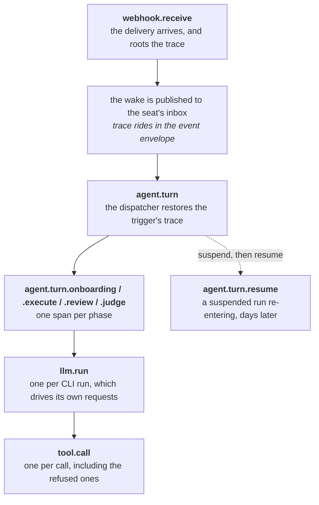

# Deployment

**Crewlet requires no infrastructure services.** The engine is one
binary: its event stream is a NATS JetStream server it embeds, and its store
is two local files it creates and owns exclusively. A single host runs a whole
company with nothing else installed.

One slot changes when a deployment outgrows one node — the stream, which
becomes either a cluster of the members the nodes already embed or a NATS
cluster somebody else runs — and this page is mostly about that path. The
coordination KV is not a second address: it lives on the stream's own
broker, deliberately, so that reaching the leases is reaching the mail. On an
embedded broker it holds a second connection to it beside the queue's, and
both are watched — either one closing for good stops the node — so a node
cannot go on holding live leases over a link that still works while the one
carrying its inbox is gone, alive to its peers and deaf to its work, for
longer than a reconnect. The store never becomes shared either:
it stays one file per node, which is why everything genuinely shared between
nodes lives in the KV instead. See [Running a Fleet](fleet.md) and
[Scaling Out](../concepts/scaling.md).

---

## The single host

**A keyring is required, on one node and on every node.** Every record on every
state log is signed under it, because the broker has no auth of its own and a
record is an instruction the next node applies. `crewlet secrets keygen` mints
one and prints the export line; a node without one refuses to start, naming the
field. Every node of a fleet needs the **same** keyring — one keyed differently
would refuse every peer's records, and every browser signed in against one
would be signed out on the next request that reached another. See
[Secret store](../concepts/secret-store.md) for what else it does and for the
zero-downtime rotation runbook — adding a key and flipping `active_key_id`
logs nobody out, and **dropping a key early is what ends live sessions**.

```yaml
# crewlet.yaml (Tier A)
secrets:
  active_key_id: "2026-01"
  keys:
    - id: "2026-01"
      material: "${CREWLET_SECRET_KEY_2026_01}"

stream:
  type: embedded              # a JetStream server inside this process
  store_dir: "/var/lib/crewlet/stream"   # required on a broker member: every data node keeps its state logs here

store:
  path: "/var/lib/crewlet/company.db"    # ONE file, this process only

coordination:
  type: local                 # one node holding its own seat leases
```

```bash
crewlet run -config crewlet.yaml -company company.yaml
```

That is the deployment. Point a reverse proxy at the API port for inbound
webhooks and the dashboard, and there is nothing else to operate. When the
webhooks have to come from the internet and the dashboard must not, give them
a listener of their own instead: see
[Exposing webhooks without the admin API](#exposing-webhooks-without-the-admin-api).

Give that proxy a **read timeout above fifty seconds** on the API port.
Nearly every request is answered in well under a second, but a node eviction
or readmission ([Retention](retention.md#eviction)) may take up to fifty
seconds — twenty to judge it and thirty to write every log — and `crewlet
retention evict` and the dashboard's evict dialog both wait a minute for its
answer. nginx's `proxy_read_timeout` defaults to sixty, which is enough; a
proxy set below fifty cuts those answers off with a 504. Nothing is lost when
it does — the node finishes the gesture whatever happens to the connection,
and both clients read an answer the engine did not write as one that never
arrived, keeping the operation id to finish it with — but the operator then
has to finish it to see what it did.

### The room the stream's volume needs

The engine keeps nine ordered logs on the stream: the tracker's mutation
log, the vector changelog, the knowledge base's log, the identity estate's
log, the usage log, the artifacts log, the artifact datastore's log,
Ask Crewlet's log and the chat log. Each log's byte ceiling is
**reserved** on the volume holding `stream.store_dir` when its stream is
created: the embedded broker grants a ceiling in full, up front, or refuses
to create the stream at all. Its limit is `stream.store_max_bytes` where you
set one, and otherwise three quarters of
that volume's free space.

The node sizes the ceilings together to fit half of that limit. A log derived
from the disk that would be scaled below 1 GiB is **held at 1 GiB** instead,
Ask Crewlet's log gives way down to its own 64 MiB floor, and any
other log whose own default is smaller than a gibibyte is held at what it asked
for, so a fresh node has a floor it cannot go below.

#### The minimum room for a fresh node

With nothing set, a node starting on an empty stream directory reserves:

| What reserves it | At its smallest | Tier A field |
|---|---|---|
| The tracker's mutation log | 1 GiB | `stream.tracker_log_max_bytes` |
| The vector changelog | 1 GiB | `stream.tracker_vectors_max_bytes` |
| The knowledge base's log | 1 GiB | `stream.pages_log_max_bytes` |
| The artifacts log | 1 GiB | `stream.artifacts_log_max_bytes` |
| The artifact datastore's log | 1 GiB | `stream.artifact_data_log_max_bytes` |
| The chat log | 1 GiB | `stream.chat_log_max_bytes` |
| The usage log (a fixed default) | 1 GiB | `stream.usage_log_max_bytes` |
| The identity estate's log (a fixed default) | 512 MiB | `stream.iam_log_max_bytes` |
| Ask Crewlet's log (512 MiB by default, scaled down where the broker is short) | 64 MiB | `stream.assistant_log_max_bytes` |
| **The nine logs together** | **7.56 GiB** | |
| The object store's `nats` bucket, reserved before the logs | a quarter of the broker's limit, 2.52 GiB at the minimum | `store.objects.nats_max_bytes` |

So the broker needs a limit of at least **10.08 GiB**, which an embedded
broker sizing itself at three quarters of the volume reaches with **13.44 GiB
free** on the volume holding `stream.store_dir` (about 14.4 GB). With the
objects in S3 (`store.objects.backend: s3`) no bucket is reserved, and the
logs' 7.56 GiB alone needs 10.08 GiB free. These are the least that **boots**:
the mailboxes, the coordination buckets and a joining node's snapshot reserve
nothing and grow into whatever is left, so give a production host far more.

Below the minimum the node refuses to boot with an error naming the log it
could not reserve, the bytes it needed, the bytes the broker had left, the
Tier A field that sets that ceiling, and the least a fresh node of its
configuration reserves, split into the logs and the bucket.

**On a small host**, two settings decide the figure:

- `store.objects.nats_max_bytes` sets the bucket's reservation instead of a
  quarter of the broker's limit. At its smallest, 1 GiB, a fresh node needs a
  limit of **8.56 GiB**, which three quarters of **11.42 GiB free** reaches.
  The bucket then holds at most 1 GiB of the company's files; see
  [Object store](../concepts/object-store.md#its-byte-reservation).
- `stream.store_max_bytes` sets the broker's limit outright, rather than three
  quarters of the free space at boot. It accepts values from 6 GiB, below
  what a fresh node needs, so `crewlet validate` (and the advisories a node
  logs at every start) warn when a data node's embedded broker is given less
  than the minimum for its configuration.

The fixed-default logs' fields also go lower: `stream.iam_log_max_bytes`,
`stream.usage_log_max_bytes` and `stream.assistant_log_max_bytes` accept
64 MiB. The other six fields accept no less than 1 GiB, so setting them only
moves the figure up.
- **A floor is per log, not universal.** The identity estate's, the usage
  log's and Ask Crewlet's fields go down to 64 MiB, far below the
  others, because the identity log grows with headcount and sign-ins,
  Ask Crewlet's with how many people ask it (a month of a ten-person company's
  questions fits in 64 MiB), and the usage log is a census of
  node-days — about 12 MB for a ten-seat node's 181 days — and a ceiling is
  granted in full at create time, so a log at a disk-sized floor costs free
  space a node needs before it can start, for a log that will not fill it.
- **More room buys longer logs, up to a point.** Unset, the mutation log and
  the vector changelog each ask for a quarter of the free space (4..64 GiB),
  the knowledge base's log, the artifacts log and the artifact datastore's
  log each for a quarter of the mutation log's, the chat log for 8 GiB,
  capped at a sixteenth of the free space (so the whole of it is asked from
  128 GiB free), the identity estate's log and Ask Crewlet's for
  a flat 512 MiB each and the usage log for a flat 1 GiB — none of the last
  three is derived from the disk at all, because the identity and Ask Crewlet
  logs grow with headcount and the usage log's size is a count of node-days
  rather than a rate, so more disk buys them nothing. The chat log's ask does
  not follow the mutation log's as the knowledge base's does, so if you set
  `stream.tracker_log_max_bytes` for a long blocked trim, set
  `stream.chat_log_max_bytes` for the same horizon (about 32 MB a day at the
  declared census) or the chat log fills first.
  They are scaled down together whenever they ask for more than the pool they
  share — half of what the broker's three quarters leave once the object
  bucket's quarter is reserved, so nine thirty-seconds of the free space —
  which on a first boot is every volume with less than about 662 GiB free (at
  their clamps the nine ask for 186 GiB, nine thirty-seconds of 662); from
  there up each log gets what it asked for. With the objects in S3 no bucket
  is reserved and the pool is three eighths of the free space, so from about
  496 GiB free.
- **The ceilings are fixed when the streams are created.** Moving the node to
  a bigger volume, or setting `stream.tracker_log_max_bytes`,
  `stream.tracker_vectors_max_bytes`, `stream.pages_log_max_bytes`,
  `stream.artifacts_log_max_bytes`, `stream.artifact_data_log_max_bytes`,
  `stream.iam_log_max_bytes`, `stream.usage_log_max_bytes`,
  `stream.assistant_log_max_bytes` or `stream.chat_log_max_bytes` later,
  changes nothing about streams that
  already exist; `crewlet retention set-capacity` is what changes a running
  log's ceiling. A log derived from the disk that is created later — one a new
  version adds — is sized from what the existing logs' ceilings leave of that
  half, so logs that already hold all of it leave it the 1 GiB floor.

[Replication](replication.md#how-the-byte-ceilings-are-sized) has the whole
arithmetic and the refusal's text.

---

## The compose stack starts nothing

`docker-compose.yml` in a repo checkout is for the things *around* the
engine — the local integration loops, and nothing else. There is no broker
service in it, because there is nothing to run: the engine embeds its own.
Every service is behind a profile, so a bare `docker compose up` brings up
nothing at all:

```bash
cp .env.example .env                              # first time only
docker compose --profile gitlab up -d             # GitLab (code host)
docker compose --profile mattermost up -d --wait  # Mattermost (chat)
```

| Service | Port | Details |
|---------|------|---------|
| GitLab | 8929 / 2424 | `gitlab/gitlab-ee`, configured `external_url http://gitlab.local:8929` — the published port and the URL GitLab builds its own links from are deliberately the same number. 2424 is git-over-SSH and optional; HTTPS plus a token is the path the engine takes |
| Mattermost | 8065 | `${MATTERMOST_LISTEN_PORT:-8065}`. Mattermost accepts a websocket upgrade only from a browser whose `Origin` matches `MM_SERVICESETTINGS_SITEURL` exactly, host and scheme, so move the port and the site URL together or the page loads with the event stream silently dead |

---

## The stream beyond one host

The stream slot has a default and one alternative, and they differ in who
runs the broker rather than in what the engine speaks: `embedded` starts a
NATS JetStream server inside this process, `nats` dials one somebody else
runs. The client code is identical either way — one implementation, with the
connection as the only branch — so nothing above the queue can tell which is
in use, and no company config mentions it.

A single host needs neither shape below. A fleet needs exactly one of them,
because two nodes each embedding a *solo* server are two companies that
cannot see each other: the solo server binds no socket at all, which is a
security property as much as a convenience.

### Every node embeds a member of one cluster

The fleet still ships as one binary and there is still no broker to deploy.
Three nodes, each naming itself, its route port and the other two:

```yaml
# crewlet.yaml (Tier A) on the first node. The other two differ only in
# node.id and in which peers they name.
node:
  id: crewlet-1

stream:
  type: embedded
  store_dir: "/var/lib/crewlet/stream"
  cluster:
    name: crewlet                      # identical on every member
    port: 6222                         # this member's route port
    peers:                             # the others' route URLs
      - "nats://crewlet-2.internal:6222"
      - "nats://crewlet-3.internal:6222"
    host: 10.0.0.11                    # bind the route port to the private
                                       #   interface, not to all of them
  replicas: 3                          # a publish is committed by a quorum
                                       #   before Publish returns

coordination:
  type: embedded-kv                    # the leases live on the stream's own
                                       #   broker; nothing else to set

secrets:                               # the SAME keys on every member: each
  active_key_id: "2026-01"             #   one verifies what the others sign
  keys:
    - id: "2026-01"
      material: "${CREWLET_SECRET_KEY_2026_01}"
```

**Bind the route port to the network the peers are on.** `cluster.host` is the
interface the route listener binds, and leaving it unset binds every
interface. A route port is how a member JOINS — and a member that joins reads
and writes every stream and every coordination bucket — so on a host with a
public interface an unset `host` publishes unauthenticated access to the
company's whole event history. Set it to the private address, or keep the port
off the public interface with a firewall; the engine cannot tell which of a
host's addresses is the private one, so it does not guess.

**A cluster block without a name is refused, because it would do nothing.**
The embedded server takes its route port, its bind interface, its advertise
address and its peer list only from a *named* cluster, so anything under
`cluster:` with no `cluster.name` starts a solo node that binds no route
listener and forms no cluster — while every other reading of the same file
(the provisioning budgets, the topology validation) calls it clustered. Tier A
names the missing field instead.

**A route port something else already holds is refused at startup, by name.**
The broker binds its route listener last, after it has recovered its whole
store, so the engine probes the port before it starts the broker and refuses
in microseconds rather than after a recovery that may take minutes:

```
stream.cluster.port 6222 is already in use on 10.0.0.11, so this member's
route listener cannot bind and it could never form a route to a peer — free
that port or give this node a different one
```

A port taken in the instant between that probe and the bind is refused too,
as soon as the bind fails, with the operating system's own error on the end of
the same sentence. `stream.leaf.port` is probed and refused the same way.

**`cluster.advertise` is for when what a member binds is not what its peers can
dial.** Members learn about each other from the members they already have: when
node 1 accepts a route from node 2 it tells node 3 where to find node 2, and
node 3 dials that address itself. With nothing configured that address is
derived from the connection's own remote address, which is correct on a flat
network and wrong wherever the address a member is seen from is not one anybody
else can use — a container with a mapped port, a NAT, a member behind a load
balancer. There, set `advertise` to the address peers should dial (host and
port, or a bare host to keep this member's own route port):

```yaml
stream:
  cluster:
    host: 0.0.0.0                      # inside the container, bind everything
    advertise: "crewlet-1.internal:6222"  # outside it, this is the address
```

**`node.id` is this member's identity in the cluster, and it has to survive a
restart.** The engine passes it as the NATS server name, which must be unique
— a route from a server whose name the cluster already knows is rejected —
and stable, because **JetStream places replicas by server name**. A node that
comes back under a fresh name is a new peer: its old replicas are orphaned on
a member that no longer exists, and the stream sits short of quorum waiting
for a server that will never return. That is why a clustered member with no
name is refused at startup rather than given a generated one — a generated
name is unique, which is only half the requirement.

**It is the resolved id, so the environment is enough.** The name follows the
same precedence as everything else that identifies this node — `node.id` in
the file, then `CREWLET_NODE_ID`, then the default — so an orchestrator
injecting a pod name needs no `node:` block at all. Writing
`node.id: "${CREWLET_NODE_ID}"` (or `"${HOSTNAME}"`) works too, and means the
same thing: Tier A expands `${VAR}` references before it decodes. Into a text
field like this one a reference expands anywhere in the value; into a number or
a boolean — a port, `stream.replicas` — it must be the whole value, and what it
resolves to is read as if it were written there (see [Environment Variable References](../getting-started/configuration.md#environment-variable-references)).

**One node or three, never two.** Two embedded-KV members have no quorum
without each other, so the fleet stops serving the moment either restarts —
and a rolling upgrade restarts them one at a time, which makes the outage
certain rather than unlucky. Tier A refuses a two-member config by name,
counting this node and the **other** members its `stream.cluster.peers`
names: an entry recognisably this node's own route, or a repeat, is left out
of the count with a warning, and an alias of this host it cannot recognise
is counted as a member — see [Running a Fleet](fleet.md#what-a-fleet-needs).

**A fresh cluster takes seconds to form, and the engine waits it out rather
than hanging.** Accepting connections is not the same as being able to serve
JetStream: a member answers its client port as soon as it is listening, while
the metadata group takes seconds to elect a leader — measured at around eight
on a quiet three-member cluster — and until it has one, creating a replicated
stream *blocks* instead of failing.

There are therefore three waits at boot, in order, and they fail for
different reasons:

| Wait | Budget | What is happening |
|---|---|---|
| **Starting** | none — reported every 10s | The broker recovers its file store: as long as the store is large, and on a fresh one milliseconds |
| **Listeners** | 30s | The broker opens its listeners — its route listener, in a cluster — once it has started. The same budget then bounds the handshake of every connection the engine opens to its own member — the queue's, the coordination store's, a snapshot donor's — which used the NATS client's two-second default and failed a loaded host's boot against a server that was already up |
| **JetStream current** | 60s | The metadata group elects a leader and this member catches up with it |

Then placement retries for as long as the cluster answers "no suitable
peers", inside the per-create provisioning budget — **30 seconds** on a solo
node and **2 minutes** on a member with peers, because the two creates are not
the same call underneath. See
[A clustered node is given longer to create them](#a-clustered-node-is-given-longer-to-create-them)
below.

**The store recovery is waited out, not bounded.** It takes as long as the
store is large — measured at roughly a second per GiB after a clean stop and
a second and a half after a crash, on a fast local disk, and longer on a
slower one — and the store holds the company's files as well as its streams.
A budget there could only fail a boot that was working: the broker cannot
stop a recovery in progress, so a boot that gave up waited for the recovery
anyway, shut the recovered broker down, and the next boot recovered the same
store again, so a store larger than the budget could never start at all.
Instead the boot says what it is doing every ten seconds:

```
INFO queue.jetstream  embedded_broker_starting server=node-1 store_dir=/var/lib/crewlet/stream elapsed_seconds=20 detail="the embedded broker is still starting — recovering its file store, …"
```

**`/health` answers `503` until the recovery is over.** The node binds its
HTTP listener before any of this, and while it recovers what it holds —
its store, this broker, the replicated estate — `/health` answers
`503 {"status": "starting", "phase": "recovering"}`; it turns `200` the moment
the recovery ends, before anything the company configures starts (see
[While a node is starting](../reference/api-endpoints.md#while-a-node-is-starting)).
So a node under an orchestrator needs a startup probe sized for the largest
store it may have to recover — and, on a data node in a fleet of more than one,
for the snapshot of the replicated estate it may have to fetch before that
recovery is over: [Sizing the startup probe](#sizing-the-startup-probe)
has the arithmetic. A liveness probe on its own counts every second of the
recovery as a failure, restarts the node partway through it, and the next boot
recovers the same store again. A broker that cannot start at all, such as one
with a store directory it cannot use or a port somebody holds, does not wait:
it [declares itself dead](#a-broker-that-declares-itself-dead) and the boot
fails at once with its reason — and so does a node whose own `api.port` or
`api.public` is taken, which now fails before the recovery rather than after
it.

**The listeners keep a budget, and only they do.** Once the broker has
started, opening its listeners is a bind each — measured at under 40 ms with
sixteen members starting at once — so thirty seconds fails a boot only when
the broker stops reporting itself ready for a reason nobody predicted, and
names that rather than hanging.

Every wait is cancellable: Ctrl-C ends it at once, unless the member is still
recovering its file store. The broker cannot stop a recovery in progress, so
the boot waits for it to finish and logs `embedded_start_cancel_waits` while
it does; a second Ctrl-C exits immediately (see
[Force stop](../concepts/agent-runtime.md#graceful-shutdown)). Every other error is returned at once: a bad subject or
a conflicting retention does not clear by waiting, and retrying would turn a
config mistake into a half-minute hang with the same message at the end.

**`store_dir` is required on every member, and the engine refuses to boot
one without it.** Empty selects an in-memory member: a restart loses that
member's replicas, and the same server holds the KV buckets carrying the
fleet's shared records — the token counters, the completion ledger, open
agent-to-agent asks, claimed scheduled fires, detached (and billed) sandbox
runs. The rule is asked of the broker, not of the roles: every **member** —
every `data` node on the embedded broker — sets `store_dir` whatever else it
does, a single node included, because an in-memory member creates every
stream it provisions in memory. A leaf and a client of an external cluster
hold no streams of their own, so both are refused a `store_dir`; see
[Satellite nodes](satellite-nodes.md).

**And the company's own records live there, whatever backends it names.**
Every data node keeps the company's **identity estate** — its people, their
credentials and sessions — on a state log, and a domain's log is a stream. With
`tracker.backend: worklet`, `knowledge.backend: doclet` or a chat that resolves
to `chatlet` (all three the defaults), its work items, its pages and its
messages are there too. An unset `store_dir` means the first restart recreates those logs
empty, and a node whose rows are ahead of a log that restarted from nothing
stops serving for good. So the engine refuses to boot without one, and
`crewlet validate` refuses it, naming `stream.store_dir`.

> This rule used to ask which backends a company ran, and a company on Jira
> and Confluence was allowed an in-memory member. That company still has
> people who sign in — so it kept its identity log in memory and lost every
> person and session on its first restart, with nothing having warned. There
> is no company the rule can correctly let past.

**One broker per `store_dir`.** An embedded member takes a lock file,
`crewlet-broker.lock`, inside its `store_dir` before its broker is built and
lets it go once the broker has stopped; a second broker on the same directory
is refused before it reads anything, naming the holder
(`pid N on HOST since T`). nats-server takes no lock of its own: it
**accepts** a second server on one directory, and two brokers writing one
directory corrupt it, with nothing said until a read meets the damage.
Whatever starts the broker holds the lock — the engine, or a `crewlet` command that reaches
the fleet's secrets itself while this node's engine is stopped
([Secret Store § Which store the CLI writes](../concepts/secret-store.md#which-store-the-cli-writes))
— so a second engine on the directory is refused, so is an engine started
while such a command holds it, and so is a command that meets an engine part
way through starting (once the engine holds its database, a command goes
through its API instead). Two engines on one host therefore each name their
own `store_dir`. The file is inside the directory rather than beside it
because a `store_dir` can be the root of its own volume, whose parent a
non-root engine on a read-only root filesystem cannot write. The kernel
releases it when its holder exits, however it exits, so there is no stale
lock to clear by hand.

**Divide `store_max_bytes` when several engines share a filesystem.** Every
stream ceiling on the embedded broker is a *reservation*: the broker refuses to
create a stream whose ceiling it cannot back, and the number it compares
against is this limit. Unset, the broker sizes itself from the free space on
`store_dir` when its JetStream comes up — three quarters of it, measured once —
which is right when it is the volume's only tenant and wrong the moment it is
not, because free space bounds the *sum* of the engines on a disk rather than
each of them. Two engines each taking what they can see over-commit the volume;
three over-commit it by half again. The failure is not a disk-full message: on
a single node it is `insufficient storage resources available`, and on a fleet
— where the limit is applied by the metadata leader placing the stream rather
than by the member creating it — it is `no suitable peers for placement,
insufficient storage`. Either way it names whichever stream that node happened
to provision last, which reads as a problem with that subsystem. So on
a host running N engines against one filesystem — a test runner, a
multi-tenant box, several companies on one machine — give each of them its own
share:

```yaml
stream:
  store_dir: "/var/lib/crewlet/acme/stream"
  store_max_bytes: 68719476736   # 64 GiB of the volume, this engine's share
```

It is measured once, at boot, on both paths: a volume that later grows or
shrinks does not move the limit, and a node that should see a resized disk is
restarted. Half of whatever is in force is what the state logs' derived
ceilings may reserve between them; the other half is for the streams that
reserve nothing and simply grow against it — the seats' mailboxes, the event
log, the dead-letter stream, the memory changelog and every coordination
bucket. A refusal names the ceiling that did not fit and the Tier A field
that sets it on either topology; it adds the limit in force and what is already
reserved only where this node can read them, which is the standalone one. On a
fleet the room that refused is another member's disk, and no member can read
another's.

> **The clustered embedded broker has no authentication and no TLS. Run it on
> a trusted network.**
>
> A clustered member listens on two ports, on every interface: the route port
> named in the config, and a client port the server picks for itself. Neither
> carries a credential or a certificate. `credentials`, `token` and
> `stream.tls` are **dial-side** options — they configure this process
> connecting *out* to a URL — and an embedded server has no server-side
> counterpart in Tier A at all. Anything that can reach those ports can
> publish onto a seat's inbox, read every event the company produces, and
> take its leases.
>
> A private subnet, a security group or a WireGuard mesh between the nodes is
> what makes this shape safe, and no configuration substitutes for one. A
> deployment that needs the brokers themselves mutually authenticated runs
> `stream.type: nats` against a NATS cluster it secures itself.

### An external NATS server

The other multi-node shape, and the one to reach for when the broker has to
be secured, operated, or shared on a schedule of its own:

```yaml
# crewlet.yaml (Tier A)
stream:
  type: nats
  url: "nats://nats-1.internal:4222,nats://nats-2.internal:4222,nats://nats-3.internal:4222"
  credentials: "/etc/crewlet/engine.creds"   # an NKey/JWT creds file
  # token: "${CREWLET_NATS_TOKEN}"           # or a bearer token
  tls:
    ca: /etc/crewlet/ca.pem                  # the private CA to trust
    cert: /etc/crewlet/client.pem            # this engine's own certificate
    key: /etc/crewlet/client.key

coordination:
  type: embedded-kv

secrets:                                     # required on every node, and the
  active_key_id: "2026-01"                   #   same keys on each of them
  keys:
    - id: "2026-01"
      material: "${CREWLET_SECRET_KEY_2026_01}"
```

**The URL goes to the NATS client verbatim**, so a comma-separated list of a
cluster's members is one value as far as this config is concerned and the
client fails over between them. `store_dir` is refused here by name: it is
where an *embedded* server persists, and an external cluster keeps its own
storage. A URL may carry a credential as its userinfo — `user:password@`, or
a bare `token@`, which the client reads as a bearer token — and nothing the
engine writes repeats it: a failed dial, a refusal at boot and a log line each
name a server by its scheme, host and port alone, and an address that does
not parse is named as one rather than quoted.

**Authentication is `credentials` or `token`.** `credentials` is a path to a
NATS credentials file, the NKey/JWT pair a NATS account setup issues per
user; `token` is a bearer token, and takes a `${VAR}` reference so the
secret stays out of the file and out of the config revision history. Set
whichever the broker asks for; both are dial options, and the engine stores
neither.

**`stream.tls` is the transport underneath that authentication**, and it is a
separate question from who you are: a broker configured `tls { verify: true }`
— the hardened default every NATS guide recommends — refuses a connection
presenting no client certificate, whatever credentials would have followed.
`ca` is the bundle the server's certificate is verified against, and empty
means the host's root pool, which is right for a public CA and wrong for the
self-signed certificate most internal estates use. `cert` and `key` are this
engine's own certificate: both or neither, because validation refuses half a
keypair rather than letting it dial and be rejected by the broker with an
error naming neither file. There is deliberately **no way to skip
verification** — that switch is set once during a bring-up and never unset,
and the connection it leaves behind carries every event this company
publishes to whoever answers on that address.

**Those files are opened before the dial, and the error names the field.** A
missing `ca` reports `tls.ca /etc/crewlet/ca.pem: no such file or directory`,
not a connection failure. Left to the NATS client, an unreadable certificate
surfaces as a dial error that reads exactly like *the broker is
unreachable* — and sends an operator to debug a network path that is fine,
for a file that is simply not there.

**A broker blip is not a node restart.** The engine dials with unlimited
reconnects and a one-second wait between attempts, and never gives up on the
URL: the coordination layer already distinguishes "unreachable" from "not
mine", and a node that keeps its seats through a two-second outage is the
entire point of that distinction. The coordination KV rides this same
connection on purpose — one connection, one fate. An outage that outlasts the
lease TTL (45 s unless `coordination.lease_ttl_seconds` says otherwise) does
hand this node's seats to a peer, and that is the intended behaviour rather
than something a reconnect policy should paper over. Each attempt — the dial,
TLS and the NATS handshake — gets **2 seconds**, not the embedded member's
listener budget: the loop tries the URLs in turn, and a member that silently
drops packets holds every attempt at it for that long before a member that
answers is asked, which is time the node spends not renewing its leases.

**A connection the client gives up on is a node restart.** Reconnecting for
ever covers a server that goes away and comes back. It does not cover the
cases where the NATS client itself closes the connection *for good* and stops
asking:

- a message larger than a `max_payload` that was lowered under the running
  node (see [below](#the-largest-message-every-server-must-carry));
- the server refusing this node's credentials, and refusing them again on the
  reconnect after it — `credentials` or `token` changed, revoked or expired,
  or the server's own authorization reloaded so it no longer admits them;
- any other error the server sends that the client does not treat as
  transient.

A node in that state has nothing to publish, consume or renew a lease over,
and it used to stay up anyway — answering its liveness probe, its seats lapsing
to peers, until somebody restarted it. It now **stops itself**: it logs
`jetstream_connection_closed_for_good` and `engine_fatal`, drains and tears
down in the order it does on `SIGTERM`, and exits with status **1**, printing on
stderr what closed, why, and what to change. The one difference from a
`SIGTERM` is the drain over a lost connection to the stream: every delivery is
acknowledged over it, so no turn still running can be, and whichever node
takes its seat runs it again — the drain cancels those turns rather than
finishing them twice, and ends at once (`drain_cut`). A node still **starting**
when it happens fails its boot the same way, exit status 1 with the same
sentence — `crewlet: engine: stream: jetstream: … closed this node's connection
for good …` — followed by `; the start failed on it at:` and the step that met
the closed connection, rather than that step's bare `nats: connection closed`.
Run it under something that
restarts a process which exits non-zero — a systemd unit with
`Restart=on-failure`, a container restart policy, a Kubernetes deployment —
and the node comes back by itself once the cause is fixed. The same applies
to the second connection the coordination store holds on an embedded broker —
whose loss alone leaves every acknowledgement landing, so that drain waits for
the running turns as `SIGTERM`'s does — and to this node's own embedded broker
going away under it: a connection to it tries
again once a second for as long as a boot gives that broker's listeners once
it has started — 30 seconds, solo or clustered — and nothing but a restart
brings a broker in this process back. It tries that member and no other: a
cluster member advertises its peers' client addresses, and a node's
connections ignore them, so a node whose own member has stopped exits for its
supervisor to restart the two together rather than running on through a peer
with its member gone and the cluster a replica short. A snapshot donor's
connection is the one exception: it serves *peers*, and a node whose donor is
down still serves its own company, so that connection closing never stops the
node — the donor [dials again](retention.md) by itself.

**The account needs more than publish and subscribe.** A node creates what it
uses, on every start and idempotently: the seven engine streams
(`CREWLET_AGENT`, `CREWLET_EVENTS`, `CREWLET_NOTIFICATIONS`,
`CREWLET_CONFIG`, `CREWLET_MEMORY`, `CREWLET_DLQ`, `CREWLET_CUSTODY`), the nine state-log
domain streams (`CREWLET_TRACKER_LOG`, `CREWLET_TRACKER_VECTORS`,
`CREWLET_PAGES_LOG`, `CREWLET_IAM_LOG`, `CREWLET_USAGE_LOG`, `CREWLET_ARTIFACTS_LOG`,
`CREWLET_ARTIFACT_DATA_LOG`, `CREWLET_ASSISTANT_LOG`, `CREWLET_CHAT_LOG`), a stream per extra subject namespace a company
publishes under, one durable consumer per seat mailbox (an ordinary API
call, measured at 1.7 ms), the twenty-two `crewlet_*` KV buckets:
three in the lease store, holding the seat and presence leases, the duty
leases and the fencing epochs, and nineteen in the fleet store holding the
shared records — the object store's backend record and its collector's report
among them — and, on the default `nats` object store, the `crewlet_files`
object store bucket (its stream is `OBJ_crewlet_files`). A credential
scoped to publishing and consuming fails at boot, on the first stream it
tries to create.

**A coordination read costs one ordered pass certified against the stream's
key index, and an account needs the consumer, stream-info, message-get and
purge APIs.** A node lists coordination records constantly — several
fifteen-second duty loops on every tick, and the state-log write fence, which
lists the published trim floors on every write at an expectation of zero, a
subject's first write among them. Each listing is one pass over a temporary
consumer, which on a replicated bucket is two metadata-raft proposals, and
beside it one stream-info request narrowed to the listing's keys, which names
every key that has a message. A pass alone cannot tell that it is complete — a
key rewritten under it can land behind the marker that ends it, and every renew
is such a rewrite — so a key the index names that the pass missed, or delivered
only as a delete marker, is read by itself from the **stream leader**
(`$JS.API.STREAM.MSG.GET`), never through the bucket's direct get, which any
replica — one that has fallen behind included — may answer: a member that had
not yet applied an acknowledged write answered from before it (see
[Coordination § Every read is the leader's](../concepts/coordination.md#every-read-is-the-leaders)).
A single key is read with that same leader request. A marker needs that
read because on a replicated bucket the pass may be served by a replica that
applied a key's delete and not yet its re-creation. On a quiet bucket the
certification therefore costs the index read and one leader read per recent
removal the pass meets, and under writes one more per key the pass lost. What
keeps "recent" recent is the maintenance duty, which sweeps the removal markers
older than three hours out of every shared bucket with no age, each with a
leader-side `$JS.API.STREAM.PURGE` bounded at the marker's own revision so a
key written again since is untouched (see
[Coordination](../concepts/coordination.md#removal-markers-are-swept)). While a
bucket's stream is **electing a leader**, a listing of it answers unavailable
rather than a short list, since every member answers the index from its own
store until one leads — the answer every caller already treats as a store
that did not answer, never as "no records". A listing's one bound is
the broker's page size for that index, **100,000 keys under one filter**; see
[Coordination](../concepts/coordination.md#the-three-valued-answer) for what
happens past it.
The engine deliberately does **not** use the batched direct get that would
avoid the consumer: it is served by any replica, and this estate has reads
whose answer is acted on with nothing to arbitrate them. So a credential
scoped only to publishing and consuming is not enough; the account needs the
consumer API, `$JS.API.STREAM.INFO`, `$JS.API.STREAM.MSG.GET` and
`$JS.API.STREAM.PURGE` alongside the rest of `$JS.API`. If the broker's own
debug logging is on, that consumer churn is what produces a steady stream of
`JetStream connection closed: Client Closed` lines — see `stream.debug`, which
is off by default for exactly this reason.

#### A clustered node is given longer to create them

Every one of those creates is a local file-store setup on a solo node and a raft
round trip on a member of a cluster, against a metadata group whose peers are
themselves still booting — so the budget branches: **30 seconds** per create
solo, **2 minutes** clustered, with the whole coordination bring-up bounded at
**2 minutes** and **5 minutes** respectively. The flat 30 seconds these replaced was
measured failing: a fleet booting together would lose one create, and because
each object discovers a slow cluster independently the failure landed on a
different stream or bucket every time. A node that exhausts the budget fails
to start rather than running against a group it cannot reach, and the error
names the object it was creating.

**A request the broker never answers is asked again, not waited on.** A
clustered metadata request does not always come back late — sometimes the
reply is never sent at all. nats-server drops a routed request outright in
more than one ordinary situation during a bring-up: a member that is not the
metadata leader and holds no assignment for the object returns without
replying, and the routed API queue is discarded wholesale when it reaches its
limit. A node waiting on one of those is waiting for something nobody will
send, so a longer budget buys nothing — measured buying nothing, at two
minutes a time, on a different object every attempt.

So the engine now distinguishes three answers to "does this object exist",
not two: it is there, it is *not* there, and **nobody said**. The first two
are answers and are acted on; the third is silence, and silence is re-asked —
at a new leader, or past a queue that has drained. An existence probe that
goes unanswered for its whole term also simply falls through to the create,
which settles the question either way: absent and it is made, present and it
comes back as a peer having won the race. A node no longer fails to start
because it could not hear.

**A dropped stream or consumer lookup is asked again within two seconds; a
create after sixteen.** The broker decides a read — does this stream, this consumer exist —
when it processes it: it answers, or it returns without a word, and nothing
answers that request later. Every fleet booting together meets the second
case. An object another node has just asked for is *in flight*, assigned by
the metadata leader but not yet applied by the member chosen to lead it, and
until that member has applied it every other member drops a lookup of it. So
a lookup of one of the engine's streams or consumers, of a coordination
bucket, or of the object store's bucket, waits one second for its answer and
is asked again a second later — every two seconds, for up to thirty in all. A
create is the opposite case: the broker keeps its reply until the object it
made has a leader, which can take an election, so a create waits fifteen
seconds for its answer and is re-sent a second after that. A lookup used to wait the create's fifteen too, and a fresh
three-member fleet was measured idling sixteen seconds of its boot on one
dropped stream lookup.

**A create that is taking a while says so while it is happening.** Provisioning
was otherwise silent — a node opens every coordination bucket and several
streams in a row and logged nothing between them, so one that hung emitted
nothing at all until its budget expired and the log could not say which object
it was on. Any create still running after 10 seconds now writes one `WARN`
naming it (`coord_kv_bucket_slow`, `natsobj_bucket_slow`,
`jetstream_stream_slow`, `jetstream_consumer_slow`), and so does the lookup
that precedes it (`jetstream_stream_lookup_slow`,
`jetstream_consumer_lookup_slow`) — that lookup is the first call to reach the
metadata group, so a member stalled against a group that has not settled
waits there, where nothing used to report it at all. The read of each state
log's ceiling that sizes the logs before any of them is created is the same
kind of lookup and says so the same way (`statelog_ceiling_read_slow`); the
nine are asked at once, so a broker that answers none of them costs one
lookup ceiling rather than nine in a row. The object store's
bucket is looked up and created as one step, and writes one line over the two
(`natsobj_bucket_slow`). A probe that went unanswered is named as such
(`jetstream_stream_lookup_unanswered`, `jetstream_consumer_lookup_unanswered`,
`coord_kv_bucket_lookup_unanswered`, `natsobj_bucket_lookup_unanswered`)
rather than failing the boot. One line per object, deliberately: whether more
lines follow is what tells a slow bring-up from a wedged one.

**Every broker line names the member that emitted it.** More than one
embedded broker can run in one process — a fleet test does exactly that — and
without the name every `queue.nats.server` line from either of them was
indistinguishable, which is the one question a reader has about a fleet that
did not form. Lines carry `server=` from `stream.cluster.name`'s member
identity; a solo broker has no name to carry and the attribute is empty.

**And it needs room for the state logs.** The nine state logs reserve their
byte ceilings against the account's JetStream storage limit when their streams
are created, and the node sizes them to half of what that limit has left. An
untiered limit counts every replica, so a `replicas: 3` fleet needs three
times the bytes; a tiered one needs its `R3` tier. An account that states no
limit leaves the node nothing to size against but its own disk, and a server's
own cap then refuses what does not fit, by name. See
[Replication](replication.md#how-the-byte-ceilings-are-sized).

#### The largest message every server must carry

**A `max_payload` of at least 8 MiB, on every server.** That is the largest
single message the engine sends — an event, a webhook delivery, a state-log
record at the largest its log declares (the tracker's, the knowledge base's,
the vector changelog's and the usage log's are 8 MiB less 4 KiB, which is
8 MiB on the wire once the record is signed) — and the embedded broker is configured at exactly
that; nats-server's own default is 1 MiB. Set `max_payload: 8MB` in the
configuration of every server in the cluster (nats-server reads `MB` as
mebibytes, so that is exactly the 8388608 bytes the engine needs). A server
holds a connection to the **lowest** of its own `max_payload` and the payload
limits of the account the engine signs in to and of its user — an account's
`limits { max_payload }` in the server's file, or the `payload` limit in an
account's or a user's JWT on an operator-mode deployment — so where either
states one, raise it to 8 MiB or leave it unlimited too.

**A node refuses to start against a server that holds it to less.** A server
below it would take every small write and refuse the first large one — a node
that booted, reported itself healthy, served, and then refused a webhook
delivery, a long phase's telemetry or a state-log record (`record_too_large`)
past the server's limit — so the check is made when the node connects, before
anything is provisioned, and the refusal names the setting, the value the
server announced and the value this build needs:

```text
engine: stream: connect nats: jetstream: the NATS server at nats://nats-1.internal:4222 announces a max_payload of 1048576 bytes for this node's connection, below the 8388608 bytes this build needs: that is the largest message it sends — an event, a webhook delivery, a state-log record at the largest its log declares — and a server that carries less takes every smaller write and refuses the first large one. Set max_payload: 8MB in the configuration of every server stream.url reaches, and wherever the account this node signs in to, or its user, states a payload limit of its own, raise that too: a server holds a connection to the lowest of them
```

What it reads is the limit the server **announces** for this connection once
it has signed in — the account's and the user's included, which the server
states only after authenticating it — on the member the client reached at
boot. That is why the setting is needed on every server rather than the first
one a node happens to dial: a member configured apart from the others is met
later, when the client reconnects to it, and so is a server restarted with a
lower limit under a running node. The node logs
`jetstream_max_payload_below_contract` at `ERROR` on the reconnect, naming
that server and its value, and a message past that server's limit is refused
when it is written — a state-log write answers `record_too_large`, naming the
server's `max_payload`.

**Never lower it with a live reload under running nodes.** nats-server applies
a reloaded `max_payload` to the connections it already holds without telling
their clients, so a node goes on believing its server carries 8 MiB, and the
first message past the new limit makes the server close the connection with
`Maximum Payload Violation`. Where the NATS client reads that refusal, it
treats it as final and does not reconnect, so the node
[stops itself](#an-external-nats-server) and exits with status 1, naming the
setting:

```text
crewlet: the node stopped itself: engine: stream: jetstream: the NATS server stream.url reaches (nats://nats-1.internal:4222) closed this node's connection for good (nats: Maximum Payload Violation): a message this node sent was larger than the max_payload the server now holds the connection to, a limit lowered under the running node — a live reload, which nats-server applies to the connections it holds without telling them — below the 8388608 bytes this build sends at most. Set max_payload: 8MB in the configuration of every server stream.url reaches, and wherever the account this node signs in to, or its user, states a payload limit of its own, raise that too; a node restarted against a server still below it refuses to start, naming the setting
```

Restarted against a server still below 8 MiB, it refuses to start with the
boot refusal above.

The client does not always read the refusal. A message larger than the
connection's socket takes at once is still being written when the server
closes the connection, and when that write fails part way the client closes
the connection itself, without reading the refusal, and reconnects. The
reconnect reads the lowered limit, so the node goes on as it does after
reconnecting to a member configured apart from the others: it logs
`jetstream_max_payload_below_contract`, and every later message past the limit
is refused when it is written, a state-log write answering `record_too_large`.

So a reload that lowers the limit either takes down every node whose next
large message reaches it, until the limit is raised again, or leaves them
running and refusing every large write. Neither is a broker that carries what
they send, which is the reason not to lower it.

**Replication is asked for, not assumed.** `stream.replicas` is the replica
count the engine requests for each of those streams and buckets, and it
applies to an external cluster exactly as it does to an embedded one — set it
to `3` against a cluster of three or more, or the engine asks for one copy and
gets what it asked for: streams and a lease bucket that survive a process
restart but not the loss of the single server holding them.

Tier A cannot check this number for you here. It refuses `replicas` above 1
on an *embedded* stream that names no peers, because that file contradicts
itself — but `stream.url` names an address rather than a member list, so how
many servers answer behind it is yours to know. Asking for more replicas than
the cluster has members fails at boot, on the first stream the engine tries to
create.

**On an external cluster `stream.replicas` also picks which storage limit the
engine is held to.** There is no `store_max_bytes` on that topology — the limit
is the *account's*, and the engine reads it back — and a NATS account states
that limit in one of two shapes, never both. An ordinary account has a single
limit, which the server charges `replicas × ceiling` against, so the engine
divides it by `stream.replicas` before it sizes anything. A **tiered** account
states one limit per replica class (`R1`, `R3`, `R5`, …), already counting
replication, so the engine takes the tier for `stream.replicas` whole.

A tiered account that has **no tier for the class you asked for** — `R1` and
`R5` declared while `stream.replicas: 3` — is neither, and neither is a tier
that *is* declared but carries no storage limit: the account's report lists
every class it holds objects in, whether or not a limit was ever set for one,
so `R3` being present is not `R3` being declared. The engine reports a budget
of **zero** under its own source — `account_no_tier` or
`account_tier_no_limit` — rather than as an account that is merely full: the
two carry the same number and the opposite instruction, since one clears by
somebody freeing room and these only by a change of configuration. A tier
declared **unlimited** is neither again: it states its limit as a negative, the
broker creates against it, and the engine sizes from three quarters of its own
free disk as it
does for any broker that states no limit.

The broker refuses every stream, consumer and bucket create either way, but
**not with the same words**, so the engine's own refusal carries the ones you
will actually see. A class the account's limit table has no entry for is never
resolved at all — `no JetStream default or applicable tiered limit present`,
before a single byte is compared — and that covers both the missing tier and a
tier the report carries only because the account holds objects in that class. A
class it really does declare with no disk, a memory-only tier, resolves
normally and is refused by the byte comparison instead: `insufficient storage
resources available` on every create that reserves bytes.

What that does to a node depends on **whether its objects already exist**, and
the two cases look nothing alike.

*A node that has not provisioned them does not start.* `crewlet run` creates
its streams while it is opening its broker client, and its coordination buckets
straight after — all of it before anything sizes a ceiling — so the first
create is refused and the process exits. The first of those two refusals names
the class the account carries no limit for and the two levers that move it: the
engine classifies it rather than reading it as the object having failed to
appear, so what you get is `R3` and `stream.replicas` and not `(and it is not
there: stream not found)` appended to the broker's bare text.

*A node whose objects are all already there boots, on numbers the broker never
agreed to.* Nothing is created, so nothing is refused. The
`statelog_broker_states_no_limit` warning says which shape it is and which
lever to move, and the `statelog_ceilings` line below it carries
`broker_source=account_no_tier` (or `account_tier_no_limit`) with
`broker_limit=0` — so the logs are sized against nothing but what they already
hold between them, floored at a gibibyte each. It keeps working until it has to
make something new: a state-log stream a new version adds, the mailbox for a
seat you just added, a coordination bucket. That create is refused as above.

Either way: set `stream.replicas` to a class the account carries a limit for,
or have the cluster's operator declare one for the class you asked for.

---

## Running the Engine + API

### Single Process (embedded API — the single-host default)

Any `api.port > 0` in the Tier A YAML makes `crewlet run` start an **embedded API server inside the engine process** — one process runs the engine, the dashboard, and every webhook route:

```yaml
api:
  port: 80       # 0 (the default) disables the embedded API
  external_url: "https://crewlet.example.com"   # REQUIRED once port is set
  auth:
    admin: serve             # serve | refuse, required once port is set
    tokens: [{id: founder, token: "${CREWLET_API_TOKEN_FOUNDER}",
              grants: [admin]}]   # at least one
secrets:
  active_key_id: k1          # REQUIRED on EVERY node, serving or not
  keys: [{id: k1, material: "${CREWLET_SECRET_KEY_K1}"}]
```

**`secrets.keys` is required on every node**, whether or not it serves the
API: every record on every state log is signed and verified under the keyring,
the company document a node fetches from its peers is authenticated by its
seal, and — once a port is set — it signs every session cookie and per-run
token too. **Three more settings stop being optional the moment `api.port` is
non-zero** — `api.external_url`, `api.auth.admin` and at least one
`api.auth.tokens` entry. `crewlet validate` refuses each by name, so a
deployment finds out on a laptop rather than at bind time. See
[the Tier A example](../getting-started/configuration.md#tier-a) and
[Configuration § Auth](../concepts/configuration.md#auth) for what each one
decides.

**`api.external_url` is where a BROWSER reaches this deployment**, which behind
a load balancer or a TLS-terminating proxy is not what `api.host` and
`api.port` bind. The engine cannot read the scheme off the request it receives —
the proxy has already terminated TLS — so the session cookie's `Secure` flag,
its `__Host-` prefix, the origin every write is checked against and the base
every webhook URL is built on all come from this one value. Behind a proxy,
name the proxy's own block in `api.trusted_proxies` too, or every caller shares
the proxy's address — one sign-in throttle curve per login for everybody,
so a stranger guessing at somebody's login slows that person's own sign-in,
and one client in every audit row. `crewlet validate` warns about an `https` external
URL with no proxy trusted, and every start of a node serving the API logs the
same warning as `config_advisory`, because the engine never terminates TLS
itself.

```bash
crewlet run -config crewlet.yaml    # engine + embedded API on :80
```

(`-api-port 8000` on the command line does the same.) This is the shape every single-host walkthrough in these docs uses, and that embedded server **is** the webhook target the integrations register (e.g. `http://host.docker.internal:8000/webhooks/gitlab`). **Port 80 buys exactly one thing**: a webhook URL with no `:port` suffix, which matters when the address is pasted into a vendor's UI by hand or has to survive a proxy that rewrites ports. It costs a privileged bind — as a non-root process on Linux that needs `sudo sysctl net.ipv4.ip_unprivileged_port_start=80` (persist in `/etc/sysctl.d/`) or `CAP_NET_BIND_SERVICE`.

The two bundled examples land on either side of that trade, which is the clearest way to read it. `examples/nimbus.config.yaml` pays for port 80: its company registers GitLab webhooks, so the address gets pasted into a vendor's UI. `examples/nimbus-claude-cli.config.yaml` takes `api.port: 8000`, because a chat-only company has no inbound webhook at all and gets nothing for the privileged bind. Its seats' `direct` boxes dial that port on loopback for their tools, at the address the node derives from the socket it binds, so nothing has to match it; `CREWLET_MCP_BRIDGE_URL` comes in only once an entry places its runs in `container` or `e2b`, or on a node without `ingress`. Make sure nothing else already owns the port you pick.

Do **not** also start a second node on the same host with such a file — both read the same `api.port`, and the second binder hits `EADDRINUSE` and fails its boot at once, naming the address, before it has recovered anything.

**The listener comes up before the boot does, and serves before the seats do.** `crewlet run` binds `api.port` — and `api.public` and `api.artifacts`, where this node serves them — as soon as it has read its Tier A, before it opens its store. Until the node has started, that socket answers a starting node's answers: `/health` `503` while the node recovers what it holds and `200` once it has, `/ready` `503`, and every route it will serve `503 starting` with a `Retry-After`, so a vendor or a client meets a node about to serve rather than a refused connection (see [While a node is starting](../reference/api-endpoints.md#while-a-node-is-starting)). Then the node's own surface takes the same socket over — logged as `api_listening` — and only after that does it start claiming seats, so `/dashboard` and every webhook route are served before the first seat is claimed, even on a company whose agents take much longer to come up. That ordering matters because claiming a seat starts that seat's per-role MCP servers (one subprocess per server per seat, each a spawn, a handshake and a `tools/list`), and a company with seven seats and three vendors is twenty-one children. Serving after them made the whole inbound edge dark for as long as the slowest vendor took, which reads exactly like a hung process.

While seats are still being claimed the node reports what is true rather than pretending: `/health` lists the seats it holds so far, and nothing is lost in the meantime because every seat's mailbox is created before any claiming (see [Event System](../concepts/event-system.md#a-seats-mailbox-exists-before-the-seat-is-running)). A seat's own children still start before its mailbox is attached, so a turn never begins without its tools — that ordering is unchanged; what changed is that they start **concurrently** rather than one after another, so a seat attaches in the time its slowest server takes rather than the sum of all of them.

### Exposing webhooks without the admin API

Every route an outside party calls shares `api.port` with everything else by
default: the vendor webhooks, the admin API (`/config`, `/secrets`, `/setup`,
`/operator`, the fleet and retention gestures), the read surface and the
dashboard, and the sign-in routes under `/auth`. A deployment that must accept
GitLab or Slack deliveries from the internet but keep the rest private would
then have to publish that one port
and filter it **by path** in a proxy — an allow-list kept outside the engine,
where one forgotten route or one prefix matched too widely puts `/config` on
the internet and nothing here can see it.

`api.public` splits the two onto separate sockets instead:

```yaml
# crewlet.yaml (Tier A)
api:
  host: "10.0.0.5"     # private: the dashboard, the REST API, the probes
  port: 8000
  external_url: "https://crewlet.internal.example.com"   # where people reach api.port
  public:
    port: 8443         # published: webhooks and the sandbox endpoints only
                       #   (host defaults to every interface)
    external_url: "https://hooks.example.com"   # where vendors reach it
```

| Route | Served on |
|---|---|
| `/webhooks/*` — every vendor delivery, the Slack OAuth landing, the GitHub App return | `api.public` only |
| `/otlp/{token}/v1/{signal}` — sandbox telemetry | `api.public` only |
| `/mcp/{token}` — the executors' tool bridge | `api.public` only |
| everything else: `/health`, `/ready`, `/dashboard` and its assets, the sign-in routes under `/auth`, every REST read, `/ws/stream`, `/config`, `/secrets`, `/setup`, `/iam/*`, `/operator/*`, `/backup`, `/fleet/*`, `/worklet/*`, `/doclet/pages/*` | `api.port` only |

`api.port` answers a public route with `404 no_route` and a hint naming
`api.public` — a vendor pointed at the wrong port learns it from the first
delivery rather than from a delivery quietly accepted on the socket nobody
published. The public listener answers every other route exactly as it answers
a path nothing serves: the same `404`, the same generic hint, nothing that says
an admin port exists behind it. It requires no credential and decides
before the guard runs, so `/config` there is that same `404` whatever
credential is sent. The split
is the engine's own, from one list (the `/webhooks/`, `/otlp/` and `/mcp/`
prefixes, the routes that authenticate by a provider signature or a signed
per-run token rather than by a person's or a token's credential), so there is
no allow-list to keep in step with the routes a release adds.

**Why the sandbox endpoints are public.** A remote sandbox (E2B's cloud) runs
on somebody else's network and reaches only what you publish; it calls
`/otlp/{token}` and `/mcp/{token}` with the signed per-run token in the path and
never holds a credential of anybody's. Leaving them on `api.port` would force that
port public for every company running remote sandboxes. Point
`CREWLET_SANDBOX_OTEL_RECEIVER_URL` and `CREWLET_MCP_BRIDGE_URL` at the public
address. The proxy in front of it may pass the public `Host` on (Caddy's
default, or nginx's `proxy_set_header Host $host`) and reach the node on
`127.0.0.1` or any other address: the bridge admits a call on the token in its
path, whatever name the call arrives under
([The tool bridge](../concepts/code-sandbox.md#the-tool-bridge--a-seats-own-tools-from-inside-a-box)).

**A proxy in front of the bridge needs a request timeout of at least 15
seconds.** Beside a run's tool calls, the bridge serves the run's poll for its
turn's [notes](../concepts/code-sandbox.md#notes-to-a-running-run)
(`/mcp/{token}/steer/notes`), which it holds for up to ten seconds while no note
waits — under Envoy's default route timeout of fifteen, which is the tightest
common default. A proxy that cuts a request sooner turns each held poll into a
failed request, which the run's notes plugin waits on before it asks again — a
second, doubling to thirty while the failures go on — so a note can reach the
run up to about thirty seconds late. Nothing is lost: a note waits on the run's
record until something reads it, and reaches the run's review either way.

**Why the probes are not.** `/health` describes the node — its version, its
seats, its posture — for whoever runs it, and an orchestrator or a load balancer
can probe a port other than the one it routes traffic to. Point the public load
balancer's health check, and the orchestrator's liveness and readiness probes,
at `api.port`'s `/health` and `/ready`; on Kubernetes that is the pod's own
address, which the kubelet reaches whether or not the port is in the public
Service. Readiness is per process, so a draining node leaves rotation on both
sockets at once.

What to point where:

- **`api.public.external_url`** is where vendors and sandboxes reach this
  deployment: the **public** listener's address as your proxy or load balancer
  publishes it, required once `api.public.port` is set on an `ingress` node.
  Every webhook the engine registers and every vendor app it provisions is
  built on it. The per-run sandbox endpoints a box is handed are not: they are
  built on `CREWLET_MCP_BRIDGE_URL` and `CREWLET_SANDBOX_OTEL_RECEIVER_URL`,
  which name the same public address (a `direct` box dials its own node on
  loopback instead: an `ingress` node's public listener, or `api.port` on a
  node without the role).
- **`api.external_url`** is where people reach the dashboard — `api.port`'s
  address as your private network or VPN reaches it. It names the session
  cookie and is the only `Origin` a write is accepted from, and every link an
  agent composes for a person (`${crewlet_base_url}` in a tool skill, a page
  change's `url`, an invitation or a password link) is built on it; the public
  listener could serve none of them. On a deployment with no public listener it
  is the vendors' address too; the two are two fields because here they
  cannot be one. Both are Tier A, because both are facts about where the
  operator published this deployment's sockets.
- **The dashboard and the CLI** stay on `api.port`: `crewlet` commands that
  read a node's own Tier A file dial `api.host:api.port`, which is unchanged.
- **A node without the `ingress` role** serves the network its
  [probes](../reference/api-endpoints.md#probes-on-a-node-without-ingress) on
  `api.port` and nothing else, and binds no public port whatever the shared
  file says about `api.public` — so one Tier A file still serves every role.
  An executor in a box off its host reaches its tools through the ingress
  nodes' bridge, which relays each call to it, so every node's
  `CREWLET_MCP_BRIDGE_URL` is the same: the public address. A `direct` box on
  it needs none: the node serves its own boxes the bridge — and, where it
  forwards to `OTEL_EXPORTER_OTLP_ENDPOINT`, the telemetry receiver — on
  `api.port` beside the probes, to its own host's loopback alone, provided
  `api.host` takes every interface or a loopback address. Its `api.port: 0`
  (or `-api-port 0`) is still the hard off switch for all of it, which leaves
  its `direct` boxes to the public address too.

`api.host` may stay `0.0.0.0` where the network keeps `api.port` private — a
container whose public Service or load balancer forwards only `api.public.port`
— or name a private interface where the host itself is reachable.
`crewlet validate` refuses a public listener beside `api.port: 0` on a node with
the `ingress` role (no probe would answer) and a public port that is also
`api.port`, `stream.cluster.port` or
`stream.leaf.port` on the same address or with either binding every interface.

**Draining.** Both sockets go through the one drain gate: from the first moment
of a drain the webhook routes answer `503` with a `Retry-After` on the public
listener, while the sandbox endpoints keep serving the runs already in flight,
and `api.port` keeps `/health` at `200`. Once the drain completes the public
listener closes first and `api.port` after it, each waiting up to five seconds
for its requests, so the probes answer until the very end — an open bridge
session can hold the public listener for its whole five seconds, and a
liveness probe must not fail while it does.

### Separate processes (a split deployment)

Run ingress as its own node when you want the webhook receiver to stay up
across engine restarts, or the two on separate hosts.

**Two processes need a stream they can both reach**, which a solo embedded
one is not — it binds no socket, so each would have its own. Either shape
from [the section above](#the-stream-beyond-one-host) works: a *clustered*
embedded stream (`stream.cluster`), or an external NATS server
(`stream.type: nats` plus `stream.url`). They also need shared coordination:
Tier A refuses `coordination.type: local` alongside either of them, by name,
rather than letting two nodes each claim every seat.

Both nodes can read the same Tier A file: against an external NATS server
nothing in it is per-node except `node.id`, which `CREWLET_NODE_ID` injects
without templating anything, and `store.path`, the node's own database, which
the engine locks for as long as it runs — so two processes on one host each
name their own through a `${VAR}` set per process, as the public port below
is. A clustered embedded stream is the one exception — each member also names
its own route port, its own peers and, on one host, its own
`stream.store_dir`, because a second broker on one directory is
[refused](#every-node-embeds-a-member-of-one-cluster). So
give each node its roles at the command line, and its own `-api-port`: on one
host two listeners cannot share a port, and only the ingress node's carries
the API — the other's carries its [probes](#probes) to the network and, to its
own host alone, the routes its own `direct` boxes dial:

```bash
# Terminal 1: the agents and the fleet duties — /health and /ready, and its
# own direct boxes' tool bridge on loopback
crewlet run -config crewlet.yaml -roles data,seats,workers -api-port 8001

# Terminal 2: the webhook receiver and the dashboard
crewlet run -config crewlet.yaml -roles data,ingress -api-host 0.0.0.0 -api-port 8000
```

`-api-port 0` on the first binds nothing at all, which is fine on a host where
nothing probes it, as long as its boxes have the fleet's address (below).

Give each node a distinct `node.id` (or `CREWLET_NODE_ID`) — two nodes sharing an id miscount the fleet. See [Running a Fleet](fleet.md).

Every agent seat's executor is its coding CLI's run in a box, which calls the seat's tools back through the [tool bridge](../concepts/code-sandbox.md#the-tool-bridge--a-seats-own-tools-from-inside-a-box). A `direct` box is a process of the seats node's host, so it dials that node's own `api.port` on loopback, where the node serves it the bridge to its own host's loopback alone — the commands above need no bridge address at all. A box in any other cell — `container`, `e2b` — or a `direct` one on a seats node started with `-api-port 0` dials `CREWLET_MCP_BRIDGE_URL`, so give **both** nodes the same value there: the ingress node's address as a sandbox reaches it (`http://<host>:8000` here, or its public listener's). A box calls that node, and it relays each call to the seats node over the broker, so a seats node needs no port of its own for those — started with `-api-port 0` it still launches its executors. An ingress node started with `-api-port 0` serves no bridge, and refuses its own seats' executor launches, naming `api.port`.

**With a [public listener](#exposing-webhooks-without-the-admin-api) on one host,** only the ingress node binds `api.public.port`: a node without `ingress` binds no public port, so the two processes share one Tier A file as they are.

`crewlet migrate` is idempotent and safe to re-run. Each node also
auto-migrates its own store file on boot, and two nodes starting together
cannot race, because they are not migrating the same file — every node owns
its own. Running the explicit step first turns a schema change into an
observable step rather than a side effect of startup.

Both take the **Tier A** bootstrap file (`crewlet.yaml`) — the founder-owned company YAML is seeded separately (`crewlet config import`, or `crewlet run -company`).

`crewlet config import` writes that file as a new revision. Against a
running node it goes through `PUT /config`, which builds it on the fleet's
revision and activates it, and every node converges with no restart. Against
a **stopped** one it cannot move the fleet's activation pointer, which lives
in the coordination store: it writes an **offer** to this node's store,
built on the company the node knows, and the node boots on it and publishes
it when it next starts — but only while the fleet still runs the revision
the offer was built on. On a fleet that moved on in the meantime the offer is
withheld rather than published over the newer company, and the node logs
`offline_revision_not_published` at warn on every start until it applies the
fleet's revision (see [Offline commands make an
offer](../concepts/configuration.md#offline-commands-make-an-offer)). A solo
node's fleet cannot move while it is stopped, so there the two differ only in
timing — the one exception being a node stopped in the moment between an API
write landing and its own reconciler recording it, whose offline change is then
built on the revision before that write and withheld, with the warning naming
both.

- **`data`** holds the company's durable state — a copy of the replicated estate, the identity directory's included, and the node's own event log; `ingress` and `workers` need it, and a node without it is [stateless](fleet.md#nodes-that-hold-no-data)
- **`seats`** runs the agents — claims seat leases, boots the instances, processes their turns
- **`ingress`** serves the REST API — receives webhooks (Slack, GitLab, Jira, GitHub, Confluence) and publishes them to the event queue
- **`workers`** runs the company-wide [singleton duties](../concepts/seat-ownership.md#singleton-duties) — the scheduler tick, the maintenance sweep, the sandbox waiter, the integration reconcile, the learning passes, the state logs' trim, the embedding duty, the object store's collector, the identity sweep, the trash reaper and Chatlet's message horizon

They are one command, and they build the **same** application: every node learns the company from the active config revision and the live picture from the broadcast event stream. Point `CREWLET_SANDBOX_OTEL_RECEIVER_URL` at whichever node is externally reachable: an `ingress` one, which serves the `/otlp/{token}/v1/{signal}` receiver. A `direct` box needs neither: a node that runs seats, binds `api.port` and forwards to `OTEL_EXPORTER_OTLP_ENDPOINT` hands its own boxes its listener on loopback for both. Its tokens are per-run and signed, so the node that mints and the node that verifies need no shared memory: signing uses the Tier A keyring, which every node already holds — the SAME keyring on each, or every token one process mints is forged as far as the other is concerned. Rotating that keyring costs nothing in flight: a token names the key that signed it, so a run holding one keeps working until the key is dropped — the runbook is in [Secret store](../concepts/secret-store.md). `CREWLET_MCP_BRIDGE_URL`, which every seat's [executor box](../concepts/llm-backends.md#the-tool-bridge) dials, is the same kind of value: the fleet's address — an `ingress` node, or a load balancer in front of several — and the same on every node. A bridge session lives in the process holding the run's seat, and the node a box's call lands on relays it there over the broker, so a `seats` node without `ingress` serves the network no bridge of its own. Only a `direct` box needs none of it: it dials its own node's listener on loopback — on a node without `ingress`, `api.port`, served to that host alone.

Point liveness probes at `/health` (stays `200` through a drain) and load-balancer readiness at `/ready` (`503` while draining or before the first config revision applies, with the cause in its `reason` field), and give the boot a startup probe on `/health`, which answers `503` until the node has recovered what it holds and `200` from then on, while the rest of the boot runs and `/ready` stays `503`. Every node answers both, whatever its roles — see [Probes](#probes) for what `/ready` means on a node that takes no traffic and how long the startup probe has to wait. A draining node keeps its listener until the drain completes, so both probes answer throughout, and it refuses any request that would start new work with `503` and a `Retry-After`; see [During a drain](../reference/api-endpoints.md#during-a-drain). A node with nothing in flight drains in milliseconds, which is also the whole of an `ingress` node's drain, so give such a pod a `preStop` sleep of a few readiness periods if you need the load balancer to have acted on that `503` before the listener goes. The engine will not sleep on its own: a delay long enough to matter would eat the `terminationGracePeriodSeconds` the drain itself has to finish inside, and only the deployment knows how much of that grace its longest turn needs.

Both communicate through the stream, and through the coordination KV on the
same broker — never with each other. Both accept `-debug` for verbose
logging.

### Where a box writes

A `direct` or `container` box is a directory on the engine host, made under
one **box root**: `providers.sandbox.local.state_dir`, else
`$CREWLET_SANDBOX_LOCAL_HOME`, else `~/.crewlet/sandboxes` under the engine
user's home. A relative `state_dir` is read against the directory the engine
was started in. A seat's box is `<box root>/boxes/<id>`, and an
[Ask Crewlet deep-work run](assistant.md#where-a-run-happens) placed on
the engine host keeps its confined box at `<box root>/assistant/boxes/<id>`.
A box holds its run's checkout, its coding CLI's home with a copy of the
entry's login, its temporary files (`TMPDIR` and the CLI's own temporary root
point inside it) and whatever the run installs and builds, and it is removed
when its run ends ([Local sandboxes](../concepts/code-sandbox.md#local-sandboxes)).

Size the volume under the box root for every box it holds at once: one for
each seat whose executor is at work (a seat runs one at a time), one for each
run parked on a person's question, which keeps its box until it resumes or its
pause TTL passes (`role.sandbox.pause_ttl_seconds`, else
`providers.sandbox.default_pause_ttl_seconds`, 1800 seconds unless set), and
one for each deep-work task running or kept for a proposal.

**On a read-only root filesystem, set `state_dir`.** An engine run as a
non-root user with only a data volume, `/tmp` and its home writable, the shape
of a hardened container, otherwise makes every box under its home. Give
`state_dir` a volume of its own that the engine's user can write, and not the
one holding `store.path` and `stream.store_dir`: a run that fills the volume it
writes on stops everything else writing there, and a store and a broker with
no room stop the node. Whether that volume should outlive the engine's
container is what a run's working tree is worth across a deploy
([below](#a-restart-and-the-coding-runs-on-its-host)).

**The box root bounds where a box's files land, not what a `direct` run may
write.** A `direct` run is a process of the engine's own user with no mount
around it, so a command that names `/tmp`, the engine's home or a path on the
data volume writes there, and no limit on the box root's volume counts it
([Security Boundaries](#security-boundaries)). A `container` box writes its
home, the one directory mounted into it, and the container's own layer, which
its runtime keeps. A deep-work run on the engine host writes its own box and
nothing else.

### A restart and the coding runs on its host

A seat's executor in a `direct` cell is a process tree of the node's own host,
detached into a session of its own so that it outlives the engine's process —
and it does, when only that process dies. What usually replaces an engine takes
more than the process: a container restart takes every process in the
container, a systemd unit stopped or restarted kills every process in its
control group (the default `KillMode=control-group`), and a host reboot takes a
`container` box's job as well. So a run's job does not survive a deploy of the
node it runs on, and none of these needs a setting of its own to be safe: the
node finds the job **lost** when it is back — its box records the engine
process that last saw the job running, and that process is gone too — and the
run's round is **carried on** in a fresh run rather than its truncated output
judged as a result. Where the box's directory survived the restart
(`providers.sandbox.local.state_dir` on a disk that outlives the process), the
fresh run continues in it, its working tree as the lost job left it, changes
it had not committed included; where it did not — a pod recreated with its
scratch volume — the fresh run starts in a new box from whatever the lost job
pushed. Either way what the lost job did through the seat's tools stands, and
a round is carried on after at most two lost jobs (see
[Code Sandbox](../concepts/code-sandbox.md#durability-completion-and-observability)).

What a deploy costs a run is therefore the work it had not committed, or not
pushed where its box does not survive, and the restart of the run that
carries it on. Keep `state_dir` on a volume that outlives the engine's
container where a run's working tree is worth keeping across a deploy.

### When the host runs out of memory

A `direct` box is a process tree of the node's own host, in the engine's own
container or systemd unit, so its coding CLI and everything that CLI builds
are counted against the same memory as the engine. Size a node that runs
`direct` boxes for all of it at once: the engine, its host-run CLI calls
(each `providers.llm` entry's `max_concurrent` of them, at 200–400 MB a call)
and one run per seat at work, a build included (see
[Replica count](#replica-count)). A `container` box can be bounded on its
own with `run_args: ["--memory", "4g"]`, and one that outgrows that limit is
killed inside its container and nowhere else.

When memory does run out, the kernel kills the process with the highest
score, and on Linux every process a box runs stands ahead of the engine: the
engine's own `oom_score_adj` plus 1000, held to the kernel's ceiling of 1000
(see [Local sandboxes](../concepts/code-sandbox.md#local-sandboxes)). So the
kernel takes the largest process of a box, whose run then fails, rather than
the engine. What happens next is up to whatever supervises the engine, and
two defaults take the engine down with the box anyway:

- **systemd** stops the whole unit when the kernel kills any process in it
  (`OOMPolicy=stop`, the default), and a `direct` box's processes are in the
  engine's unit. Set `OOMPolicy=continue` on the engine's unit, so a box's
  OOM kill ends that box's run and nothing else; an OOM kill of the engine
  itself still ends the unit, for `Restart=` to bring back. systemd-oomd,
  where a host enables it for the engine's slice, kills whole units by
  design.
- **Kubernetes** on cgroup v2 sets `memory.oom.group` on every container, so
  the kernel's kill of any process in it, a `direct` box's included, takes
  every process in the container, the engine with it. The kubelet's
  `singleProcessOOMKill: true` keeps one kill to one process; without it,
  give the pod a memory limit with room for the engine and every box it runs
  at once.

A container runtime sets neither for a container it starts, so the engine
in Docker or Podman loses the one process the kernel picked. On macOS a box
and the engine compete on size alone, since macOS gives an unprivileged
process no such priority to set.

### Probes

Every node with an `api.port` answers `/health` and `/ready` on it, whatever
its roles, so an orchestrator can probe each one the same way. What the two
answer is fixed; what `/ready` *means* follows from whether the node takes
traffic:

| | `/health` (liveness) | `/ready` |
|---|---|---|
| A node with `ingress` | `200` while the process is alive, from the moment the node has recovered what it holds — through the rest of its boot, its serving life and a drain — and `503` before that | Should traffic come here: `503` until the node serves, and then `503` while draining, unconfigured, on a `shed` or `stuck` posture, or while its own copy of the estate is out of service and it cannot name a data node to route to (`estate_behind`) |
| A node without it | The same, with the node's half of the health envelope | Is it doing its work: also `503` while its broker link is down, it does not hold its presence lease, or — running seats — it has not been admitted to claim them |

A node without `ingress` serves the network **nothing else** on that port —
no API, no dashboard, no webhook, no tool bridge: an executor run in a box off
its host reaches its tools through an ingress node, which relays each call to
it. Its own `direct` boxes dial the port on loopback, and to its own host alone
it serves them the tool bridge and, where it forwards telemetry, the receiver.
The reasons, their precedence and both bodies
are in [Probes on a node without ingress](../reference/api-endpoints.md#probes-on-a-node-without-ingress).

**While a node starts**, both kinds answer their probes the same way, because
neither serves anything of its own yet: `/health` is `503 {"status": "starting",
"phase": "recovering"}` while the node recovers what it holds and
`200 {"status": "starting", "phase": "preparing"}` while it brings up what its
company configures, and `/ready` is `503` with `reason: "starting"`. Every
route the node will serve is `503 starting` with a `Retry-After` — a node
without `ingress` serves none but its probes, and its own boxes' two routes to
a caller on its own host — and every other path is the
`404` it answers once it serves. The bodies are in
[While a node is starting](../reference/api-endpoints.md#while-a-node-is-starting).

On Kubernetes that is one probe block for every node, with `api.host: 0.0.0.0`
so the kubelet can reach the pod's address, and `api.port: 8000` — the port the
image's `EXPOSE` documents:

```yaml
# the engine container of any node — ingress, seats, satellite
ports:
  - {name: http, containerPort: 8000}
startupProbe:
  httpGet: {path: /health, port: http}
  periodSeconds: 10
  timeoutSeconds: 5
  failureThreshold: 60     # ten minutes for a node with no join to make —
                           #   a lone data node, or a node without data —
                           #   to recover what it holds. A data node in a
                           #   fleet adds the join: see "Sizing the
                           #   startup probe"
livenessProbe:
  httpGet: {path: /health, port: http}
  periodSeconds: 10
  timeoutSeconds: 5        # /health reads the coordination plane under a
  failureThreshold: 6      #   budget well inside this; a minute of silence
                           #   is a wedged process, not a slow broker
readinessProbe:
  httpGet: {path: /ready, port: http}
  periodSeconds: 5
  timeoutSeconds: 5
```

Liveness tolerates a minute because the engine ends a wedged process itself:
the [watchdog](../concepts/seat-ownership.md#the-wedged-node-and-why-it-leaves)
exits once its watched duty stalls for a seat lease TTL (45 s), so a liveness
failure is the backstop for a process that cannot even do that. Readiness on a
node without `ingress` is what a rolling update waits on before it replaces
the next pod, so a satellite that cannot reach its fleet holds the rollout
rather than letting it take the next one down too.

Give every pod a `terminationGracePeriodSeconds` of at least its longest turn
plus 60 s, plus any `preStop` sleep you give it — Kubernetes starts the grace
countdown before the hook runs, so the sleep is spent out of the same grace.
The drain waits for the turns already running and has no bound of the engine's
own, so the longest turn is the part of the grace it needs; what follows the
drain — giving its leases back, closing the HTTP listeners (five seconds each,
which an open sandbox bridge session spends whole), flushing the auxiliary
spend and the day's usage, closing the store — takes milliseconds on a healthy
fleet but up to about 46 s on a member that has lost both its event stream and
its coordination store, and about 50 s on a node without `data`, each step
waiting out its own bound (see
[Graceful shutdown](../concepts/agent-runtime.md#graceful-shutdown)). A grace of the longest turn
alone kills such a member before its store closes; the extra 60 s covers that
with room for the process to exit. A deployment whose turns finish in seconds
still needs 60 s, not Kubernetes' 30 s default — and an `ingress` pod with the
`preStop` sleep described above needs 60 s plus that sleep.

#### Sizing the startup probe

**`/health` answers `503` until the node has recovered what it holds.** The
node binds its listener before its boot, so the port answers from the first
second, but until the node has recovered what it holds itself — its own store
and that release's schema migrations, the broker's file store, the broker's
listeners, JetStream catching up with its peers (on a node without `data`, its
leaf link to a member), the streams and buckets it provisions, the batches of
a stateless node's events its own event log left unsettled, the
replicated estate and its state logs, and a joining node's snapshot — `/health`
answers `503` with `"phase": "recovering"`. Applying those logs is not part of it: it
catches up in the background from the end of the recovery, and what waits for
it is the node's first seat, never `/health`. Kubernetes runs no liveness or
readiness probe until a startup probe has succeeded once, so the startup probe
is what bounds the recovery, and it fails the container after
`failureThreshold × periodSeconds`. Without one, the liveness probe above
counts the recovery as a wedged process: six failures, one minute, and the
kubelet restarts the node partway through its recovery. The next boot then
recovers the same store again, so a store whose recovery takes longer than a
minute never boots.

The listener does not answer `200` during the recovery, on purpose. A `200`
then could say only that the process exists, and a recovery that never
finished, on a disk that stopped answering, would have nothing to restart it.
Bounding the recovery belongs to the startup probe, because only the
deployment knows how large a store it gave the node.

**Nothing the company configures is part of it.** The moment the recovery is
over the node logs `engine_recovered` and `/health` turns `200`, with
`"phase": "preparing"`, while the node brings up what its company configures:
the snapshot of the company's secrets its `${VAR}` references resolve from, the
company built from its document, its shared MCP servers (each bounded by its
own [`startup_timeout_seconds`](../getting-started/configuration.md#mcp-servers),
for its start and again for its first tool listing, with no ceiling on the
setting), its sandboxes, Worklet's, Doclet's and Chatlet's halves, its coding CLIs' credential bundles,
the first apply of the revision it boots on, and the dashboard's projection. A probe
sized by the store knows
nothing about any of them, so none of them is allowed to hold it: the startup
probe passes, the liveness probe takes over and is answered `200`, and
`/ready` stays `503` with `reason: "starting"` until the node serves, so
neither traffic nor a rollout counts the node before then.

**What no probe catches is a part of that which never returns**, and it is the
price of keeping the company's part out of the probe. A part that waits on
something else is bounded by its own setting — a tool server that runs out of
time costs only its own tools, and the boot carries on — but the first apply
as a whole has no deadline beyond its parts', since one cut short would publish
a company missing whatever had not come up yet. So a part that hangs leaves
the node `preparing`: `/health` `200`, `/ready` `503 starting`, and no restart.
A restart would not cure it — the next boot meets the same company and waits on
the same part — so what a deployment needs is to see it. The same holds for a
secret store that does not answer: the node builds no company until it has read
the store, because one built from the environment alone would run on stale or
missing credentials, so it asks again, logging `secret_store_unreadable`, until
the store answers. A value the node's keyring cannot open is the one exception:
no wait changes that answer, so the boot ends there, naming the secret. A rollout stops
behind such a pod (a Deployment marks it with `ProgressDeadlineExceeded` after
its `progressDeadlineSeconds`), and an alert on a pod whose `/ready` has named
`starting` for longer than the startup probe's window plus twice the slowest
shared tool server's `startup_timeout_seconds` names the node. Its log says
where it stopped: `engine_recovered`, and no `api_listening` after it.

**The arithmetic:** `failureThreshold × periodSeconds` has to cover the
recovery of the largest store the node may hold, plus — on a data node in a
fleet of more than one — the join it may have to make, plus the rest of the
node's own bring-up.

- **The recovery** was measured at about a second and a half per GiB after a
  crash on a fast local disk (see the boot's three waits under
  [Every node embeds a member of one cluster](#every-node-embeds-a-member-of-one-cluster)).
  A slower disk is slower in proportion.
- **The join**, on a data node of a fleet. A data node whose rows the logs can
  no longer bring level — one added to a fleet whose logs have been trimmed,
  one whose volume was replaced, one that was down longer than a log's replay
  window or that a peer's reanchor passed — fetches a peer's snapshot of the
  whole replicated estate and installs it before its recovery ends
  ([How a node that fell behind catches up](fleet.md#how-a-node-that-fell-behind-catches-up)),
  and its startup probe waits for that too. The deployment already states how
  long that may take: `stream.tracker_retention.rejoin_window` (default 30
  minutes) is its budget for a node to become a complete replica, so it is
  the term to allow here. Hold the window against the **projected join**
  `crewlet retention status` prints on its `REPLICA` line, a conservative
  projection for the replicated estate the node holds today: if the
  projection is past the window, raise the window and the probe with it, and
  revisit both as the estate grows. A join cut short — by this probe, a
  rollout or a preemption — keeps nothing of what it fetched, so the next
  boot starts the transfer again from the first byte: a probe shorter than
  the join is a node that never comes up. **A lone data node never
  transfers** — there is nobody to donate, so its join asks, hears nothing
  and comes up on the history it has in a moment — and neither does a node
  without `data`, which holds no copy to replace, so neither needs this
  term.
- **The rest of the node's own bring-up** takes seconds on a healthy fleet.
  Allow two minutes for it. That covers the whole of the broker's two bounded
  waits — 30 seconds for the listeners and 60 for JetStream to catch up — and
  the seconds provisioning takes on a cluster that can place what it creates.
  Provisioning on a cluster that cannot is held to budgets of its own, up to
  five minutes for the coordination bring-up on a member (see
  [A clustered node is given longer to create them](#a-clustered-node-is-given-longer-to-create-them)),
  so add those minutes if your members routinely boot while their peers are
  still forming.

The block above allows ten minutes (60 × 10 s), which is sized for a node
with no join to make: a lone data node, or a node without `data`. Less the two
minutes, that leaves eight minutes, or 480 seconds, of recovery: about 320 GiB
at 1.5 s per GiB, or about 80 GiB on a disk four times slower. A data node in a
fleet adds its `rejoin_window` to that: with the default 30 minutes and the
same eight minutes of recovery, 40 minutes, or `failureThreshold: 240`. For a
larger store or a longer window, raise `failureThreshold` and leave
`periodSeconds` alone, because the period is also how long a finished
recovery can wait before the kubelet sees it.

**Measure your own.** `api_bound` is the moment the port began answering. A
recovery longer than ten seconds logs `embedded_broker_starting` every ten
seconds with its `elapsed_seconds`. A boot that joins logs
`statelog_below_the_floor` (or `statelog_behind_a_reanchor`) when it decides
to, `statelog_join_fetching` when it starts the transfer — naming the donor,
the artefact's size and the projected join — then `statelog_join_progress`
every ten seconds with the bytes received, the total, the elapsed seconds and
the rate, and `statelog_adopted` once the snapshot is installed. The time from
the process's first log line to `engine_recovered` is the recovery the startup
probe has to cover, a join included; from there to `api_listening`
(`api_probes_listening` on a node without `ingress`) is the company's part,
which it does not. A crash recovery measures no join, so time a join of its own
as well — a node added to the fleet, or a volume replaced — and read the rate
the progress lines give against the projection `crewlet retention status`
prints. Time a node's first boot on a new
release as well: each node applies that release's schema migrations to its own
store as it opens it, inside the recovery. The store holds the company's files
as well as its streams on the default `nats` object store, which has no byte
ceiling, so revisit the number as the store grows.

**Err long.** A probe that is too short is a restart loop that never ends. A
probe that is too long delays only the restart of a recovery that is genuinely
stuck. A boot that fails outright, such as one with an unusable store
directory, a taken port or a bad config, exits at once with its reason
whatever the probe says.

A StatefulSet of [clustered broker members](fleet.md#the-broker-members-and-leaves)
needs `podManagementPolicy: Parallel`. The default, `OrderedReady`, starts a
member only once the one before it is ready, and no member can be ready alone:
the company revision it applies and the presence lease it holds are both in a
coordination store that writes through a quorum of the members — so the first
waits for peers the StatefulSet will not start until it is ready, and the set
never comes up.

### Replica count

**Run one `crewlet run`, and scale up before you scale out.** A single
engine handles many concurrent turns — agent handlers are
goroutines, so the practical ceiling is your model plans' and keys' rate
limits and host memory — every model call is a coding CLI process of 200–400 MB:
the reviewer's, the workers' and the side passes', up to each `providers.llm`
entry's `max_concurrent` (4) at once, and beside them one executor run per seat
at work, on the engine host itself for a `direct` cell, which no
`max_concurrent` counts — not the engine's own process count. One node is the
design's degenerate case, not a lesser path: it holds every lease, and
everything a fleet does works exactly the same way.

Multi-node is supported and certified by a chaos suite that kills nodes
mid-turn under load. Reach for it when a node's failure is not acceptable
downtime, when you need to terminate traffic separately from running
agents, or when some seats have to run somewhere specific — not as a
throughput lever, because `max_concurrent` is per process and N nodes is
N × that ceiling whether you wanted it or not.

**[Running a Fleet](fleet.md)** is the guide: node roles, seat placement,
draining, and rolling upgrades. The two things that bite hardest:

> **A fleet needs shared coordination.**
>
> Seat leases live in the coordination slot. `coordination.type: local` is a
> per-process store, so every node would believe it owns the whole company,
> which is why a Tier A file that pairs it with a clustered or external stream
> is refused at load on `coordination.type`. A fleet needs
> `coordination.type: embedded-kv`; see [Running a Fleet](fleet.md). The slot
> governs the *leases* only — the fleet's shared records are on the KV
> regardless, because they have to survive a restart as much as a peer, and
> the KV lives on the stream's own broker whichever value the slot holds. So
> is the fencing counter the leases mint their epochs from, for the same
> reason: those epochs are written into the shared records.
>
> **And, when the nodes *are* the broker, a quorum to keep it on.**
>
> One node or three, never two: two embedded members have no quorum without
> each other, so the fleet stops serving the moment either restarts, and Tier
> A refuses that config by name, counting `stream.cluster.peers`.
> `stream.replicas: 3` is the other half — one replica count covers the
> engine's streams *and* the coordination buckets, because both live on the
> same broker, and at 1 the loss of a member takes a seat's mailbox or the
> fleet's leases with it. Against an external NATS cluster the quorum is that
> cluster's to provide rather than the engine's to count; see
> [An external NATS server](#an-external-nats-server).
>
> **Raising it on a fleet that already ran needs the existing objects resized.**
> Nothing the engine provisions is ever rewritten by a booting node — a
> shared stream's configuration has one writer and it is not whichever node
> started last — so a rolling restart after raising `stream.replicas` finds
> every stream and bucket already there at the old count and adopts it. A node
> that is short refuses to start and says so, naming both counts: a stream
> because an acknowledged publish would be proving fewer copies than
> `stream.replicas` promises, and a coordination bucket because the leases,
> the fencing epochs and the company's secrets would be on fewer disks than
> the config claims. Resize the objects deliberately (`nats stream update
> --replicas=3`, which covers the buckets too — a bucket *is* a stream), or
> stand the fleet up fresh.

**A sandbox run record the engine cannot read.** Every reader of the sandbox
runs lists them: the boot's epoch floor (before a node claims a seat, it raises
each seat's fencing epoch above the highest epoch that seat's runs carry), each
seat's recovery, the completion poll, the lookup that matches a reply to a
parked run, a seat's retirement, and the dashboard. A record that does not
decode is skipped by all of them and logged at error as
`sandbox_run_undecodable` with its key, and every run they can read is worked
as usual, so the node starts and its seats are prepared. Its seat, status and
owner cannot be known, so nothing polls, resumes or ends it, and nothing
deletes or rewrites it: a retirement ends the seat's readable runs and leaves
it as it is. A listing of the runs that fails as a whole still stops the boot,
naming the bucket. Remove the record once you know its run is over (its box,
if any, is the provider's to reclaim):

- **An external NATS cluster** (`stream.type: nats`): with the NATS CLI,
  connected as the engine's own account, `nats kv del crewlet_sandbox_runs
  <key>`, the key from the log line.
- **The embedded broker:** there is no supported way to reach its buckets from
  outside the engine, and the engine has no command that removes a run
  record. The record stays, and every listing logs it again.

### What an acknowledged publish has reached

**`stream.sync` decides, and it defaults to `always` at every replica count.**
Every write is fsynced before the broker acknowledges it, so a publish that
returned is on the disk of the member that took it — which is what the
`EventQueue` contract's "durable" means, and what the company's own records
depend on. The cost is one fsync per write: **1–3 ms on NVMe**, and 15–40 ms
at the 99th percentile on a network-attached volume.

**It is deliberately not inferred from `replicas`.** The tempting inference —
a replicated member has a quorum instead of a disk, so it can skip the fsync —
is true of *one* failure class and there are five:

| What fails | Does a quorum survive it? |
|---|---|
| One host loses power | Yes — the other two hold the write |
| The process is killed, or panics | Yes — the page cache is the kernel's, and the kernel lives |
| An orderly shutdown | Yes — the store is flushed on the way out |
| A rack or an availability zone loses power | **No** — a majority can go together |
| Correlated power loss across every member | **No** — three copies of one unflushed page cache is one copy |

A three-node fleet in one rack, which is what a first production deployment
usually looks like, is exposed to the bottom two rows by construction.

**Declining the fsync is a legitimate trade and it is made explicitly.** Set
`sync` to a duration — `30s` — and that duration is the window: the most an
acknowledged write may be behind the disk. Tier A refuses the value in the
four places where it would be recorded and then not honoured:

- **against `stream.type: nats`**, because the field configures the embedded
  server's file store and an external cluster stores its own data (set
  `sync_interval` on that cluster instead);
- **on a leaf** (`stream.leaf.urls`), because a leaf's broker runs no
  JetStream and has no file store at all — the members it joins decide what
  an acknowledged write has reached, in their own `stream.sync`;
- **below `replicas: 3`**, because the disk being traded away is the only copy
  there is, so the window buys nothing;
- **on a cluster whose peers are all on this host**, because the majority the
  window trades for shares one power supply and one page cache.

Give each node a distinct id — `node.id` in the Tier A file, or the
`CREWLET_NODE_ID` environment variable, which is how a container orchestrator
injects a pod name without templating the config. Two nodes sharing an id
miscount the fleet and each compute too small a share.

Each node migrates its **own** store file at boot; there is no shared schema
to bring up first, and no migration lock, because no two processes share a
file. [`crewlet migrate`](../reference/cli.md#crewlet-migrate) applies them
ahead of time when you would rather not do it on the startup path.

What a fleet gets right, each of which was a real defect before:

- *Duplicate Slack posts, duplicate Jira comments, two contradictory plans for one webhook.* A seat's inbox is attached only by the node holding its lease, admission is gated on a renew fresh enough to prove exclusivity, and the turn's tool loop re-checks the seat fence as each CLI run opens and again before and after each of its tool calls, as the tool bridge does around each call of the seat's executor run — so a node that loses the seat mid-turn stops before its next call rather than running out the turn beside the seat's new owner. A turn that finished but whose delivery was never acked is not re-run, because the [completion ledger](../concepts/seat-ownership.md#the-completion-ledger) records what shipped.
- *Live coding sandboxes torn down mid-run.* Recovery is a per-seat step inside the acquire hook, fenced on the claiming node's epoch, instead of a fleet-wide scan that treated every in-flight run as abandoned.
- *Config activation.* Delivered by the [control plane](../concepts/control-plane.md) — a shared activation pointer whose own revision is the epoch, polled by every node — rather than the competing-consumer subscription that used to let exactly one replica apply a revision while the rest ran the previous company.
- *Token budgets.* Shared counters in the coordination slot, one slot per calendar window, so an org cap of 500 k a day is 500 k a day across the fleet — and they cover **every** completion the engine makes on a seat's behalf, the turn loop (the round-cap extension judge included), the coding sandbox, the turn-start context assembly and the auxiliary learning passes alike.
- *Duplicate auto-drafted skill pages and N× LLM spend on synthesis.* Skill clustering, skill curation and episode compaction are [singleton duties](../concepts/seat-ownership.md#singleton-duties) (they share one `worker:` lease, so a fleet runs each of them on exactly one node), along with the scheduler tick, the sandbox waiter, the integration reconcile, the maintenance sweep, the state logs' trim, the embedding duty, the object store's collector, the identity sweep, the trash reaper and Chatlet's message horizon. Each lease is claimed per tick: a node that stops gracefully gives its duties back as it exits, and one that dies mid-duty hands them back by lapsing, which for the longer duties takes up to their TTL (45 minutes for the maintenance sweep and the trim, three hours for the learning passes).
- *Unbounded table growth.* `scheduled_runs` and `conversation_sessions` both answer a short-horizon question and are written on every event that asks it. The migrations always said they were swept on a TTL; the sweep exists, behind the `maintenance` duty. Most fleet-shared records — the delivery dedupe, the rate valve, the completion ledger and each node's apply status — are not swept here at all: each lives in a [coordination](../concepts/coordination.md) bucket whose own age is its retention, so the broker expires them. Agent-to-agent channels are the exception and *are* swept by the duty, because a bucket age cannot tell an open ask from an answered one — and so is the chat read state of a human seat the company no longer has, which no age could tell from a person who simply has not opened chat for a while, forgotten 24 hours after a sweep first finds the seat gone — and so are the removal markers every bucket with no age keeps, which the duty sweeps after three hours so a listing never re-reads every record the company has ever removed. The apply status is the one that hides: it is keyed by *node* rather than by event, so it does not look short-horizon — but a node that is scaled in, redeployed or crashed would leave its last report behind, which under generated pod names is one per pod that ever ran, and the bucket's one-minute age is what makes that node *vanish* instead.

Two things are still per-process. `max_concurrent`: Tier A's
`node.max_concurrent` (default 32) gates every turn segment the node runs,
whatever starts it
([ADR-0063](https://github.com/crewlet/crewlet/blob/main/adr/0063-every-turn-on-a-node-passes-the-nodes-admission.md)):
a new turn from its onboarding pass to the park at its executor's launch, and
a resume — a run's collection off the seat's control topic, the review and any
relaunch it sends back, or a person's answer carrying a parked run on, inline
or retried — until it and its settle return. The executor run in its box holds
no slot, and each seat runs at most one at a time. It is per node — so an org's ceiling becomes N × the configured
value. Size it per node, not per company. And a spent plan: an entry whose CLI reported its
vendor's rate limit sits out on the node that heard it — until the reset the
vendor named, never more than an hour away, or, where it named none, for a
window of 1, 2, 5, then 15 minutes that steps up with each probe the limit
refuses — while every other node learns the same thing from its own calls once
per window.

For the model underneath all of this — what a node is, what the fleet shares,
and where the constants come from — see
[Scaling Out](../concepts/scaling.md).

---

## The store

Two local files per data node — the node's own (`store.path`) and the
replicated estate beside it (`store.replicated_path`) — and one on a node
without `data`, a scratch file it deletes at every boot (`store.scratch`).
Each is opened by **Turso** — the only driver, so there is no setting that
chooses one — and is in the SQLite format, so any SQLite-compatible client
can read it.

**Turso keeps a native library cache, and the engine prepares it before the
first query.** The driver is pure Go in the sense that matters — no cgo, no C
toolchain — but its engine ships as a ~20 MB native library embedded in the
driver, extracted on first use into `$TURSO_GO_CACHE_DIR` (default
`~/.cache/turso-go`, or `$TMPDIR/turso-go` when neither `XDG_CACHE_HOME` nor
`HOME` is set) and loaded from there. That cache is shared by every
process on the host and is written without a rename, so two engines starting at
once could leave a half-written file behind that fails verification for good.
Crewlet therefore extracts under a lock in `<cache>/turso-go/`, and clears and
re-extracts a cache entry that will not verify. Two consequences worth knowing:

- **Point `TURSO_GO_CACHE_DIR` at a writable, persistent path** in an ephemeral
  container. A read-only or per-restart cache costs a 20 MB extraction on every
  start; a cache root that cannot be created at all fails the store open with an
  error naming the directory.
- **A cache that cannot be repaired names the way out**, and there is no
  second driver to fall back to: delete that directory by hand, or
  point `TURSO_GO_CACHE_DIR` at a writable directory of its own.
- **The linux binaries need glibc, and there is no musl build.** The database
  engine is a native library loaded with `dlopen`, which makes the binary
  dynamically linked against `libc.so.6` even though it is pure Go and built
  with `CGO_ENABLED=0`. On Alpine and other musl systems it fails at `execve`,
  reported as `no such file or directory` about a file that plainly exists.
  Use a glibc base image — the published one is `debian:trixie-slim` for
  exactly this reason — or run the engine on a glibc host. macOS is
  unaffected.

**Database connections write nothing under `TMPDIR`.** Every connection keeps
the database engine's temporary storage in memory
(`PRAGMA temp_store = MEMORY`). On the driver's default, each connection that
took a write transaction kept a small temporary database in a new directory
under the temporary directory (`.tmpXXXXXX/tursodb-temp.db`; the first of
`TURSO_TMPDIR`, `SQLITE_TMPDIR` or `TMPDIR` that is set), removed only when
that connection closed. So every exit that closes nothing (the watchdog's, a
crash, a `SIGKILL`) left one per connection behind for good, and a node whose
temporary directory was missing or read-only refused every write. What it
costs instead is memory. A sort larger than the 32 MiB page cache keeps the
rest in memory until its statement ends, where it used to spill to disk; a
hash join and a de-duplicating table now build in memory with no spill at all,
where a join used to spill past 64 MiB. The reads a node runs all the time are
planned not to sort; what can is a schema migration that indexes a table
already holding most of a node's data. A
[backup](backup.md#what-crewlet-backup-produces) and the
[snapshot](retention.md#snapshots) each data node
takes for its peers are the exception: both copy the database with
`VACUUM INTO`, which needs a writable temporary directory while the copy runs.
A data node that has none takes no snapshot, so it has nothing to offer a peer
that has fallen behind the log.

**The engine owns the file exclusively.** A second process pointed at the same
path is not a degraded configuration, it is corruption waiting for a schedule
to collide — so nothing that genuinely needs to be shared between nodes lives
here. Seat leases, the activation pointer and per-node apply status, the
completion ledger, webhook dedupe and the rate valve are
all in the [coordination slot](../concepts/coordination.md) instead.

### The connection pool, and the one connection ordinary work cannot take

`store.max_open_conns` sets each file's **ordinary readers**. Left at `0` it is
**derived**, and either way what ordinary work may not occupy is added on top:

```
pool  = readers                 (max(8, GOMAXPROCS) unset; the setting when set —
                                 never fewer than 2 on the replicated estate)
      + 1  reserved for identity work
      + one per pinned writer   (the replicated estate only — one per
                                 state-log domain this node applies)
```

**`max(8, GOMAXPROCS)`.** A read on this store is CPU-bound work inside this
process — the database engine is embedded, so a query is not a round trip to a
server — and a connection that cannot get a core buys queue depth rather than
concurrency. GOMAXPROCS is therefore the honest ceiling, and 8 is the floor
because the dashboard's socket admits four concurrent queries **per socket**
and a company is routinely watched from more than one tab — so the floor is
two full dashboards. It was a flat `4` before: a number describing one socket,
on a host of any size, so three tabs offered twelve concurrent scans to a pool
of four and the engine's own reads queued behind whichever four arrived first —
on a 16-core node exactly as on a laptop. Nothing said so, and the only fix was
to set this field by hand on every deployment that outgrew one tab.

The **unit** is the socket, which is what the floor counts: a person with three
tabs open offers twelve concurrent queries, which wait in the pool's own queue
past its size, while the one read that must never wait behind them — resolving
who is acting — runs on the connection reserved for it below. See
[Scaling Out § The socket's admission semaphore](../concepts/scaling.md#the-sockets-admission-semaphore).

**The reserved connection is held, not merely counted.** Connections are handed
out first-come-first-served, so a spare one nobody holds is taken by the first
read burst that wants it. The store therefore **draws that connection at open
and keeps it**, the same move a pinned writer makes, and only identity work
ever runs on it — the one arrangement under which a socket storm cannot starve
the lookups that answer who is acting. See
[Scaling Out § The admission semaphore, and the connection it cannot take](../concepts/scaling.md#the-admission-semaphore-and-the-connection-it-cannot-take)
for why it is held rather than defended by a semaphore: a gate in front of the
pool would stop `database/sql` ever reaching its own limit, and the
`pool_starved` alarm below reads exactly that.

**Setting the field sets the readers, and nothing else.** An explicit value
replaces `max(8, GOMAXPROCS)`; the reserved connection and the pinned writers
are added on top of it exactly as they are to the derived figure, so the number
you give is always the number of connections ordinary reads may draw. Taken out
of it instead, a figure at or below what is held would leave the readers
nothing at all, and a read burst would queue behind a writer with nothing
naming the loss. Raise it if the `pool_starved` alarm fires — see
[Alarms](../reference/alarms.md) — which means reads are queuing before they
start.

The load-bearing tables:

- **`agent_diary`** — each agent's private observation log, each note with the vector of the model it came from (a per-agent scan the database ranks; there is no vector index). Written by the reflect path, which embeds content on write; the node holding the seat fills any note left without a vector of the current model. The `## Personal memory` prefetch reads it via hybrid candidate selection (vector top-50 ∪ recency top-50, deduped by row id) handed to an aux-LLM relevance filter. Shared knowledge is **not** stored here — natively it is rows in the replicated estate beside the vectors derived from them, and a Confluence knowledge base has no local copy at all; see [knowledge system](../concepts/knowledge-system.md).
- **`episodes`** — one row per completed turn, raw and LLM-compacted shapes in the same table; a raw turn carries the vector of the model it came from and a compacted row none (a per-seat scan the database ranks; there is no vector index). Drained by the episode-lifecycle duty.
- **`synthesized_skills`** + **`synthesized_skill_versions`** — auto-drafted skills the agent can load, plus their refinement history.
- **`counterparty_profiles`** — per-`(observer, subject, platform)` profiles built from observed interactions.
- **`agent_onboarding_markers`** — onboarding bookkeeping, one row per agent.
- **`crewlet_events`** — the observability event store. A phase completion's token counts are promoted out of its payload into columns, so the spend rollup reads nine narrow values a row instead of hauling every prompt and response across the driver — which is what lets it fold the whole window rather than a capped prefix of it. Every row names the node that published it (`node`), which on a data node keeping a stateless node's events in [custody](#custody-the-rows-of-a-node-without-data) is not the node holding it.
- **`crewlet_event_parties`** — which agents each event involves, one row per pair. It is an *index* of the table above rather than state of its own: the dashboard's per-seat activity filter matches on it, and it exists because the engine's planner does no OR-optimization, so the same predicate spread across five columns would scan the log instead of seeking. Swept on the same horizon as the events it points at.
- **`conversation_sessions`** — the [conversation ledger](../concepts/conversation-sessions.md): what this seat already said in one thread, rendered back into that conversation's next turn.
- **`company_config`** — the revision payloads this node has met, and its own three facts about them: the revision it boots on (`is_active`: the last one its engine applied, or an offline command's choice, with the activation it applied, `served_at`), the fleet's revision as it last saw it (`is_fleets`), and an offline change not yet published, with what it was built on (`offered`, `offered_over`, `offered_unconfirmed`, `offered_at`). Every row keeps the fleet's latest activation of its revision that this node knows of (`activated_at`). Which one is the *company* is the fleet's business — the activation pointer, in coordination — and every config read answers that; see [A node's own store keeps three facts apart](../concepts/control-plane.md#a-nodes-own-store-keeps-three-facts-apart).

Migrations are **forward-only**: each file in `internal/store/schema/` is applied once and recorded by filename, and there are no downgrade scripts. Downgrading the binary below the schema it already migrated is not supported; restore a [backup](backup.md) instead. There is no migration lock and no advisory-lock protocol, because one process owns the file — the whole idiom disappears.

Everything else is either:

- **YAML config** — the org structure and every seat's definition
- **In-memory** — agent runtime state, the execution tracker
- **An external tool** — task state (Jira, GitLab issues)
- **The event stream** — routing, with a durable per-subscription backlog

---

## Observability

### The event store

Crewlet persists every engine event (LLM invocations, task lifecycle, agent
states) to the `crewlet_events` table in the same file as everything else.

There is **nothing to set up**: the table is created by the engine's own
migrations on first start, on whichever path `store.path` names. No extension
to enable, no managed service to configure, no separate retention system.

The engine registers the event-store writer as a **publish listener** on the
event queue. Every event is written at publish time, inline on the node that
published it — no queue round-trip and no consumer group, which is precisely
why two nodes can never write the same row and a group rebalance can never
lose one. Events land with dedicated columns for the common filterable
dimensions (`event_type`, `source`, `category`, `agent_id`, `agent_role`,
`task_id`, `channel_id`, `sender`, `trace_id`) plus a JSON column for
everything else.

That inline write is also why a fleet's event store is *per node*: each data
node holds what it published, and what it keeps for a node without `data`
([custody](#custody-the-rows-of-a-node-without-data), below). A history read is
therefore asked of **every live data node** at query time — the node serving
the dashboard reads its own store and scatters the same question to its peers,
merges what comes back, and names any node that did not answer in the answer's
`coverage` (see
[Reading the fleet's history](../concepts/event-system.md#reading-the-fleets-history)).
A node that has LEFT the fleet takes its turn-level detail with it; the
aggregates — spend, turn counts, page reads — survive it in the replicated
`usage` domain. A deployment that wants to keep every node's detail past its
departure exports to an external sink over OTLP rather than pointing the
nodes at one database, which the exclusive file ownership rules out by
construction.

#### Custody: the rows of a node without `data`

A node without the `data` role writes none of its own. Its store is deleted
at every boot, so rows written there would be gone at its next restart with
nothing able to read them in between (the API runs only where the data is).
So it hands every event it would have written to the data nodes, and **exactly
one** of them keeps each one:

1. **It publishes them durably.** Events are buffered for at most a second —
   a turn never waits on its own audit trail — and published in batches of up
   to 256 events or 1 MiB onto the custody topic, `crewlet.custody.records`,
   on the `CREWLET_CUSTODY` stream. Once the broker acknowledges a batch it
   survives the node that published it; a batch it could not publish is sent
   again under the same id, which the broker collapses. The buffer holds 4 096
   events while the broker is unreachable, and an event that finds it full is
   dropped and counted (`event_custody_dropped`) rather than holding a turn.
2. **The data nodes take them from one group,** `event-custody`, and each
   writes the batch it takes into its own event log, where its `GET /events`
   and the fleet's history reads find it.
3. **One data node keeps each batch.** The group delivers a batch whose
   acknowledgement was lost again, to whichever data node asks next — so after
   writing a batch a data node *claims* it in the coordination store,
   create-only. The claim's winner keeps the batch; any other node that wrote
   it deletes its copy. A batch is acknowledged only once its keeper is
   decided — or once its keeper's record is one nothing can read (below) —
   and a data node that crashed between writing and claiming settles its copy
   the same way at its next boot.

That last step is what keeps every figure derived from a node's own log
honest: the `usage` domain sums each data node's day, so a batch two data nodes
kept would bill a stateless node's spend twice. And a node's day counts only
what it keeps: a batch it has written and not settled counts in none of its
days, and one it settles as kept is counted from then on — on the day its
rows fall, which the node publishes again however far back that is, within
the event log's 30-day read floor
([Replication](replication.md#two-compacted-domains-the-embeddings-and-each-data-nodes-day)).

**A kept row still says where it happened.** Every row of the event log names
the node that *published* it, in its `node` column and as `node` on every
event the API returns — the envelope's own origin, not the data node holding
the row. So a turn's page names the agent host it ran on rather than the data
node that happens to keep its events, and an operator reading that host's logs
finds the turn there.

Until the node that lost the claim has settled its copy — at once when its
claim is answered, and otherwise at its next pass, a minute later or as soon
as it can reach the coordination store again — both logs hold the batch's
rows. The fleet's history reads hold such a row once, wherever they list rows
and wherever they count them — the event axis's bars and category counts, a
trace's or a turn's total, a page of turns' tokens, and the integrations' drop
and merge counts: each data node counts the rows it keeps and names the ones it
has not settled, and the node you asked counts each named row once
([Reading the fleet's history](../concepts/event-system.md#reading-the-fleets-history)).

**A keeper record nothing can read is left alone rather than guessed at.**
Every record in the coordination store's custody bucket is written by a claim,
which names its node. A record that does not decode, or names no node, came
from somewhere else — written there by hand or by a process that is not
Crewlet, reshaped by a later build, or corrupted — and says neither who keeps
the batch nor that nobody does. A data node holding such a batch keeps its copy
as it is, counted in none of its days; acknowledges the delivery rather than
hand it to the next data node to write once more; and logs
`event_custody_undecidable` naming the batch when the delivery arrives and on
every pass after, a minute apart; its error names where the record is, the
bucket `crewlet_custody` under the batch's id. Every other batch settles as
usual, before and after it. Left alone, the batch goes with its rows once it is
older than the event log's retention, 31 days after it was written. Removing
the record instead lets the next pass claim the batch afresh — but only once
you know that no data node kept the batch before its record became unreadable:
that node holds its copy as kept and logs nothing, and the claim after the
removal would keep a second. Whether you can remove it depends on the broker:

- **An external NATS cluster** (`stream.type: nats`): with the NATS CLI,
  connected as the engine's own account, `nats kv del crewlet_custody
  <batch-id>`, the id from the log line.
- **The embedded broker:** there is no supported way to reach its buckets from
  outside the engine — a solo server binds no socket, and the client port a
  clustered member opens is one the server picks for itself at each start,
  which no setting names — and the engine has no command that removes a
  custody record. The batch waits out the event log's retention.

**Upgrade the data nodes first.** A data node writes each event in a batch by
its own build's category map, and leaves out a type its build does not place —
so a node without `data` on a newer build can hand a data node still on this
one events it cannot keep, and they reach no event log. With every data node
upgraded before the nodes without `data`, nothing is left out.

#### What gets stored, and under which category

`category` is the one column with a closed vocabulary, and it is what the
dashboard's filter and `GET /events?category=` group by. It is a property of
the **event type**, fixed in `internal/events`, and this table is generated
from that map — a guard test fails if the two drift.

| Category | Event types |
|---|---|
| `a2a` | `a2a_channel_closed`, `a2a_channel_opened`, `a2a_message_sent` |
| `auth` | `iam_credential_minted`, `iam_credential_revoked`, `iam_grants_changed`, `iam_invitation_cancelled`, `iam_login_failures`, `iam_mfa_reset`, `iam_password_changed`, `iam_password_reset`, `iam_password_reset_issued`, `iam_recovery_code_used`, `iam_second_factor_throttled`, `iam_session_ended`, `iam_session_generation_bumped`, `iam_session_started`, `iam_stepup_completed`, `statelog_record_tampered`, `statelog_record_unverifiable` |
| `decision` | `contribution_received`, `contribution_requested`, `decision_requested`, `decision_resolved` |
| `learning` | `compaction_completed`, `compaction_requested`, `counterparty_profile_updated`, `episode_written`, `knowledge_read`, `persist_decider_completed`, `prefetch_summary`, `reflection_completed`, `skill_archived`, `skill_promoted`, `skill_refined`, `skill_revived`, `skill_staled`, `skill_synthesized`, `skill_used`, `turn_completed` |
| `lifecycle` | `assistant_conversation_read`, `assistant_turn_completed`, `backup_requested`, `config_revision_activated`, `config_revision_applied`, `model_acted`, `operator_acted`, `org_started`, `org_stopped`, `seat_access_drift_restored`, `seat_paused`, `seat_resumed` |
| `notification` | `external_notification`, `notification_skipped`, `notifications_coalesced`, `turn_trigger_skipped` |
| `system` | `agent_phase_completed`, `agent_phase_started`, `agent_turn_completed`, `agent_turn_started`, `agent_turn_steered`, `agent_turn_stopped`, `auxiliary_spend`, `budget_exhausted`, `llm_unavailable`, `phase.tool_skill_blocked`, `prompt.size`, `provider_fallback`, `seat_provider_parked`, `seat_provider_released`, `skill_telemetry_write_failed`, `subagent_batched`, `turn.guard_breach` |
| `task` | `executor_asked`, `executor_answered`, `executor_finished`, `executor_failed`, `executor_launched`, `executor_stopped`, `scheduled_task_fired`, `task_assigned` |
| `webhook` | `inbound_delivery` — one row per delivery presented to one seat, from a [webhook route](../reference/api-endpoints.md) or a [Mattermost socket](../integrations/mattermost.md#running-on-a-fleet). The row is filed under the delivery's own label (`webhook:<event>`, `forge:<event>`, `socket:posted`) rather than under `inbound_delivery`, with the provider's exact bytes as its payload |

**The map is also the admission list.** A type that is not in it is not written
and does not reach the activity feed — so the exclusions below are
deliberate and each one says why, and a *new* type that nobody placed fails a
test rather than vanishing quietly.

Each exclusion carries a **cause** as well as a reason. The reason is for you,
when you come looking for a type and do not find it; the cause is the same
decision as a value, so the rule below can be checked rather than remembered.

| Excluded type | Cause | Why |
|---|---|---|
| `agent_turn_progress` | Intermediate state | Fires as each LLM round opens, answers and runs its tools, as a live-only signal; the matching `agent_phase_completed` is its durable record, so persisting this would fill the log with intermediate states of rows it also holds finished. It still drives the live projection. |
| `agent_spawned` | Placement | Placement moves a seat between nodes on every rebalance, so a durable row per claim would fill the log with a fact about **scheduling** rather than about the company. It still drives the live projection, which is what asks "is this seat running, and where". |
| `agent_terminated` | Placement | The counterpart, excluded for the same reason. It is what takes a released instance's call off a live screen rather than leaving it showing whatever it last did; whether the seat still runs anywhere is the seat leases' to say. |
| `raw_webhook` | Already recorded | The delivery is **already** a row (`inbound_delivery`, in the `webhook` category above). This event is the wake an inbound edge publishes for the transports to route, so categorising it too would store every delivery twice — once as what arrived and once as what was forwarded. |
| `a2a_request` | Already recorded | The ask is **already** a row: `a2a_channel_opened` and `a2a_message_sent` record the same exchange under the ids the audit trail is keyed on. This event is the wake it puts on the target seat's inbox — same reason as `raw_webhook`. |
| `a2a_message` | Already recorded | The answer is **already** a row (`a2a_message_sent`). This event is the wake it puts on the requester's inbox. |
| `executor_answer_given` | Already recorded | The command an [answer by turn](../concepts/code-sandbox.md#answering-a-parked-run) puts on the seat's control topic, and never a turn. What the answer became is **already** a row (`executor_answered`), and that a person gave it is their `operator_acted` row, same reason as `a2a_request`. |
| `tool_skill_page_changed` | Already recorded | A **nudge** between nodes that one tool-skill page moved, so every node's registry re-reads it rather than only the node that won the webhook. The delivery that caused it is **already** a row (the `webhook` category above), and what the change did is a log line on each node, so a durable row would record one wiki edit once more per member of the fleet. |
| `reflection_due` | Already recorded | The **wake** that puts a finished turn in front of [post-turn reflection](../concepts/agent-learning.md) on the seat's holder. The turn is **already** a row (`turn_completed`), and what reflecting on it did is its own (`reflection_completed`) — same reason as `a2a_request`. |
| `custody_batch` | Already recorded | A **carrier**, not an event: a node without the `data` role keeps no event log, so it publishes its events in batches and one data node writes each event inside as the row it is ([custody](#custody-the-rows-of-a-node-without-data)). A row for the batch would describe the transport and repeat every event in it. |
| `budget_meters` | Periodic snapshot | A **snapshot** of the shared token counters, published by every node on a 15-second tick and at once when a budget window first refuses a charge, so a durable row per report is about two million a year per node to answer a question the live projection and `GET /budgets` answer for free. What the audit log holds instead is the spend the counter is charged with, recorded per phase in the `agent_phase_completed` rows and per auxiliary purpose in the `auxiliary_spend` rows every spend query folds, so "what did we spend last month" is answerable and "what was the counter reading at 14:03:15" is not a question anybody asks. It still drives the live projection. |

**Nothing an anonymous caller can pace is written here.** Every categorised
type also records who authors its rate — this company's own work (`engine`), an
admitted caller such as an operator's token, a seat or a signed webhook
delivery (`authenticated`), or anybody who can reach the listener with no
credential at all (`anonymous`). Nothing is in that third group, and the rule
is that nothing may be: this file is on a disk you sized, and every backup,
every snapshot a lagging node installs and every integrity check taken before
either counts is a copy of the whole of it. A failed login is the case to hold
in mind — anyone who can reach the API can author millions a day for free — so
the per-attempt fact is the `crewlet.auth.attempts.failed` counter on the
[metrics](../reference/metrics.md) exporter, and what becomes a row is
`iam_login_failures`: one per node per minute, carrying a count per source and
never what was presented, published by the engine's own flush loop and therefore
paced by the engine. A type kept out for this reason is excluded with the cause
`anonymous_rate`. The rule is enforced by a test over the taxonomy, not by
review.

Two facts the identity design names as deliberately unrecorded have no event
type at all rather than an excluded one: a per-request **authorization
decision** (orders of magnitude more voluminous than everything else here, and
a fact about a poll rather than about the company — a Tier A token refused by
a route is a WARN log line on the node it reached instead) and a **session
touch** (a clock rather than an event; a re-issue moves a deadline inside the
cookie's own signature, so an hour of use writes nothing anywhere). The
exclusion table lists types something publishes, and nothing publishes either
of these.

**Stored is not always fed.** One class of type is written like every other row
and kept out of the dashboard's activity feed — a ring of the whole company's
last few hundred events, since every node's feed is fed fleet-wide. It is in
`GET /events`, a turn's history and a trace like any row, and filterable by its
category.

| Stored, not in the activity feed | Why |
|---|---|
| `auxiliary_spend` | **Accounting, not activity**: what the auxiliary model cost for one key, coalesced per flush ([Budgets and spend § Auxiliary spend](budgets-and-spend.md#auxiliary-spend)). A turn writes several beside its own phases, and a compaction a burst, so in the feed they would push the turns, failures and deliveries a reader is watching out of the ring. |

#### Querying events

The dashboard's [Event log](../reference/dashboard-design.md#information-architecture) is the
intended reader — filters, traces and event detail, over the same
`/ws/stream` query channel the REST routes use, so both surfaces answer from
one implementation.

For ad-hoc SQL, point any SQLite-compatible client at `store.path` while the
engine is stopped, or use the read-only endpoints under
[`/events`](../reference/api-endpoints.md) while it runs. Do **not** open the
file with a second writer against a running engine.

### Tracing

Crewlet uses **OpenTelemetry** for distributed tracing. Every event carries W3C Trace Context fields (`trace_id`, `span_id`, `parent_span_id`) that propagate automatically through the system.

#### How Traces Flow


```mermaid
flowchart TD
    A["<b>webhook.receive</b><br/>the delivery arrives, and roots the trace"]
    B["the wake is published to the seat's inbox<br/><i>trace rides in the event envelope</i>"]
    C["<b>agent.turn</b><br/>the dispatcher restores the trigger's trace"]
    D["<b>agent.turn.onboarding / .execute / .review / .judge</b><br/>one span per phase"]
    E["<b>llm.run</b><br/>one per CLI run, which drives its own requests"]
    F["<b>tool.call</b><br/>one per call, including the refused ones"]
    G["<b>agent.turn.resume</b><br/>a suspended run re-entering, days later"]
    A --> B --> C --> D
    D --> E
    E --> F
    C -.->|"suspend, then resume"| G
```

**Five span names, and that is the whole set.** `webhook.receive`,
`agent.turn` (plus `agent.turn.resume`), `agent.turn.<phase>`, `llm.run` and
`tool.call`, alongside `schedule.fire` for cron-started work. A phase is one or
more runs of its CLI, and each run's tool calls are its children: a run's span
ends once every call it made has settled, and carries the model, the run's
whole token spend, its call count and how it ended (`crewlet.outcome`: `end`,
`cap`, `stopped` or `failed`).

Span attributes are deliberately thin: the seat, the phase, the model, the
round, the tool and its outcome, and token counts. Everything about what a turn
*did* — prompts and responses verbatim, tool arguments and results, the
decision — is already in the [event store](#the-event-store), and a span
carries what no event does, which is **duration**.

Only the CLI *run* is spanned — not each request the CLI made inside it, which
the engine reads from the CLI's own record onto the phase event, and not the
fallback chain and each member tried beneath it, which would nest a span per
member and tell you nothing you could act on. Which member answered is on the
phase event.

**A suspended run is two spans, not one.** A [code sandbox](../concepts/code-sandbox.md)
run detaches: the phase returns, the process may exit, the seat may move node,
and the resume can be days later. A live span cannot survive that, so the
suspending span ends and the resume opens a new one under a reconstructed
parent — the wait shows up as the gap it actually is.

#### Dashboard Trace View

The dashboard groups a trace's events into a tree — reach one from any row that carries a `trace_id`, or paste the id into the search box:

- Root event (e.g., webhook) shown as the trace header
- Child events nested underneath with connecting lines
- Click `inspect →` on LLM turn events to view the full prompt/response
- Notification skip reasons shown inline (e.g., "not following this thread")

#### OTLP Export

To export traces to Jaeger, Grafana Tempo, or any OTLP-compatible backend:

```bash
export OTEL_EXPORTER_OTLP_ENDPOINT=http://localhost:4318
```

That is the collector's **base** URL — the engine appends `/v1/traces` itself.
Do not include the signal path here; use `OTEL_EXPORTER_OTLP_TRACES_ENDPOINT`
when you need to give the full URL. Getting this wrong also reaches the sandbox
forwarder, which appends a signal path of its own, and the collector sees
`/v1/traces/v1/traces`.

When either is set the engine installs a batching exporter at startup and
flushes it during shutdown, after the drain, so the spans a shutdown itself
produces are exported rather than dropped. Without it, spans are still created
and their ids still reach every event, the event store and the dashboard's
trace view — there is simply nothing shipping them anywhere.

The full set of variables, including the protocol, the service name and the
sampling ratio, is in
[Environment Variables](../reference/environment-variables.md#opentelemetry-optional).
The engine's exporter and the sandbox OTLP forwarder read the **same** endpoint
and headers on purpose: a coding agent's spans land in the same backend as the
turn that started them, nested underneath it.

#### Correlating logs with traces

Every log line emitted inside a span carries `trace_id` and `span_id`, in all
three [log formats](#logging). So a span you are looking at in Jaeger and the
lines the engine wrote while it was open are joined by the same identifier:

```bash
crewlet run -log-format json | jq 'select(.trace_id == "4bf92f35…")'
```

Lines emitted outside any span carry neither field rather than carrying an
empty one, so a shipper indexing `trace_id` never sees a placeholder.

#### Querying Traces in the Event Store

The `crewlet_events` table stores `trace_id`, `span_id`, and `parent_span_id` as first-class columns, so trace queries are a direct column filter:

```sql
-- All events in a specific trace
SELECT event_time, event_type, source, summary, payload
FROM crewlet_events
WHERE trace_id = '<trace-id>'
ORDER BY event_time ASC;
```

The dashboard API also provides `GET /events/trace/{trace_id}` which returns all events in a trace ordered by timestamp.

### Logging

How loud a node is, in what shape, and where it writes, is Tier A:

```yaml
# crewlet.yaml (Tier A)
logging:
  level: info       # debug, info (default), warn, error
  format: console   # console (default), text, json
  stderr: true      # default. false needs a file below — see "The log file"
  file:             # optional: a durable copy, IN ADDITION to stderr
    path: "/var/log/crewlet/crewlet.log"
    format: json    # empty follows logging.format
    level: debug    # empty follows logging.level
    max_size_mb: 100    # rotate at this size (default 100)
    max_backups: 5      # rotated files kept beside the live one (default 5)
```

That block is the only way the file says it.

The same settings, on the command line, for one run:

```bash
crewlet run -debug                             # shorthand for -log-level debug
crewlet run -log-level debug                   # what -debug is shorthand for
crewlet run -log-level info -log-format json   # for a log shipper
crewlet run -log-file /var/log/crewlet/crewlet.log   # a durable copy
crewlet run -log-file ""                       # and no file, for one run,
                                               #   whatever the Tier A says
```

**A flag overrides the file only when it is actually given.** A flag carries
its default whether or not anyone typed it, so `crewlet run` distinguishes
"the operator asked for `info`" from "nobody said anything" — otherwise
`logging.level: warn` in a file would be dead on arrival behind the flag's own
default. `-debug` only ever *raises*: to quieten a node whose file says
`logging.level: debug`, pass `-log-level info`. `-log-file` obeys the same
rule in both directions: it replaces `logging.file.path` for one run, and an
explicit `-log-file ""` is how a node with a file configured is asked to write
none. It moves only the *path* — the shape and the rotation caps describe the
disk this deployment runs on rather than this invocation, so they stay the
file's. Each flag given is folded into the document the node runs, so the
level, the file and the [advisories every start
logs](../reference/cli.md#every-start-says-what-its-tier-a-is-worth-knowing)
all read one answer: a node started with `-debug` is not told the embedded
broker's debug output has nowhere to go — unless `logging.stderr: false` hands
the stream to a log file that keeps a quieter `logging.file.level` of its own,
which `-debug` does not raise, and then the line names that level rather than
`-debug`.

**The first lines of a run come out in the flag's shape, not the file's — and
before any log file exists.** The `${VAR}` warnings a Tier A document produces
are emitted while it is being read, so a node configured `format: json` writes
those few lines as `console`, on stderr only, before switching. The log file is
named *by* the document that is still being read, so it cannot be open yet.
That is the best a process can do about a file it has not opened, and it is
the right way round: `-debug` is turned on most often to watch the config load
itself fail, so the flags have to take effect first. If a boot fails on the
document itself, stderr is the only place it is recorded — start there before
the log file.

**What the document is worth knowing comes out after the file is open.** A
Tier A that is valid and carries a consequence — no backup owner, a declined
fsync, an acknowledged insecure sign-in posture — is logged at `WARN` on every
start as one `config_advisory` line per warning, with `config=bootstrap`, the
`path` the remedy is written at and the whole message as `detail`: the same
list `crewlet validate` prints, for every deployment nobody ran `validate` on.
Unlike the `${VAR}` lines above they come out once the document, with the
run's flags folded in, has passed every Tier A rule and the log file is
attached, so they are in it, and they are judged on that same document. A
deployment that has said everything logs none. See
[`crewlet run`](../reference/cli.md#every-start-says-what-its-tier-a-is-worth-knowing).

A value the build does not recognise is treated differently in the two
places, on purpose. In a **flag** it resolves to the default — a bad log level
must never be why a company will not boot. In the **file** it is refused, with
the field path, by `crewlet validate` and at boot: a flag is typed by someone
watching the process start, and a file is written once and deployed for
months, so a misspelled level there would run quietly at `info` for as long as
nobody looked. Either way the fallback is never *silent*: an unrecognised
`-log-level` / `-log-format`, or `$CREWLET_LOG_LEVEL` / `$CREWLET_LOG_FORMAT`,
logs a `log_level_unrecognised` / `log_format_unrecognised` warning naming what
was written, what the build used instead, and what it accepts.

**A log file is the one logging value that does not fall back at all.** A
level is an enum with a sane default; a path is not. A node that could not
open the file it was told to write *refuses to start*, naming the path and the
error, rather than running on stderr alone — an operator who configured a
durable record and silently did not get one has nothing anywhere pointing at
why. The same
applies to `$CREWLET_LOG_FILE` on the other commands. Once the node is up, a
file that *becomes* unwritable — a full disk, a volume pulled away — is the
opposite case and is handled the opposite way: the failure is announced on
stderr once, the console sink keeps every line, and the engine keeps running.
It is announced again when the file starts taking writes, so the gap has two
ends.

#### The three formats

| Format | For | Shape |
|---|---|---|
| `console` (default) | A person watching a terminal | Fixed columns — time, level, component, event — with attributes dimmed, and ANSI colour when the stream is a live terminal |
| `text` | Grepping without a parser | slog's `key=value`: `time=… level=INFO msg=seat_claimed component=seat.host seat=eng.alice` |
| `json` | A log shipper | One JSON object per line |

`console` adapts to its sink. Colour appears only on a live terminal, so a
redirected stream carries no escape codes it cannot render — and because a
redirected stream is read *later*, its lines carry the full date where a
terminal's carry the wall-clock time alone. `CREWLET_LOG_COLOR=always|never`
overrides the detection (for a CI viewer that renders ANSI without being a
terminal), and `NO_COLOR` suppresses it the way it does for every other tool.
A **log file is never a terminal**, so a `console`-format file is never
coloured and always carries the full date, whatever `CREWLET_LOG_COLOR` says —
the variable describes the screen someone is looking at, and nobody is looking
at a file.

#### The log file

`logging.file.path` adds a durable copy of the log. It is a **second
destination, not a redirect**: stderr keeps every line it had. That is
deliberate — stderr is the only sink that exists before the document naming
the file has been read, it is what a container platform captures, and it is
where a boot failure and the [watchdog's exit
notice](../concepts/seat-ownership.md) are written. A node that fell silent
there the moment a path was configured would look exactly like one that had
stopped. A deployment that genuinely wants the file alone redirects stderr in
its unit file or its container spec.

Because the two are separate destinations rather than one stream tee'd in two,
each carries its own shape — which is the point:

```yaml
logging:
  format: console     # columns and colour, for whoever is watching
  file:
    path: "/var/log/crewlet/crewlet.log"
    format: json      # one object per line, for the shipper
```

Leave `file.format` out and the file follows `logging.format`, so a node that
says nothing writes one log in two places.

**The level splits the same way, and both directions are real.** `file.level`
is how loud the *file* is; unset, it follows `logging.level`, so `-log-level`
and `-debug` move both destinations at once.

```yaml
logging:
  level: warn         # what a person watching sees
  file:
    path: "/var/log/crewlet/crewlet.log"
    level: debug      # what the incident is reconstructed from
```

A `debug` file behind a `warn` console keeps the detail an incident needs
without burying whoever is watching; a `warn` file behind a `debug` console
keeps the durable record small while somebody works. The process admits the
**louder** of the two and each destination filters, so `log.Enabled(…, debug)`
answers "will this be recorded anywhere" — meaning a `debug` file costs the
work at every debug call site whatever the console says. That is the price of
asking for a debug file, and it is paid whichever destination reads it.

#### Turning stderr off

`logging.stderr: false` silences the ordinary log stream on stderr once a file
has taken it over:

```yaml
logging:
  stderr: false
  file:
    path: "/var/log/crewlet/crewlet.log"
```

Use it where the platform already captures stderr **and** you keep a file —
journald plus a log file, or a container with a log driver plus a mounted
volume — because there every line is otherwise stored twice. Without it the
default stands: a file never silences stderr.

**The tradeoff it buys you:** with stderr off the file is the node's *only*
destination, so a file that becomes unwritable loses log lines rather than
diverting them. The engine still says so on stderr — the notice names the
file, the error, and that the lines are lost rather than continuing
elsewhere — but the lines themselves are gone until the file takes writes
again. Leave stderr on if a gap in the record is worse for you than storing
it twice.

**It is not `2>/dev/null`, and the difference is the point.** Three kinds of
line reach stderr without passing through the configured handler, and this
field keeps all three while a shell redirect throws them away:

| What | Why it bypasses the handler |
|---|---|
| Everything before the Tier A document is read | The log file is named *by* that document, so it cannot be open yet |
| The [seat watchdog's](../concepts/seat-ownership.md) exit notice | It writes to stderr directly and calls `os.Exit(75)`; a wedged process has not earned a configured handler. A broker that declared itself dead leaves by the same exit with code `69`, after an `embedded_broker_died` line that does go through the handler |
| "log file *X*: no space left on device" | A sink cannot report its own failure through itself |

**A terminal that is about to go quiet says so.** Before the switch takes
effect the engine writes one plain line to stderr naming the file it is
handing over to — not through the logger, and so not subject to
`logging.level`. That matters: the structured `log_file_opened` record is
ordinary telemetry at `info`, so on a `logging.level: warn` node it is
filtered, and without the plain line `crewlet run` would print *nothing at
all* with no way to discover the log was in a file.

**A node with neither destination is refused**, by name: `logging.stderr:
false` with no `logging.file.path` fails validation and fails the boot, and
so does a `-log-file ""` that takes the file away from a document that had
switched stderr off. Silence is never what configuring logging meant.

The other commands are unaffected — they read no `logging:` block, so their
stderr always stays on.

**Rotation is built in, and it cannot be turned off.** A log file with no
ceiling fills the disk the store is on, and it does it on exactly the
deployments nobody is watching — so there is no "never rotate" spelling, only
a size you will not reach. The live file rotates at `max_size_mb` (default
100) and the rotated ones are kept as `crewlet.log.1` (newest) through
`crewlet.log.N`, `max_backups` of them (default 5). Together the defaults
bound the estate at roughly 600 MB. `max_backups: 0` is a setting rather than
an absence: it keeps no history at all, which is what a small disk with a
shipper already tailing the live file wants.

The size is checked *before* the record that would cross it, never after, so a
record is never split across two files — half a JSON object at the end of one
file and half at the start of the next is a parse error in whatever is
shipping it. A single record larger than the whole cap is written whole into
an empty file rather than rotating forever around something that can never
fit.

Restarting **appends**; it does not rotate. A restart loop is precisely when
the previous incarnation's last lines are the evidence, and rotating on every
boot would push the first failure off the end of the stack by morning.

Missing directories are created, `0700`, and the file is `0600`. A log line is
redacted but it is not a public document, so a shipper running as another user
needs a `chmod` you make deliberately.

Already running `logrotate(8)`? Point it at the same path with
`copytruncate` — which keeps the descriptor this process holds — and give
`max_size_mb` a value this node will never reach. Both caps are bounded above
as well as below (`max_size_mb` at 1 073 741 824, a pebibyte; `max_backups` at
1000) and a value past either is refused by name: the size is held in bytes,
so a larger one wraps and would rotate on *every line* — the exact inverse of
what a huge number asks for — and the backup count is a rename per rotation,
so a huge one stalls the rotation instead of keeping more history. A rename-based logrotate
rule moves the file out from under the engine's open descriptor, and there is
no reopen signal to send it: the engine owns its signals for the graceful
drain (see [`crewlet run`](../reference/cli.md#crewlet-run)), and a third tier
of signal handling is not worth a mechanism this file already has.

**One file per node.** Two processes on one host — a split `ingress` / `seats`
deployment, or a node beside a `crewlet migrate` — pointed at one path will
interleave their lines and rotate each other's file, and nothing detects it.
Put the node id in the path, which resolves like any other Tier A `${VAR}`:

```yaml
logging:
  file:
    path: "/var/log/crewlet/${CREWLET_NODE_ID}.log"
```

Every line is structured whichever format is installed, and carries a
`component` attribute naming the subsystem that emitted it (`agent.turn`,
`mcp.client`, `seat.host`) — the field `console` promotes into its own column
— so a debug run stays filterable rather than becoming a wall.

The operator commands are quiet by default: they open a store, which logs a
line per migration, and that is noise on a one-shot command whose output is
meant to be piped or diffed. They take no logging flags — only `crewlet run`
does — so `CREWLET_LOG_LEVEL`, `CREWLET_LOG_FORMAT` and `CREWLET_LOG_FILE` are
their levers: the third appends a `crewlet migrate` or a `crewlet validate` to
the same durable record the node writes, which is the reason a CI step wants
any of them. It writes only what the command *logs*; whatever the command
prints for its caller still goes to stdout, so a piped or diffed output is
untouched. `crewlet run` ignores all three — its level, shape and file come
from Tier A and its own flags. See
[Environment Variables](../reference/environment-variables.md#logging).
Nothing silences a warning.

#### The embedded broker's own logs

The NATS server the engine embeds logs through the engine's logger, under the
component `queue.nats.server`, so what the **broker** said is always
distinguishable from what the engine said about it. Anything it reports as
wrong — a JetStream write error, a slow consumer, stream recovery after an
unclean shutdown, cluster election trouble — keeps its own severity and
reaches the log whatever else is configured. Its boot narration ("Starting
nats-server", the JetStream storage line, "Server is ready") is `debug`: a
dozen lines describing infrastructure you deliberately did not deploy.

Its **own debug output is a separate switch**, `stream.debug`, and it is off
by default:

```yaml
stream:
  debug: true     # only when the BROKER is what you are diagnosing
```

`logging.level: debug` and `-debug` say how loud the *engine* is. They are
what you want to watch a turn — the prompt, the tool calls, the review — and
they deliberately do not turn this on, because nats-server's debug output is
per *internal client* rather than per event, and the engine's own coordination
reads manufacture those continuously. Every coordination key listing is an
ordered consumer created and then deleted, and deleting one writes two lines
like:

```
DEBUG queue.nats.server  nats_server detail="JETSTREAM - JetStream connection closed: Client Closed"
```

Two of a node's fifteen-second duty loops list keys on every tick, so that is
a constant background stream on a node doing nothing at all. `Client Closed`
is the *graceful* close reason and nothing is leaking; it is simply the
broker narrating its own housekeeping.

Both switches have to agree for these to appear: `stream.debug` decides
whether nats-server produces them, and a destination at `debug` decides
whether anything records them. `crewlet validate` warns when the first is set
and the second is not, and so does every start, as `config_advisory` — judged
with the run's own `-debug` / `-log-level` folded in, so a node started with
`-debug` is not warned unless `logging.stderr: false` hands the stream to a log
file that keeps a quieter level of its own. The line names the cause it found
and only the changes that would record the broker: there, `logging.file.level`,
never `-debug`. `stream.debug` is **refused** for `stream.type: nats` —
an external cluster logs wherever its own operator configured it to, so a flag
here would reach nothing.

**The NATS client's own errors go through the same logger**, on every
topology, embedded or external. What the client reports outside any call —
a slow consumer, a permissions violation, a server refusing this node's
credentials on a reconnect — is `jetstream_client_error` at `WARN` under
`queue.jetstream`, carrying the client's own error and nothing read off the
subscription it came from: the client rewrites a JetStream consumer's
subscription under a lock of its own on every reset, and what that field names
there is a random inbox anyway. A permissions violation names the subject the
server refused in the error itself. Left to the client's default it was a bare
line written straight to stderr, outside `logging.file`, outside any level and
in the middle of a `json` stream; the credentials refusal that comes before a
[connection closed for good](#an-external-nats-server) was said only there.

#### A broker that declares itself dead

nats-server has one more severity, **fatal**, for a failure it cannot go on
from: JetStream refusing its store directory, a listener that cannot bind, an
advertise address it cannot read. A standalone nats-server exits the process
there. The embedded one does not — the engine owns the process — so the engine
decides what it means, and it means the same thing a standalone server would:

- **During the boot, the boot fails at once with the broker's own reason.**
  Nothing waits for a server that has already given up, and the reason is
  nats-server's own sentence rather than a summary of it:

  ```
  engine: stream: start embedded nats: embedded nats server could not start:
  nats-server: Can't start JetStream: storage directory is not a directory
  ```

  A clustered member is not told its route port was taken unless it was: a
  bind that failed on `stream.cluster.port` or `stream.leaf.port` because
  something else holds it is the one fatal reported as a taken port.
- **After the boot, the node ends.** It logs `embedded_broker_died` at
  `error`, with the broker's reason, through the ordinary log, then leaves the
  same way the [seat watchdog](../concepts/seat-ownership.md#a-broker-that-declares-itself-dead)
  does: a notice on stderr, and exit code **69** rather than the wedge's 75,
  so an orchestrator's restart log tells the two apart. It does not drain, as
  a node whose [connection closed for good](#an-external-nats-server) does,
  because every step of a drain — acknowledging a turn, publishing what it
  did, giving a seat's lease back — rides the broker that has just declared
  itself dead, and a declaration closes no connection for those steps to fail
  on at once. A node left running on it would answer `/health` while nothing
  it did could land; ended, it is restarted, and the restart recovers the
  broker from its store. The same reason on every restart is a setting or a
  disk to fix.

### Per-Agent Token Tracking

Every LLM completion records prompt, completion and total tokens plus a call
count, per agent and per model, with cache reads and writes broken out so
cached prefixes are visible rather than folded into the total.

Read them from the dashboard's **Settings › Token spend** and **Company › Budgets**, or
over the socket's query channel — `tokens` for the rollup and `budgets` for the
caps beside the durable counters the engine enforces against. Both are the same
functions the REST routes call, so the two surfaces cannot disagree.

```bash
crewlet budgets show      # the durable counters, read from a running node
```

It talks to a node rather than to a file: the counters are the fleet's, and on
the default topology they live inside the running engine. `-api` names another
node, and without it the address is taken from the `api` block of the config
on the command line; the credential is `CREWLET_API_TOKEN`, never a flag.
There is no reset command: a window's allowance comes back when the window
turns over.

### Token Budgets

Set budgets at two levels, each a mapping of ceilings per calendar window —
`day`, `week` and `month`, each optional — cut on the company's
[clock](../getting-started/configuration.md#the-companys-clock):

- **Org-wide** — the company's `token_budget`, a setting changed by a
  revision through `/config`
- **Per seat** — an agent seat's `token_budget`, changed with the rest of the
  seat through `/config` — `PUT /config/roles/{handle}` for one seat

```yaml
token_budget: {day: 3000000, month: 40000000}
```

An absent window is uncapped, and a ceiling of `0` is refused rather than read
as unlimited. See [Configuration § Token budgets](../getting-started/configuration.md#token-budgets)
for the rules and for the ceilings `crewlet validate` warns can never bind.

Every model round is charged against both the moment its reply arrives (its
size is known no sooner) and before any tool it asked for runs, in every
window at once — the day, the week and the month it falls in on the company's
clock — and it is admitted only while every capped window of both had room for
it. A round that does not fit is refused: its tool calls do not run, the turn
stops, and the engine publishes a `budget_exhausted` event naming the scope that
refused, the window (`period`, `window`, `resets_at`) and its figures, beside
the turn's own `agent_turn_completed`. The refused round is **counted all the
same**, on the seat's counter and the company's, because the vendor has
already billed it: the refusing window reads past its ceiling by the round that
crossed it, and every later round is refused against that figure until the
window turns over or the ceiling is raised. Each scope's check is atomic, and
nothing a charge counted is taken back: a seat write that fails after the
company's landed stops the round as an outage and leaves it on the company,
whose record of a billed round is true, so only that seat's own counter is
short of it — logged as `coord_kv_budget_spend_uncounted` — until the window
turns over. In a fleet the counters live in the coordination
slot, so an org cap of 500 k is 500 k across every node rather than per
process.

A window's allowance comes back when the window turns over — at local
midnight, on Monday, on the 1st — rolled inside the first charge after the
boundary, so nothing has to run for it and no node has to be up at midnight.
There is no reset: room before a window turns over is made by raising its
ceiling, which takes effect on the next turn. See
[Coordination § Token budgets are windows](../concepts/coordination.md#token-budgets-are-windows).

**A seat out of room waits; its mail is not lost.** Before a delivery is
handed to a seat, the node asks whether one of that seat's capped windows —
its own or the company's — is refusing. If one is, the seat is **parked**:
its inbox is held, the delivery goes back to the broker for one of its
deliveries, and it is delivered again when the window turns over (the one
that ends last, where several refuse) or at once when a change to the
ceilings applies on that node — the revision that changed them. The node logs
`seat_budget_parked` with the window and when it resets, and
`seat_budget_park_released` when the mail flows again. A
turn refused part-way through is parked the same way, unless it had already
written outside the engine, in which case it is recorded and not run again.
See [Agent Runtime § The budget park](../concepts/agent-runtime.md#the-budget-park).

**Every seat is counted, capped or not.** A company that sets no ceiling
still has its spend on the counters, in every window, so a ceiling added
part-way through a day judges what the day has already spent rather than
starting from zero, and `GET /budgets` shows an uncapped company's spend
rather than nothing.

A refusal is also recorded beside the counter, as when the gate last turned a
call away in that window (`refused_at` on [`GET /budgets`](../reference/api-endpoints.md#get-budgets)
and on the [live token meter](../reference/api-endpoints.md#the-live-token-meter)),
and the next charge the scope admits clears it, as does the window turning
over. The gate turns work away in two ways, and both are recorded: it refuses
a round's charge, or — once a window is already full, because a context
assembly, a rewrite, a coding run, a person's answers or an earlier round took
it there — the work is turned away before its first call, since that call
would be billed and then refused. That second way is every refusal of a full
window the engine can see coming: a turn stops its next call, the
[budget park](../concepts/agent-runtime.md#the-budget-park) defers a seat's
delivery, a person's `answer_knowledge` question is refused, and the
reflection stage declines a pass and a conversation entry's rewrites. Each is
recorded on the scope a charge would be refused by (the company's before the
seat's), a turn's once per window for each part of the turn, so a window that
is refusing everything sent its way never reads as one that has refused
nothing. Because the counter carries every round it refused, `GET /budgets`,
the live meter and the park all read a window that refused a round **over** its
ceiling by the round that crossed it, never just short of it; `refused_at` is
when the gate last said no. A window filled with nothing asked of it since — a
background pass, a coding run whose turn has not resumed, and no delivery,
question or pass for that scope after it — carries no `refused_at` until
something is, though its `state` is already `refusing`.

No model call can be checked by its own size first, because its size is known
only once it has happened. A turn's round is judged when it is charged, as
above, because a verdict still has something to stop: the tools it asked for
and every model call of the turn after it, each refused before it is sent
rather than billed and refused in turn. Four other spends have nothing left to
stop by the time their size is known, so each is **post-charged** — added to
the counters in the windows it is recorded in, without a verdict — behind a
gate that reads the room left *before* it starts:

- **A coding run** — every seat's executor. Its box spends while the turn is
  parked, so its tokens are known only when the run is collected, and they
  reach both the seat's counter and the company's in the windows the run is
  collected in. A run that takes a counter past its cap is logged as
  `sandbox_spend_over_budget`. Its gate is
  `turn_engine.executor_min_budget_tokens` (default 25 000): every launch, a
  turn's first and each relaunch, is refused while a capped window of the seat
  or the company has less than that left, and the seat
  [parks](../concepts/agent-runtime.md#the-budget-park) until the window turns
  over or a ceiling moves; a ceiling below the floor is refused when the
  document is validated.
- **An auxiliary pass** — the reflection, profiling, compaction and summary
  calls the [learning subsystem](../concepts/agent-learning.md) makes on a
  seat's behalf. A pass does not start for a seat or company with no room
  left, and each completion it makes is recorded in full on the seat's counter
  and the company's, past the ceiling included. The same gate stands in front
  of the rewrite of a [conversation entry's](../concepts/conversation-sessions.md)
  long tool payloads, made after a turn under the same reflection stage: with
  no room left the entry is still written, each such payload named by its size
  and digest.
- **A turn's own auxiliary calls** — the memory filter, the knowledge query and
  the episode summary the [turn-start prefetch](../concepts/agent-learning.md)
  asks the seat's auxiliary model for before the first phase opens, and every
  rewrite the turn's conversation block, ledgers, judge and tools need. Their
  gate is the turn's own: a delivery to a seat whose window has no room left is
  [parked](../concepts/agent-runtime.md#the-budget-park) before it runs, so no
  prefetch starts for it; each completion the turn does make is recorded on the
  seat's counter and the company's through the turn's own meter, which then
  holds any window the completion filled; and the turn makes no further call,
  auxiliary or not, while that window is full — except its task card's
  rewrite, the turn's record, made after its last round.
- **A person's knowledge answer** — the dashboard's ⌘K answer
  ([`answer_knowledge`](../reference/api-endpoints.md#answering-a-question-from-the-companys-knowledge)).
  It is a person's question rather than a seat's work, so it is gated on the
  **company's** windows alone — refused `budget_exhausted` before any model
  call when one of them has no room — and recorded on the company's counter
  alone, although it runs on the auxiliary model of the seat the asker is
  bound to (which is why a credential bound to no seat is refused it).

In each case the next round the seat or the company attempts is refused
against the recorded figure — and for a turn's own auxiliary calls, and for a
coding run its resumed turn collects, that round is refused before it is sent:
the turn's meter holds what the post-charge answered, or reads it once before
the resumed turn's first call.

### Structured Logging

Every significant operation emits structured log entries:

```json
{
  "time": "2026-03-12T10:30:00.412Z",
  "level": "INFO",
  "msg": "onboarding_phase_complete",
  "component": "agent.onboarding",
  "agent": "sarah-chen",
  "turn_id": "9f3c1e70-…",
  "marked": true,
  "rounds": 6,
  "chain": "…",
  "trace_id": "4bf92f3577b34da6a3ce929d0e0e4736",
  "span_id": "00f067aa0ba902b7"
}
```

`trace_id` and `span_id` are present on any line emitted inside a span — which
is every line a turn produces — and absent entirely on lines that are not, so a
shipper indexing them never sees an empty placeholder. They are the same ids the
[tracing](#tracing) section exports, which is what lets you pivot from a slow
span in Jaeger to the lines the engine wrote while it was open.

The JSON key for the message is `msg`, slog's own, and its *value* is the
short, machine-parsable event name every line carries in place of a sentence.

### Reacting to events

Every state change in the engine is an event on the stream, so anything that
wants to react — dashboards, alerting, an external audit sink — subscribes
rather than polls. `/ws/stream` is the read surface for a client; nothing runs
inside the process to hook them, because the engine loads no plugins.

---

## Security Boundaries

- **Scope isolation** — agents can only access knowledge within their permitted scopes
- **Tool availability** — all registered tools available; per-role MCP tools carry role-specific credentials
- **Communication permissions** — agents can only post to channels they're members of
- **Manager handoffs**: agents identify their manager from their identity prompt and reach them through the colleague-surface tools (Slack/Jira/Confluence/A2A); engine-detected failures surface to the operator dashboard as the seat's `last_error`, and a model at its usage limit as the seat state `stopped`/`provider`
- **LLM sandboxing** — tool execution results are validated before returning to the agent
- **Executor runs** — every agent seat's executor is its coding CLI's own fully permissioned run; `direct` runs it on the engine host as the engine's own user, which keeps each box's state apart and not the host, so it is for a dedicated host you are willing to hand to an autonomous agent, the entry that needs the host itself, or a first run on your own machine while its seats take work from you alone, and any other deployment places its seats' runs in `container` or `e2b`, through each `providers.llm` entry's `run_in` or `providers.sandbox.default_run_in` (see [Code Sandbox § Choosing a cell](../concepts/code-sandbox.md#choosing-a-cell))
