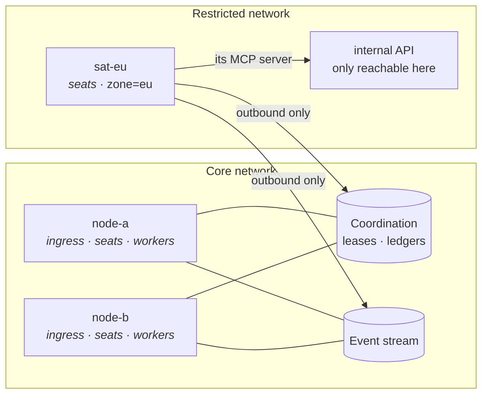

# Running One Agent Somewhere Else

Sometimes a single seat needs to be somewhere the rest of the company is
not: a support agent that must reach an internal API only one VPC can
see, an engineer whose MCP server drives a licensed binary installed on
one host, a seat that needs a GPU, a lab network, or a database behind a
jump host.

You do not move the company for that. You start one more Crewlet process
on that host, tell it what it is, and pin that one role to it. Everything
else — the API, the webhooks, the scheduler, the other agents — stays
exactly where it is. This shape is called a **satellite**: a node that
runs agents, holds no company-wide duty, and terminates no inbound
traffic.

> A satellite is a normal `crewlet run` with roles subtracted, not a
> lighter agent-only binary. It still needs to reach the database and
> the broker. If that is not possible from where you want the agent,
> this is not the mechanism you want — see
> [what a satellite still needs](#what-a-satellite-still-needs).

---

## What actually moves

Pinning a seat moves the whole seat, which is the point — an agent is
not a request handler you can route, it is a place where things run:

| Moves to the satellite | Stays on the core |
|---|---|
| The agent instance, its state and its turns | The HTTP API, the dashboard, every integration's webhooks |
| **Its per-role MCP servers**, spawned as child processes of the node that claimed the seat | The scheduler tick, the retention sweep, the sandbox waiter, skill clustering and curation |
| Its LLM calls, its knowledge searches, its tool calls | Every other seat's agents and MCP servers |
| Its sandbox launches, if the role is sandboxed | The company config, the leases and the ledgers — all shared, in the coordination slot |

The MCP row is the one that makes this feature what it is. A seat's
stdio MCP servers are children of the process holding its lease, so
"pin the seat" and "run its tools over there" are the same act. That is
also why the mechanism cannot be a routing trick: the tools are not
somewhere the request can be forwarded to, they are somewhere the
*agent* has to be.

Work still reaches it normally. A trigger is published to the seat's
inbox topic, and the node holding that seat's lease is the one consuming
it — so nothing that publishes has to know where the agent is, and a
Slack message routed to that agent works exactly as before.

A satellite is also a full **replica**, not just an agent host: it applies
the company's shared state logs — the work tracker, the knowledge base and
the search vectors — into its own database, exactly as a core node does.
Which of those it applies follows from the roles you gave it, and nothing
else; see
[which state-log domains the node runs](#which-state-log-domains-the-node-runs).



---

## Set it up

Three steps: say what the node is, say where the role belongs, start it.

### 1. Give the satellite a Tier A config

Only the Tier A file lives on the satellite. The company itself (roles,
prompts, providers, integrations) comes from the database, so there is
no company YAML to copy or keep in sync.

```yaml
# crewlet.yaml, on the satellite host
node:
  id: "${CREWLET_NODE_ID}"        # distinct and stable — sat-eu-1
  roles: [seats]                  # agents only: no API, no duties
  labels:
    zone: eu                      # what a role will select on
  max_concurrent: 4               # this host runs one or two seats, not a
                                  #   company's worth — see below

store:
  path: "/var/lib/crewlet/sat-eu-1.db"   # this node's own file, not shared

stream:
  type: nats
  url: "${CREWLET_STREAM_URL}"

coordination:
  type: embedded-kv               # the fleet's replicated KV, reached over
                                  #   the same NATS cluster
```

`${VAR}` references are resolved in `node.labels` and `node.id` like
anywhere else, so an orchestrator injects both from the environment
without templating the file. There is a `-roles` flag for the same
reason; labels have no flag, because `${VAR}` already covers it.

`api.port` can stay set: a node without the `ingress` role does not
bind it, and logs `api_not_started` saying why. That means one config
file works for both shapes. The one exception is a seat in
[agent mode](../concepts/subscription-llm-backends.md#the-tool-bridge):
its box calls the seat's tools back over `/mcp/{token}`, and only the
node that runs the seat can answer, so a satellite with
`CREWLET_MCP_BRIDGE_URL` set binds `api.port` for that route alone
(`api_bridge_listening`) and serves nothing else on it.

### 2. Pin the role

In the company config (Tier B), on the role that has to run there:

```yaml
roles:
  - name: EU Support
    handle: eu-support
    goal: "Answer in-zone customer requests"
    placement:
      labels: {zone: eu}
```

`labels` requires **every** pair to be present and equal on the node.
`node: sat-eu-1` pins to one node id instead. Give both and both must
hold — a placement only ever narrows.

Prefer a **label** over a node id. A label is a statement about what the
host *is* ("this one is in the EU zone"), so a replacement host with the
same label picks the seat up; a node id is a statement about which
process, and it strands the seat when that particular process is gone.

### 3. Start it

Both commands run **on the satellite**, against the Tier A file above:

```bash
crewlet migrate                 # this host's own store file
crewlet run                     # roles come from the file
```

`crewlet migrate` is **per node, not per fleet**. There is no shared database
to migrate from elsewhere: it applies the pending schema migrations to the one
local store file its Tier A config names (`/var/lib/crewlet/sat-eu-1.db`
above), and every node owns its file exclusively. A new satellite is migrated
on the satellite.

Or, if you would rather not put roles in the file:

```bash
crewlet run -roles seats
```

---

## Verify it landed

The **Fleet** screen in the dashboard is the direct answer: it reads the
lease table, so it gives the same picture from whichever node you happen
to reach. Look for the satellite in *Nodes* with its roles and labels,
and for the pinned handle in *Seat ownership* against that node.

From the logs on the satellite:

```
seat_claimed    seat=eu-support epoch=3
inbox_attached  seat=eu-support epoch=3 elapsed_ms=5.1
```

Two failures to know by sight:

- **`seats_unplaceable`** — no live node matches the selector. Usually a
  typo (`zone: EU` does not match `zone: eu`; comparison is exact) or a
  satellite that has not started. The seat is not being served, and
  every other node's sweep looks perfectly healthy, which is why this is
  logged rather than left to be noticed.
- **The label change did not take.** Labels are advertised on the node's
  presence lease, so a change takes effect one heartbeat after the
  **restart** that made it — editing the file is not enough.

---

## Which state-log domains the node runs

The work tracker, the knowledge base and the search vectors are
[replicated state machines](replication.md). Each is one ordered log the
whole fleet shares, and a node that **runs** a domain applies that log
into its own copy of the rows — so it can answer questions about it
locally, and so it can donate a snapshot of it to a member that fell
behind.

Which domains a node runs is **derived from `node.roles`**. There is no
separate key for it, no per-domain switch, and nothing to keep in step
with the roles you already wrote: subtract a role and you subtract
whatever that role was the only reason for.

Today every role needs all three, so every node — satellite included —
runs all three:

| Role | Domains it runs | Why it needs them |
|---|---|---|
| `ingress` | `tracker`, `vectors`, `pages` | It serves the board, the knowledge base and search over the REST API and the dashboard |
| `seats` | `tracker`, `vectors`, `pages` | A turn reads and writes all three |
| `workers` | `tracker`, `vectors`, `pages` | The retention sweep runs over each one's ledger, and the embedding duty is what fills the vectors |

Every cell being the same is a **decision, not an absence**: each domain
states in its own right that every role needs it, and a node running no
domain at all refuses to boot rather than coming up as a member that
serves no work item, no page and no search. So narrowing a satellite to
`roles: [seats]` changes nothing about what it applies today. What the
derivation buys is that a domain added later can narrow — and on the day
one does, the roles already in your Tier A files are what decides, rather
than a new key you have to add to every node.

Two rules follow from it, and both are worth knowing before you need
them:

- **Every domain a node declares, or none.** A node that could not start
  one of the domains its roles say it runs refuses to start at all. It
  does not come up serving the ones that did start: a node applying half
  of what it declared serves rows derived from one log while another
  log's records pile up unapplied, and nothing above it can tell that
  apart from a node that is merely behind.
- **A domain a node's roles exclude is a declaration, not a shortfall.**
  Such a node publishes no position for that domain, and it is *not
  counted* for that domain's trim — peers read its roles off its presence
  lease and derive the same answer this node did. Counted at zero it
  would instead pin that log's floor for as long as the node lived, and
  the log would grow without bound on any fleet with one satellite in it.
  (See the counted set in [Retention](retention.md#the-six-terms).)

### Reading it before the node boots

The consequence is otherwise invisible until start-up, so `crewlet
validate` answers it from the Tier A document alone — no broker, no
store, nothing running:

```bash
crewlet validate crewlet.yaml -json
```

```json
{
  "valid": true,
  "tier": "bootstrap",
  "file": "crewlet.yaml",
  "problems": [],
  "warnings": [],
  "summary": {
    "roles": ["seats"],
    "domains": ["tracker", "vectors", "pages"],
    "stream": "nats",
    "coordination": "embedded-kv",
    "store": "/var/lib/crewlet/sat-eu-1.db"
  }
}
```

`summary.domains` is what the roles beside it resolve to. Every form of
the command carries it — the JSON payload above, the one-line prose
summary, and the two-file `crewlet validate -config … -company …` a
pipeline runs:

```
crewlet.yaml: stream "nats", coordination "embedded-kv", store "…", roles [seats], domains [tracker vectors pages chart]
```

### Reading it off a running node

At boot, every node logs what it started, whether or not it serves HTTP —
which on a `roles: [seats]` satellite is the one place to look, because
such a node [binds no listener](#1-give-the-satellite-a-tier-a-config):

```
statelog_started  node=sat-eu-1 domains="[tracker vectors pages chart]"
```

On a node that **does** run `ingress`, `GET /health` carries the same
list:

```bash
curl -s http://node-a:8000/health | python3 -m json.tool
```

```json
{
  "node": "node-a",
  "status": "ok",
  "seats": ["ceo", "eng"],
  "domains": ["tracker", "vectors", "pages"]
}
```

A fleet's members may legitimately differ here, so read it per node
rather than assuming the one you reached speaks for the rest. It is also
what to check after *adding* a role: the domain appears once the node is
really applying it, not when you edited the file.

---

## What a satellite still needs

It is a full engine process with roles subtracted, so be honest about
the dependency surface before choosing a host for it:

- **Outbound reach to the coordination slot and to the stream.** Seat
  leases, the activation pointer, the ledgers and the seat's inbox all
  live there. A network so restricted that neither is reachable cannot
  host a satellite. Its own store file is local, so that one costs
  nothing.
- **Whatever its LLM provider needs.** Usually outbound HTTPS to the
  provider. A network with no egress at all can still work if the role
  uses a [subscription CLI backend](../concepts/subscription-llm-backends.md)
  or an on-premises OpenAI-compatible endpoint.
- **The MCP servers its role declares, installed on that host** — the
  whole reason the seat is there.
- **The same keyring**, if company-config encryption is on. The
  satellite decrypts the company document and the
  [secret store](../concepts/secret-store.md) itself; without the
  keyring it cannot read the config at all.
- **Nothing inbound**, unless a seat pinned here runs in agent mode. No
  port, no ingress rule, no public URL. That is what makes this shape
  workable in a zone the rest of the fleet is not in. An agent-mode seat
  is the exception: its box must reach this node's `/mcp/{token}`
  bridge, which is the one route the satellite then serves.

---

## What it costs

**A pinned seat is unserved whenever nothing matches it.** The engine
will not widen a selector to keep a seat running — widening it is
exactly what you asked it not to do. So when the satellite is down, that
agent is down, and the fleet says so (`seats_unplaceable`) rather than
quietly running it somewhere it does not belong. If that is not
acceptable, run **two** satellites carrying the same label: the seat
moves between them, and the fair share is computed per placement group,
so the pinned seat does not eat into anything else's capacity.

**A satellite is eligible for unpinned seats too.** It runs seats, so it
takes its share of the ones nobody pinned — which is a real property to
be deliberate about, because those seats' MCP servers may not work in a
restricted network. There is no "only take pinned seats" switch. To keep
general work off it, pin the general work to the core, which is one
label and a YAML anchor rather than a block per role:

```yaml
roles:
  - name: CEO
    handle: ceo
    goal: "Set direction"
    placement: &core {labels: {tier: core}}       # anchor, on first use

  - {name: Engineer, handle: eng, goal: "Build", placement: *core}
  - {name: Designer, handle: design, goal: "Design", placement: *core}

  - name: EU Support
    handle: eu-support
    goal: "Answer in-zone customer requests"
    placement: {labels: {zone: eu}}
```

Give the core nodes `labels: {tier: core}` and the satellite only
`{zone: eu}`, and each group stays on its own side. (The anchor has to
be declared on a real `placement` field as above — a top-level holder
key is rejected, since the company schema forbids unknown fields.)

**Two more, inherited from running a fleet at all:**

- `node.max_concurrent` is per process, so the satellite has its own ceiling.
  Size it for one agent, not for the company — the default of 32 is sized for
  a node holding a company's worth of seats, and a satellite running one seat
  wants a much smaller number.
- A rolling upgrade across a lease-protocol bump makes new nodes wait
  for old ones. Upgrade the satellite in the same rollout as the core —
  see [mixed-version fleets](../concepts/seat-ownership.md#mixed-version-fleets).

---

## Sandboxed seats

A [sandboxed](../concepts/code-sandbox.md) seat can be pinned like any
other, with three network facts the engine cannot check for you:

- The satellite **launches** the sandbox, so it must reach the sandbox
  provider (E2B cloud, or your self-hosted `domain`).
- Whichever node holds the `sandbox-waiter` duty **polls** it. On a
  satellite (`roles: [seats]`) that duty is on a core node by
  construction — so check that node's reachability too, not just the
  satellite's.
- `CREWLET_SANDBOX_OTEL_RECEIVER_URL` must name an address the *sandbox*
  can reach, which means an ingress node. It is explicit config and is
  never derived from whichever node launched the run, so a satellite
  never advertises itself by accident.

Pinning a sandboxed seat to a node that cannot reach the provider gives
you a seat that claims cleanly and fails every run. The engine knows
what a node *says it is*, never what it can talk to.

---

## See also

- [Running a Fleet](fleet.md) — the general case: node roles, fair-share
  placement, draining and rolling upgrades
- [Scaling Out](../concepts/scaling.md) — what a node is, what the fleet
  shares, and what the design does not promise
- [Seat Ownership](../concepts/seat-ownership.md) — how the lease makes
  "only this node runs that agent" true
- [Tools & MCP](tools-and-mcp.md) — declaring the MCP servers a role's
  seat will spawn wherever it runs
