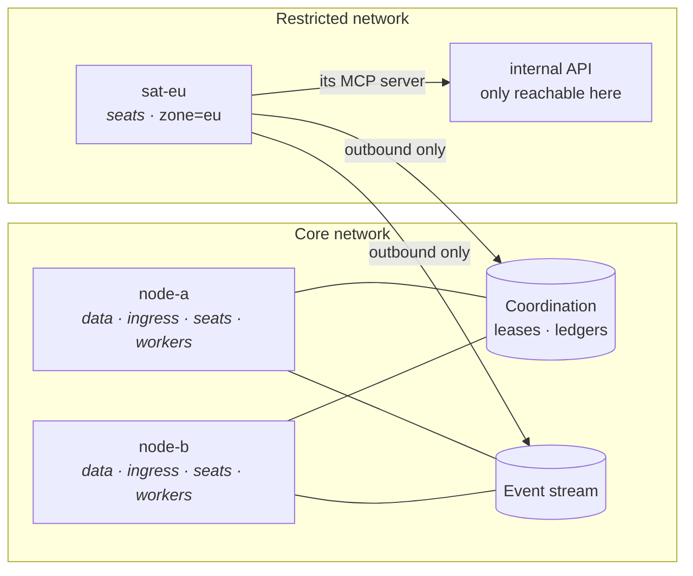

# Running One Agent Somewhere Else

Sometimes a single seat needs to be somewhere the rest of the company is
not: a support agent that must reach an internal API only one VPC can
see, an engineer whose MCP server drives a licensed binary installed on
one host, a seat that needs a GPU, a lab network, or a database behind a
jump host.

You do not move the company for that. You start one more Crewlet process
on that host, tell it what it is, and pin that one role to it. Everything
else — the API, the webhooks, the scheduler, the other agents — stays
exactly where it is. This shape is called a **satellite**: a node that
runs agents, holds no company-wide duty, and terminates no inbound
traffic.

A satellite comes in two shapes, and the difference is the `data` role:

| | `roles: [seats]` — **stateless** | `roles: [data, seats]` — **holds data** |
|---|---|---|
| Its store | Scratch: deleted at every boot, and no copy of the tracker or knowledge base | Its own full copy of the replicated estate |
| Its broker | A **leaf** of the members' — no JetStream, no replica, no vote | A cluster **member**, holding replicas (a data node on a leaf is refused) |
| Disk it needs | Its seats' memory and working rows, nothing else | The whole company's history |
| Its seats' tools | Read and write through a data node, over the broker | Read and write its own copy, through the same router |
| Replacing it | Delete it and start another — it keeps nothing | A member leaving and joining |

Which of the two its broker is — its **broker kind** — comes from its `stream`
block, never from its roles: `stream.leaf.urls` makes it a leaf, and every node
advertises the kind it runs on its presence (`crewlet fleet broker list`, or
the Broker column on **Settings › Nodes**). See
[The broker: members and leaves](fleet.md#the-broker-members-and-leaves).

**Stateless is what you want for an agent host you intend to keep small and
disposable**: it can be rebuilt from its Tier A file alone, holds no raft
state, and restarts in seconds whatever the company's size. Its price is that
its seats need a data node to answer — see
[what a satellite still needs](#what-a-satellite-still-needs).

> A satellite is a normal `crewlet run` with roles subtracted, not a
> lighter agent-only binary. Either shape still needs to reach the fleet's
> broker. If that is not possible from where you want the agent, this is
> not the mechanism you want.

---

## What actually moves

Pinning a seat moves the whole seat, which is the point — an agent is
not a request handler you can route, it is a place where things run:

| Moves to the satellite | Stays on the core |
|---|---|
| The agent instance, its state and its turns | The HTTP API, the dashboard, every integration's webhooks |
| **Its per-role MCP servers**, spawned as child processes of the node that claimed the seat | The scheduler tick, the retention sweep, the sandbox waiter, skill clustering and curation |
| Its LLM calls, its knowledge searches, its tool calls | Every other seat's agents and MCP servers |
| Its sandbox launches, if the role is sandboxed | The company config, the leases and the ledgers — all shared, in the coordination slot |

The MCP row is the one that makes this feature what it is. A seat's
stdio MCP servers are children of the process holding its lease, so
"pin the seat" and "run its tools over there" are the same act. That is
also why the mechanism cannot be a routing trick: the tools are not
somewhere the request can be forwarded to, they are somewhere the
*agent* has to be.

Work still reaches it normally. A trigger is published to the seat's
inbox topic, and the node holding that seat's lease is the one consuming
it — so nothing that publishes has to know where the agent is, and a
Slack message routed to that agent works exactly as before.


```mermaid
flowchart LR
    subgraph core["Core network"]
        C1["node-a<br/><i>data · ingress · seats · workers</i>"]
        C2["node-b<br/><i>data · ingress · seats · workers</i>"]
        KV[("Coordination<br/>leases · ledgers")]
        MQ[("Event stream")]
    end
    subgraph zone["Restricted network"]
        S["sat-eu<br/><i>seats</i> · zone=eu"]
        API["internal API<br/>only reachable here"]
        S -->|its MCP server| API
    end
    C1 --- KV
    C2 --- KV
    C1 --- MQ
    C2 --- MQ
    S -->|outbound only| KV
    S -->|outbound only| MQ
```

---

## Set it up

Three steps: say what the node is, say where the role belongs, start it.

### 1. Give the satellite a Tier A config

Only the Tier A file lives on the satellite. The company itself (roles,
prompts, providers, integrations) comes from the fleet, so there is no
company YAML to copy or keep in sync.

A **stateless** satellite on an embedded fleet:

```yaml
# crewlet.yaml, on the satellite host
node:
  id: "${CREWLET_NODE_ID}"        # distinct and stable — sat-eu-1
  roles: [seats]                  # agents only: no data, no API, no duties
  labels:
    zone: eu                      # what a role will select on
  max_concurrent: 4               # this host runs one or two seats, not a
                                  #   company's worth — see below

store:
  path: "/var/lib/crewlet/sat-eu-1.db"
  scratch: true                   # deleted at every boot — required without
                                  #   the data role, and it says so twice

stream:
  leaf:
    urls:                         # any member's leaf listener will do
      - "nats-leaf://node-a.internal:7422"
      - "nats-leaf://node-b.internal:7422"

coordination:
  type: embedded-kv               # the fleet's replicated KV, reached over
                                  #   the same link
```

There is no `stream.store_dir` here, and there must not be: a leaf runs no
JetStream, so it has no stream store to keep, and Tier A refuses one beside
`stream.leaf.urls`. Every stream the satellite's seats use lives on the
members, in theirs — which is also why `crewlet validate` raises no in-memory
stream warning for this file.

The members open that listener with `stream.leaf.port`, and a member that
opens one must persist (`stream.store_dir`), as every member of a fleet must:
the nodes that join it keep nothing, so it keeps everything they do.

```yaml
# on node-a and node-b — alongside their existing cluster block
stream:
  store_dir: /var/lib/crewlet/stream
  leaf:
    port: 7422                    # where stateless nodes join
```

A leaf port something else already holds is refused when the member starts,
by name, as a taken route port is (see [Every node embeds a member of one
cluster](deployment.md#every-node-embeds-a-member-of-one-cluster)). NATS
does not fail when it cannot bind the listener — it logs the error and the
member never becomes ready — so the engine probes the port first:

```
leaf listener port taken: stream.leaf.port 7422 is already in use on
every interface, so no stateless node could join the fleet through this
member — free that port or give this node a different one
```

On an **external** NATS cluster there is no leaf to configure: a stateless
node dials the cluster as every node does, and keeps `store.scratch: true`
and `roles: [seats]`.

A satellite that **holds data** is the same file with `roles: [data, seats]`,
a durable store (no `scratch`) and a cluster member's `stream.cluster` block
and `stream.store_dir` instead of `stream.leaf` — see
[Running a Fleet](fleet.md). It joins the broker as a voter: mind the
[five-member ceiling](fleet.md#the-broker-members-and-leaves) before adding
one to a fleet that already has five.

`${VAR}` references are resolved in `node.labels` and `node.id` like
anywhere else, so an orchestrator injects both from the environment
without templating the file. There is a `-roles` flag for the same
reason; labels have no flag, because `${VAR}` already covers it.

`api.port` can stay set, and one config file works for both shapes: a node
without the `ingress` role binds it for its [probes](#probe-it) alone —
`/health` and `/ready` — and serves no API, no dashboard and no webhook on it
(`api_probes_listening`). Every other path answers `404`, or `401` for a write
or an always-guarded prefix, exactly as an unknown path does on an ingress
node. The one route it adds is for a seat in
[agent mode](../concepts/subscription-llm-backends.md#the-tool-bridge): its box
calls the seat's tools back over `/mcp/{token}`, and only the node that runs
the seat can answer, so a satellite with `CREWLET_MCP_BRIDGE_URL` set serves
that route (`tool_bridge=true` on the same line) — beside the probes, or on
`api.public.port` when the file sets one (`public_addr` on the same line names
it), since the bridge is a route a sandbox outside your network calls (see
[Deployment → Exposing webhooks without the admin API](deployment.md#exposing-webhooks-without-the-admin-api)).
With `api.port: 0` the satellite binds nothing at all, which is the shape for a
host that must accept no connection of any kind — at the price of no probe
and no agent mode.

### 2. Pin the role

In the company config (Tier B), on the role that has to run there:

```yaml
roles:
  - name: EU Support
    handle: eu-support
    goal: "Answer in-zone customer requests"
    placement:
      labels: {zone: eu}
```

`labels` requires **every** pair to be present and equal on the node.
`node: sat-eu-1` pins to one node id instead. Give both and both must
hold — a placement only ever narrows.

Prefer a **label** over a node id. A label is a statement about what the
host *is* ("this one is in the EU zone"), so a replacement host with the
same label picks the seat up; a node id is a statement about which
process, and it strands the seat when that particular process is gone.

### 3. Start it

On a **stateless** satellite there is one command:

```bash
crewlet run                     # roles come from the file
```

Its store is created fresh, at the binary's own schema, every time it starts,
so there is nothing to migrate — `crewlet migrate` refuses a scratch store and
says so, and so do the offline `config`, `secrets` and `search eval` commands,
because anything they wrote into it would be gone at the next boot. Configure
the company through the API of a node that holds data.

A satellite that **holds data** is migrated on the satellite first:

```bash
crewlet migrate                 # this host's own store file
crewlet run
```

`crewlet migrate` is **per node, not per fleet**. There is no shared database
to migrate from elsewhere: it applies the pending schema migrations to the one
local store file its Tier A config names, and every node owns its file
exclusively.

Or, if you would rather not put roles in the file:

```bash
crewlet run -roles seats
```

---

## Verify it landed

The **Settings › Nodes** screen in the dashboard is the direct answer: it reads the
lease table, so it gives the same picture from whichever node you happen
to reach. Look for the satellite in *Nodes* with its roles and labels,
and for the pinned handle in *Seat ownership* against that node.

From the logs on the satellite:

```
seat_claimed    seat=eu-support epoch=3
inbox_attached  seat=eu-support epoch=3 elapsed_ms=5.1
```

### Probe it

A satellite with `api.port` set answers the same two probes every node
does, so an orchestrator can restart one that wedged and wait for one to
join before it replaces the next:

```bash
curl -s http://sat-eu-1.internal:8000/ready
# {"ready":true,"node":"sat-eu-1","configured":true,"draining":false,"posture":"serve"}
```

`/health` is liveness, and answers `200` for as long as the process is
alive — through a drain, and through a broker link that is down — with the
node's half of the [health envelope](../reference/api-endpoints.md#probes-on-a-node-without-ingress):
its id, its roles, its posture and applied epoch, the seats it holds, and
`shutting_down`.

`/ready` answers whether the node is **doing its work**, because a
satellite takes no traffic for a probe to steer. It is `503` until all of
these hold, naming the first that does not in `reason`:

| `reason` | What it means here |
|---|---|
| `draining` | The node is stopping: its turns finish and it claims nothing new. |
| `broker_unlinked` | Its leaf link to every member is down (or, on an external cluster, its connection is reconnecting); `detail` says which. Its seats can neither receive nor publish anything. |
| `unconfigured` | No company revision has reached it yet. |
| `shed` or `stuck` | Its [config posture](../concepts/control-plane.md#operator-surface): it cannot apply the revision its peers run. |
| `no_presence` | It does not hold its presence lease, so its peers do not count it and nothing routes to it. |
| `admission_withheld` | No data node has yet answered that a copy of the estate admits a seat — or the node cannot serve the seats it holds — so it claims nothing. This is the state a fresh satellite sits in until it is admitted, and the one it returns to while no data node is reachable. |

Two failures to know by sight:

- **`seats_unplaceable`** — no live node matches the selector, or the
  only one that does cannot serve its seats right now and has withdrawn
  (`seats_shed_unserviceable` on that node says why). Usually a typo
  (`zone: EU` does not match `zone: eu`; comparison is exact) or a
  satellite that has not started. The seat is not being served, and
  every other node's sweep looks perfectly healthy, which is why this is
  logged rather than left to be noticed.
- **The label change did not take.** Labels are advertised on the node's
  presence lease, so a change takes effect one heartbeat after the
  **restart** that made it — editing the file is not enough.

---

## What a satellite still needs

It is a full engine process with roles subtracted, so be honest about
the dependency surface before choosing a host for it:

- **Outbound reach to the coordination slot and to the stream.** Seat
  leases, the activation pointer, the ledgers and the seat's inbox all
  live there. A network so restricted that neither is reachable cannot
  host a satellite. Its own store file is local, so that one costs
  nothing.
- **For a stateless satellite, a data node that answers.** Its seats' tracker
  and knowledge-base tools, their knowledge search and its tool-skill walks
  are each a request to a data node over the broker — no inbound port, the
  same link. It is admitted to claim seats only once a data node answers
  that its own copy is level with its logs, and while none answers its tools
  fail naming the estate nobody served rather than answering from nothing. What it publishes about its
  own turns is handed to a data node's event log (the audit trail cannot live
  in a store deleted at its next boot), so `GET /events` on that data node
  shows it; its seats' memory rides the compacted changelog every seat's
  memory does and is rehydrated after a restart.
- **Whatever its LLM provider needs.** Usually outbound HTTPS to the
  provider. A network with no egress at all can still work if the role
  uses a [subscription CLI backend](../concepts/subscription-llm-backends.md)
  or an on-premises OpenAI-compatible endpoint.
- **The MCP servers its role declares, installed on that host** — the
  whole reason the seat is there.
- **The same keyring**, if company-config encryption is on. The
  satellite decrypts the company document and the
  [secret store](../concepts/secret-store.md) itself; without the
  keyring it cannot read the config at all.
- **Nothing inbound from the fleet or the outside world.** No ingress
  rule, no public URL: the satellite dials out to the broker and
  coordination slot and is never dialled back. That is what makes this
  shape workable in a zone the rest of the fleet is not in. What reaches
  `api.port` is the orchestrator's probes and, if a seat pinned here runs
  in agent mode, that seat's box calling its `/mcp/{token}` bridge — the
  box must be able to dial this node for that one. `api.port: 0` closes
  both.

---

## What it costs

**A pinned seat is unserved whenever nothing matches it.** The engine
will not widen a selector to keep a seat running — widening it is
exactly what you asked it not to do. So when the satellite is down, that
agent is down, and the fleet says so (`seats_unplaceable`) rather than
quietly running it somewhere it does not belong. If that is not
acceptable, run **two** satellites carrying the same label: the seat
moves between them, and the fair share is computed per placement group,
so the pinned seat does not eat into anything else's capacity — and
nothing else eats into the pinned seat's: a satellite's share of the
unpinned seats is a separate bound from its share of its own, so it
keeps room for the seat it exists for and claims it first. A seat whose
teardown failed on the satellite is charged against the unpinned seats
before the pinned one, for the same reason.

**A satellite is eligible for unpinned seats too.** It runs seats, so it
takes its share of the ones nobody pinned — on top of its pinned seat,
never instead of it — which is a real property to be deliberate about,
because those seats' MCP servers may not work in a restricted network.
There is no "only take pinned seats" switch. To keep general work off
it, pin the general work to the core, which is one label and a YAML
anchor rather than a block per role:

```yaml
roles:
  - name: CEO
    handle: ceo
    goal: "Set direction"
    placement: &core {labels: {tier: core}}       # anchor, on first use

  - {name: Engineer, handle: eng, goal: "Build", placement: *core}
  - {name: Designer, handle: design, goal: "Design", placement: *core}

  - name: EU Support
    handle: eu-support
    goal: "Answer in-zone customer requests"
    placement: {labels: {zone: eu}}
```

Give the core nodes `labels: {tier: core}` and the satellite only
`{zone: eu}`, and each group stays on its own side. (The anchor has to
be declared on a real `placement` field as above — a top-level holder
key is rejected, since the company schema forbids unknown fields.)

**Two more, inherited from running a fleet at all:**

- `node.max_concurrent` is per process, so the satellite has its own ceiling.
  Size it for one agent, not for the company — the default of 32 is sized for
  a node holding a company's worth of seats, and a satellite running one seat
  wants a much smaller number.
- A rolling upgrade across a lease-protocol bump makes new nodes wait
  for old ones. Upgrade the satellite in the same rollout as the core —
  see [mixed-version fleets](../concepts/seat-ownership.md#mixed-version-fleets).

---

## Sandboxed seats

A [sandboxed](../concepts/code-sandbox.md) seat can be pinned like any
other, with three network facts the engine cannot check for you:

- The satellite **launches** the sandbox, so it must reach the sandbox
  provider (E2B cloud, or your self-hosted `domain`).
- Whichever node holds the `sandbox-waiter` duty **polls** it. On a
  satellite (`roles: [seats]`) that duty is on a core node by
  construction — so check that node's reachability too, not just the
  satellite's.
- `CREWLET_SANDBOX_OTEL_RECEIVER_URL` must name an address the *sandbox*
  can reach, which means an ingress node. It is explicit config and is
  never derived from whichever node launched the run, so a satellite
  never advertises itself by accident.

Pinning a sandboxed seat to a node that cannot reach the provider gives
you a seat that claims cleanly and fails every run. The engine knows
what a node *says it is*, never what it can talk to.

---

## See also

- [Running a Fleet](fleet.md) — the general case: node roles, fair-share
  placement, draining and rolling upgrades
- [Scaling Out](../concepts/scaling.md) — what a node is, what the fleet
  shares, and what the design does not promise
- [Seat Ownership](../concepts/seat-ownership.md) — how the lease makes
  "only this node runs that agent" true
- [Tools & MCP](tools-and-mcp.md) — declaring the MCP servers a role's
  seat will spawn wherever it runs
