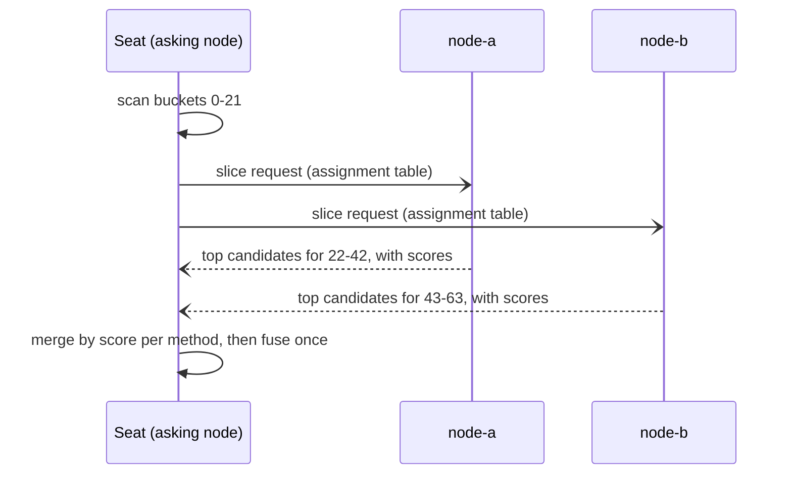

# Search

How the knowledge search is answered, what it costs, and what a fleet can do
about it when the corpus outgrows one node's CPU.

Search is answered from **this node's own tables**. Every node holds the whole
corpus — see [Scaling](../concepts/scaling.md) — so there is no lookup that has
to leave the machine and no answer that depends on a peer being up. What a
fleet can divide is the **work**, not the data.

---

## The two halves, and the bucket both of them carry

A hybrid search runs two rankers and fuses them:

- **Lexical** — BM25 over the engine's own inverted list, in this node's
  database.
- **Semantic** — a two-stage vector scan over the replicated vectors.

Every indexed document carries a **search shard**: a stable hash of its own
identity into 64 fixed buckets, written beside the row in both estates by the
same function. See
[Every document carries a bucket](../concepts/knowledge-system.md#every-document-carries-a-bucket)
for what the bucket is a function of and — just as important — what it is
deliberately not.

A search can be told to read only part of that range. On a single node nothing
tells it one: it holds every bucket and reads every bucket.

---

## When a fleet divides the scan

Above **10 000 documents**, a company running more than one node divides the
buckets between them. Each node scans its own contiguous range, returns its
best candidates *with their scores*, and the node that asked merges them.

The division is computed, not configured, and every node computes the same one:
sort the live node ids, give each a contiguous range, hand the remainder to the
first few. 64 buckets over three nodes is 22, 21, 21.

Below that floor a search is answered by the asking node alone. The floor is
not a preference — a broker round trip is about a millisecond and 10 000
documents is about 13 ms of scanning, so under it a fan-out spends more wall
clock arranging the work than doing it.

**More nodes is not always faster, and the limit is CPU rather than count.**
Measured on four cores over 4 000 documents, with every participant in one
process: 89 ms at one replica, 64 ms at two, 70 ms at four and 98 ms at eight.
A real fleet spreads those scans across separate machines, so the turn is
further out — but the shape is the same, and it is why the floor is priced in
scan time rather than in node count. Recall against the single-scan answer was
exactly 1.000 at every width.

### What travels, and what does not

The request carries the query and the whole assignment table; each node answers
only for its own row. Nothing about it is durable: there is no stream, no
consumer, no acknowledgement and no record afterwards. A request nobody serves
is a request that never existed. That is deliberate — a search that wrote two
records and an audit row per keystroke would make the audit log a function of
how often somebody typed.

---

## Why the merge is by score, and then fused once

Each node returns its top candidates **per method, with scores**. The asking
node merges each method's candidates into one global list by score, and only
then fuses the two global lists by reciprocal rank fusion at k = 60.

The order matters and it is not a style choice. Reciprocal rank fusion combines
*different rankers over one corpus*. Run over *one ranker across disjoint
slices* it ranks by placement: a document ranked first on a weak slice
contributes 1/61 = 0.0164 and a far stronger document ranked second on a strong
slice contributes 1/62 = 0.0161 — so a 0.10 outranks a 0.98.

Merging by score first removes the problem rather than tuning around it. It is
also **exact**: the slices are disjoint, so the global top-N is contained in the
union of the per-slice top-N, and a search fanned out four ways returns the
identical order a search fanned out no ways does.

**The scores are comparable, for a different reason per method.** Semantic
similarity is comparable by construction — one model, one metric, one vector
space. BM25 would not be comparable if each node computed its statistics from
its own slice, and it does not: every node holds the whole corpus, so document
frequency and the document count come from that node's complete tables whatever
buckets it scanned. **The scan is bucket-limited; the statistics are global.**

---

## When part of the corpus is not scanned

A node that is restarting, overloaded or gone does not answer its assignment.
The asking node holds the whole corpus and could have answered alone — which is
exactly why a short answer must say so, because a search that returns one fewer
result looks identical to a corpus with one fewer document.

So the answer is **labelled partial** and names what it missed: how many buckets
were answered, how many were not, and which nodes were silent. The
`search_scoped` alarm reports the fraction of searches answered that way; see
[Alarms](../reference/alarms.md).

The three search alarms are kept apart because they cost different things:

| Alarm | What happened | What the answer lost |
|---|---|---|
| `search_scoped` | A node did not answer its assignment. | A range of the corpus went unscanned. |
| `search_degraded` | A semantic scan was asked for and did not run. | Over the range it *did* scan, only what shares words with the query was found. |
| `search_slow` | Interactive search is over its p95 target. | Nothing — yet. The corpus has outgrown what one node's share can scan in the budget. |

**A company with no embeddings provider is not degraded.** `search_degraded`
counts semantic scans that were asked for and failed, never searches that asked
for one half by design — an alarm red for the life of a deployment is one
nobody reads.

**The asking node always scans its own range itself**, never through the
broker. A search that returned nothing because the broker hiccupped would be a
fleet-wide outage of a read every node can serve alone, so only the *peers'*
ranges can go missing.

---

## If search is slow

1. **Check `search_degraded` first.** A failing embeddings provider makes every
   search worse and cheaper at the same time, which does not look like a
   slowdown.
2. **Check the corpus against the fleet.** `search_slow` fires against the
   interactive p95 target. Adding a node divides the buckets again with no
   configuration and no rebuild.
3. **Check `recall_below_floor`.** A corpus whose vectors are behind is
   answering semantically from a fraction of itself.

There is no index to tune, no shard count to set and no routing table to
maintain. The bucket count is fixed for the life of a deployment: changing it
re-buckets every document, which costs a full index rebuild rather than a
rebalance.
