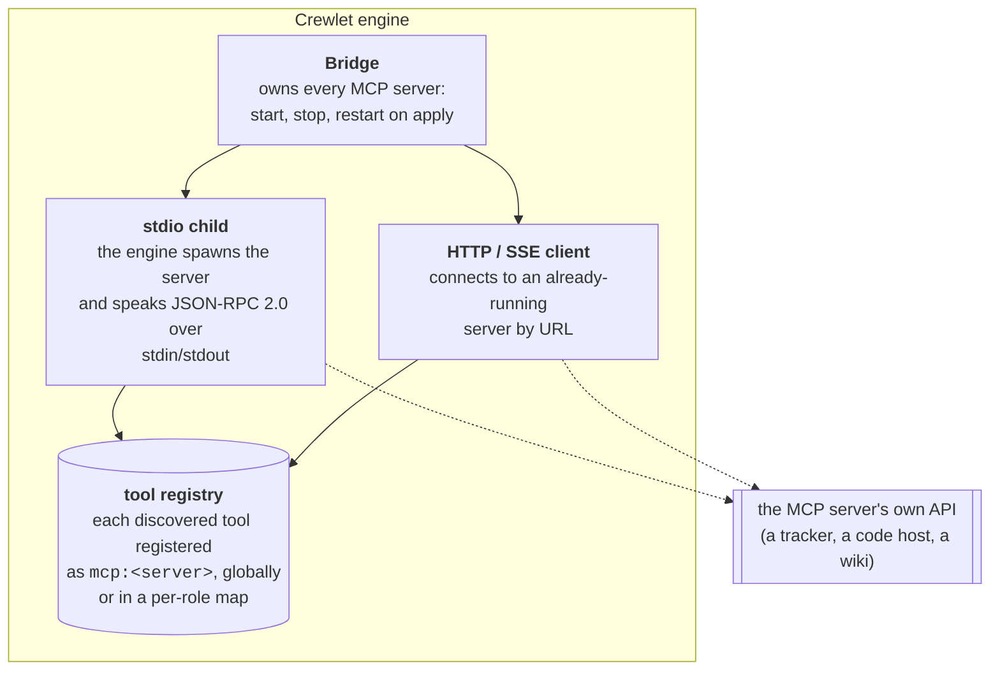

# Tools & MCP Integration

Agents interact with external systems and internal engine operations through tools. Crewlet supports both built-in tools and dynamically discovered MCP tools.

---

## Built-in Tools

These tools are registered globally and available to all agents:

| Tool | Description |
|------|-------------|
| `lookup_colleague` | Resolve any agent identifier (handle, Slack user, Jira ID, GitHub login, …) to a canonical handle and its known cross-platform identities. Falls back to case-insensitive / substring / fuzzy match (e.g. `ceo` → `agent-ceo`); ambiguous fuzzy queries return the candidate list so the LLM picks rather than guessing |
| `reflect_and_persist` | Capture a durable fact in the agent's private diary (LONG / SHORT) |
| `refresh_memory` | Re-run the personal-memory filter mid-turn after gathering richer context |
| `query_episodes` | Search the agent's own past completed turns by similarity |
| `use_skill` | Load one of the agent's own [synthesized skills](../concepts/agent-learning.md#5-skillsynthesizer--skill-induction) on demand |
| `refine_skill` | Append a bullet to a synthesized skill (or replace its body) |
| `mark_onboarded` | Stamp the agent's onboarding marker after reading the relevant onboarding pages |
| `a2a_ask` | Tight-loop synchronous handoff to a colleague (see [Turn Engine § Colleague-surface tools](../concepts/turn-engine.md#colleague-surface-tools)) |

Note the deliberate split between personal and shared writes: `reflect_and_persist` is **personal-only** (it writes to the agent's private `agent_diary`), while team-shared content lives in the knowledge backend (Confluence) — written through that backend's own MCP tools and searched live at query time (see [Knowledge System](../concepts/knowledge-system.md)). `use_skill` resolves the agent's own synthesized skills; shared procedures are knowledge-backend pages.

Task-management tools (`create_task`, `assign_task`, `update_task`, `list_tasks`, `delegate`) are **not** registered as builtins — agents interact with the external PM tool (Jira, GitLab issues, etc.) via MCP tools instead.

### Per-Role MCP Servers (GitHub)

Roles with GitHub credentials in `mcp_env.github` get a per-role instance of the [remote GitHub MCP server](https://github.com/github/github-mcp-server) (declared as a `shared: false` `http` entry in `mcp_servers`), giving them the full GitHub toolset for reading/reviewing/tracking code (issues, PRs, repos, code search, actions); code authoring goes through the [code sandbox](../concepts/code-sandbox.md). See [GitHub Integration](../integrations/github.md).

### Where a tool comes from

Every registered tool records **who registered it**, and that is recorded at
registration because it cannot be recovered afterwards: a tool an MCP server
serves is structurally identical to one the engine ships — same name, same
schema, same call signature. With nothing recorded, a tool missing because its
server failed to start reads as a missing builtin, which sends an operator to
debug the wrong subsystem.

`GET /tools` reports it as each tool's `source`, and the dashboard's **Tools** screen
groups on it:

| `source` | Where the tool came from |
|---|---|
| `builtin` | Shipped by the engine. The agent-to-agent tools are builtins too — `a2a_ask` is registered by the same walk, so "a2a" is a capability rather than an origin |
| `mcp:<server>` | Discovered on an MCP server. `<server>` is the **bare** template name, never the per-role instance: two seats' children of one template are the same integration to a reader grouping the catalogue |

Those two are the whole grammar. A server that fails to start is visible as a
**missing group**, rather than its tools quietly going absent from the builtins.

---

## Extending the engine

There is no plugin API and no runtime loading. Crewlet ships as one
binary, and nothing under `internal/` is importable from outside the module —
so an extension cannot be a library the engine loads.

**The extension point is MCP**, deliberately. A tool server is a separate
process (or a remote URL), it carries its own credentials, it can be written in
any language, and a server that crashes takes down a tool group rather than the
engine. Everything above about `mcp_servers` is that surface.

Two things MCP does not cover, and what to do instead:

- **A new chat or tracker vendor.** Routing an inbound delivery to a seat needs
  a parser, and that is an in-tree Go interface — the
  [notification spine](../concepts/event-system.md) is backend-neutral by
  design, but a vendor contributes a client, a parser and a transport as code.
  That is a pull request, not a config entry. The six this build serves are
  [Mattermost](../integrations/mattermost.md), [Slack](../integrations/slack.md),
  [Jira](../integrations/jira.md), [Confluence](../integrations/confluence.md),
  [GitLab](../integrations/gitlab.md) and [GitHub](../integrations/github.md) —
  every one of them routes end to end (see
  [Design Decisions](../reference/design-decisions.md#every-vendor-is-served)).
- **Company-wide periodic work.** An MCP server is called by an agent; it does
  not get a tick of its own. Schedule it as [cron work](../concepts/scheduling.md)
  against a seat, which gives it an agent, a turn, and the engine's own
  at-most-once delivery across a fleet — rather than a loop that would run once
  per node.

---

## MCP Integration

Instead of building hardcoded API wrappers for external tools (Jira, Slack, Confluence, GitHub, etc.), Crewlet uses the **Model Context Protocol (MCP)** for dynamic tool discovery. This gives agents access to the full capabilities of external tools — not just a curated subset.

### Architecture



A stdio server is a process **tree**, not a process: `npx` execs a launcher that
execs the real server, so the engine puts each child in its own process group
and signals the group. Killing only the pid it spawned leaves the grandchild
holding the credentials and the port.

### Two Transport Modes

1. **Stdio (Crewlet launches the server)** — The engine spawns MCP servers as child processes (e.g., `npx @anthropic/mcp-atlassian`). Crewlet manages the full lifecycle: start on engine boot, stop on shutdown. Communication uses JSON-RPC 2.0 over stdin/stdout.

2. **HTTP/SSE (externally provided)** — The engine connects to an already-running MCP server via URL. Supports JSON and SSE response modes with automatic session management and reconnection.

### Handshake and server diagnostics

On connect the engine (identifying itself as `crewlet` in the handshake) negotiates the newest protocol the server speaks: it probes the modern `server/discover` method first and falls back to the legacy `initialize` handshake automatically. Servers built on older MCP SDKs may log a one-time "unknown method" warning when they see the probe — harmless, and it stays out of your console because of the rule below.

A stdio server's **stderr is never passed through raw**. Every line the child process writes (startup banners, tracebacks, that probe warning) becomes a structured `server_stderr` DEBUG event attributed to the server, instead of foreign log lines interleaving with the engine's own stream. When a server fails to start, the last lines it wrote are surfaced with the failure as a single `server_stderr_tail` ERROR event — that tail usually names the real cause (bad token, missing binary, import error). Run with `--debug` to watch a server's full stderr live.

---

## Per-agent identity

Each Role names its per-server credentials directly in `mcp_env`, so every agent authenticates as itself in external tools. The engine applies these as **env vars** for `stdio` servers and **HTTP headers** for `http` servers — it stays tool-agnostic, reading only `mcp_env` (and, for the Slack transport, `integrations.slack`):

```yaml
roles:
  - name: Senior Engineer
    integrations:                          # per-agent transport identity (inbound webhook
      slack:                               #   verification + outbound send() fallback)
        bot_token: "${ALICE_SLACK_BOT}"
        signing_secret: "${ALICE_SLACK_SIGNING}"
    mcp_env:
      atlassian:
        JIRA_USERNAME: "${ALICE_JIRA_USER}"
        JIRA_API_TOKEN: "${ALICE_JIRA_TOKEN}"
      slack:
        SLACK_MCP_XOXB_TOKEN: "${ALICE_SLACK_BOT}"   # same token, the Slack MCP subprocess
      github:
        Authorization: "Bearer ${ALICE_GH_TOKEN}"
```

A Slack-enabled agent names its bot token in **both** `role.integrations.slack.bot_token` and `role.mcp_env.slack.SLACK_MCP_XOXB_TOKEN`: the two are different consumers — the notification transport vs. the Slack MCP subprocess — and both reference the same `${VAR}`, so no secret is duplicated. The Atlassian token (`JIRA_API_TOKEN` / `CONFLUENCE_API_TOKEN`) and the GitHub PAT (`Authorization: Bearer …`) likewise live wherever the consuming MCP server reads them.

When the engine launches a per-role MCP server instance, it merges the base server config with the role's `mcp_env` (applied as **env vars** for `stdio` servers, **HTTP headers** for `http` servers).

### Per-Unit Config

A unit declares its Jira project / Confluence space *identity* under `integrations` (used for inbound webhook routing and as the team's write home — not a tool credential, and it does not scope knowledge reads). Real per-agent tool credentials still live in `mcp_env`, which all roles inherit:

```yaml
units:
  - name: Backend
    type: team
    lead: Tech Lead
    integrations:
      jira:
        project: "BACK"             # the unit's Jira project (integration identity)
    mcp_env:
      atlassian:
        JIRA_URL: "${JIRA_URL}"     # shared by the whole unit
    roles:
      - name: Tech Lead
        mcp_env:
          atlassian: { JIRA_API_TOKEN: "${TL_JIRA_TOKEN}" }
      - name: Engineer
        mcp_env:
          atlassian: { JIRA_API_TOKEN: "${ENG_JIRA_TOKEN}" }
```

Inheritance: the unit's `mcp_env` is the base, role values override per key. The unit's `integrations` identity (Jira project / Confluence space) is separate from these credentials.

---

## Shared vs per-role servers

`shared:` decides which of two quite different things a server is, and the
difference is a lifetime as much as a scope.

| | `shared: true` (default) | `shared: false` |
|---|---|---|
| What it is | One child for the company | A **template**: one child per role that declares credentials for it |
| Whose identity | Nobody's — it carries no seat's credentials | That seat's, from `role.mcp_env[name]` |
| Who can call it | Every seat | Only the seat whose child it is |
| Lifetime | The config **epoch** — started on apply, replaced on the next one | The seat's **lease** — spawned when this node claims the seat, killed when it releases it |
| Use it for | A shared knowledge base, a read-only reference server | A tracker, a chat backend, a code host — anywhere the action must be attributable to *this* agent |

**An `mcp_servers` edit takes effect on the next turn, not at the next
restart.** Applying a revision reconciles the bridge server by server: an entry
that did not change is left alone, and one that was added, removed or re-pointed
starts, stops or restarts **only that child**. A seat mid-turn finishes on the
tool surface it started with, and its next turn renders the new one — the same
next-turn promise [tool skills](../concepts/tool-skills.md), embeddings and the
org chart make. A per-role template is reconciled the same way, on the seats
this node holds.

**A per-role child belongs to a seat, not to a node.** In a fleet each node
claims a slice of the company, and it spawns children only for the seats it
holds — so the company's processes are spread across the fleet rather than run
N times over. It also means a seat that moves to a peer takes its identity with
it: the credentials in a child *are* that seat, and one left running after the
lease moved would let the old node keep acting as an agent it no longer serves.

**Each seat gets its own surface**, and that is a correctness property rather
than tidiness. Two children of one template publish the *same tool names*, so a
single shared catalogue would keep whichever registered last and hand it to
everyone — every seat calling one child, acting under one agent's identity in
the tracker, invisibly, because the call looks identical from the engine's
side. A claimed seat therefore gets its own registry (the company's catalogue
plus its own children's tools) and its own bridge (holding only its own
children).

**A seat that declares no `mcp_env` for a template gets no child.** A template
with nobody's identity in it is a server nobody can act through, and offering
its tools anyway would put entries in the prompt whose every call fails
authentication.

**A server that will not start costs its own tools and nothing else.** The seat
keeps its builtins, the other servers keep working, and the operator sees that
server's **group missing** from the Tools room — which points at the right
subsystem, where builtins quietly shrinking would not. It is logged as
`mcp_server_failed` with the reason. Failing the apply instead would take a
working company offline because one vendor's binary was absent from an image.

---

## YAML Configuration

**All** tool servers go in `mcp_servers` — including the Jira/Confluence (`atlassian`), Slack, and GitHub servers. The `integrations.jira` / `.confluence` / `.slack` / `.github` sections carry only non-tool config (admin credentials, webhook secrets) — MCP servers are never declared there. Per-agent identity comes from `role.mcp_env[name]` — env vars for `stdio` servers, HTTP headers for `http` servers:

```yaml
mcp_servers:
  # stdio, shared by all agents
  - name: tavily
    command: npm
    args: ["exec", "--yes", "--", "tavily-mcp@latest"]
    env: { TAVILY_API_KEY: "${TAVILY_API_KEY}" }
  # stdio, per-role (Jira + Confluence share one mcp-atlassian)
  - name: atlassian
    shared: false
    command: uvx
    args: ["mcp-atlassian"]
    env: { JIRA_URL: "https://mycompany.atlassian.net" }
  # stdio, per-role Slack
  - name: slack
    shared: false
    command: npm
    args: ["exec", "--yes", "--", "slack-mcp-server@latest", "--transport", "stdio"]
    tool_prefix: "slack_"
  # http, per-role remote GitHub MCP (token supplied per agent)
  - name: github
    transport: http
    shared: false
    url: "https://api.githubcopilot.com/mcp/"

roles:
  - name: Senior Engineer
    integrations:
      slack: { bot_token: "${ALICE_SLACK_BOT}", signing_secret: "${ALICE_SLACK_SIGNING}" }
    mcp_env:
      atlassian: { JIRA_API_TOKEN: "${ALICE_JIRA_TOKEN}" }
      slack:     { SLACK_MCP_XOXB_TOKEN: "${ALICE_SLACK_BOT}" }
      github:    { Authorization: "Bearer ${ALICE_GH_TOKEN}" }
```

Environment variables and HTTP header values support `${VAR}` references that resolve from the process environment at startup — both whole-value (`"${TOKEN}"`) and embedded (`"Bearer ${TOKEN}"`) — so secrets stay out of config files.

### Tool annotation overrides

The engine derives some behaviour from a tool's [capabilities](../concepts/tool-capabilities.md) — for example, the sub-agent guard denies tools that write to a shared surface, classified from the MCP `readOnlyHint` / `destructiveHint` / `openWorldHint` annotations the server advertises. Most servers advertise these; for one that doesn't, supply them per server via `tool_annotations` (keyed by bare tool name):

```yaml
mcp_servers:
  - name: linear
    command: uvx
    args: ["mcp-linear"]
    tool_annotations:
      linear_create_comment: { read_only: false, open_world: true }
      linear_get_issue:      { read_only: true }
```

Keys accept snake_case (`read_only`) or the MCP camelCase (`readOnlyHint`); overrides win over whatever the server advertised. Because every tool server is now an `mcp_servers` entry — including `atlassian`, `slack`, and `github` — `tool_annotations` is declared there for all of them. This is the *only* place tool names appear in config for behaviour purposes — the engine itself never hardcodes them. See [Tool Capabilities](../concepts/tool-capabilities.md) for the full mechanism.

---

## How Tool Calls Work

From the LLM's perspective, builtin tools and MCP tools are identical — both appear as JSON schema tool definitions. The model does not know whether a tool is a function inside the engine or an MCP server talking to a tracker.

**Tool resolution order:**

1. **Per-role MCP tools** — checked first (role-specific credentials)
2. **Global tools** — builtin tools + global MCP tools

**Tool output is returned to the LLM in full.** Control characters are stripped, secrets redacted and binary rejected, but results are **never length-truncated** — a truncated result silently hides content the agent reasons over. The same principle applies across the engine: the turn's own trigger text, the Plan-phase prefetch blocks (personal memory, similar prior work, synthesized skills, counterparty profiles), the tool catalogue and every `list_mcp_server_tools` listing, the [prior-work and conversation ledgers](../concepts/turn-engine.md#prior-work-ledger-across-self_iterate-rounds) apart from tool *arguments*, the draft handed to Review, a coding run's result and transcript, phase / turn / aux telemetry, the agent diary (stored content), coalesced notification digests, and the knowledge-base search query all carry their full text.

**Where a bound is genuinely unavoidable, the engine refuses or says so — it never shortens in silence.** Three shapes, and which one applies is a deliberate choice:

| Shape | Where | Why not just cut it |
|---|---|---|
| **Refuse** | `reflect_and_persist` and `mark_onboarded` notes, `refine_skill` bodies and reasons, a `secrets` value, a Slack app manifest name, a counterparty trait | The value is *stored* and read back later, so half of it is a lasting half-fact. The caller — a model or an operator — can shorten it and retry, and the error names the field and the limit |
| **Say it cut** | a coding run's activity transcript, an MCP server's stderr tail, a `cli-agent` subprocess's output, a config diff, a knowledge snippet, an episode's tool sequence | The full text genuinely cannot travel (an unbounded subprocess, a per-tick fleet read), so the excerpt carries a marker and, where a reader can go and get the rest, says how |
| **Bound the input, not the output** | the embeddings input (diary writes, similarity-query keys) | The provider has a hard token limit; only the vector's *input* is trimmed, and the stored and displayed text stays complete |

A cut with none of those three properties is a bug, not a budget: a "character budget" on a prompt block is not a ceiling, it is a silent decision about which of the agent's own memories it is allowed to see.

See [Agent Runtime](../concepts/agent-runtime.md) for the full execution loop.
