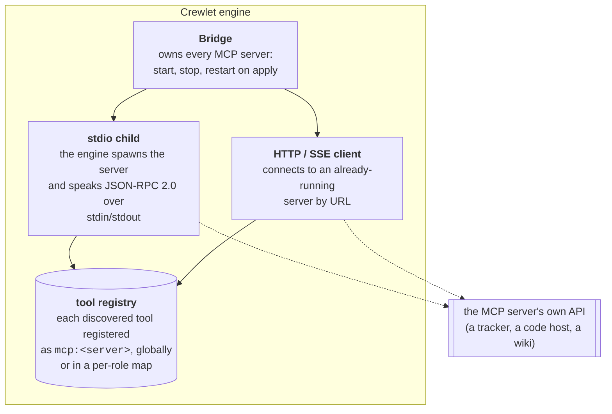

# Tools & MCP Integration

Agents interact with external systems and internal engine operations through tools. Crewlet supports both built-in tools and dynamically discovered MCP tools.

---

## Built-in Tools

The engine registers these into each epoch's tool registry with the origin `builtin`. A tool whose dependency is absent (no store, no knowledge backend, no sandbox) is omitted rather than registered and broken; [Agent Runtime § Built-in Tools](../concepts/agent-runtime.md#built-in-tools) says when each one is registered.

| Tool | Description |
|------|-------------|
| `lookup_colleague` | Resolve any colleague identifier (handle, role name, a human's contact ID) to one seat, case-insensitively, with partial and fuzzy fallbacks; ambiguous queries return the candidate list so the LLM picks rather than guessing. A person the identity directory withholds shows no accounts, and their ids name nobody |
| `reflect_and_persist` | Capture a durable fact in the agent's private diary (`kind`: `long` or `short`) |
| `refresh_memory` | Re-run the personal-memory filter mid-turn after gathering richer context |
| `query_episodes` | Recall the agent's own past turns: by meaning, by conversation, or most recent first |
| `use_skill` | Load one of the agent's own [synthesized skills](../concepts/agent-learning.md#5-synthesizer-skill-induction) on demand |
| `refine_skill` | Replace a synthesized skill's body with a corrected procedure; the previous version is kept |
| `mark_onboarded` | Stamp the agent's onboarding marker after reading the relevant onboarding pages (offered to the onboarding pass) |
| `a2a_ask` | Ask one AI colleague one question over the private A2A channel (see [Turn Engine § Colleague-surface tools](../concepts/turn-engine.md#colleague-surface-tools)) |
| `search_knowledge` | Re-run the shared-knowledge search mid-turn, once the agent knows what the task actually needs. `mode` picks the ranking — `hybrid` by default, `keyword` or `semantic` (see [Search](search.md#three-modes-and-what-an-answer-says-it-served)) — and an answer ranked other than it was asked says so in a sentence: a `semantic` search with nothing to rank by meaning runs nothing, and says that tells the seat nothing about whether a page exists. Registered wherever the company has a knowledge backend at all |
| `load_tool_skill` | Load the full body of a [Tool Skill](../concepts/tool-skills.md) by key |
| `run_sandbox` | Hand a code task to a coding agent in a [sandbox](../concepts/code-sandbox.md) |

`delegate`, the tool that hands work to short-lived [workers](../concepts/turn-engine.md#workers), is not registered here: it is built per turn for the executor, because it carries that turn's grant.

### The native tracker and knowledge base

Nineteen more, registered **only where the company runs the engine's own backends**
(`tracker.backend: native` / `knowledge.backend: native`, which are the
defaults). A company on Jira and Confluence gets none of them, and that is the
point: a seat offered a tool against a tracker its company does not run would
reach for it and fail at the call, and a model shown a tool that always fails
learns to distrust the whole catalogue. The thirteen below are the item and page
tools; the other six read the catalogue, the projects and the activity feed,
and [The Work Tracker](work-tracker.md#what-a-seat-can-do) lists the tracker's
fourteen in full.

| Tool | Description |
|------|-------------|
| `list_work_items` | The board, filtered — what you are assigned, what is open in a project, whether something was already filed |
| `get_work_item` | One item's description, thread, history and links, by key or id |
| `create_work_item` | File one. `project` defaults to the seat's own unit's, and is required when the unit owns none. `status` says where it starts (default `todo`). With no `assignee` it goes to the project's default assignee, else to triage for the lead, and the answer's `assignee` says which. `ask` (with an optional `decision`) files it as a question to that person, in one record |
| `update_work_item` | Move it — status, assignee (with an optional `reason` the new assignee reads), priority, labels, links, one checklist change — with an optional `if_match` that refuses on a concurrent edit |
| `comment_on_work_item` | Post to the thread. Mentions wake the seats they name; the turn's own key makes a re-run turn post once. `ask` puts a question to somebody and `decision` structures it as options; `answers` with `choice` answers one |
| `merge_work_item` | Fold a duplicate into the item that survives — linked, its subtasks re-parented, and closed as `cancelled` |
| `move_work_item` | Move a top-level item and its subtasks to another project, re-keyed there with the old keys still resolving — the project lead's, as a re-route is |
| `search_work_items` | Find an item by what it says, ranked over titles and descriptions. `mode` picks the ranking as `search_knowledge`'s does — `hybrid` by default, `keyword` or `semantic` — and the answer names the mode it served, with a `degraded` sentence when that is not the one asked for |
| `list_pages` | Browse the knowledge base by container, parent or title |
| `get_page` | One page's body, breadcrumb, children and history |
| `write_page` | Create one. Titles are addresses and are unique per container; a body links another page by id, `[its title](#/knowledge/pages/<page id>)`, which is what "Linked from" reads |
| `save_page` | Edit one, stating the version you read — there is no per-field merge that makes overwriting prose safe |
| `comment_on_page` | Remark on a page, or replace one of your own with `edit` |

The writes on each side count as a **delivery** for the turn's own
did-this-reach-anybody gate, and each waits for its own write to reach this
node's projection before answering — so a turn that files an item and then
lists the project sees what it just filed.

Every write answers with its `outcome` — `applied`, `pending` or `unknown`, the
[three values every write has](replication.md#a-write-has-three-outcomes) — and
the `position` it is durable at. A write whose outcome is **unknown** is never
answered with the id, key, version or revision of something that may not
exist, on any write tool on either surface: the call fails, saying that the
write may have landed and may not, under which operation, and what to do. That
includes `create_work_item`, whose unknown answer names the key this attempt
minted, if it minted one, as the key the item has *if* it was filed — never as
a receipt — and a comment, whose id, mentions and ask are not reported beside
a remark nobody can say was posted. An `update_work_item` whose change is
unknown writes none of the dependency changes it was also asked for: it stops
there, and the same call made again answers the change first and writes them
after. And the `version` an update answers with is always the item's own and
its newest — the one to send back as `if_match` — never another item's that
the same call wrote, and never one its own dependency change has already moved
the item past, when a call changes both; its `position` is likewise the call's
last write, so waiting for it waits for all of them.

Where this node's operation ledger cannot vouch for the operation — it was
minted before the ledger may have lost rows, a seat woken by a backlog trigger
just after its node adopted a snapshot — the answer says this node cannot
tell, because the same operation asked here answers the same way until the
write reaches this node, and tells the caller to look before writing it again;
a gesture that stopped part of the way through at such a step is not told to
repeat itself either. A seat's own write under a plain lost acknowledgement is
told to repeat the call with exactly the same arguments, before any different
call to the same tool — that is the same operation, and it lands once.
Reworded, it is a new one. Where the ledger cannot vouch for it, that same
repeat is still safe — it publishes nothing this node cannot vouch for — but it
answers the same way until the write reaches this node, so looking says sooner.
The two writes that state a whole value rather than change one —
`write_project` and `write_work_catalogue` — say instead that repeating them is
harmless: each call is a new operation stating the same thing.

A create or an update that declares its labels first (`labels_create_missing`)
and cannot tell whether that declaration landed stops there too, and is
answered under its own name as the write it did *not* make — the item not
filed, the change not made — because the declaration comes before the item's
own write. The same call made again answers the declaration and then makes the
write, once; where this node's ledger cannot vouch for the declaration, the
answer says to declare the tags with `write_project` first, which is harmless
if they already landed, and then to make the same call — and says what that
call will do. Its own write dates from the same instant as the declaration, so
this node cannot vouch for it either: it answers with the item an earlier
attempt filed, or the change this node still holds a record of, and otherwise
answers `unknown` again, which then means looking for the write
(`list_work_items`, `get_work_item`) rather than making it another way — or,
from the operator's surface, making the same call with its `op_id` through
another node whose ledger reaches back that far.

The same tools are served to **your** AI assistant over
[`/operator/mcp`](../reference/api-endpoints.md#operatormcp--your-own-assistant),
and eleven more beside them that no seat is given: the saved views, the
catalogue write, a person's own queue, inbox and pins, the trash, and the board
drag. Each call is decided by the same authority table a seat's is, and each
write is attributed to who the request is, never to a name the caller chooses:
a person whose credential the identity directory binds to a seat writes **as
that seat**, with kind `human`, and a credential nobody is bound through writes
under its own login (`token:<id>`), with kind `operator` — the credential
itself is recorded beside either as the write's `operator_id`. Five more are a
person's decisions about the company rather than its work, and are served only
there too: `pause_seat` and `resume_seat`, and `steer_turn` (a note to a
running turn, decided once a probe of the fleet names the turn's seat — a
probe nobody answers is `unavailable`), each for the seat's holder, its lead
or a `fleet:operate` holder; `answer_run`, for the person who asked the parked
coding run its question or a lead of its seat; and `answer_knowledge`, which
asks the company's knowledge a question on the auxiliary model of the asker's
seat, so it needs `state:read` **and** a credential bound to a seat. That set
is ONE operator catalogue, built for every call from what the node runs now,
and every operator transport serves it — MCP at `/operator/mcp` and the
dashboard's [`/operator/act`](../reference/api-endpoints.md#operatoract--the-dashboards-write-surface)
— so what a person can do is the same whichever way they reach the company.
The MCP transport is **stateless**: every call is decided by the credential of
the request carrying it, never by the one that opened a session, so a grant
withdrawn mid-conversation stops the next call and an `Mcp-Session-Id` is a
handle rather than a proof.

Over MCP, each tracker write's answer also carries the **`op_id`** of the
operation the call was, and the write tools take it back as an argument: an
assistant has no turn to repeat, so sending the same call with that `op_id` is
how it finishes a write that came back `unknown` or stopped part of the way
through, instead of filing it twice. An `op_id` is that one call and no other:
it carries a digest of the call's arguments, and brought back with any other
argument, or to another tool, it is refused before anything is written. A seat
is never offered the argument — its turn is its identity — and a seat's call
that sends one is refused. The dashboard's transport,
[`/operator/act`](../reference/api-endpoints.md#operatoract--the-dashboards-write-surface),
takes the operation in an `Idempotency-Key` header instead, and refuses a
write without one (`400 op_id_invalid`, naming the header) and an `op_id`
argument beside it: the key is scoped to the principal that sent it, so a
retry is the same request sent again with the same key, and a key somebody
else learned names a different operation for them.

Note the deliberate split between personal and shared writes: `reflect_and_persist` is **personal-only** (it writes to the agent's private `agent_diary`), while team-shared content is a knowledge-base page — `write_page` on the native backend, or the vendor's own MCP tools on Confluence (see [Knowledge System](../concepts/knowledge-system.md)). `use_skill` resolves the agent's own synthesized skills; shared procedures are knowledge-base pages.

**On a vendor tracker there are still no task builtins.** `create_task`,
`assign_task`, `update_task` and `list_tasks` are not registered against Jira
or GitLab issues — an agent works those through the vendor's own MCP tools, so
the engine mirrors no state it would have to keep in step. See
[The Tracker](../concepts/task-engine.md).

### Per-Role MCP Servers (GitHub)

Roles with GitHub credentials in `mcp_env.github` get a per-role instance of the [remote GitHub MCP server](https://github.com/github/github-mcp-server) (declared as a `shared: false` `http` entry in `mcp_servers`), giving them the full GitHub toolset for reading/reviewing/tracking code (issues, PRs, repos, code search, actions); code authoring goes through the [code sandbox](../concepts/code-sandbox.md). See [GitHub Integration](../integrations/github.md).

### Where a tool comes from

Every registered tool records **who registered it**, and that is recorded at
registration because it cannot be recovered afterwards: a tool an MCP server
serves is structurally identical to one the engine ships — same name, same
schema, same call signature. With nothing recorded, a tool missing because its
server failed to start reads as a missing builtin, which sends an operator to
debug the wrong subsystem.

`GET /tools` reports it as each tool's `source`, and the dashboard's **Settings › Tools & MCP** screen
groups on it:

| `source` | Where the tool came from |
|---|---|
| `builtin` | Shipped by the engine. The agent-to-agent tools are builtins too — `a2a_ask` is registered by the same walk, so "a2a" is a capability rather than an origin |
| `mcp:<server>` | Discovered on an MCP server. `<server>` is the **bare** template name, never the per-role instance: two seats' children of one template are the same integration to a reader grouping the catalogue |

Those two are the whole grammar. A server that fails to start is visible as a
**missing group**, rather than its tools quietly going absent from the builtins —
and, above the catalogue on the same screen, as a row of its own: every node
re-publishes what its MCP starts concluded on its presence heartbeat (per
server, its instances counted), so **MCP servers** shows each server as
*Running*, *Partly failing*, *Failing*, *Not started* or *Not reported* with one
cell per live node and the first failure's reason and seat (`GET /mcp-servers`,
which takes `config:read` because it shows each server's configured launch,
as `/config` does; the heartbeat carries each reason bounded, and the whole
text is the node's `mcp_server_failed` log line). Clicking a server opens its own page:
its state, reach and launch, every node's reason as the node reported it rather
than clamped to the grid's two lines, and the catalogue narrowed to its tools —
which, for a server that never started, says it registered none and why.

### Adding a server from the dashboard

**Add an MCP server** on Settings › Tools & MCP (`config:write`) writes
the same `mcp_servers` entry you would write in YAML: a name, a command and its
arguments (stdio) or an address (http), `shared` or one per seat, and the
environment or headers — values as `${NAME}` pointers into the secret store,
which the form offers as you type `$`. It checks the whole company with the
server in it before storing, and adds it after every server already declared.
A name the configuration already carries is refused; a name only a node still
runs, from a revision it has not applied past yet, is free: the create is
judged against the configuration alone.
Over the API it is `PUT /config/mcp-servers/{name}` with `If-None-Match: *` —
see [configure via the API](configure-via-api.md). A per-seat server still needs
a seat to declare credentials for it under `mcp_env`, which is written in the
org builder.

### What a tool can do

Beside the origin, every catalogue row carries the **behavioural hints** the
tool was registered with — what an MCP server advertised, plus whatever an
operator overrode on top — and where calling it lands:

| Field | What it says |
|---|---|
| `annotations.read_only` | The tool modifies no state |
| `annotations.destructive` | The tool may perform irreversible updates |
| `annotations.idempotent` | Repeat calls have no additional effect |
| `annotations.open_world` | The tool reaches entities outside the local system |
| `delivers` | **Where** a call puts something in front of somebody outside the turn — empty for a tool that reaches nobody |

**Each hint is three-valued** — `yes`, `no`, `unknown` — and `unknown` is a
first-class answer, not a soft `no`: it means the server did not advertise the
hint at all. The engine reads them that way everywhere. An unannotated tool is
**not** a known read, because treating unknown as read-only would exempt most
of a fresh server from the [delivery fence](../concepts/turn-engine.md) the
moment it is added.

`delivers` is not "was this served by MCP". A proven read-only MCP tool
delivers nowhere, and the engine's own work-item comment tool delivers although
it is a builtin — the surface is a first-party declaration made at
registration, and for an MCP tool it is the **server**, because nothing else
about it says where its call lands.

The **Tools** screen renders all of this: the strongest thing a tool's hints
positively assert, whether it reaches outside the company, where it delivers,
and how many arguments its schema declares. A tool whose server advertised
nothing shows as `unknown` rather than as a read — which is the row to check
before granting a seat a new server.

### When a tool refuses

A tool that cannot do what it was asked answers with a **failed result** rather
than an error: the turn is fine, this call is not, and the sentence goes back to
the model so it can try again with a better argument. That sentence is written
for a model and tuned against how models behave, so it is not a contract anybody
else can parse.

The engine's **own** tools therefore also say what *kind* of refusal it was — a
machine-readable class beside the sentence, which is what a surface that is not
a model acts on:

| Class | What it means | What a caller should do |
|---|---|---|
| `invalid` | An argument is wrong, and the sentence names which | Send something different |
| `not_found` | The item, page, skill or colleague the call is *about* does not exist | Stop; it is gone or was never there |
| `forbidden` | This caller may not do this here — outside a turn, somebody else's inbox or priorities, a view protected for its owner, a project's policy without the lead's authority, a reserved container | Ask whoever the sentence names |
| `stale_version` | The object changed after the caller read it | Read it again and decide from what it says now |
| `conflict` | The write lost its race to other writers, or the object's state moved under it | Read it again; a retry may land |
| `exists` | What the call would create is already there | Edit the existing one |
| `already_answered` | The question this answers has an answer | Read the answer |
| `reassignment_budget` | The item has been handed on as often as it may be | Do not reassign it again |
| `inbox_full` | A person's inbox list is at its ceiling | Mark older entries read |
| `not_running` | The run or turn the call addresses is not running, or not waiting for this | Nothing to act on |
| `steer_unsupported` | The running turn's runtime cannot take a note mid-turn | Wait for the turn to end |
| `budget_exhausted` | The company's token budget has no room left in one of its windows, so a call that would spend tokens was not made; nothing was spent | Wait for the window the sentence names to turn over, or raise its ceiling |
| `unavailable` | This node cannot serve the call right now, or the company does not run what it needs — the node is behind its log, the log refused the read or the append (a maintenance or sealed fleet included), the coordination store did not answer, the event broker did not answer or this node's connection to it is reconnecting, this node's store was busy with other writes, the backend is not configured. A **condition**, which waiting clears. **Never** "it does not exist" | Retry, or use the backend the company does run |
| `peer_upgrading` | A node in the fleet is too old to carry this gesture | Retry after the rolling upgrade |
| `internal_error` | This node failed at something of its own — a read of its own store that broke. Nothing about the call was wrong, and waiting does **not** clear it; the sentence is fixed and the error itself is in the node's log, never in the answer | Tell whoever runs the node; a retry fails the same way |

An argument that merely *names* something missing — a `parent`, a `waiting_on`
item, an `assignee` nobody has — is `invalid`, not `not_found`: the fix is the
argument, and the call is not about that object.

**`invalid` is claimed, never assumed.** A write the work tracker refuses on
what it was asked — a field value it will not round, a tombstoned item, a cap
the object would pass — is marked as such where the refusal is written. Any
failure that is *not* marked is read as the node's, in one of two ways: a
condition waiting clears — the log refused the append, the coordination store
or the event broker did not answer, this node's store was busy with other
writes — is `unavailable`, and a fault of the node's own — a read of
its own store that broke — is `internal_error`. So a person is never told to
change an input that was never wrong, and never invited to retry against a
store that will fail the same way until somebody fixes it.

**A call refused before any tool ran is classed too.** A tool name nothing
registered is `not_found`; a real tool this phase was not offered, or one a
skill guard holds back until its skill is loaded, is `forbidden`.

**An MCP server's failure carries no class.** Its prose is the server's, and
the engine will not guess a class from text it did not write; a reader that
needs one treats an unclassified failure as the server's own. A person's
surface answers one — and a first-party tool that failed without a class — as
`internal_error`: neither has a remedy the caller can apply.

---

## Extending the engine

There is no plugin API and no runtime loading. Crewlet ships as one
binary, and nothing under `internal/` is importable from outside the module —
so an extension cannot be a library the engine loads.

**The extension point is MCP**, deliberately. A tool server is a separate
process (or a remote URL), it carries its own credentials, it can be written in
any language, and a server that crashes takes down a tool group rather than the
engine. Everything above about `mcp_servers` is that surface.

Two things MCP does not cover, and what to do instead:

- **A new chat or tracker third-party app.** Routing an inbound delivery to a seat needs
  a parser, and that is an in-tree Go interface — the
  [notification spine](../concepts/event-system.md) is backend-neutral by
  design, but a third-party app contributes a client, a parser and a transport as code.
  That is a pull request, not a config entry. The eight this build serves are
  [Mattermost](../integrations/mattermost.md), [Slack](../integrations/slack.md),
  [Jira](../integrations/jira.md), [Confluence](../integrations/confluence.md),
  [GitLab](../integrations/gitlab.md), [GitHub](../integrations/github.md) and
  [Datadog](../integrations/datadog.md), plus Atlassian's own Forge relay —
  every one of them routes end to end. A config block the engine cannot honour
  is refused rather than ignored, because a silently dropped integration block
  looks exactly like one that is working until somebody notices the messages
  never arrived.
- **Company-wide periodic work.** An MCP server is called by an agent; it does
  not get a tick of its own. Schedule it as [cron work](../concepts/scheduling.md)
  against a seat, which gives it an agent, a turn, and the engine's own
  at-most-once delivery across a fleet — rather than a loop that would run once
  per node.

---

## MCP Integration

Instead of building hardcoded API wrappers for external tools (Jira, Slack, Confluence, GitHub, etc.), Crewlet uses the **Model Context Protocol (MCP)** for dynamic tool discovery. This gives agents access to the full capabilities of external tools — not just a curated subset.

### Architecture


```mermaid
flowchart TD
    subgraph ENGINE["Crewlet engine"]
        BRIDGE["<b>Bridge</b><br/>owns every MCP server:<br/>start, stop, restart on apply"]
        STDIO["<b>stdio child</b><br/>the engine spawns the server<br/>and speaks JSON-RPC 2.0 over<br/>stdin/stdout"]
        HTTP["<b>HTTP / SSE client</b><br/>connects to an already-running<br/>server by URL"]
        REG[("<b>tool registry</b><br/>each discovered tool registered<br/>as <code>mcp:&lt;server&gt;</code>, globally<br/>or in a per-role map")]
        BRIDGE --> STDIO
        BRIDGE --> HTTP
        STDIO --> REG
        HTTP --> REG
    end
    SERVER[["the MCP server's own API<br/>(a tracker, a code host, a wiki)"]]
    STDIO -.-> SERVER
    HTTP -.-> SERVER
```

A stdio server is a process **tree**, not a process: `npx` execs a launcher that
execs the real server, so the engine puts each child in its own process group
and signals the group. Killing only the pid it spawned leaves the grandchild
holding the credentials and the port.

### Two Transport Modes

1. **Stdio (Crewlet launches the server)** — The engine spawns MCP servers as child processes (e.g., `npx @anthropic/mcp-atlassian`). Crewlet manages the full lifecycle: start on engine boot, stop on shutdown. Communication uses JSON-RPC 2.0 over stdin/stdout.

2. **HTTP/SSE (externally provided)** — The engine connects to an already-running MCP server via URL. Supports JSON and SSE response modes with automatic session management and reconnection.

### Handshake and server diagnostics

On connect the engine (identifying itself as `crewlet` in the handshake) negotiates the newest protocol the server speaks: it probes the modern `server/discover` method first and falls back to the legacy `initialize` handshake automatically. Servers built on older MCP SDKs may log a one-time "unknown method" warning when they see the probe — harmless, and it stays out of your console because of the rule below.

A stdio server's **stderr is never passed through raw**. Every line the child process writes (startup banners, tracebacks, that probe warning) becomes a structured `server_stderr` DEBUG event attributed to the server, instead of foreign log lines interleaving with the engine's own stream. When a server fails to start, the last lines it wrote are surfaced with the failure as a single `server_stderr_tail` ERROR event — that tail usually names the real cause (bad token, missing binary, import error). Run with `-debug` to watch a server's full stderr live.

---

## Per-agent identity

Each Role names its per-server credentials directly in `mcp_env`, so every agent authenticates as itself in external tools. The engine applies these as **env vars** for `stdio` servers and **HTTP headers** for `http` servers — it stays tool-agnostic, reading only `mcp_env` (and, for the Slack transport, `integrations.slack`):

```yaml
roles:
  - name: Senior Engineer
    integrations:                          # per-agent transport identity (inbound webhook
      slack:                               #   verification + the working indicator)
        bot_token: "${ALICE_SLACK_BOT}"
        signing_secret: "${ALICE_SLACK_SIGNING}"
    mcp_env:
      atlassian:
        JIRA_USERNAME: "${ALICE_JIRA_USER}"
        JIRA_API_TOKEN: "${ALICE_JIRA_TOKEN}"
      slack:
        SLACK_MCP_XOXB_TOKEN: "${ALICE_SLACK_BOT}"   # same token, the Slack MCP subprocess
      github:
        Authorization: "Bearer ${ALICE_GH_TOKEN}"
```

A Slack-enabled agent names its bot token in **both** `role.integrations.slack.bot_token` and `role.mcp_env.slack.SLACK_MCP_XOXB_TOKEN`: the two are different consumers — the notification transport vs. the Slack MCP subprocess — and both reference the same `${VAR}`, so no secret is duplicated. The Atlassian token (`JIRA_API_TOKEN` / `CONFLUENCE_API_TOKEN`) and the GitHub PAT (`Authorization: Bearer …`) likewise live wherever the consuming MCP server reads them.

When the engine launches a per-role MCP server instance, it merges the base server config with the role's `mcp_env` (applied as **env vars** for `stdio` servers, **HTTP headers** for `http` servers).

### Per-Unit Config

A unit declares its tracker project and knowledge container *identity* under `project` / `space` (used for inbound webhook routing and as the team's write home; not a tool credential, and it does not scope knowledge reads). The two keys are vendor-neutral: they name a native project and container, or a Jira project and a Confluence space, depending on which backends the company runs. Real per-agent tool credentials still live in `mcp_env`, which the unit's direct agent seats inherit:

```yaml
units:
  - name: Backend
    id: backend                     # the unit's key; `name` above is display
    type: team
    lead: tech-lead                 # the lead seat's handle
    project: "BACK"                 # the unit's tracker project (integration identity)
    mcp_env:
      atlassian:
        JIRA_URL: "${JIRA_URL}"     # shared by the whole unit
    roles:
      - name: Tech Lead
        mcp_env:
          atlassian: { JIRA_API_TOKEN: "${TL_JIRA_TOKEN}" }
      - name: Engineer
        mcp_env:
          atlassian: { JIRA_API_TOKEN: "${ENG_JIRA_TOKEN}" }
```

Inheritance: the unit's `mcp_env` is the base and a seat's own values override it variable by variable, so a seat that sets one variable of a server keeps the unit's other variables for that server. Only the unit's **direct agent** seats inherit it. A child unit inherits nothing (it declares its own block), and a human seat inherits nothing, because a human seat runs no tools and may not carry an `mcp_env`. The unit's `project` / `space` identity is separate from these credentials.

---

## Shared vs per-role servers

`shared:` decides which of two quite different things a server is, and the
difference is a lifetime as much as a scope.

| | `shared: true` (default) | `shared: false` |
|---|---|---|
| What it is | One child for the company | A **template**: one child per role that declares credentials for it |
| Whose identity | Nobody's — it carries no seat's credentials | That seat's, from `role.mcp_env[name]` |
| Who can call it | Every seat | Only the seat whose child it is |
| Lifetime | The config **epoch** — started on apply, replaced on the next one | The seat's **lease** — spawned when this node claims the seat, killed when it releases it, and reconciled in place when the org chart changes what the seat declares |
| Use it for | A shared knowledge base, a read-only reference server | A tracker, a chat backend, a code host — anywhere the action must be attributable to *this* agent |

**A shared `mcp_servers` edit takes effect on the next turn, not at the next
restart.** Applying a revision reconciles the shared bridge server by server: an
entry that did not change is left alone, and one that was added, removed or
re-pointed starts, stops or restarts **only that child**. A seat mid-turn
finishes on the tool surface it started with, and its next turn renders the new
one, the same next-turn promise [tool skills](../concepts/tool-skills.md),
embeddings and the org chart make.

**A per-role `mcp_env` edit takes effect on the next turn too, and it is not a
config apply at all.** A seat's `mcp_env` is content on the
[org chart's own log](../concepts/chart-domain.md), so changing one publishes a
company without any revision in it — and the node holding that seat reconciles
its children in place, as the `seat_tools` step of
[the convergence](../concepts/configuration.md#what-follows-a-published-company):
a server the chart no longer declares for the seat is retired, one it now
declares is started, and one it still declares is neither stopped nor
restarted, so the credential re-handshake a restart would cost is paid only by
what actually changed. The seat keeps its lease throughout. A change to a
shared `mcp_servers` template is the apply's own reconcile above; what an apply
does for a held seat is rebuild the catalogue its turns are built against (its
builtins and the shared servers), which is the half that goes stale on a new
epoch.

**A per-role child belongs to a seat, not to a node.** In a fleet each node
claims a slice of the company, and it spawns children only for the seats it
holds — so the company's processes are spread across the fleet rather than run
N times over. It also means a seat that moves to a peer takes its identity with
it: the credentials in a child *are* that seat, and one left running after the
lease moved would let the old node keep acting as an agent it no longer serves.

**Each seat gets its own surface**, and that is a correctness property rather
than tidiness. Two children of one template publish the *same tool names*, so a
single shared catalogue would keep whichever registered last and hand it to
everyone — every seat calling one child, acting under one agent's identity in
the tracker, invisibly, because the call looks identical from the engine's
side. A claimed seat therefore gets its own registry (the company's catalogue
plus its own children's tools) and its own bridge (holding only its own
children).

**A seat that declares no `mcp_env` for a template gets no child.** A template
with nobody's identity in it is a server nobody can act through, and offering
its tools anyway would put entries in the prompt whose every call fails
authentication.

**A server that will not start costs its own tools and nothing else.** The seat
keeps its builtins, the other servers keep working, and the operator sees that
server's **group missing** from the Tools room — which points at the right
subsystem, where builtins quietly shrinking would not. It is logged as
`mcp_server_failed` with the reason. Failing the apply instead would take a
working company offline because one vendor's binary was absent from an image.

---

## YAML Configuration

**All** tool servers go in `mcp_servers` — including the Jira/Confluence (`atlassian`), Slack, and GitHub servers. The `integrations.jira` / `.confluence` / `.slack` / `.github` sections carry only non-tool config (admin credentials, webhook secrets) — MCP servers are never declared there. Per-agent identity comes from `role.mcp_env[name]` — env vars for `stdio` servers, HTTP headers for `http` servers:

```yaml
mcp_servers:
  # stdio, shared by all agents
  - name: tavily
    command: npm
    args: ["exec", "--yes", "--", "tavily-mcp@latest"]
    env: { TAVILY_API_KEY: "${TAVILY_API_KEY}" }
  # stdio, per-role (Jira + Confluence share one mcp-atlassian)
  - name: atlassian
    shared: false
    command: uvx
    args: ["mcp-atlassian"]
    env: { JIRA_URL: "https://mycompany.atlassian.net" }
  # stdio, per-role Slack
  - name: slack
    shared: false
    command: npm
    args: ["exec", "--yes", "--", "slack-mcp-server@latest", "--transport", "stdio"]
    tool_prefix: "slack_"
  # http, per-role remote GitHub MCP (token supplied per agent)
  - name: github
    transport: http
    shared: false
    url: "https://api.githubcopilot.com/mcp/"

roles:
  - name: Senior Engineer
    integrations:
      slack: { bot_token: "${ALICE_SLACK_BOT}", signing_secret: "${ALICE_SLACK_SIGNING}" }
    mcp_env:
      atlassian: { JIRA_API_TOKEN: "${ALICE_JIRA_TOKEN}" }
      slack:     { SLACK_MCP_XOXB_TOKEN: "${ALICE_SLACK_BOT}" }
      github:    { Authorization: "Bearer ${ALICE_GH_TOKEN}" }
```

Environment variables and HTTP header values support `${VAR}` references — both whole-value (`"${TOKEN}"`) and embedded (`"Bearer ${TOKEN}"`) — so secrets stay out of config files. A reference resolves from the [secret store](../concepts/secret-store.md) first and the engine's process environment behind it, when the engine builds the server — so the value is baked into the running child's environment or its connection's headers, and a rotation reaches it only when that server is rebuilt (see [Secret Store § Propagation](../concepts/secret-store.md#propagation) for which gesture rebuilds which child).

### What a stdio server's environment is

A stdio server is handed an **explicit** environment, never the engine's own. The engine's environment is where Tier A's `${VAR}` references resolve from — the keyring that signs every session cookie and state-log record, every `api.auth.tokens` value, any credential in an external `stream.url` — and where the engine reads its collector credential (`OTEL_EXPORTER_OTLP_HEADERS`), often beside an operator's own provisioning tokens (`GITLAB_ADMIN_TOKEN`, `MATTERMOST_ADMIN_TOKEN`); a tool server pulled off a package registry has no business holding any of it: a server that logs its environment on a crash, forwards it to its own children or reports it in telemetry would carry it off. So a child gets exactly these layers, the last winning:

| Layer | What | Why |
|---|---|---|
| The host allowlist | `PATH`, the locale (`LANG`, `LANGUAGE`, `LC_ALL`, `LC_CTYPE`, `LC_NUMERIC`), `TERM`, `TZ`, the TLS trust variables (`SSL_CERT_FILE`, `SSL_CERT_DIR`, `REQUESTS_CA_BUNDLE`, `CURL_CA_BUNDLE`, `NODE_EXTRA_CA_CERTS`) and the proxy variables (`HTTP_PROXY`, `HTTPS_PROXY`, `ALL_PROXY`, `NO_PROXY`, `http_proxy`, `https_proxy`, `all_proxy`, `no_proxy`) | What a process needs to run at all. It is the same list every child the engine starts is handed — a coding CLI and a local sandbox get it too |
| The engine user's locations | `HOME`, `USER`, `LOGNAME`, `TMPDIR` and the XDG base directories (`XDG_CONFIG_HOME`, `XDG_CACHE_HOME`, `XDG_DATA_HOME`, `XDG_STATE_HOME`, `XDG_RUNTIME_DIR`) | A server launched through `npx` or `uvx` runs as the engine's user and keeps its package cache under that user's `HOME` |
| A container runtime's own settings — **only** when the server's `command` is `docker` or `podman` | Every `DOCKER_*`, `CONTAINER_*`, `CONTAINERS_*` and `PODMAN_*` variable, `REGISTRY_AUTH_FILE` and `DBUS_SESSION_BUS_ADDRESS` | A server published as an image (`command: docker`, `args: ["run", "-i", "--rm", …]`) *is* the runtime's CLI, and a rootless runtime finds its daemon through `DOCKER_HOST`: without it the CLI dials the system socket and fails at the daemon with a permission error that names nothing you set. It is the same rule the [local sandbox](../concepts/code-sandbox.md) drives the runtime with. What the image itself receives is what `args` passes it — a bare `-e NAME` there copies `NAME` from this environment, so name it in `env:` |
| What the config declares | The server's `env:`, then the seat's `mcp_env` for it, which wins variable by variable | The server's settings and its identity, resolved as above |

**Anything else a server reads is declared.** A server that reads a variable the table does not carry — a vendor SDK's conventional key, a private registry's `NPM_CONFIG_REGISTRY`, an `LD_LIBRARY_PATH` its runtime needs — gets it by naming it in `env:`, and a `${VAR}` reference there is how the host's own value is passed through:

```yaml
mcp_servers:
  - name: search
    command: npx
    args: ["-y", "some-search-mcp"]
    env:
      SEARCH_API_KEY: "${SEARCH_API_KEY}"          # the store, then the host
      NPM_CONFIG_REGISTRY: "${NPM_CONFIG_REGISTRY}" # a host setting, passed on by name
```

A server that worked by reading an undeclared variable out of the engine's environment fails to authenticate or to install until that line is added, and its own last words on stderr — surfaced as `server_stderr_tail` — usually name the variable.

**This is not isolation, and it does not claim to be.** The server runs as the engine's user, so it can read whatever that user can: the Tier A file and the engine's own `/proc/<pid>/environ` among it. What the explicit environment removes is the engine *handing* its secrets to code that never asked for them. Keeping a server you do not trust away from them takes a different user or a container around the server itself — and, since declaring a stdio server is running its `command` on every engine host that runs seats, `config:write` is a grant to give as you would give shell on those hosts (see [Grants](../concepts/identity-and-access.md#grants-the-eleven-things-there-are-to-allow)).

### Tool annotation overrides

The engine derives some behaviour from a tool's [capabilities](../concepts/tool-capabilities.md) — for example, the worker guard denies tools that write to a shared surface, classified from the MCP `readOnlyHint` / `destructiveHint` / `openWorldHint` annotations the server advertises. Most servers advertise these; for one that doesn't, supply them per server via `tool_annotations` (keyed by bare tool name):

```yaml
mcp_servers:
  - name: linear
    command: uvx
    args: ["mcp-linear"]
    tool_annotations:
      linear_create_comment: { read_only: false, open_world: true }
      linear_get_issue:      { read_only: true }
```

Keys accept snake_case (`read_only`) or the MCP camelCase (`readOnlyHint`); overrides win over whatever the server advertised. Because every tool server is now an `mcp_servers` entry — including `atlassian`, `slack`, and `github` — `tool_annotations` is declared there for all of them. This is the *only* place tool names appear in config for behaviour purposes — the engine itself never hardcodes them. See [Tool Capabilities](../concepts/tool-capabilities.md) for the full mechanism.

---

## How Tool Calls Work

From the LLM's perspective, builtin tools and MCP tools are identical — both appear as JSON schema tool definitions. The model does not know whether a tool is a function inside the engine or an MCP server talking to a tracker.

**Tool resolution order:**

1. **Per-role MCP tools** — checked first (role-specific credentials)
2. **Global tools** — builtin tools + global MCP tools

**Tool output is returned to the LLM in full.** Control characters are stripped, secrets redacted and binary rejected, but results are **never length-truncated**: a truncated result silently hides content the agent reasons over. The same principle applies across the engine: the turn's own trigger text, the turn-start prefetch blocks (personal memory, similar prior work, synthesized skills, counterparty profiles), the tool catalogue and every `list_mcp_server_tools` listing, the draft handed to Review, the agent diary and the conversation ledger as **stored**, coalesced notification digests, and the knowledge-base search query all carry their full text.

**Where a bound is genuinely unavoidable, the engine refuses or says so — it never shortens in silence.** Three shapes, and which one applies is a deliberate choice:

| Shape | Where | Why not just cut it |
|---|---|---|
| **Refuse** | `reflect_and_persist` and `mark_onboarded` notes, `refine_skill` bodies and reasons, a `secrets` value, a Slack app manifest name, a counterparty trait | The value is *stored* and read back later, so half of it is a lasting half-fact. The caller — a model or an operator — can shorten it and retry, and the error names the field and the limit |
| **Say it cut** | a coding run's result, error and transcript (tailed — a crash explains itself at the bottom); an MCP server's stderr tail; a `cli-agent` subprocess's output; error text on an event (`events.ClipDiagnostic`, 64 KiB, head kept); a prior round's produced text and a failed call's result as *rendered* into the prior-work ledger; a conversation's older entries, dropped whole; a config diff; a knowledge snippet; an episode's tool sequence | The full text genuinely cannot travel — an unbounded subprocess, a per-tick fleet read, or an event the queue would REFUSE, which costs the operator the whole record rather than its tail — so the excerpt carries a marker and, where a reader can go and get the rest, says how |
| **Bound the input, not the output** | the embeddings input (diary writes, similarity-query keys) | The provider has a hard token limit; only the vector's *input* is trimmed, and the stored and displayed text stays complete |

Two rules run through the table. **Bound the render, never the record** — the stored row is usually the only copy, so a cut at write time is not a shortened rendering. And **drop whole units where you can**: an entry, a bullet, a call, never the middle of a sentence.

A cut with none of these properties is a bug, not a budget: a "character budget" on a prompt block is not a ceiling, it is a silent decision about which of the agent's own memories it is allowed to see.

See [Agent Runtime](../concepts/agent-runtime.md) for the full execution loop.
