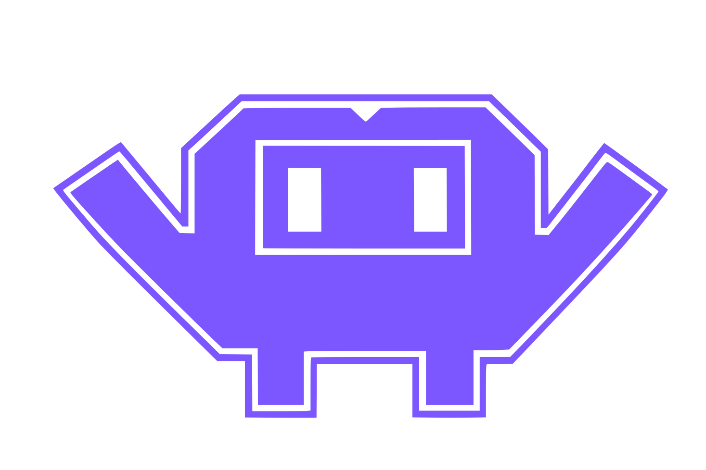

# Crewlet Documentation

Crewlet is an open-source engine for orchestrating hierarchically organized AI
agent companies. It treats the organizational hierarchy as the primary
orchestration structure — knowledge, permissions, communication, and decisions
are all scoped by position in the org chart.

New here? Read in this order: **[Installation](getting-started/installation.md)
→ [Quickstart](getting-started/quickstart.md) →
[Choosing your stack](getting-started/choosing-your-stack.md)**, then dip into
the concept pages for the subsystems you touch.

Rather not write the YAML by hand? An AI assistant can interview you and
author it — see
**[Authoring with an AI assistant](getting-started/ai-authoring.md)**.

---

## Getting Started

- **[Installation](getting-started/installation.md)** — Install the binary; why there is no infrastructure to bring up, and what the compose profiles are for
- **[Quickstart](getting-started/quickstart.md)** — Build a four-agent company and watch its first turn, with LLM provider options (Anthropic / OpenAI / any OpenAI-compatible)
- **[Choosing Your Stack](getting-started/choosing-your-stack.md)** — The decision guide for every external dependency: the tracker and knowledge base, the code host, the code sandbox, chat, email — what each path sets up for you, and what you must create manually
- **[Authoring with an AI Assistant](getting-started/ai-authoring.md)** — Let an AI write your company config: a step-by-step walkthrough, the `company-architect` skill, `crewlet schema` for editor autocomplete, and the `crewlet validate -json` fix loop
- **[Configuration Reference](getting-started/configuration.md)** — Full YAML config schema and examples

## Core Concepts

How the engine works, one subsystem per page:

- **[Overview](concepts/overview.md)** — The org chart as execution graph, design principles, high-level architecture
- **[Configuration](concepts/configuration.md)** — Two-tier config (ops-owned `crewlet.yaml` + a founder-owned revision in the store), bootstrap sequence, unconfigured state, live propagation, auth, the apply stage by stage, whole-config encryption at rest
- **[Scaling Out](concepts/scaling.md)** — Why one node is the design's degenerate case rather than a lesser path, what a node is (`ingress` / `seats` / `workers`), the five kinds of coupling that had to be resolved and which one a lock actually fixes, what the fleet shares in the coordination slot versus what stays per-node, the measured broker numbers the lease TTL and prefetch cap come from, and what the design does not promise
- **[Coordination](concepts/coordination.md)** — The fleet's shared store and the line between it and the node's own database: the three-valued answer every question here returns, which direction each contract fails in when the store cannot be reached, the slots a fleet is discovered from, why every retention is a bucket's age rather than a per-write TTL, and what stays node-local or per-process on purpose
- **[Seat Ownership](concepts/seat-ownership.md)** — How a fleet decides which node runs which seat, and why no two ever run the same one: TTL leases with epoch fencing, fair-share placement with give-back, the two release modes, freshness-based admission, owner-only inbox and sandbox-control attachment, the durable subscription that holds an unowned seat's mail, the broker settings that must not delete it, and why a wedged-but-alive node ends its own process
- **[Control Plane](concepts/control-plane.md)** — How every node converges on one company config: the shared activation pointer whose own revision is the epoch, the reconcile poll, per-node apply status (`ok` / `error` / `degraded`), the posture a lagging node takes (`serve` / `wait` / `shed` / `isolated` / `stuck`), what a running turn sees through a live apply, and what `/health` and `/ready` report
- **[Secret Store](concepts/secret-store.md)** — The company's encrypted credentials on the coordination KV, read by every node and consulted ahead of the process environment when resolving `${VAR}`: `crewlet secrets set/list/unset/get/rekey`, the `/secrets` API they write through, the `-secret-store` provisioning sink that hands minted credentials straight to the engine, store-wins precedence, and the Tier A root-of-trust boundary
- **[Organization Model](concepts/organization-model.md)** — Hierarchy, departments, teams, roles (seats), handles
- **[Humans in the Org Chart](concepts/humans-in-the-org.md)** — Human seats (`kind: human`): hierarchy membership, contact identities, notify delivery, escalation terminus, prompts and lookup
- **[Agent Runtime](concepts/agent-runtime.md)** — Agent lifecycle, states, execution model, graceful shutdown
- **[Turn Engine](concepts/turn-engine.md)** — Per-agent Plan / Execute / Review loop, sub-agents, colleague-surface tools, per-phase LLM models
- **[Subscription LLM Backends](concepts/subscription-llm-backends.md)** — Run agents on a coding CLI you already subscribe to (Claude Code, Codex, Gemini CLI, OpenCode, …) instead of a metered API key: per-seat state isolation, the in-prompt tool-call channel, `crewlet llm login`, falling back to a key when the window is spent, and the other shape — an OAuth proxy behind an ordinary HTTP entry, and what that moves onto you
- **[Code Sandbox](concepts/code-sandbox.md)** — Sandboxed coding-agent execution: the `run_sandbox` tool, E2B cloud/self-hosted, local boxes (direct or containerised, on a subscription login), Claude Code & OpenCode runners, git-auth recipes, mid-run clarifications
- **[Tool Skills](concepts/tool-skills.md)** — Knowledge-base-sourced prompt fragments (Confluence pages) that teach agents *how to use* each tool / MCP server
- **[Tool Capabilities](concepts/tool-capabilities.md)** — How the engine stays tool-stack agnostic: capability prose + MCP annotations, no hardcoded tool names
- **[Event System](concepts/event-system.md)** — EventQueue, topics, routing, inbox batching, distributed tracing
- **[Task Engine](concepts/task-engine.md)** — why the engine keeps no task state: the PM tool is the source of truth
- **[Scheduling](concepts/scheduling.md)** — Role/unit-scoped cron-style recurring work (standups, audits, nightly jobs)
- **[Knowledge System](concepts/knowledge-system.md)** — Query-time knowledge-base search behind the `knowledge.Searcher` seam (Confluence CQL — one backend per org) + private `agent_diary`
- **[Agent Learning](concepts/agent-learning.md)** — Reflection loop, skill induction, episodic memory, counterparty profiles
- **[Conversation Sessions](concepts/conversation-sessions.md)** — What a seat already said in one Slack thread / issue / pull request, carried into that conversation's next turn: the entry shape and its elision budgets, which turns are recorded, why the key is the conversation and the dedupe is the work key, and why this is a structured ledger rather than a transcript replay
- **[One-on-Ones](concepts/one-on-ones.md)** — Manager↔report coaching as a usage pattern over the scheduler + A2A channels + learning loop
- **[Decision Framework](concepts/decision-framework.md)** — DACI model for multi-agent decisions

## Integrations

Connecting the external surfaces agents work on:

- **[Jira](integrations/jira.md)** — Cloud or Data Center: webhook routing by mention / assignee / watcher / project lead, derived seat account ids, per-role MCP tools, and `crewlet jira provision`
- **[Confluence](integrations/confluence.md)** — Cloud or Data Center as the knowledge base: live CQL search run as the asking seat, page-change routing, tool-skill pages, and `crewlet confluence import`
- **[GitLab](integrations/gitlab.md)** — gitlab.com or self-hosted: API-provisioned per-agent service accounts, `crewlet gitlab provision`, webhook routing, per-role MCP tools, sandbox code authoring
- **[GitHub](integrations/github.md)** — github.com or Enterprise Server: webhook routing by review request / assignment / review verdict / mention, derived seat logins, participant fan-out, organization or per-repository hooks, and `crewlet github provision`
- **[Slack](integrations/slack.md)** — One app per agent: `crewlet slack provision` builds and installs them from a manifest, per-seat webhook routing with thread follows, a text-carrying working indicator, and the Slack MCP tool server
- **[Mattermost](integrations/mattermost.md)** — Self-hosted open-source chat: one bot account per agent, `crewlet mattermost provision`, a websocket event fleet instead of webhooks (no public URL needed), and thread routing

## Guides

- **[Tools & MCP](guides/tools-and-mcp.md)** — Built-in tools, MCP integration, the two-value tool-origin grammar the dashboard groups on, and how you extend a binary that loads no plugins
- **[Deployment](guides/deployment.md)** — The single host, the compose profiles, Pulsar sizing & auth, the event store, tracing, logging (levels, the three formats, colour)
- **[Running a Fleet](guides/fleet.md)** — When to run more than one node, node roles, seat placement, draining and rolling upgrades
- **[Running One Agent Somewhere Else](guides/satellite-nodes.md)** — Put a single seat on a host that can reach what it needs — an internal API, a licensed binary, a GPU, a lab network — without moving the company: what a satellite is, what moves with the seat (its MCP servers above all), what the node still needs outbound, and what a pin costs when the host is down
- **[Configure via API](guides/configure-via-api.md)** — End-to-end curl recipes for bootstrapping a company through `/config/*`

## Reference

- **[CLI](reference/cli.md)** — Command reference
- **[API Endpoints](reference/api-endpoints.md)** — REST API routes and schemas
- **[Dashboard Design System](reference/dashboard-design.md)** — The dashboard's rooms and its visual system: what each room answers that no other one does, how a seat is coloured by what it is doing rather than by who it is, tokens measured against the worst surface they can land on, the shared panel recipe, the validated categorical hues, and the rules a change has to keep
- **[Environment Variables](reference/environment-variables.md)** — All configuration env vars
- **[Design Decisions](reference/design-decisions.md)** — Why certain architectural choices were made
