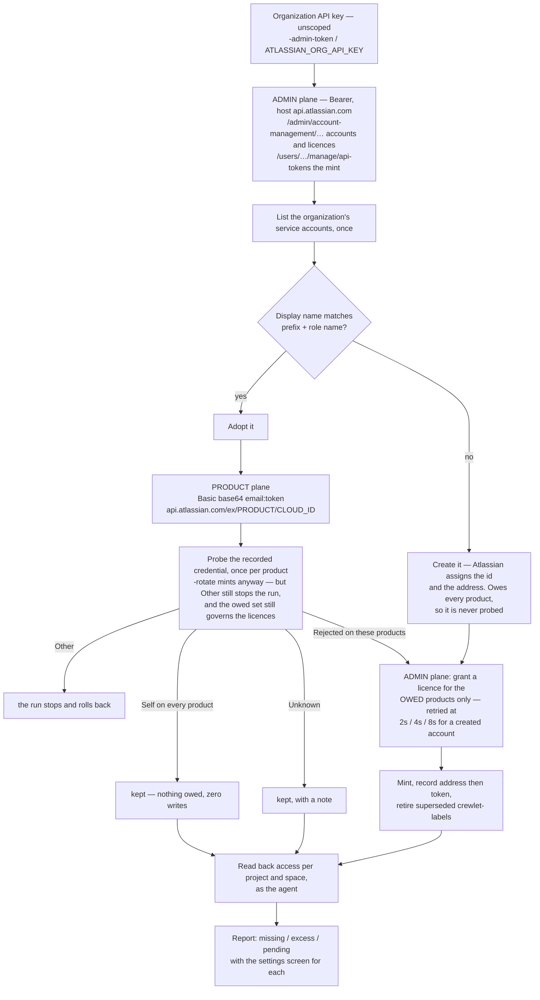

# Atlassian Organization

[Jira](jira.md) and [Confluence](confluence.md) are each one **product**: a webhook edge, a routing tier order, a set of MCP tools, a content format. This page is the **organization** those two sites live in, and the one place per-seat Atlassian identity is created rather than pasted in by hand. `crewlet atlassian provision` gives every agent seat its own Atlassian service account, mints that account's API token into the `${VAR}` the seat's config already references, and grants it a product licence — so an agent is an assignee, a watcher and an `@`-mention target in its own right instead of acting through one shared company account.

That is a correction, not an addition. Both product pages said Atlassian issues no credential on a provisioner's behalf, and that is true of a **user** account — a Cloud API token is created by the person it belongs to, and a Data Center personal access token can only be minted for the calling user. It is false of a **service** account: with an organization API key created without scopes, the account-management admin API creates the account, mints its credential and licenses it into a product. So this is the third true minting reconcile in the build, beside [GitLab's](gitlab.md#provisioning) and [Mattermost's](mattermost.md#automated-setup-crewlet-mattermost-provision), and it is shaped like them deliberately.

**Nothing on the delivery path reads this block.** No routing decision, no parser, no transport and no notification consults `integrations.atlassian`; what the engine reads at boot and on every config apply is each seat's *own* credential, to learn which account it authenticates as — see [Seat identity](jira.md#seat-identity). The one engine surface that does read the block is the company view behind the REST API and the dashboard: it reports the organization as a configured integration, and calls this command's own planner to list the seats a run would touch. The planner rather than a second reading of the fields, because "which seats get an account" is not a field test — restating the rule would be a second reading of the seat rule, free to disagree with the run it describes, and a block an operator wrote that no surface acknowledges is indistinguishable from one this build does not know about. The same holds for `atlassian_products` on a role.

> **Prerequisites — an organization API key created WITHOUT SCOPES.** This is the wall every first run hits. Create it at **admin.atlassian.com → Settings → API keys** and give it **no scopes at all**: the `account-management` service refuses a *scoped* key with a flat `403` whatever scopes it holds, which is the same answer it gives a key with no permission, so a correctly-scoped key looks exactly like a wrong one. (Atlassian's published reference documents service accounts under a different service, `api-access`, which serves only `/count` and answers the collection with "Request failed to match any route"; that service *does* take a scoped key, and it is not the one this command calls.) You also need an **Atlassian Cloud organization**, and a `cloud_id` on **every** `jira`/`confluence` block the company configures — not just the ones you want licensed, because the run resolves them all before it does anything — nothing here discovers one. The key is the **operator's** credential and is never read from company config or the [secret store](../concepts/secret-store.md): it arrives from `-admin-token`, then `$ATLASSIAN_ORG_API_KEY`, then `$ATLASSIAN_ADMIN_TOKEN`. **Cloud only** — a Data Center address is refused by name, see [Cloud only](#cloud-only).

---

## Configuration

```yaml
integrations:
  atlassian:                                     # the ORGANIZATION the two sites below live in
    org_id: "${ATLASSIAN_ORG_ID}"                # REQUIRED — the Settings page at admin.atlassian.com
    site_url: "https://example.atlassian.net"    # optional — the base a permission report's links are built from; a ${VAR} resolving to one is fine
    display_name_prefix: "Crewlet"               # default "Crewlet"; never empty
    token_expiry_days: 300                       # optional, 1–365, default 300

  jira:
    cloud_id: "${JIRA_CLOUD_ID}"                 # the site a Jira licence is granted on
    token: "${JIRA_ADMIN_TOKEN}"                 # unchanged — the org-read account routing uses
    email: "${JIRA_ADMIN_EMAIL}"

  confluence:
    cloud_id: "${CONFLUENCE_CLOUD_ID}"           # the site a Confluence licence is granted on
    token: "${CONFLUENCE_ADMIN_TOKEN}"      # the ORG READ account — never a
    email: "${CONFLUENCE_ADMIN_EMAIL}"      # name the seat grammar also reads
```

**The block names the organization and nothing else.** Atlassian's own model is an organization that *contains* sites, and a site that hosts Jira and Confluence — so the service accounts, their credentials and their licences are organization-level and cover both products at once, while *where an agent works* stays the product blocks' business. A licence is granted on a **site**, and the site is the `cloud_id` on `integrations.jira` or `integrations.confluence`. Putting a `provisioning:` sub-block on both would duplicate the organization id onto two blocks and invent a disagreement that does not exist — and reading the site from each product's own block is also what makes an organization running its two products on two sites work correctly rather than by accident.

**There is deliberately no `api_key` field.** The organization key carries the right to create billable accounts across the whole organization, and the secret store is replicated to every node holding the keyring. Crewlet never persists one — the same rule `GITLAB_ADMIN_TOKEN` and `MATTERMOST_ADMIN_TOKEN` follow.

Two cross-block shapes are refused by validation — by `crewlet validate`, and by this command's own config load before it opens a connection — rather than at the first API call. An `atlassian` block with **neither** `jira` nor `confluence` has nothing to provision: there is no site for a licence to land on. And a company where **one** product names a `cloud_id` and the other does not is half Cloud and half Data Center — provisioning would licence one product into a site the other cannot reach — so it is refused naming both blocks. Two blocks naming *different* cloud ids is fine: that is two sites, which is what per-product resolution exists for.

**`display_name_prefix` can never be empty**, which is why it defaults rather than being required. Atlassian assigns a service account's id and its email address, so the display name is the only field both the org chart and the organization control — it is the join a re-run adopts an existing account by (`"<prefix> <role name>"`, compared case- and whitespace-insensitively), and it is the whole of what marks an account as this company's when `-decommission` sweeps. An empty prefix would match a person.

**`token_expiry_days` is refused outside 1–365** rather than sent and rejected. Atlassian will not mint a token that outlives 365 days, and a zero would be a credential that is dead before the run finishes — which is why the field is a pointer, so "absent" and "0" stay distinguishable. The default is **300**, deliberately short of the cap: nothing in Crewlet renews a credential on a schedule, so two months of slack is the difference between noticing at the next provisioning run and noticing when the agents stop answering.

**`site_url` is the base for links a person opens**, and only that. It must start with `http://` or `https://`, **or be a `${VAR}` that resolves to one** — validation treats a value still carrying a reference as unknown rather than wrong, because Tier B stores the pointer and only the run that resolves it can see what is underneath. That is not a loophole to close: the same rule validates `site_url` on the `jira` and `confluence` blocks, and the shipped `examples/nimbus.company.yaml` writes `site_url: "${JIRA_SITE_URL}"` on its Jira block — refusing a reference here would refuse the example the quickstart runs.

Absent, the command works down a chain before it asks anybody: `integrations.jira.site_url`, then `integrations.jira.url`, then the Confluence equivalents — skipping any value containing `api.atlassian.com`, because the API gateway is not a place a browser can go and a link built from it looks right and opens nothing. Only when none of them answered does the run ask the organization which site it has. One request, spent for the company that set the field nowhere rather than on every run to learn what three config fields already say.

**A failed discovery is a printed note, not a refusal.** Nothing the run actually does needs this value, and an organization legitimately has no single answer — two sites is two answers, and picking one would point every settings link at a place the operator did not choose. So the run prints what went wrong and carries on, and the permission report then names each project and space without a link to its settings. What it never does is invent a base.

### Which products a seat is licensed for

```yaml
units:
  - name: Docs
    type: team
    lead: "Tech Writer"
    roles:
      - name: "Tech Writer"
        integrations:
          atlassian:
            products: [confluence]    # absent block = every configured product; [] = none
        mcp_env:
          atlassian:
            CONFLUENCE_USERNAME: "${ATLASSIAN_EMAIL_WRITER}"   # the address Atlassian assigns, written back
            CONFLUENCE_API_TOKEN: "${ATLASSIAN_TOKEN_WRITER}"  # the credential this command mints
```

Three states, and all three are real. **Absent** takes every product the company configures, the sensible default for a seat that works across the org. **An explicit empty list** takes none, which is how a seat that lives entirely in chat is kept out of a provisioning run without deleting its `mcp_env`. **A list** takes exactly those, narrowed to what the company actually configures — a seat naming Confluence in a company with no Confluence would otherwise be licensed into a site that is not there.

It is exposed rather than collapsed into "every product the company configures" because **a product licence is billable**, and the free service-account allowance an organization gets without Atlassian Guard is small. `products: [confluence]` is how a writer agent consumes one licence — and it holds no credential that can move a sprint, because the token's scopes are derived from the seat's products at mint time.

The block sits on a **role**, never on a unit: a licence is per seat. Naming a product twice, or naming one outside `jira | confluence`, fails validation.

---

## The seat credential contract

The provisioner mints into the variables the seat's own tools already read. It names none of its own — a `CREWLET_ATLASSIAN_TOKEN_<seat>` would be a variable nothing consumes.

A seat's Atlassian credential is looked for in `mcp_env.atlassian`, then `mcp_env.jira`, then `mcp_env.confluence` — three names because Atlassian's own MCP server covers both products (so the documented entry is `atlassian`), while a single-product deployment names its server `jira` or `confluence`. A block counts only if it **holds a token**, never because it exists under one of those names: a block declared with a URL and no credential would otherwise be picked by position and report a working seat as having none. The provisioner writes back into the same blocks it read from.

**Provisioning reads every block that holds a token, not the first one.** Reading a seat's identity can stop at the first, and does: any block holding a credential authenticates the same account, so one answer is the whole answer. Minting runs the other way. A seat running a `jira` entry beside a `confluence` entry — a documented shape — has a variable in each, and writing into the first and walking away leaves the second server starting with an unset credential: no error, no note, and exactly the silent half-provisioned seat this grammar exists to end. So the seat gets **one** account and **one** credential, written into both blocks' variables, and the report names it once.

| Half | Keys, in the order they are tried |
|------|-----------------------------------|
| Token | `ATLASSIAN_API_TOKEN`, `JIRA_API_TOKEN`, `JIRA_PERSONAL_TOKEN`, `JIRA_TOKEN`, `CONFLUENCE_API_TOKEN`, `CONFLUENCE_PERSONAL_TOKEN`, `CONFLUENCE_TOKEN`, `Authorization` |
| Address | `ATLASSIAN_EMAIL`, `JIRA_USERNAME`, `JIRA_EMAIL`, `CONFLUENCE_USERNAME`, `CONFLUENCE_EMAIL` |

**Both halves are required, and that is not a formality.** Atlassian Cloud authenticates an API token as `Basic base64(email:token)` and refuses the same token presented as a bearer — the identical credential, rejected purely on which scheme carried it. So the address is half the credential, and a seat whose block names a token variable and no address variable is reported as a note and skipped: a minted token could not be used. (A token with no address is the Data Center shape, which is the bearer case, and Data Center is not provisionable here at all.)

`Authorization` is tried last and a leading `Bearer ` is stripped, so the HTTP-MCP shape `Authorization: "Bearer ${VAR}"` provisions like any other. A **`Basic`** value makes the seat **hand-managed**, and the run reports it as that: the payload is already `base64(email:token)`, so there is no `${VAR}` underneath to mint into and no way to write one without rewriting the company config. It is named apart from a malformed reference because the fix is different — there is nothing to fix. The note says so, and says that pointing a named token key (`ATLASSIAN_API_TOKEN`) at a variable is what makes the seat provisionable if that is what was wanted.

**Every credential key present must be a whole `${VAR}` reference**, and one that is not takes the **whole seat** out of the run — not just that key. A seat with three referenced keys and one literal would otherwise be provisioned into three variables and go on authenticating through the fourth: the hardest kind of stale credential to find, because every line of the report reads as freshly provisioned while one of the seat's tool servers quietly uses a value nobody rotated. Managing a seat's credential by hand is a supported choice; managing half of one is not.

The skip is a note rather than a failure — the rest of the company still provisions — and the note names the offending key and the *shape* it holds ("a literal", "a reference embedded in other text"), never the value, because the report is something an operator pastes into a ticket. What is **refused at plan time**, before anything is created, is two seats pointing at the same variable: provisioning would give one account two seats' identities and leave the other authenticating as its colleague.

**Two service accounts already upstream wearing one name are refused too.** The plan can only see what the *chart* would cause; this is the half only the organization can. There is no answer to which of them is this seat, and taking the first is taking whichever Atlassian happened to list first — which is not stable across runs, so the seat's identity would flip between two account ids, each holding issues the other does not, and `-decommission` can sweep neither because the name is in the keep-set. The refusal names both account ids; delete or rename the duplicate in `admin.atlassian.com`.

**Two seats that would produce the same account name are refused the same way.** The org chart enforces unique *handles*, not unique role names — two roles in different units may be called the same thing and differ only by a declared `handle` — and the display name is built from the role name. Left alone, the first run would create two service accounts called `"<prefix> <role name>"` and the next would adopt them in whatever order the organization lists them: each seat would mint over the other's credential, both would keep working, and nothing would say which identity was filing which issue. The refusal names both handles and the name they collide on; the fix is to rename one of the roles.

**Crewlet never chooses the address.** Atlassian assigns the service account's email when it creates it, and the run records that assigned value into the seat's address variables — address first, then token, so a run that died between the two leaves a seat that cannot present a credential rather than one holding a token it cannot use. Inventing an address would be a value the vendor overwrites.

Human seats are never provisioned. They hold their own Atlassian account and are reached by `contact.atlassian_account_id` — one id covers both products. A seat with no Atlassian `mcp_env` block at all is skipped in silence rather than noted: most companies have seats that do no tracker work, and a line each would bury the seats an operator has to act on.

---

## Provisioning

```bash
export ATLASSIAN_ORG_API_KEY="..."        # created WITHOUT scopes at admin.atlassian.com
crewlet atlassian provision company.yaml -secret-store
```

The reconcile is **stateless** — no ledger, no local table, nothing remembered between runs. Which account belongs to a seat comes from the organization's own listing joined by what the recorded credential says it is; whether a seat holds a working licence comes from whether its credential can call that product. A remembered claim is the one thing that can disagree with the vendor.

**A steady-state re-run performs zero writes** — and the repair still happens, because they are the same mechanism. A licence is granted only where the probe found one *owed*: where the agent's own credential could not reach that product. A company nobody has touched therefore grants nothing, mints nothing and retires nothing, and the report's "licensed for" lines are empty, because they name what this run actually granted. Revoke a licence by hand and the same probe is what notices — the agent's credential is then refused on that product, the run is told a licence is owed, and it grants it again. **The evidence is the check, not a memory.** Re-sending every grant on every run looks free because Atlassian treats a repeat as a no-op, and it is not: it is a write per product per seat for ever, and it marks every licence as freshly granted, which makes every container the agent cannot see read as "still starting" — so the one permanent failure the access report exists to surface could never print.

### Flags

| Flag | Description |
|------|-------------|
| `company.yaml` (positional) | The Tier B company document — exactly one |
| `-admin-token KEY` | The organization API key, **created without scopes**. Empty reads `$ATLASSIAN_ORG_API_KEY`, then `$ATLASSIAN_ADMIN_TOKEN`. Never read from company config or the secret store: the seats' own credentials are what this run *mints*, so it cannot bootstrap itself from them |
| `-secret-store` | Record minted credentials in the encrypted [secret store](../concepts/secret-store.md) — the engine reads it directly, so there is nothing to source, and against a running node every peer reads them too. Needs a Tier A keyring (`-config`) |
| `-env-file PATH` | Record them into this `.env`, written through and left `0600` |
| `-print` | Print them to stdout and persist nothing. Nothing is read back either — this sink answers "not held" for every variable, which is the honest answer for a value that went to a terminal — so the probe has nothing to test with and **every run mints and retires**, including a re-run against a live fleet. That is the shape of every provisioning command's print sink, not this one's alone |
| `-config PATH` | Tier A config naming this node's store and secret keyring (default `crewlet.yaml`). Read on **every** run to resolve the company's `${VAR}`s through the store ahead of the environment — a run that saw only the environment would read an empty string for every value already rotated into the store |
| `-api URL` | With `-secret-store`, the running node to record through; default is the `api.host:port` in `-config` |
| `-handles a,b` | Provision only these seat handles. It narrows **provisioning** only — `-decommission` still keeps every agent seat in the org chart, or `-handles a -decommission` would delete every other seat's account |
| `-rotate` | Mint a fresh credential for every seat, including seats whose current one still works. **The engine has to be restarted after** |
| `-decommission` | Delete the service accounts of seats that have left the **org chart**. The keep-set is every agent seat the chart names, not the seats this run provisioned — see [Rotation and decommission](#rotation-and-decommission) for why the difference is irreversible. Atlassian has no disable verb and no restore, so the account's history goes with it |
| `-dry-run` | Print what the run would do and touch nothing. The sink is not opened either, so nothing is created, locked or written: the `-env-file` sink creates its file at `0600` on open, and `-secret-store` probes the store's lock and may reach a running node |

The plan is printed on a real run and a dry run alike, and it is the *same* plan the run uses — a `-dry-run` that re-derived it separately would be a second implementation that can disagree with the real one about what it was going to do. It is also **narrowed by `-handles` before it is printed**, so a dry run describes the run the flags actually asked for rather than the one without them, and a handle that matched no seat is named instead of leaving a full plan, an empty result and exit 0.

With `-decommission`, the plan additionally prints the **keep-set** — every agent seat name the chart still has — and says that every other service account starting with this company's prefix will be deleted. That is the only preview of the one irreversible verb here: without it the dry run printed the same words whether the real run would delete nothing or twenty accounts, and Atlassian has no restore.

### What one run does

1. **Resolves the organization and each product's site.** The `cloud_id` comes from the product's own block; a **Data Center** address is refused here, by name, rather than at the first `404` half way through a company.
2. **Walks the org chart** for agent seats whose Atlassian `mcp_env` block names a whole `${VAR}` for both a token key and an address key. The scan reads the *unresolved* config, because every one of those variables is unset before the first run. Every agent seat is recorded as this company's along the way — including the ones this walk cannot provision — because that record, and not the list of seats to provision, is what `-decommission` keeps.
3. **Adopts or creates the service account.** An existing account whose display name matches `"<prefix> <role name>"` is adopted; otherwise one is created, with the seat's own goal as its description so an administrator browsing `admin.atlassian.com` can tell what the account is for. An account another seat in this run already took is never shared.
4. **Probes the recorded credential**, once *per product*, by asking that product who the credential is. Four verdicts: **Self** — kept; **Rejected** — re-minted; **Other** — the run **stops**, because minting over a variable that authenticates as someone else hands this seat a second identity while whoever holds the value keeps authenticating from two places; **Unknown** (a `5xx`, a dropped connection, an answer this client cannot read) — **kept, with a note**, because re-minting on "cannot tell" destroys a credential that works. Asking per product is what detects a stale scope set: token scopes cannot be read back from Atlassian at all, so a seat that gained Confluence holds a Jira-only token that looks healthy until its first real Confluence call — here, that refusal re-mints with the scopes the seat has now. **Narrowing is detected the same way, from the other side**: the credential is also exercised against every product the *company* configures that this seat is no longer enabled for, and a success there proves the token still reaches a product its author took away. That re-mints with narrower scopes and grants no licence, because every product the seat still holds already answered. The **licence** is not withdrawn — Atlassian offers no route to give one back — so the run says so and points at `admin.atlassian.com`. Where the licence was already removed by hand the credential is refused there and the stale scope simply survives until the next rotation, harmlessly. An account this run just **created** is probed too, and on a genuinely new seat that costs nothing — there is nothing recorded, so the probe answers from the sink without one product call, and the account owes every product by construction. What the check buys is the case creation cannot see: **a role that was renamed**. The account is joined by display name, which is built from the role *name*, and the org chart makes *handles* unique rather than names — so editing a name makes the existing account unmatchable, and the run would otherwise create a second billable identity and mint into variables that still authenticate as the first. That original goes on owning every issue, watcher and history entry it had, with a live credential nothing will ever revoke, until a later `-decommission` deletes it for not being in the keep-set. Atlassian has no restore. `VerdictOther` is exactly that fact, so the run stops and the second identity is rolled back. Renaming a role therefore needs the account renamed in `admin.atlassian.com` to match, or the seat's variables cleared so it is provisioned fresh. `-rotate` is different: the probe still **runs**, and two of its three answers survive the flag. Its verdict is overridden to Rejected so the seat is minted regardless — except **Other**, which still stops the run, because minting over a variable that authenticates as somebody else hands one account two seats' identities however the run was invoked. And its *owed* list still governs the licences, so a rotation does not re-buy access the agent already holds.
5. **Grants a product licence for each product the probe found owed**, and for nothing else. A service account is created with none, so without this an agent authenticates perfectly and finds an empty Jira. A just-created account is not yet visible in Atlassian's directory and the grant answers a `404` that reads exactly like "no such account", so it is retried at **2s, 4s and 8s** — for a created account only, because a not-ready answer from one that already existed is a real fault and sleeping fourteen seconds over it just makes the report slower to arrive. Outliving the wait is a note, not a failure: the next run's probe finds the licence still owed and grants it. A grant that fails for any other reason is a note too — the account and its credential work, and failing here would roll a live credential back over a billing step.
6. **Mints and records write-through** for a seat the probe rejected, then retires its own superseded credentials on that account — recognised by the label prefix `crewlet-<handle>-`, so an administrator's own token is left alone. Retiring happens **after** the record, never before: a failed record on a seat whose old credential was already revoked leaves that seat with nothing. And it **never fails the seat**. It is hygiene running after all the real work, so a transient refusal on the listing or on one `DELETE` used to roll back a run whose every meaningful step had succeeded — revoking the fresh credential of every seat before it, whose old ones this same step had already killed. What a failed revoke costs is one live credential too many, and that is a note: every token is attempted, and each one it could not revoke is named in the report by its label. The report is the only place it will ever be named, because this command keeps no state and the next run's probe answers *kept*. A refusal cannot be told apart from a wrong credential, a stale scope set or a revoked licence — Atlassian answers all three with the same flat `401` — so the repair is both halves at once: grant the owed licences, and mint a credential carrying the scopes the seat has *now*.
7. **Reads back, as the agent, what access it actually has** in every project and space the org chart names — see [What it cannot do](#what-it-cannot-do--placement).

The probe runs *before* the grant, and that is what makes a steady-state run free. The obvious objection — a credential is refused by a product its account is not licensed for, so probing first would report every new seat as broken — is exactly why an account this run created is never probed and owes everything. For an account that already existed, a refusal is not noise: it is the evidence that a licence is owed.

### Token sinks

Exactly one of `-secret-store`, `-env-file PATH` and `-print`, and there is no default: a run with nowhere to put what it mints creates live credentials at the vendor and prints none of them. Two are refused rather than ordered by precedence — writing to both doubles the number of copies of a live credential.

The report opens by naming the sink and, when it actually recorded something, the step that still has to happen for those values to reach a running engine: re-activate the current revision so the engine rebuilds its secret snapshot (`-secret-store`), source the file and restart (`-env-file`), or put them into the environment before closing the terminal (`-print`).

### Rotation and decommission

**`-rotate` is a flag rather than what a run does.** Atlassian returns a token's value exactly once, so a provisioner cannot check that what it recorded last time still matches. The tempting answer — mint every run — is an outage: the engine is running with the *old* value, and rotating revokes the credential every agent is currently authenticating with. An operator adding a tenth seat would take the other nine down, from a command whose whole promise is that it is safe to re-run. So a re-run **leaves a working credential alone**, and says so: the report names the seats it *kept*, because a report listing only changes reads as a run that did nothing and the operator's next move would be to reach for `-rotate`.

**`-print` is the one carve-out, and it is not this command's alone.** That sink persists nothing and reads nothing back, so it answers "not held" for every variable the run asks about — the honest answer for a value that went to a terminal, since this process has no idea what became of it. With nothing to test, the probe treats every seat as owing a credential, so a `-print` re-run mints and retires on every pass, revoking what a running fleet is currently authenticating with. It also empties the access report, for the same reason: reading back what an agent can do means authenticating *as* the agent, and there is no recorded credential to do it with. Every provisioning command's print sink behaves this way. Reach for `-print` on a first run, or for a company that keeps its credentials somewhere Crewlet does not; use `-secret-store` or `-env-file` for anything you intend to re-run.

**`-decommission` deletes.** It is scoped to accounts whose display name starts with this company's prefix — the prefix is the whole safety property, which is why it can never be empty, and a run that somehow reaches this step without one skips the sweep rather than proposing to delete every service account in the organization. It runs *after* every minted credential is durable, because deleting an account is the one step no rollback can undo.

**The keep-set is every agent seat in the org chart, not the seats this run provisioned.** Those are different sets, and the difference is irreversible: an Atlassian service account cannot be restored. They differ on real seats — one that opted out of every product, one whose credential is a literal its operator manages by hand, one whose `mcp_env` names a token variable and no address. None of them is in this run's plan, and every one of them may hold an account an earlier run created. Sweeping on the plan would delete an identity that owns issues because somebody edited a `products` list. `-handles` is not read as a keep-set either, for the same shape of reason: it says which seats to *provision*, and reading it the other way would make `-handles a -decommission` delete every other seat's account.

It is the genuinely destructive direction here, and more so than [Mattermost's](mattermost.md#flags), which disables a bot precisely so its posts survive: Atlassian offers no disable verb at all, so the account that reported an issue stops existing and every history it appears in is rewritten. A deletion Atlassian itself refuses is a note rather than an error — the credentials are already durable by then, and aborting would leave an operator believing the whole run failed.

### When a run cannot finish

**A service account with no email address fails its seat**, rather than being recorded and reported as provisioned. Atlassian assigns the address when it creates the account, so an account without one is a broken account and not a shape to work around — and Cloud authenticates `Basic base64(email:token)`, so a seat handed the token alone falls back to a bearer, which Cloud rejects. Recording it would print a seat as successfully rotated that authenticates as nobody, which is the failure hardest to see from the report. So nothing is recorded, the seat fails, and the run rolls back: the credential Atlassian has just issued is revoked, or — if this run created the account — the account is deleted whole. The report names the account and says it has to be repaired at `admin.atlassian.com`.

When a run does fail, everything it minted is undone. An account **this run created** is deleted, which takes its credentials and its billable licence with it and costs nothing because nothing has used it yet. An account it **adopted** is never deleted — it owns issues, is a watcher, appears in history — so exactly the one credential this run minted is revoked. A mint that answered with neither a value nor an id is found by the label the run sent — which is why that label is built by the run and sent verbatim rather than decorated anywhere downstream. An account Atlassian **created and then answered badly about** — no `atlassianId`, so there is no identity to mint a token for — is deleted too: it is real, billable, and only the failing run knows it exists, and leaving it would poison every later run, each one matching the orphan by display name and failing the same seat the same way.

The one case no rollback can reach is a create whose **answer never came back**. Silence is not a refusal: a refusal is proof Atlassian processed the request and declined it, so nothing was made, while a dropped connection means the request may have landed and had its response lost — the account then exists with no credential and no id anywhere to address it by. So that failure, and only that one, **names the display name** in its message; find it in `admin.atlassian.com` and delete it, or re-run and the next pass adopts it by name.

A **licence granted on a pre-existing account cannot be withdrawn** — Atlassian has no route for it — so the rollback names it under its own heading rather than pretending to undo it. That heading is separate from the credentials one on purpose: a credential the cleanup could not revoke is live and has to be hunted down, while a licence is billable and simply cannot be given back, and printing them together sends an operator looking for a token that does not exist. Anything the cleanup could not finish is printed as credentials that may still be live and must be revoked by hand. The rollback runs on a detached context, because the failure being undone is often the cancellation itself.

---

## What it cannot do — placement

**Crewlet cannot put an agent in a Jira project role or on a Confluence space's permission grid.** Atlassian refuses that to an API token outright; only a [Forge app](https://github.com/crewlet/forge) on a paid plan may do it. Every call this integration makes on the product plane is therefore a **`GET`**, and the run's deliverable for access is a report. Reporting a fact it cannot change is a better answer than a write that silently does nothing.

The check names **permissions, not a role**. The obvious shape — "put the agent in Developer and be done" — does not survive contact with a real instance: a role's meaning is set by the tenant's own permission scheme, so *Developer* is administrative on one site and read-mostly on the next. What is checked is the individual permissions an agent needs (`BROWSE_PROJECTS`, `CREATE_ISSUES`, `TRANSITION_ISSUES`, `ASSIGNABLE_USER`, … for Jira; `read:space`, `create:page`, `create:comment`, … for Confluence), asked **as the agent**, because both products report the caller's own access and that is the only reading that accounts for every scheme, project role, group grant and space restriction at once.

Each container comes back as one of four findings:

- **missing** — contract access the agent did not get. It is licensed and cannot do its job, and this is the **operator's** to grant. The report ends with the exact settings screen and says which *kind* it is, because the fix differs: a **team-managed** Jira project's access is one setting on the project itself; a **company-managed** project is governed by a permission scheme that is shared, so widening it for this agent widens it for other projects too; a **space** is a grid of permissions per person and group. The Jira route is read from the project rather than guessed (`software`, `business` and `service_desk` projects live under different sections of the site, and a wrong guess lands somebody on an error page having been told the link was the fix).
- **excess** — a permission on the forbidden list (`ADMINISTER_PROJECTS`, `DELETE_ISSUES`, `delete:space`, `export:space`, …) that this site's own permission scheme attached. Crewlet did not grant it and cannot revoke it without editing something it does not own, so it says so rather than accepting it in silence. Forbidden is deliberately not the complement of allowed, and both halves are asked for in **one** round trip — a second call for the forbidden half is the call that gets dropped, and its absence then reads as "nothing forbidden was granted".
- **pending** — the licence was granted in *this* run, and only then. Atlassian answers a grant with `202` and applies it asynchronously, which has taken minutes in practice, so a freshly licensed agent that cannot yet reach its project is reported as **still starting** rather than broken. **The next run reports it as an error if it really is one**, and that follows from the grant being evidence-driven rather than unconditional: a run with nothing owed grants nothing, so it marks nothing as fresh, and the same container comes back as `missing` or as a check that could not run. Re-sending every grant on every run is what would keep a genuinely inaccessible container saying *still starting* for ever.

The containers checked are the ones the **org chart** names — every unit's and seat's `integrations.jira.project` / `integrations.confluence.space` — not just the seat's own, because a seat's project is its filing home rather than the limit of where it works. For Confluence the set also includes `knowledge.confluence_spaces`: that is where every seat's Plan-phase [knowledge search](../concepts/knowledge-system.md) runs, and a seat that cannot read those spaces gets an empty knowledge block on every turn, which is indistinguishable from a company that has written nothing down. The tracker has no counterpart — there is no org-wide Jira read scope to be missing from.

Confluence has no `/mypermissions`, so the space's own permission list is read and filtered to this agent — by account id **and** by the groups the agent belongs to, because almost every real grant is made to a group. Matching only the account id would report an agent that works perfectly as having no access at all, and the operator's next move would be to grant permissions it already had.

The clean containers are counted rather than listed. A twenty-seat company works in a handful of projects, and a line per pair is a page of "ok" that the four lines worth reading scroll past with.

---

## Cloud only

The account-management admin API does not exist on Data Center: there is no organization admin API, and a personal access token can only be minted for the calling user. So a company whose `integrations.jira.url` or `integrations.confluence.url` is a non-Atlassian host is refused **up front, by name**, and pointed at [`crewlet jira provision`](jira.md#provisioning) — which keeps the Data Center duties: reporting which account each seat's own credential authenticates as, checking that every project the org chart names exists and that Jira's project lead agrees with the org chart's, and registering the inbound webhook with its HMAC secret. Two commands that look interchangeable and are not is worse than one that says no.

A Cloud product block that names no `cloud_id` is refused for a different reason: a licence is granted on a site, and nothing here derives that site's id from the config. The organization *is* asked which site it has when no `site_url` is set anywhere, but only for the human-readable base a settings link is built from, and the answer is never promoted into a `cloud_id`. They are different questions with different failure modes: a wrong link is a page that does not open, while a wrong site is an agent that authenticates perfectly into an empty instance and reports nothing wrong. The id is in the URL at `admin.atlassian.com` and at `<your-site>/_edge/tenant_info`.

There are no webhook flags on this command, and that is not an omission. Cloud events arrive through the Forge app on `POST /webhooks/forge`, verified by the app's invocation token against `integrations.forge_app_id`. There is no HMAC secret in that path and no dynamic webhook an API token may register, so a `-public-url` here could never do anything.

---

## How It Works

Two credential planes, and they never mix. The **admin** plane is the organization's own unscoped key, sent as a bearer against **`api.atlassian.com`** — and the host is the unit, not a path prefix. Accounts and licences are under `/admin/account-management/v1/…` and the site lookup under `/admin/v3/…`, but the token mint is at **`/users/{atlassianId}/manage/api-tokens`**, which is not under `/admin` at all: an operator who allow-listed `api.atlassian.com/admin/*` would watch every account create and every licence land and every mint fail. It is rejected by the products outright. The **product** plane is the agent's own credential, sent as `Basic base64(email:token)` against `api.atlassian.com/ex/{product}/{cloudID}`; the organization key is refused there, and everything Crewlet does on it is a read.



The order is load-bearing at three points. The probe precedes the grant, or a licence is re-asserted for every seat on every run and every container the agent cannot reach reads as still starting. A created account is never probed, or a brand-new credential nothing has recorded yet would be judged against a product it is not licensed for. Recording precedes retiring, or a failed record leaves a seat with no credential at all.

---

## Limitations

- **Two of the routes are console-derived.** The licence grant (`…/service-accounts/invite`) and the token mint (`/users/{id}/manage/api-tokens`) were read off the admin console's own traffic: Atlassian's published reference documents its token endpoints as read-and-revoke only, and documents service accounts under a *different* service that does not serve the collection. They are used anyway, because the alternative is creating and pasting one credential per agent by hand for ever — but they can be withdrawn, and if they are, every refusal surfaces as a named error rather than a half-provisioned company.
- **A licence lands asynchronously.** Atlassian answers the grant with `202` and applies it minutes later, so a freshly provisioned agent legitimately reads as *still starting* on the run that created it.
- **Nothing renews a credential on a schedule.** A minted token lasts `token_expiry_days` (default 300, Atlassian's cap 365) and then everything 401s at once. Re-running `crewlet atlassian provision -rotate` well inside that window is the once-a-year cron candidate; nothing warns you as the date approaches.
- **Token scopes cannot be read back at all.** Atlassian's listing returns an id and a label. A stale scope set is detectable only by exercising the credential against each of the seat's products, which is what the per-product probe does — and it costs one request per product per seat.
- **`-decommission` deletes, because there is nothing gentler to reach for.** Atlassian has no disable verb — where [Mattermost](mattermost.md#flags) disables a bot so its posts survive, this deletes, and the account that filed and commented on issues stops existing. Emptying the seat's `products` list, or removing its `mcp_env` credential, is the safe way to stand an agent down: the seat stays in the org chart, so the sweep keeps its account and the run stops touching it. Deleting the seat outright is what hands its account to the sweep. Neither move frees the licence the account already holds — Atlassian has no route to withdraw one, so an organization that wants to stop paying for it removes it at `admin.atlassian.com`.
- **Placement is not provisionable.** The run grants the org-level licence and reports what the agent ended up with; putting it in a project role or on a space's permission grid is a person's job on the screens the report names. See [What it cannot do](#what-it-cannot-do--placement).
- **The organization's allowance is finite, and hitting it keeps what fitted.** A full organization is a wall, not a fault: the seats already provisioned are finished and their credentials are recorded, so enrolment simply stops there. The sink is still flushed, the report still prints, and the run exits non-zero naming the seat it stopped on and how to finish — free a service account or a licence, raise the allowance (Atlassian Guard raises it), or narrow the rest with `-handles`. Rolling those seats back instead would delete billable identities to report a limit, and every re-run would churn the same create-then-delete. The free service-account allowance without Guard is small, which is why the per-seat `products` list exists.
