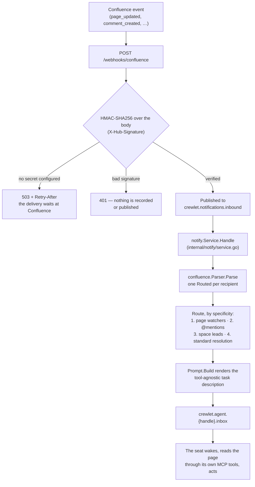

# Confluence Integration

Crewlet integrates with Confluence bidirectionally: agents read and write Confluence pages via MCP tools, and Confluence pushes content change events to agents via webhooks.

> **Prerequisites — the Atlassian side is set up by hand.** Atlassian offers no API for provisioning users, so the operator creates the Atlassian site (Cloud or Data Center) and each agent's Atlassian account and API token manually, then wires the tokens into `mcp_env` as shown below. Webhooks differ by deployment: **Cloud** events arrive via the [Crewlet Forge app](https://github.com/crewlet/forge); **Data Center** uses direct webhook registration (see [Webhooks](#webhooks-confluence-pushes-to-agents)).

---

## Configuration

The `integrations.confluence` block is **non-tool config** — the admin/service account for org-level REST calls and the inbound webhook secret. Org-wide knowledge spaces live in the separate `knowledge:` block. The Confluence MCP *tool* server is a separate `mcp_servers` entry, shared with Jira under the name `atlassian`:

```yaml
integrations:
  confluence:
    url: "${CONFLUENCE_URL}"                        # Confluence instance URL (Cloud or Data Center)
    token: "${CONFLUENCE_API_TOKEN}"                # API token (admin/service account)
    email: "${CONFLUENCE_EMAIL}"                    # Cloud only — admin email for Basic Auth
    webhook_secret: "${CONFLUENCE_WEBHOOK_SECRET}"  # Data Center: required, HMAC-SHA256

knowledge:
  confluence_spaces: ["HANDBOOK"]                   # org-wide spaces every agent can search

mcp_servers:
  - name: atlassian                               # shared by Jira + Confluence
    shared: false                                 # per-agent: each role supplies its own token
    command: uvx
    args: ["mcp-atlassian"]
    env:
      CONFLUENCE_URL: "${CONFLUENCE_URL}"         # declare explicitly — the engine does not inject it
```

> **Note:** Instead of `url`, you can provide `cloud_id` (Atlassian Cloud ID) — the base URL is constructed automatically. Provide one or the other, not both.

> **Human-clickable links agents share:** with `cloud_id`, the `mcp-atlassian` tools return `api.atlassian.com/ex/confluence/{cloud_id}/...` gateway URLs, which colleagues can't open. To have agents share a clickable `…atlassian.net/wiki/spaces/…/pages/…` link, set a [skill variable](../concepts/tool-skills.md#skill-variables) — `skill_variables.confluence_base_url: "https://mycompany.atlassian.net/wiki"` — for your mention/link Tool Skill to reference. (The bundled `examples/tool-skills/platform-mentions.md` ships Plane-shaped, since the reference org runs on Plane; a Confluence org adapts its link-shape section to this variable.) Note this is *enforced-reading guidance* (the required-skill guard puts the rule + base in context before the agent can post), not a rewrite of tool results — `mcp-atlassian` builds result links from `CONFLUENCE_URL` and does not read a site-URL env. (This is independent of `site_url`, which the notification transport and knowledge search use for their own links.)

For **Cloud** webhooks, install the [Crewlet Forge app](https://github.com/crewlet/forge) which forwards events via Forge Remote to `POST /webhooks/forge`. The `webhook_secret` field is only used for Data Center deployments.

Since Jira and Confluence share the Atlassian platform, they use the **same** `mcp-atlassian` server — declare it **once** in `mcp_servers` as `atlassian` and set both `JIRA_URL` and `CONFLUENCE_URL` in its `env`; the engine does not derive them from the `jira:` / `confluence:` sections.

---

## MCP Server (Agents Control Confluence)

The `atlassian` MCP server gives agents full wiki capabilities — searching spaces, reading pages, creating and updating content, managing attachments, and adding comments. Set `CONFLUENCE_URL` in the server's `env`.

### Key MCP Tools

Agents see these tools in their tool list (discovered dynamically via MCP):

| Tool | Description |
|------|-------------|
| `confluence_search` | Search pages and blog posts using CQL |
| `confluence_get_page` | Read a page's content (returns Confluence storage format) |
| `confluence_create_page` | Create a new page in a space |
| `confluence_update_page` | Update an existing page's content |
| `confluence_get_page_children` | List child pages (for navigating hierarchies) |
| `confluence_get_comments` | Read page comments |
| `confluence_add_comment` | Add a comment to a page |

### Per-Unit Confluence Space (identity)

A unit declares the Confluence space it **owns** under `integrations.confluence.space`. This is *integration identity* — it routes inbound page webhooks to the unit lead and is the team's write / skill-promotion home. It is **not** a tool credential (those stay per-role in `mcp_env.atlassian`) and it **does not** scope knowledge reads (read scope is the org-wide `knowledge.confluence_spaces` — see [Scoped spaces](#scoped-spaces) below).

```yaml
units:
  - name: Engineering
    type: department
    lead: CTO
    integrations:
      confluence: { space: "ENG" }   # unit identity: routing + write home (NOT read scope)
    roles:
      - name: CTO
        mcp_env:
          atlassian: { CONFLUENCE_API_TOKEN: "${CTO_CONFLUENCE_TOKEN}" }
      - name: Architect
        mcp_env:
          atlassian: { CONFLUENCE_API_TOKEN: "${ARCHITECT_CONFLUENCE_TOKEN}" }

  - name: Product
    type: department
    lead: VP Product
    integrations:
      confluence: { space: "PROD" }
    roles:
      - name: VP Product
        mcp_env:
          atlassian: { CONFLUENCE_API_TOKEN: "${VP_PRODUCT_CONFLUENCE_TOKEN}" }
```

Each role keeps its own `CONFLUENCE_API_TOKEN` (and `CONFLUENCE_USERNAME`) in `mcp_env.atlassian` — the credential the mcp-atlassian server and the query-time searcher authenticate with. The unit's `integrations.confluence.space` is read by the engine (routing + skill-promotion), not passed to the MCP server.

---

## Webhooks (Confluence Pushes to Agents)

Confluence Cloud and Data Center use different webhook models. Cloud uses the **Crewlet Forge app**; Data Center uses direct webhook registration.

### Confluence Cloud — Forge App

Install the [Crewlet Forge app](https://github.com/crewlet/forge) from the Atlassian Marketplace (or via a private installation link). The Forge app forwards these Confluence events to the Crewlet backend:

- `avi:confluence:created:page` — new page created
- `avi:confluence:updated:page` — page content or title changed
- `avi:confluence:trashed:page` — page moved to trash
- `avi:confluence:deleted:page` — page permanently deleted
- `avi:confluence:created:comment` — new comment on a page
- `avi:confluence:updated:comment` — comment edited
- `avi:confluence:created:blogpost` — new blog post
- `avi:confluence:updated:blogpost` — blog post updated

Events are delivered via Forge Remote to `POST /webhooks/forge`. The Forge platform handles authentication automatically. Label events are not currently forwarded by this integration.

### Confluence Data Center — Direct Webhook Registration

Data Center supports webhook registration via the admin UI or REST API:

1. Go to **Administration** > **Further Configuration** > **Webhooks**
2. Set URL to `https://your-server.com/webhooks/confluence`
3. Select events: `page_created`, `page_updated`, `comment_created`
4. Set a **Secret** for HMAC-SHA256 signature verification

Or register dynamically via the REST API:

```
POST /rest/webhooks/1.0/webhook
Content-Type: application/json

{
  "name": "crewlet",
  "url": "https://your-server.com/webhooks/confluence",
  "events": ["page_created", "page_updated", "comment_created"],
  "active": true,
  "secret": "your-shared-secret"
}
```

Inbound requests are verified using **HMAC-SHA256** against the `X-Hub-Signature` header, at the route, before the delivery is recorded or published — the same point at which the GitHub, GitLab and Plane webhooks verify theirs. `POST /webhooks/confluence` is exempt from the API's bearer token precisely *because* it authenticates by provider HMAC, so the check belongs there.

`webhook_secret` is therefore **required** for Data Center webhooks: without one the endpoint answers **503** with a `Retry-After`, exactly as its peers do, rather than accepting deliveries it cannot verify. That is deliberately not a 4xx — the sender's request is fine, what is missing is on this side, and a 4xx would tell it to discard a delivery nobody else has a copy of. The delivery waits at Confluence and flows once the secret is set. Cloud is unaffected — those events arrive through the Forge app on `/webhooks/forge` and carry a JWT instead.

### Delivery deduplication

Data Center deliveries are claimed fleet-wide on the `X-Atlassian-Webhook-Identifier` the instance sends, which is stable across its own retries — so a redelivery is answered `200 {"status":"duplicate"}` and wakes nobody. The claim lasts five minutes. Cloud events relayed through Forge are deduplicated by the Forge route's own rules instead.

---

## Query-Time Confluence Search

Crewlet keeps no local copy of Confluence content. Shared knowledge is searched **live at query time**: the auxiliary model turns a turn's trigger into a short text query — once per turn — and the searcher runs it as CQL against `/rest/api/content/search`. There is no startup walk, no vector index, and no webhook-driven re-index of page bodies; Confluence is the live source of truth and is read on demand.

The query text is **capped and escaped** before it reaches the CQL literal. A pathologically long fragment is both a slow query and a sign the auxiliary model misbehaved, and an unescaped quote would end the literal early — turning a search into a query nobody wrote.

The search backs the Plan-phase `## Relevant knowledge` prefetch (see [Knowledge System](../concepts/knowledge-system.md#relevant-knowledge-prefetch)). Agents that want to search or read Confluence directly use the `confluence_search` and `confluence_get_page` MCP tools.

### Authentication

The query-time search authenticates **as the agent's own Atlassian user**, reusing the per-agent token already configured for direct Confluence MCP calls in `role.mcp_env["atlassian"]`:

- **Cloud** — `CONFLUENCE_USERNAME` + `CONFLUENCE_API_TOKEN`.
- **Data Center** — `CONFLUENCE_PERSONAL_TOKEN`.

The credential is read from `mcp_env.atlassian` or `mcp_env.confluence` — Atlassian's own MCP server covers both products, so the documented entry is named `atlassian`.

Roles without a per-agent Confluence token fall back to the **org token** (`integrations.confluence.token`), which sees whatever that account sees. That fallback is exactly why an unscoped search is then **refused** rather than run: searching the whole instance on a shared credential is how one seat reads a page its own account never could.

### Page-level restrictions — enforced natively by Confluence

Because the search runs as the agent's own Atlassian user, **Confluence enforces its page permissions natively**: a page the agent's user cannot see simply does not appear in the result set. There is no engine-side restricted-page handling — no `has_restrictions` flag, no empty-content audit rows, no separate ACL store.

To control what an agent can read, set Confluence page/space permissions on that agent's Atlassian user — exactly as you would for a human team member. To make a restricted page agent-readable, grant the agent's user access (or move the content to a space the agent can reach).

### Scoped spaces

The CQL query is narrowed by a `space IN (...)` clause built from **one** source: the org-wide `knowledge.confluence_spaces` list. It is the same for every agent — a unit's own `integrations.confluence.space` is *identity* (routing + writes, above) and **does not** narrow reads.

**Scoping is optional, and empty is the useful default.** If `knowledge.confluence_spaces` is empty, the search falls back on the auth model: a role with its **own** Confluence credentials searches **unscoped** (the `space IN (...)` clause is dropped and Confluence ACLs bound the results — it sees every space its account can read), while a **credential-less** role — which would otherwise search the org admin's entire view — searches **nothing**. So with per-agent tokens everywhere you can omit `knowledge.confluence_spaces` entirely and let Confluence ACLs scope reads; set it only to *narrow* the search to a curated floor.

```yaml
knowledge:
  confluence_spaces: ["HANDBOOK", "GENERAL"]   # optional read-scope floor — omit to rely on per-agent ACLs

units:
  - name: Engineering
    integrations:
      confluence: { space: "ENG" }    # ENG is Engineering's WRITE / routing home — it does NOT scope reads
```

Read scope is computed at query time from the normalised `knowledge.confluence_spaces`, so a live config edit to the scope takes effect with no restart and no refresh hook. With the config above, *every* agent's search is scoped to `{HANDBOOK, GENERAL}` regardless of unit; an Engineering agent is **not** restricted to `ENG` (and with `confluence_spaces` omitted it searches across everything its Atlassian account can read).

**Unreviewed auto-drafted skills never reach a planner.** A hit whose ancestor chain includes `Auto-Drafted Skills` is dropped, and so is one whose title still carries the `[Auto-draft] ` prefix — two tests, because the first can silently stop matching (an instance that answered without the ancestor expand) and an exclusion that quietly matches nothing looks exactly like a knowledge base with no drafts in it. A lead publishes a draft by **moving it out** of that parent, which is the review gesture; the prefix is cleared with it.

**The tool-skills space is not knowledge.** Pages in `integrations.confluence.skills_space` (default `TS`) are machinery — a planner told to read one would follow an instruction written for a different phase of a different turn — so they are excluded from search and from routing alike, while still being indexed into the skill registry.

### When Confluence search is unavailable

The `## Relevant knowledge` prefetch stays empty — logged, never an error — whenever the search cannot run: no `confluence` block, an org token that did not resolve, an unreachable instance, a refused query. **A turn must not die because a wiki was slow**, so every failure path is an empty result.

There is also a cheap **no-I/O pre-gate**: when a search is a guaranteed no-op (no scope AND no per-seat credential), the Plan phase skips the auxiliary model call that would have generated the query. That call is the expensive half, so a gate that had to reach the network to answer would cost more than it saves.

The search needs a Confluence connection and a model for query generation. It needs **no** database and **no** embeddings provider.

---

## How It Works

Confluence serves two roles in a Crewlet company: **knowledge source** (agents search and read docs) and **knowledge sink** (agents publish results back).

### Inbound: Confluence Content Changes Wake Agents



### Routing Strategy

Routing follows the same watcher-based pattern as Jira, adapted for Confluence's behaviors:

1. **Watchers** — The transport fetches page watchers via the Confluence REST API. Confluence **auto-adds users as watchers when they edit a page** — this includes the page creator, so there is no separate "page creator" routing step. Agents who have edited a page will automatically receive notifications about subsequent activity on it.
2. **@mentions** — When a comment contains `@mention` markup (`<ri:user ri:account-id="..."/>`), the mentioned agents receive the notification. The Confluence UI does not allow mentioning service accounts, but **the API can insert mention markup** — so agents commenting via MCP tools can direct notifications to other agents. Mentioned agents are **automatically added as page watchers** so they receive future events on that page.
3. **Space leads** — If no watchers or mentions resolved to a known agent (steps 1-2), all unit leads mapped to the space key receive the notification — **except the agent that triggered the event**. Multiple units can share the same space key.

"Resolved to a known agent" means the account maps to an **agent seat in the org**, not to an agent running in the node that received the webhook — a watcher owned by another node is routed to normally, since the notification is addressed by handle and consumed by whichever node owns that seat. Human watchers deliberately resolve to nothing here: Confluence already notified them natively, and counting one as a delivered recipient would suppress the space-lead fallback in favour of a notification the engine then skips.
4. **Standard resolution** — If no space mapping exists, the notification is returned for generic handle/email resolution.

When specific recipients are found (steps 1-2), space leads are **not** notified — this prevents leads from being flooded with events that already have a clear recipient.

#### Self-ignore: an agent is never notified about its own action

Every routing step excludes the user who triggered the webhook — the agent already knows about the action it just performed. This matters most for **space-lead routing**: a lead acting in the space it leads (e.g. a CEO commenting on a page in the leadership space) is the *default* space-lead recipient for the resulting `comment_created` / `page_updated` webhook. Without the exclusion, that webhook routes straight back to the lead, which wakes it to "acknowledge" the change — posting another comment that triggers another webhook, an endless self-notification loop.

When the **only** candidate recipient is the trigger user (the sole watcher, or the sole space lead), the event is **dropped** rather than falling through to a later routing step. The notification service adds a transport-agnostic backstop: any inbound notification whose `actor_external_id` resolves to the recipient itself is skipped (recorded as a `NotificationSkipped` event). `actor_external_id` is the **one** actor key every integration stamps — a per-vendor key protects the vendors somebody remembered and silently protects none of the others — and the actor is *resolved* through the handle registry rather than string-matched, so a seat's bot identity and its member identity compare equal. Both layers depend on each agent authenticating as a **distinct Atlassian user** (per-role `CONFLUENCE_API_TOKEN`) so the engine can tell whose action it was — see the per-role-token note below.

### Lead-fallback prompt hint

When a lead receives an event via `routed_via = "space_lead"` (steps 1-2 produced no recipient), the Confluence notification prompt adds a `## Why You Received This` section that names the space, warns the lead that no one else is watching the page, and lays out three explicit decisions:

- **Delegate** — `@mention` the right teammate in a comment on the page; the mention markup auto-adds them as a watcher so they pick up future events.
- **Act yourself** — if the page concerns the lead's own work or needs a lead-level response, reply directly.
- **Escalate** — if the page is outside the team's scope or the lead can't identify the right reviewer, `@mention` their own manager (named in the identity prompt) in a comment so the manager is added as a watcher and can decide where the page belongs. Space-lead fallback fires only when nobody else is involved, so silently walking away would leave the page unwatched.

The hint is suppressed for `watcher` / `mention` routings — those carry their own signal of personal involvement.

**Example 1**: Agent SWE edits a page (auto-added as watcher). A human comments on it:
- Agent SWE gets the notification (via watcher)
- Unit leads do NOT get it (watcher routing succeeded)

**Example 2**: Agent PM comments on a page mentioning `@Agent CTO` via the API:
- Agent CTO gets the notification (via @mention) and is auto-added as a page watcher
- Next time someone updates this page, Agent CTO will receive the event (via watcher)

> **Important: Per-role tokens required for watcher and creator routing.** Watcher and page-creator routing only work when each agent authenticates to Confluence as a **distinct Atlassian user** (via per-role `CONFLUENCE_API_TOKEN` in `mcp_env`). If all agents share a single service account token, Confluence records the same user for all edits, and routing cannot distinguish between agents. See [Jira Integration](jira.md) for the `mcp_env` pattern.

> **Confluence does NOT auto-add commenters as watchers.** When an agent comments on a page, they are not automatically added as a watcher (unlike page edits). The transport provides an the watcher registration method to explicitly watch a page after commenting, ensuring the agent receives future events.

> **@mentions via API only.** The Confluence UI does not allow `@mentioning` service accounts. However, the API can insert mention markup (`<ri:user ri:account-id="..."/>`) when agents create comments via MCP tools. The transport extracts these mentions and routes accordingly. For human users wanting to direct a comment to an agent, they must use the agent's display name in the comment text (not @mention) — the transport will still route via watchers/page creator.

### Outbound: Agents Write to Confluence

Agents use MCP tools directly to create or update pages. Common patterns:

- **Decision records** — after a DACI decision resolves, the driver agent publishes an ADR page
- **Sprint reports** — a PM agent summarizes completed Jira tickets into a Confluence page
- **Incident postmortems** — an agent compiles findings and publishes a structured postmortem
- **Meeting notes** — agents document outcomes from multi-agent discussions

---

## Publishing Local Pages from Your Machine (CLI)

Operators publish locally authored markdown — [Tool Skills](../concepts/tool-skills.md) and [knowledge docs](../concepts/knowledge-system.md#publishing-knowledge-docs) — to Confluence with `crewlet confluence import`. Each `.md` file is routed by its frontmatter: a `trigger:` makes it a Tool Skill page (in the Tool Skills space); everything else becomes a knowledge doc whose **space is its parent-directory name** and **title is its first `# H1`**.

```bash
crewlet confluence import <company.yaml> ./docs-to-publish
```

(The Nimbus example org runs on Plane — its shipped `nimbus.company.yaml` carries an `integrations.plane` block, so point the command at a company YAML with a `confluence:` block. The docs tree itself is Confluence-importable as-is: the directory conventions are identical across backends.)

- The **first positional argument is the Tier B company YAML** and the second is the directory — the Confluence credentials come from its `confluence:` block, resolved through the node's secret store and then the environment (pass `-config` to name a different Tier A document).
- **Every target space is checked before a single page is written.** A typo in a directory name would otherwise be discovered half way through, leaving an operator to work out which pages landed. The importer never *creates* a space: that names a container the whole company then works in, and guessing it is not this command's job.
- **A page that exists is updated in place**, matched by title within its space. Confluence has no external-id field, so a page somebody renamed in the UI is orphaned and a re-import creates a second one — a real limitation of the backend, reported rather than worked around with a hidden marker page.
- **Page failures are isolated.** A restricted page or one 403 does not cost the other forty; the run reports what failed and exits non-zero.
- Add `-dry-run` to print the plan and write nothing.

Publish first, then start the engine — two commands, in that order. The importer reads its credentials from the **Tier B company YAML**, so it works before a node is configured at all, and running it first means the engine's boot-time sync finds the pages already there.

`crewlet confluence resync <company.yaml>` is the read-only diagnostic beside it, and the counterpart of [`crewlet plane resync`](plane.md): it runs the **same** walk and the **same** admission the engine's boot sync runs, against a throwaway registry, and prints the keys that loaded plus any page that declares a `trigger:` and does not parse. It answers "why is this skill not being applied", not "make it apply" — it does **not** reach into a running engine, which picks changes up on its next boot or the next webhook. `-space` targets a space other than the configured one, for checking a container before pointing the company at it. It exits non-zero on a page that meant to be a skill and failed to decode, because the only other symptom is guidance that never appears. See the [CLI reference](../reference/cli.md#crewlet-confluence-resync).

---

## Teaching Agents to Use Confluence

MCP tools give agents the *capability* to use Confluence, but agents also need to know *when* and *why* to use it. Three layers carry this guidance:

### 1. Behavioral guidelines (per role, in YAML)

These render directly into the role's Plan-phase system prompt — no DB seed step.

```yaml
roles:
  - name: Architect
    behavioral_guidelines:
      - "Search Confluence (ENG space) for existing architecture docs before proposing changes"
      - "Publish all architecture decisions to Confluence under 'Architecture Decisions'"
  - name: PM
    behavioral_guidelines:
      - "After each sprint, summarize completed work in a Confluence page under 'Sprint Reports'"
      - "When creating a new project, check Confluence for existing requirements docs first"
```

### 2. The `Onboarding` page convention (per unit)

Each unit's Confluence space can host an `Onboarding` page that fresh agents are nudged to read on their first turn. The Plan prompt grows a ``## First-turn onboarding`` block listing every `Onboarding` page on the agent's unit chain (org root + each ancestor unit + own unit); the agent reads them, captures conventions via `reflect_and_persist`, and calls `mark_onboarded` to suppress the hint until the org chain changes. See [Agent Learning § Prompt scaffolding](../concepts/agent-learning.md#prompt-scaffolding).

### 3. Query-time Confluence search (engine side)

The Plan-phase `## Relevant knowledge` block runs a live Confluence search for the planner: the Confluence searcher has the auxiliary LLM generate a CQL query from the trigger and runs it against the Confluence REST API, optionally narrowed to the org-wide `knowledge.confluence_spaces` (empty ⇒ unscoped, with the agent's own Confluence ACLs bounding the results). See [Knowledge System § Relevant-knowledge prefetch](../concepts/knowledge-system.md#relevant-knowledge-prefetch). Agents that want to search or read pages themselves use the `confluence_search` and `confluence_get_page` MCP tools.

This approach keeps tool guidance **configurable per-org** and **per-role** rather than hardcoded in the engine. The same Confluence MCP tools are available to all agents, but each agent's prompt scaffolding and accessible spaces determine how they use them.

### Mentioning Other Agents in Confluence Comments

The Confluence UI does not allow `@mentioning` service accounts, but agents can mention each other via the API by including Atlassian user markup in comment bodies. To mention another agent, use the `confluence_add_comment` tool with the following HTML format:

```html
<p>Hey <ac:link><ri:user ri:account-id="ACCOUNT_ID"/></ac:link>, please review this page.</p>
```

Replace `ACCOUNT_ID` with the target agent's Atlassian account ID. The transport will extract the mention, route the notification to the mentioned agent, and auto-add them as a page watcher.

**This syntax is carried by a [Tool Skill](../concepts/tool-skills.md)** — a Confluence-sourced prompt fragment triggered for any role with `atlassian` in its `mcp_env`. The skill's summary appears in the per-phase catalogue and the full mention-syntax body loads on demand via `load_tool_skill`, so agents with Confluence tools know how to mention others without paying the token cost on every turn.

---

## Integration with Jira

When both Jira and Confluence are configured, agents can cross-reference between them:

- **Jira ticket → Confluence page**: An agent working on a Jira issue can search Confluence for related documentation, architecture decisions, or runbooks.
- **Confluence page → Jira ticket**: An agent reading a requirements page can create Jira tickets for each action item.
- **Linked artifacts**: Agents can add Confluence page links to Jira tickets and vice versa, maintaining traceability.

This works naturally because both integrations share the `mcp-atlassian` MCP server — all Jira and Confluence tools are available in the same tool list.

---

The Confluence MCP *tool* server is declared separately in `mcp_servers` (the `atlassian` entry shown under [Configuration](#configuration)), and it is a different surface from the one this page has been describing: the MCP server is what an **agent** calls, while the `integrations.confluence` block is what the **engine** reads — the inbound webhook, the knowledge search and the tool-skill walk. For Cloud, install the [Crewlet Forge app](https://github.com/crewlet/forge), which delivers webhooks over Forge Remote.
