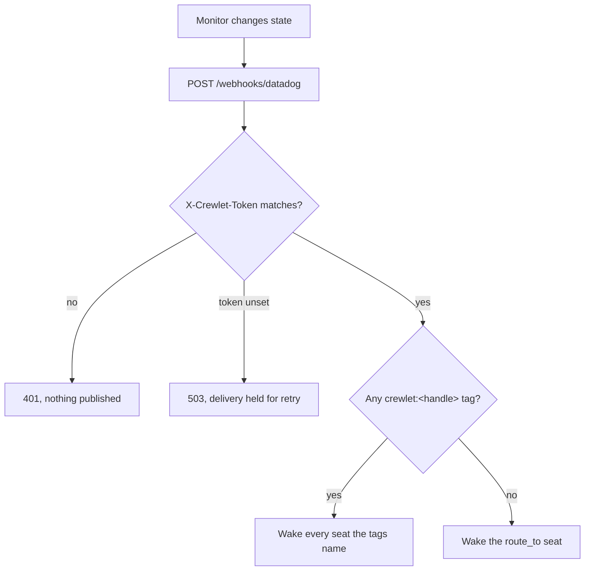

# Datadog

Datadog reaches Crewlet through its **Webhooks integration**, which posts a monitor's payload to a URL you configure. A firing monitor becomes an inbound event on the same path as everything else, so a seat is woken by an alert exactly as it is by a comment on a merge request.

## Configuration

```yaml
integrations:
  datadog:
    enabled: true
    webhook_token: "${DATADOG_WEBHOOK_TOKEN}"
    route_to: sre-lead        # required: where an alert naming no owner goes
    handle_tag: crewlet       # optional: the monitor tag key that names a seat
```

| Field | Required | Meaning |
|---|---|---|
| `enabled` | yes | Turn the integration on. |
| `webhook_token` | yes | Compared against the `X-Crewlet-Token` header on every delivery. A route with nothing to check against answers **503** rather than accepting one. |
| `route_to` | yes | The handle of the seat an alert wakes when no monitor tag names an owner. See [Routing](#routing-is-by-ownership-not-by-mention). |
| `handle_tag` | no | The monitor tag key that names a seat. Defaults to `crewlet`. Cannot contain a colon, a comma or a space, because Datadog uses those to separate a key from its value and one tag from the next. |

## Routing is by ownership, not by mention

Every other inbound surface routes by **identity**: a comment names a login, an issue names an account id, a chat message names a user. A Datadog alert names none of those. It is a monitor changing state, and the only thing on it that can say whose problem that is, is the **monitor's tags**.

Datadog's `@` syntax in a monitor message is not an alternative. It is Datadog's own notification-target grammar, resolved against its integrations before the delivery is made: `@webhook-crewlet` is what reaches your engine at all, and writing `@sre-lead` there earns a Datadog warning about an unknown target rather than a routed alert.

So routing has two tiers and a floor:

1. **A tag naming the seat.** A monitor tagged `crewlet:backend-lead` wakes that seat. A monitor may carry the tag more than once, and each named seat is woken, so one alert can reach a whole team.
2. **The company's `route_to` seat**, when no tag names anybody.



**`route_to` is required, and that is deliberate.** An alert is the one delivery that can legitimately name no party, because a monitor is not addressed to anyone. Without a floor those alerts would be accepted, verified, counted on the dashboard and delivered to nobody, which is the worst state an alerting integration can be in: it looks exactly like coverage. `crewlet validate` refuses an enabled block without one.

A tag naming a seat that does not exist is **not** silently dropped. It is delivered as far as it can go and recorded as an undeliverable notification with the handle on it, because a typo in a monitor tag is something you have to be able to see.

### What a seat is asked

The prompt differs by why the seat was reached, because the two are not the same job:

- A seat named by a **tag** owns the monitor. It is told this is its service and its call.
- A seat reached through **`route_to`** is told that nothing named an owner, and asked to establish whether the alert is theirs before working it, handing it on if it is not.

A **recovery** reaches the same seats as the alert it recovers from: the seat woken to investigate is the one that has to be told to stand down. What differs is the ask. A recovery is asked to confirm the recovery is real (a monitor with no data recovers exactly like one whose problem was fixed), close out anything it reported, and say so plainly if it cleared for reasons nobody understands.

A monitor's trigger, recovery and re-trigger are **one conversation**, so a seat sees that this is the fourth time tonight rather than four unrelated pages.

## Verification is weaker here, and that is the provider's ceiling

Every other inbound route verifies an HMAC over the request body. Datadog cannot do that: its webhook attaches custom headers, but only with **fixed values**, so there is nothing varying with the payload to sign.

The strongest check available is therefore a constant-time comparison of a shared token. The difference is real and worth stating rather than glossing:

- a replayed delivery is indistinguishable from a fresh one
- anyone holding the token can forge an alert

Treat `webhook_token` as a signing key. It is doing that job with none of the guarantees. Rotate it the same way, and keep it a `${VAR}` rather than a literal.

## Setting it up in Datadog

1. Open **Integrations → Webhooks** and add a webhook.
2. Set the URL to `https://<your-engine>/webhooks/datadog`.
3. Under **Headers**, add `X-Crewlet-Token` with your token's value.
4. Set the **Payload** to the template below.
5. Reference the webhook from a monitor's notification message with `@webhook-<name>`.
6. Tag the monitors you want routed to a particular seat with `crewlet:<handle>`.

### The payload template

Datadog posts an **empty body** unless the webhook defines a payload template, and the template is written by whoever creates the webhook rather than fixed by the vendor. There is therefore no canonical Datadog alert shape: there is the shape this engine asks for, and this is it.

```json
{
  "id": "$ID",
  "title": "$EVENT_TITLE",
  "body": "$EVENT_MSG",
  "alert_transition": "$ALERT_TRANSITION",
  "priority": "$PRIORITY",
  "tags": "$TAGS",
  "link": "$LINK",
  "scope": "$ALERT_SCOPE",
  "event_type": "$EVENT_TYPE"
}
```

`$TAGS` is what routing runs on, so an alert cannot be routed to its owner without it. `$LINK`, `$EVENT_TITLE` and `$ALERT_SCOPE` are what let a seat be told where to look rather than only that something happened.

Every value is quoted, including `$PRIORITY`. An unquoted variable that expands to nothing yields `"priority": ,`, which is not JSON and which Datadog posts anyway. The engine still accepts a bare number, so a template somebody unquoted by hand does not lose its alerts, but the template above is the one to paste.

Every field is optional on the way in. A template somebody edited is a configuration mistake, and dropping a firing monitor over one is the worst available response: the alert is real whether or not its priority came through.

## Deduplication

Datadog stamps each notification with an `id` that is stable across its own retries, and the route claims on it, so a retried alert is answered as a duplicate rather than waking a seat twice.

A payload carrying no `id` is processed **without** a claim. There is nothing stable to key on, and delivering a firing monitor twice is better than dropping it.
