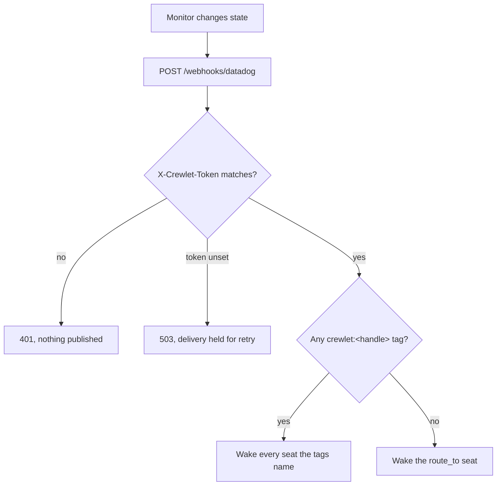

# Datadog

Datadog reaches Crewlet through its **Webhooks integration**, which posts a monitor's payload to a URL. A firing monitor becomes an inbound event on the same path as everything else, so a seat is woken by an alert exactly as it is by a comment on a merge request.

The engine registers that webhook itself and keeps its address current, so the only thing left for you at Datadog is naming it in the monitors you want an agent woken by.

## Setting it up from the dashboard

The Integrations screen connects Datadog without a shell: it takes an API key
and an application key, asks for the monitor tag key and the fallback seat,
generates the shared token, seals it, points the config at it and activates.
The next reconcile pass registers the webhook at Datadog. Everything below
describes what that writes, and is what you edit by hand if you would rather.

The tag key comes filled in as `crewlet` and most companies leave it, since
the two routing questions it and the fallback seat answer are asked in order:
which tag on a monitor names an owner, and who is woken when none does.

See [Setting an integration up](../reference/api-endpoints.md#setting-an-integration-up)
for the routes behind it.

## Giving each agent its own Datadog identity

`integrations.datadog.provisioning` carries the organization credential pair,
and it is **required when the integration is enabled**: it is what registers
the webhook that makes alerts arrive at all. An enabled block without it serves
a route, checks a token and receives nothing, because nothing at Datadog was
ever told this deployment exists, so the configuration is refused rather than
reported connected.

The same pair buys one more thing: a **service account per agent seat**, each
holding a role and its own application key, so an agent reading Datadog does it
as itself.

```yaml
integrations:
  datadog:
    enabled: true
    webhook_token: ${DATADOG_WEBHOOK_TOKEN}
    route_to: sre-lead
    provisioning:
      site: datadoghq.eu          # checked against Datadog's own regions
      api_key: ${DATADOG_API_KEY} # says which organization
      app_key: ${DATADOG_APP_KEY} # says which user acts
      role: Datadog Read Only Role
      email_domain: agents.example.invalid
```

Both keys are needed together. Datadog refuses a write carrying only the API
key, with a message that names neither, so the engine asks for the pair or
neither.

A seat opts in by naming a `${VAR}` in its `mcp_env.datadog` block; a seat with
nowhere to write a key is left alone rather than reported broken. The account
is created **already holding** its role, because one that exists for a moment
without one inherits the organization's default.

**A key is minted once.** Datadog returns an application key's value exactly
once, so the pass mints only for a seat holding none. A seat whose account
already has a key that the engine cannot read is **reported, not replaced** —
replacing it would silently revoke whatever is using it. A sink the engine
cannot read stops that seat rather than minting, because unknown is not "no
key".

The role is **refused rather than defaulted** if the organization does not have
it: creating accounts under whatever role happened to match would grant an
agent access nobody asked for.

It is shown on each agent's row on the Integrations screen, as the tag a code
host's tier gets, because it is the same question: how much this agent may do
there. Datadog's own three are shortened, since "Datadog Standard Role" on a
row that has already said which app it is about is noise, and mapped onto the
access words the rest of the engine uses so an agent's Datadog access reads
beside its GitHub access rather than in a second grammar:

| Role | Shown as | Read as |
|---|---|---|
| `Datadog Read Only Role` (the default) | Read-only | `read_only` |
| `Datadog Standard Role` | Standard | `review` |
| `Datadog Admin Role` | Admin | `full_access` |

A role your organization defined keeps its own name and is graded as nothing:
shortening somebody's own name is how a reader stops recognising it, and this
engine has no basis for claiming how much a role it has never seen grants.

Disconnecting **disables** these accounts when you tick "also remove the
accounts Crewlet created". Disabled rather than deleted, because deleting a
Datadog user detaches it from everything it authored.


## Configuration

```yaml
integrations:
  datadog:
    enabled: true
    webhook_token: "${DATADOG_WEBHOOK_TOKEN}"
    route_to: sre-lead        # required: where an alert naming no owner goes
    webhook_name: crewlet     # optional: monitors name it as @webhook-crewlet
    handle_tag: crewlet       # optional: the monitor tag key that names a seat
    provisioning:             # required when enabled: registers the webhook
      site: datadoghq.com
      api_key: "${DATADOG_API_KEY}"
      app_key: "${DATADOG_APP_KEY}"
```

| Field | Required | Meaning |
|---|---|---|
| `enabled` | yes | Turn the integration on. |
| `webhook_token` | yes | Compared against the `X-Crewlet-Token` header on every delivery. A route with nothing to check against answers **503** rather than accepting one, and so does one whose token is shorter than **26 characters** — see [Verification is weaker here](#verification-is-weaker-here-and-that-is-the-providers-ceiling). |
| `route_to` | yes | The handle of an **agent** seat this company declares, or the literal `none`. An alert wakes that seat when no monitor tag names an owner; `none` dismisses those alerts on purpose. A handle no seat has, or one naming a human seat, is refused at validation — and no seat may itself be handled `none`, or it would be silenced by its own name. See [Routing](#routing-is-by-ownership-not-by-mention). |
| `provisioning` | yes | The organization credential pair and the region it was issued in: `site`, `api_key`, `app_key`, all three required. The engine registers the webhook with them, so an enabled block missing any is refused. `site` must be a region Datadog serves — a key issued in one is refused by every other, and the hostname is the only thing that tells them apart. |
| `webhook_name` | no | The name of the webhook the engine keeps at Datadog, and therefore the handle a monitor writes: `@webhook-crewlet` by default. Give two deployments watching one organization two names, or each rewrites the other's address on every pass. Cannot contain a space, an `@` or a comma. **Renaming leaves the old definition in place** — see below. |
| `handle_tag` | no | The monitor tag key that names a seat. Defaults to `crewlet`. Cannot contain a colon, a comma or a space, because Datadog uses those to separate a key from its value and one tag from the next. |

**Renaming `webhook_name` is a two-step change, and the engine does the first step and then tells you about the second.** The name is also the handle your monitors write, so every monitor still saying `@webhook-crewlet` keeps delivering through the old definition — same address, same token, still working. The engine therefore does not delete it: doing so would silence exactly those monitors. Nor could anything find it for you afterwards, because Datadog answers a `GET` on the webhooks collection with `405` and there is no listing to enumerate.

So the engine **remembers the name it registered under**, and the first pass after a rename reports the definition left behind: the Integrations screen carries it as a note on a **Connected** integration, naming both the old definition and the new one. Nothing is broken, which is why it is an advisory rather than a fault. Repoint the monitors to the new handle, then delete the old definition at Datadog and the note clears itself. A disconnect withdraws only the name the field currently holds.

A disconnect also **reads before it deletes**: a definition under your `webhook_name` that posts somewhere other than this deployment's own `/webhooks/datadog` address is not this engine's, so it is reported and left alone rather than removed.

## Routing is by ownership, not by mention

Every other inbound surface routes by **identity**: a comment names a login, an issue names an account id, a chat message names a user. A Datadog alert names none of those. It is a monitor changing state, and the only thing on it that can say whose problem that is, is the **monitor's tags**.

Datadog's `@` syntax in a monitor message is not an alternative. It is Datadog's own notification-target grammar, resolved against its integrations before the delivery is made: `@webhook-crewlet` is what reaches your engine at all, and writing `@sre-lead` there earns a Datadog warning about an unknown target rather than a routed alert.

So routing has two tiers and a floor:

1. **A tag naming the seat.** A monitor tagged `crewlet:backend-lead` wakes that seat. A monitor may carry the tag more than once, and each named seat is woken, so one alert can reach a whole team.
2. **The company's `route_to` seat**, when no tag names anybody.



**`route_to` is required, and that is deliberate.** An alert is the one delivery that can legitimately name no party, because a monitor is not addressed to anyone. Without a floor those alerts would be accepted, verified, counted on the dashboard and delivered to nobody, which is the worst state an alerting integration can be in: it looks exactly like coverage. `crewlet validate` refuses an enabled block without one.

**`none` is an answer, and it is not the same as leaving the field blank.** A company may want only the monitors it has labelled to wake anybody, and everything else to stay with whatever Datadog already does about it — that is a decision, and `route_to: none` is how it is written down. Blank is a question nobody answered, and an alert reaching nobody through it is a silent hole in the coverage. Because `none` means nobody, **no seat may be handled `none`**: one that was would be silenced by its own name, on a screen reporting the configuration exactly as written, so `crewlet validate` refuses it.

**And it has to name somebody who can be woken.** A handle no seat has resolves to nothing, and one naming a **human** seat resolves fine and is then dropped as a self-action — both leave the configuration reading as correct on every screen while every untagged alert lands nowhere, which is the state the requirement exists to prevent. So validation checks the value against the company's own roster: it must be `none`, or the handle of an agent seat this company declares. A monitor **tag** naming an unknown handle is different and stays visible as an undeliverable notification, because a tag is somebody's typo in Datadog rather than a line in this document.

A tag naming a seat that does not exist is **not** silently dropped. It is delivered as far as it can go and recorded as an undeliverable notification with the handle on it, because a typo in a monitor tag is something you have to be able to see.

### What a seat is asked

The prompt differs by why the seat was reached, because the two are not the same job:

- A seat named by a **tag** owns the monitor. It is told this is its service and its call.
- A seat reached through **`route_to`** is told that nothing named an owner, and asked to establish whether the alert is theirs before working it, handing it on if it is not.

A **recovery** reaches the same seats as the alert it recovers from: the seat woken to investigate is the one that has to be told to stand down. What differs is the ask. A recovery is asked to confirm the recovery is real (a monitor with no data recovers exactly like one whose problem was fixed), close out anything it reported, and say so plainly if it cleared for reasons nobody understands.

A monitor's trigger, recovery and re-trigger are **one conversation**, so a seat sees that this is the fourth time tonight rather than four unrelated pages. The thread is keyed on the monitor's own id (`$ALERT_ID` in the [payload template](#the-payload-template)), not on its title, because a Datadog title carries the alert state and would put a trigger and its recovery in two threads.

## Verification is weaker here, and that is the provider's ceiling

Every other inbound route verifies an HMAC over the request body. Datadog cannot do that: its webhook attaches custom headers, but only with **fixed values**, so there is nothing varying with the payload to sign.

The strongest check available is therefore a constant-time comparison of a shared token. The difference is real and worth stating rather than glossing:

- a replayed delivery is indistinguishable from a fresh one
- anyone holding the token can forge an alert

Treat `webhook_token` as a signing key. It is doing that job with none of the guarantees. Rotate it the same way, and keep it a `${VAR}` rather than a literal.

Because the token is the entire check, its length is the entire strength, so **Crewlet refuses one shorter than 26 characters** — the length the dashboard's own Generate button mints (130 bits of base32). The refusal happens in two places on purpose: `crewlet validate` and `PATCH /config` reject a short literal, and the route itself answers 503 for a short **resolved** value, so pointing a `${VAR}` at a weak token is not a way around it. The same floor applies to Confluence Cloud's `webhook_token`, which is in the same position for the same reason.

## What you do in Datadog

The webhook itself is not on this list. The reconcile pass creates it under
`webhook_name`, points it at `<public_base_url>/webhooks/datadog`, attaches the
`X-Crewlet-Token` header and writes the payload template below, and it rewrites
that definition whenever the address or the token changes. A disconnect
withdraws it.

What is left is naming it on the monitors you care about:

1. Add `@webhook-crewlet` to a monitor's notification message. Without it Datadog posts nothing, however healthy the webhook is.
2. Tag the monitors you want routed to a particular seat with `crewlet:<handle>`.

You can see what the engine wrote under **Integrations → Webhooks**. Editing it
there is temporary: the next pass restores the definition above, which is what
keeps the address correct when the deployment moves. A definition that already
matches is left alone rather than rewritten, so a converged pass writes nothing
at Datadog at all.

### What the reconcile reports

Three states the pass reaches and, until recently, could say nothing about —
each one leaving the surface reporting `ready` while alerts went nowhere:

| What it found | What it reports | What clears it |
|---|---|---|
| No webhook was registered because this deployment has no inbound address | `ingress_blocked` | set `integrations.public_base_url` |
| No webhook was registered because `webhook_token` resolved to nothing, or because this node has no keyring to seal one with | `credential_missing` | set `integrations.datadog.webhook_token`, or install `secrets.keys` |
| A seat's service account exists but is **disabled** | `identity_failed` | re-enable it in Datadog |

The last is the one worth knowing about. Disabling an account is exactly how a
disconnect with account removal decommissions one, so a company that had run
that and then reconnected looked fully provisioned while no seat could act. It
is **reported rather than re-enabled**: undoing an operator's explicit
decommission from a timer is not a decision this loop gets to make.

A node with no keyring also no longer creates the accounts. It used to make a
real Datadog service account per seat and then fail to record its key — so the
account existed, nothing could authenticate as it, and the next pass made
another one.

### The payload template

Datadog posts an **empty body** unless the webhook defines a payload template, and the template belongs to whoever creates the webhook rather than being fixed by the third-party app. There is therefore no canonical Datadog alert shape: there is the shape this engine writes, and this is it.

```json
{
  "id": "$ID",
  "monitor_id": "$ALERT_ID",
  "title": "$EVENT_TITLE",
  "body": "$EVENT_MSG",
  "alert_transition": "$ALERT_TRANSITION",
  "priority": "$PRIORITY",
  "tags": "$TAGS",
  "link": "$LINK",
  "scope": "$ALERT_SCOPE",
  "event_type": "$EVENT_TYPE"
}
```

`$TAGS` is what routing runs on, so an alert cannot be routed to its owner without it. `$LINK`, `$EVENT_TITLE` and `$ALERT_SCOPE` are what let a seat be told where to look rather than only that something happened.

`$ID` and `$ALERT_ID` are both here because they answer different questions. `$ID` identifies the **notification** and is what the webhook edge deduplicates a retry on. `$ALERT_ID` identifies the **monitor**, and it is what makes a trigger and its recovery one conversation — a Datadog title carries the state (`[Triggered] API latency`, then `[Recovered] API latency`), so keying the thread on the title split every incident in two. An alert delivered by a definition written before this line existed carries no `monitor_id`, and falls back to the title.

Every value is quoted, including `$PRIORITY`. An unquoted variable that expands to nothing yields `"priority": ,`, which is not JSON and which Datadog posts anyway. The engine still accepts a bare number, so a template somebody unquoted by hand does not lose its alerts until the next pass restores this one.

Every field is optional on the way in. A template somebody edited is a configuration mistake, and dropping a firing monitor over one is the worst available response: the alert is real whether or not its priority came through.

## Deduplication

Datadog stamps each notification with an `id` that is stable across its own retries, and the route claims on it, so a retried alert is answered as a duplicate rather than waking a seat twice.

A payload carrying no `id` is processed **without** a claim. There is nothing stable to key on, and delivering a firing monitor twice is better than dropping it.
