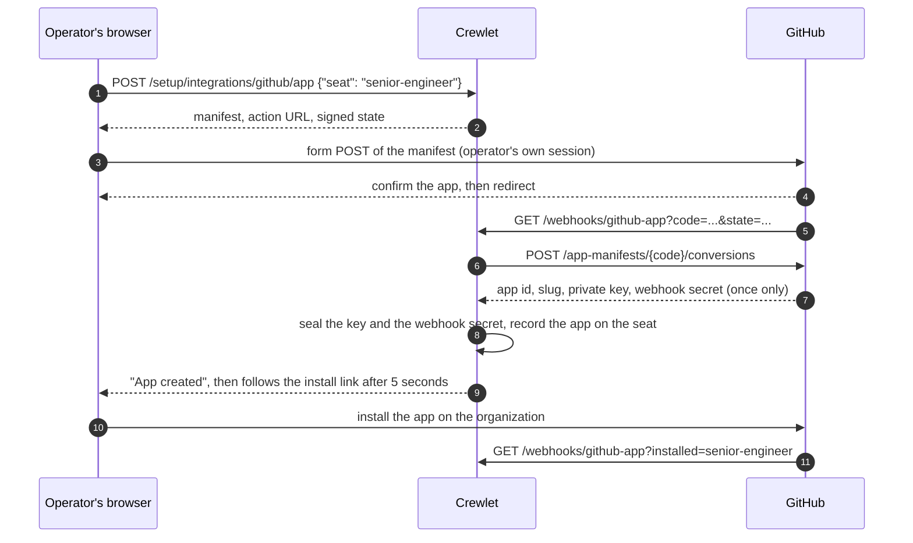

# GitHub Integration

GitHub is a **served code host**: a delivery from github.com or a GitHub
Enterprise Server wakes the seat it concerns, and `crewlet github provision`
registers the webhooks that carry it. A company can run it beside
[GitLab](gitlab.md) — they are two hosts with different repositories on them,
which is what a migration and an open-source presence both look like.

Three surfaces, and they are deliberately separate:

- **Inbound** — `integrations.github` plus `POST /webhooks/github`. This is
  how a review request, an assignment, a comment or a red workflow run
  reaches an agent.
- **Tools** — the [GitHub MCP server](https://github.com/github/github-mcp-server),
  a `shared: false` entry in `mcp_servers` with each agent's token in
  `role.mcp_env.github`. This is how an agent reads, reviews and tracks.
- **Identity.** One GitHub App per agent, in `role.integrations.github`. An app
  carries exactly one bot identity, so each agent has its own, created and
  installed from the dashboard and bounded by an access tier. See
  [One GitHub App per agent](#one-github-app-per-agent).

GitHub tools are for **reading, reviewing and tracking** code — diffs,
comments, reviews, run status. **Authoring** code changes goes through the
[code sandbox](../concepts/code-sandbox.md), which opens a pull request under
the agent's own identity.

---

## Setting it up from the dashboard

Connect GitHub on the Integrations screen. The engine generates the webhook
secret and the reconcile loop registers the hook on its next tick, running the
same pass `crewlet github provision` runs with the same secret store behind
it. Nothing on that form asks for a personal access token.

The loop keeps checking after that, so a grant you change at GitHub is
reflected on the screen within a tick without anything to press.

Giving each agent its own bot identity is a separate, per-seat flow that the
loop cannot run for you, because it needs your GitHub session: see
[One GitHub App per agent](#one-github-app-per-agent).

See [Running the provisioning pass](../reference/api-endpoints.md#running-the-provisioning-pass).

## Configuration

```yaml
integrations:
  github:
    enabled: true
    # Omit url for github.com. An Enterprise Server names itself here.
    url: "https://github.example.com"
    webhook_secret: "${GITHUB_WEBHOOK_SECRET}"   # required when enabled
    token: "${GITHUB_ENGINE_TOKEN}"              # read credential; see below
    provisioning:                                # read by the engine's pass and the CLI
      org: acme
      repos: [acme/api, acme/web]
      org_webhook: auto
```

- **`url` is optional and its absence is meaningful.** Leave it unset for
  github.com, whose API lives on a different *host* (`api.github.com`) rather
  than a path on the web UI. An Enterprise Server names itself and the REST
  base is derived as `<url>/api/v3` — there is no second address to keep in
  step, and pasting the API base in instead of the instance URL is accepted
  rather than doubled.
- **`webhook_secret` is required** when enabled, and it is the
  *organization's*: it verifies the bare route and any seat with no app of its
  own. A company whose agents all hold their own apps still sets one, because
  enabling this block turns on the organization route. Every delivery to
  `POST /webhooks/github` is verified as HMAC-SHA256 over the raw body
  against `X-Hub-Signature-256`; a route with nothing to verify with answers
  **503** rather than accepting the delivery. Unlike GitLab's, this secret
  has no required shape — GitHub takes any string and signs with it verbatim
  — so there is no wrong *shape* to catch, only a wrong value.
- **`POST /webhooks/github/{handle}`** is the same route, addressed to one
  seat, and is what a [per-agent GitHub App](#one-github-app-per-agent)
  delivers to.

  **It verifies against that seat's own secret.** GitHub generates a signing
  secret per app, at conversion time, and returns it once, so an agent's
  deliveries are signed with its app's secret rather than the organization's.
  The route reads the seat's own `webhook_secret` first and falls back to
  `integrations.github.webhook_secret`, which is what a single organization
  app pointed at one seat signs with. With neither, the route answers **503**.

  GitHub delivers to **every** app installed on a repository, each delivery
  carrying its own `X-GitHub-Delivery`. A repository five agents work
  therefore produces five deliveries of one comment. Those are not
  duplicates to collapse — they are five agents being told, which is the
  point of each holding its own app — and without the seat in the path
  nothing downstream can tell them apart from a redelivery of one. The
  handle travels on the published event as `handle`.

  The bare `POST /webhooks/github` stays for a single app serving a whole
  organisation, where a delivery names no seat and the organization's secret
  is the only one that could have signed it. The seat is never a way past the
  signature check: what the handle selects is which credential the delivery is
  checked against, not whether it is checked.
- **`token` (optional)** is the credential the **organization-level**
  reconcile reads and registers hooks with, and
  [`crewlet github provision`](#provisioning--crewlet-github-provision)
  requires it. A company whose agents each hold their own app needs none: each
  app carries its own hook, and participant fan-out is read through those
  apps. See [Participants](#participants-are-computed-not-read). With no token
  the organization pass reads nothing and says so as a note, which is not a
  fault: there is nothing it was going to do for such a company.

  It is not on the connect form. Asking every company for a hand-minted
  personal access token, for a credential no agent ever acts as, put a
  permanent note on cards with nothing wrong with them.
- **`provisioning:`** says where hooks are registered and which organization
  these agents work in, and it is read by the engine's own pass as well as by
  the CLI. `org` is the GitHub organization holding the repositories, and it is
  also the account a [per-agent app](#one-github-app-per-agent) is registered
  under; `repos` are `owner/repo` entries to hook individually; `org_webhook`
  is `auto` (default) / `true` / `false`, described under
  [Webhooks](#webhooks).

### Seat identity is derived, never declared

A GitHub delivery names people by **login**, and nothing in the org chart
says which account a seat holds. At boot the engine calls `GET /user` with
each seat's own credential and registers whatever account answers.

A declared login beside the token would be cheaper and is the wrong shape: a
declaration that disagrees with the credential is a misroute nothing can
detect, and it would make the engine name a variable the seat's own tools do
not read. The credential is read from `role.mcp_env.github` under whichever
key that seat's tool stack uses — `GITHUB_TOKEN`,
`GITHUB_PERSONAL_ACCESS_TOKEN`, `GH_TOKEN`, or an `Authorization` header
(the `Bearer` and `token` schemes are both stripped).

The lookup is **cached against the credential**, not the seat: identity is a
function of the token, so a config apply that changed something else costs no
requests, and a rotated token costs exactly one.

A seat whose lookup fails is left unresolved rather than failing the boot —
GitHub may be rate-limiting — and the engine says so per seat
(`github_seat_identity_unresolved`). That seat receives no GitHub events
until the next apply re-resolves it. A company with **no** resolved seats
logs `github_has_no_seat_identities`, because the integration is completely
inert in that state and nothing else would say so.

### Human seats

A human seat holds no tool credential. It is addressed by
`contact.github_login` in the org chart, which the party registry registers
directly — so a person can be mentioned in a comment and reached by the
engine's notification spine without ever holding a token here.

## One GitHub App per agent

A GitHub App has exactly one bot identity, derived from its slug, and nothing
varies it: not a token, not a header, not a manifest field. An agent that is to
act as itself on GitHub therefore needs an app of its own, so the engine
creates one **per seat** rather than one per company.

That is a constraint rather than a preference. **Agents cannot share one app
and keep distinct identities.** A single company-wide app would have every
agent comment, review and commit as the same account, and an `@mention` of one
of them would no longer say which agent was meant.

### What an operator does

Two acts, both performed by a person signed in to GitHub, and the second can be
a day after the first.

1. **Create the app.** The Integrations screen asks the engine for a manifest
   and submits it to GitHub as a form POST carrying the operator's own GitHub
   session. GitHub shows what is about to be created and, on approval, sends
   the browser back to the engine with a one-time code. The engine converts the
   code, seals the private key that comes back, and records the app on the
   seat.
2. **Install the app.** Creating an app grants it nothing: an app with no
   installation can see no repository. The page the operator lands on after
   creation links straight to the install page for the app that was just
   created, and the install is where the repositories are chosen.

**Neither act can be automated, and that is GitHub's shape.** A manifest is
submitted with the browser session of somebody who may create apps on that
organization, and GitHub offers no server-to-server equivalent. This is the one
part of any integration here that a
[reconcile pass](../concepts/integration-reconcile.md) cannot do on its own.



### What has to be in place first

- **`integrations.public_base_url`.** Three addresses are baked into an app at
  creation: where its deliveries go, where the browser returns after the
  creation, and where it returns after the install. Only a person at GitHub can
  change them afterwards, so the engine refuses to begin without a public base
  (`409 no_public_url`) rather than create an app that would have to be created
  again. The reconcile loop reports the same gap for the org- and
  repository-level hooks: with no public base there is no address for GitHub to
  deliver to, so the integration is reported **degraded** naming that field
  rather than **ready** with nothing registered anywhere.
- **`integrations.github.provisioning.org`.** It names the account the app is
  registered under, and the account matters: an app registered under a person's
  own account cannot be installed on the organization that owns the
  repositories. With no organization set, the operator is sent to their
  personal app registration page instead.
- **`integrations.github.url`**, when the company runs Enterprise Server. Unset
  means github.com.

### The manifest the engine builds

| Manifest field | What the engine puts in it |
|---|---|
| `name` | The company name and the seat's role name, joined and cut to 34 runes |
| `url` | `https://crewlet.ai` |
| `public` | `false`. The app is the company's own |
| `hook_attributes.url` | `<public_base_url>/webhooks/github/<handle>` |
| `redirect_url` | `<public_base_url>/webhooks/github-app` |
| `setup_url` | `<public_base_url>/webhooks/github-app?installed=<handle>` |
| `default_events` | `issues`, `issue_comment`, `pull_request`, `pull_request_review`, `pull_request_review_comment` |
| `default_permissions` | The seat's tier, below |

**The events are named, never `*`.** An app with a delivery address and no
events subscribes to nothing, receives nothing, and reports itself healthy
while doing so. `push` is deliberately absent: it is the highest-volume event a
busy repository produces and the router drops every one. `workflow_run` is not
in an app's set either, so a failed-run notice reaches a seat through the
organization or repository hook the
[provisioning pass](#provisioning--crewlet-github-provision) registers rather
than through the seat's own app.

### The three access tiers

A seat's tier is the one field in this block a person writes, and it decides
two things: the permissions the app is created with, and the permissions every
token minted for that app carries.

| Tier | What it grants | GitHub permissions |
|---|---|---|
| `read_only` (the default) | Reads code and issues, changes nothing. | `metadata:read`, `contents:read`, `issues:read`, `pull_requests:read`, `checks:read`, `actions:read`, `deployments:read` |
| `review` | Reads the code and writes **about** it: issues, comments, reviews. | `metadata:read`, `contents:read`, `issues:write`, `pull_requests:write`, `checks:read`, `actions:read`, `deployments:read` |
| `full_access` | Branches, commits, pull requests, issues and checks. No administration. | `metadata:read`, `contents:write`, `issues:write`, `pull_requests:write`, `checks:write`, `actions:read`, `deployments:read` |

- **Empty means `read_only`.** A seat nobody has thought about yet should have
  to ask for more rather than already hold it.
- **`review` keeps `contents` at read on purpose**, so a reviewer cannot change
  what it is reviewing.
- **`metadata: read` is on every tier**, because GitHub requires it for almost
  every read: without it a token cannot resolve a repository at all.
- **Each tier is an allow list.** GitHub's token endpoint takes the permissions
  to grant, so anything absent from a tier is simply not on the token. There is
  no catalogue to subtract from and therefore nothing to forget.
- **A typo is refused, not guessed at.** `tier: reviw` fails config validation
  naming the field, and a reader that takes the value anyway falls back to
  `read_only` rather than to something wider. A hyphen is not a typo:
  `full-access` and `full_access` are the same tier.

### What no tier grants

None of the three asks for any of these, so no token this engine mints carries
one. Each is a way out of the tier rather than a step up within it:
administration (deleting a repository, dropping branch protection), secrets and
variables (every credential the repository holds), and membership and
organization settings (how an agent would widen its own access).

`administration` · `organization_administration` · `organization_secrets` ·
`organization_self_hosted_runners` · `organization_user_blocking` · `members` ·
`organization_plan` · `secrets` · `actions_variables` ·
`organization_actions_variables` · `environments`

**What an app holds is a different question from what a token carries.** A
manifest can be edited in the browser before it is submitted, and an
installation can be widened by a person afterwards; neither is the engine's to
decide. What is the engine's is the mint: a token is issued with the tier's own
permission list and nothing else, so a `read_only` seat still cannot write on
an installation that could. Where the seat names `repos`, the token is narrowed
to those as well, and an empty list means every repository the installation
covers, which is what the operator chose when they installed it.

### What lands where

The app is recorded on the seat, addressed by handle, so a company with ten
agents keeps ten separate records:

```yaml
roles:
  - name: Senior Engineer
    integrations:
      github:
        tier: review              # read_only (default) | review | full_access
        repos: [acme/api]         # empty means every repository the installation covers
        # Written by the engine, never typed in:
        app_id: 1234567
        app_slug: acme-senior-engineer
        installation_id: 87654321
        private_key: "${SENIOR_ENGINEER_GITHUB_APP_KEY}"
        webhook_secret: "${SENIOR_ENGINEER_GITHUB_APP_WEBHOOK_SECRET}"
```

`tier` and `repos` are the two fields a person writes. `app_id`, `app_slug`,
`private_key` and `webhook_secret` are written when the app is created, and the slug is what the
bot login derives from, so it is what an `@mention` of this agent resolves
through. `installation_id` is written as `0` at that moment, because creating
an app and installing it are two acts and an app installed nowhere is a real
state to report rather than a half-written record. A seat's app can mint tokens
only once app id, installation id and key are all present.

The credentials themselves never enter the document. Two entries are sealed in
the [secret store](../concepts/secret-store.md):

| Sealed name | What it is |
|---|---|
| `<HANDLE>_GITHUB_APP_KEY` | The app's PEM private key |
| `<HANDLE>_GITHUB_APP_WEBHOOK_SECRET` | The webhook secret GitHub generated for the app, when it returned one |

`<HANDLE>` is the seat's handle upper-cased, with every character outside
`A-Z`, `0-9` and `_` replaced by an underscore, so `senior-engineer` becomes
`SENIOR_ENGINEER`. The names are per seat because the credentials are: one
shared name would have the second agent's key overwrite the first's, and both
seats would then authenticate as whichever app was created last.

### How a seat's app is recognised

An app has two names and nothing at GitHub relates them. A person writing a
mention types the **slug**, so a body carries `@acme-sre-lead`; every payload
reporting what that app did carries the **account**, which is the slug with
`[bot]` appended. Both are registered against the seat, the slug where
mentions resolve and the account in the companion namespace a payload's sender
resolves through, so an agent is routable under either.

Neither costs a request. A seat holding a personal access token still has its
account learned with one `GET /user`, because a token says nothing about whose
it is; an app's account is its slug, which the engine wrote down when it
created the app. **The app wins** where a seat has both, because the app is
what the agent acts as; a credential nobody cleaned out of `mcp_env` would
otherwise take the mapping and the app's own deliveries would reach a
stranger.

Logins are folded to lower case on the way in, because GitHub treats them as
case-insensitive and a mention carries whatever a person typed.

### Deliveries from a seat's app

An app created this way delivers to `POST /webhooks/github/<handle>`, which is
the ordinary GitHub route addressed to one seat (see
[Configuration](#configuration)).

GitHub signs an app's deliveries with **that app's own** webhook secret, which
it generates at conversion time and returns once. The engine seals it as
`<HANDLE>_GITHUB_APP_WEBHOOK_SECRET` and writes the `${VAR}` onto the seat, and
the route verifies that seat's deliveries against it. Nothing has to be set at
GitHub by hand, and no two apps share a secret.

A seat with no secret of its own falls back to
`integrations.github.webhook_secret`, which is what a single organization app
pointed at a seat signs with. A seat with neither is a route with nothing to
verify against, and it answers `503` rather than accepting the delivery.

### The two routes

| Route | Called by | What it does |
|---|---|---|
| `POST /setup/integrations/github/app` | The dashboard, authenticated | Answers with one seat's manifest, the address to POST it to, and a signed state |
| `GET /webhooks/github-app` | GitHub's redirect, unauthenticated | Converts the one-time code, seals the key, records the app; also the page an install returns to |

Creating an app and installing it are two clicks at GitHub, and an operator who
has just done the first is already going to do the second, so the created-app
page counts down five seconds and follows the install link itself. The button
stays for anyone who would rather not wait, and it is the whole flow with
scripting off: the countdown is hidden until the script owns it, so the page
never promises a redirect it cannot make.

The callback carries no engine credential, because a browser redirect from
GitHub has none to carry. What stands in its place is the **state**: a signed
token naming the seat, minted by the begin route, valid for 15 minutes, and
validated before anything else happens. It is scoped to this flow, so a token
minted for another signed URL this engine issues cannot be replayed here.

Across a fleet the state signer is keyed from the Tier A keyring
(`secrets.keys`), so a creation begun on one node can be finished on another. A
deployment with no keys configured falls back to a per-process key, which is
correct for a single node and cannot work across two; the engine says so at
startup with `github_app_state_key_is_per_process`.

Request and response shapes are in
[API Endpoints](../reference/api-endpoints.md#one-agents-own-github-app).

### What the reconcile loop heals

Both of the acts that build a seat's app happen at GitHub, in a browser, and
GitHub tells the engine about neither. So the loop reads the app back on every
pass and corrects the document from what it finds.

| What it reads | What it writes | What the screen then says |
|---|---|---|
| An installation the app has and the seat does not name | `installation_id` on the seat | The seat is finished |
| A stored `installation_id` GitHub answers 404 to | `installation_id: 0` | Install it, with the link |
| An app id GitHub answers 404 to | Clears `app_id`, `app_slug`, `installation_id`, `private_key` and `webhook_secret` | Create an app for this seat |

Every one of these reads as **Action needed**, waiting on a person at GitHub.
The engine cannot create an app or install one for anybody: both are acts in a
browser, carrying the operator's own session.

The last row is the one that needs the extra call. An app installed nowhere
and an app somebody deleted both answer `404` from the installation
endpoints, and they call for opposite things, so the app's own identity
(`GET /app`, signed with its own key) is asked for before an operator is sent
anywhere. Read as "installed nowhere", a deleted app pointed an operator at an
install page GitHub itself 404s, on a card reporting the app as present.

The sealed key is left in the store when a record is cleared: it is named per
seat, so the next app's conversion overwrites it, and deleting a credential on
the strength of one remote `404` is a destructive answer to a question only
GitHub can settle.

A **check** (`POST /setup/integrations/github/check`) writes none of this. It
reads and reports, and the loop makes the correction on its next pass.

**An applied revision makes every surface due, now.** The loop's wait is for
asking GitHub again, not for asking the company document again, so a change
here is reconciled immediately rather than at the settled cadence, and rather
than at the end of the tick interval. Without it, an operator who installed an
agent's app was redirected back to a card still holding the previous pass's
finding, printed above the same card's roster reporting that agent installed
and ready.

### The constraints that shape all of this

- **The private key and the webhook secret come back exactly once.** GitHub has
  no endpoint that reissues either, so the callback seals both before doing
  anything else that can fail. A failure after the seal costs a retry; a
  failure before it costs the app, and the only way forward is to delete it at
  GitHub and create it again. It is also why an error here is worded by the
  engine and never quotes GitHub's response body: that body carries the key.
- **The delivery address is baked in at creation.** An app's hook attributes,
  redirect and setup URLs are set from the manifest and changed afterwards only
  by a person editing the app at GitHub, which is why the begin route refuses
  to run before the engine knows its own public base.
- **An app name is globally unique and capped at 34 characters.** A name built
  from the seat alone would collide the second time two companies both have an
  `sre-lead`, so the company name leads, the seat's role name follows, and the
  whole is cut on a rune boundary (a name sliced through a multi-byte character
  is refused as malformed rather than as too long). GitHub then slugifies the
  name and disambiguates a collision itself, so the app that exists may not
  carry the name that was asked for. That is why the install link is built from
  the slug the conversion returned rather than from the name that was
  requested.
- **Permissions are frozen at creation.** Raising a seat's tier afterwards
  means editing the app's permissions at GitHub, where every installation has
  to approve the change before it takes effect. Choosing the tier before the
  app is created is the cheap moment to get it right.
- **The creation code is single use and lives one hour.** A code that has been
  converted or has expired is reported as exactly that, and the flow starts
  again from the begin route. The engine's own state is shorter still, at 15
  minutes, so an abandoned attempt fails on the state rather than on a code
  nobody can do anything about.

---

## Webhooks

`POST /webhooks/github` verifies HMAC-SHA256 over the raw body against
`X-Hub-Signature-256`, and dedupes on `X-GitHub-Delivery` — GitHub sends a
stable per-delivery uuid, the same on every retry and on a redelivery an
operator triggers by hand, so a redelivery does not wake the seat again.

The event name arrives in the **`X-GitHub-Event` header**, not the body.
GitHub puts only the action in the payload, so `{"action": "created"}` is the
whole discriminator a body-only reader gets — created *what* is not in there.

### The subscribed events

The hooks the provisioner registers subscribe to exactly what the parser
reads, never `*`:

`issues` · `pull_request` · `issue_comment` · `pull_request_review` ·
`pull_request_review_comment` · `workflow_run`

A wildcard hook delivers every push, star and fork — thousands a day on a
busy repository, each one verified, stored, deduped and routed to nobody.
`check_run` is deliberately excluded: it reports the same failing Actions run
as `workflow_run`, once per job, so subscribing to both would wake one seat
as many times as the workflow has jobs.

### One organization hook, or one per repository

An **organization** hook covers every repository in the org, including ones
created after the run — the difference between a new repository routing on
day one and routing whenever somebody remembers to re-run the provisioner.
It needs the `admin:org_hook` scope, which a fine-grained token cannot carry
at all and a classic token carries only if whoever minted it ticked the box.

| `org_webhook` | Behaviour |
|---|---|
| `auto` (default) | Try one org hook; fall back to per-repository hooks if the credential may not, saying so in the run's notes |
| `true` | Demand the org hook. A credential that cannot register it **fails the run** — an operator who asked for this arrangement must not silently get the other one |
| `false` | Always register per-repository hooks |

A working org hook means the `repos` list is **not** hooked separately: two
hooks on one repository deliver every event twice.

---

## Routing

Two layers, and the difference between them is what a seat is being asked
for.

**Directed** events name their recipient in the payload. They route from the
payload alone, need no reads, and survive a lapsed credential:

| Event | Reaches | Reason stamped |
|---|---|---|
| `pull_request` `review_requested` | The requested reviewer | `pull_request.review_requested` |
| `pull_request` `opened` | Every reviewer the pull request already requests, every assignee, and anyone the body `@`-mentions — each under its own reason, so an opener who assigned and mentioned one person wakes them once | `pull_request.review_requested` / `.assigned` / `.mention` |
| `pull_request` / `issues` `assigned` | The named assignee | `pull_request.assigned` / `issue.assigned` |
| `pull_request_review` `submitted`, changes requested | The pull request's author | `pull_request.changes_requested` |
| `pull_request_review` `submitted`, approved | The author | `pull_request.approved` |
| `pull_request` `closed` with `merged: true` | The author and assignees | `pull_request.merged` |
| `pull_request` `closed` without it | The author and assignees | `pull_request.close` |
| `pull_request` `reopened` | The author and assignees | `pull_request.reopened` |
| `pull_request` `ready_for_review` | The author and assignees | `pull_request.ready_for_review` |
| `pull_request` `converted_to_draft` | The author and assignees | `pull_request.converted_to_draft` |
| `issues` `closed` | The assignees | `issue.close` |
| A `@login` in any body | Whoever was named | `…mention` |
| `workflow_run` `completed`, conclusion `failure` | **The run's own actor** | `workflow_run.failed` |

The four state changes — `closed`, `reopened`, `ready_for_review`,
`converted_to_draft` — take the **author first**. A pull request's outcome is
news to whoever opened it before it is news to anyone else, and GitHub gives
the login rather than an opaque id, so it needs no lookup and works with no
credential at all. `closed` splits on `merged` because to the author those are
opposite outcomes: one means the work landed and the other means somebody
decided it would not.

**Thread activity** — a comment, a close, a merge — concerns everyone taking
part, which GitHub does not put in the payload. It costs one read per issue
event and two per pull request, and without a `token` it degrades to the
author and assignees the payload does carry. That degradation can only ever
cost reach on the watching layer, never on the directed one.

Where several reasons name one person, **the first wins**, and the list
arrives in priority order — so a mentioned author is woken once, as a
mention, which is the stronger claim on their attention and the one the
prompt renders differently.

### What deliberately does not route

- **Bookkeeping.** A label, a milestone, a `synchronize` (new commits
  pushed), an auto-merge toggle. Each changes the item without asking anyone
  for anything, and routing them produces turns triaging "somebody added a
  label".
- **An edit, beyond the names it added.** GitHub's own rule: re-saving a body
  does not re-notify the people it already named. Only newly-added mentions
  route, so a typo fix pings nobody.
- **A deleted comment.** Whatever it said is gone, and a notification
  pointing at it sends the recipient to a 404.
- **A green, cancelled or timed-out run.** A cancel is somebody deciding the
  run was unnecessary; a timeout is usually the runner rather than the diff.
- **A team review request.** `@acme/reviewers` names no person, and the
  `acme` half is not one either — reading it as a login wakes whichever seat
  happens to share the organization's name on every team ping. Expanding the
  team would mean a members lookup on the inbound path to produce a fan-out
  GitHub itself treats as weaker than a direct request. It is logged
  (`github_team_review_request_not_routed`) rather than dropped silently.
- **Anyone who is not a seat here.** A repository has contributors who are
  not in this company; the registry is the single gate every fan-out passes
  through.

### The one event addressed to its own actor

A seat is never told about its own actions — with one exception in the whole
engine. A **failed workflow run** names the person whose push triggered it,
and when it goes red they are the only one who can fix it. A build runs
asynchronously, minutes after the push, and reports a result nobody could
have predicted, so suppressing it means the person who can act never learns.

The prompt says so out loud: a seat that has learned "I am not told about my
own actions" reads its own name as a routing mistake otherwise.

### Participants are computed, not read

GitHub has no participants endpoint. Its own subscription rule is that you
are subscribed once you author, are assigned, are mentioned, comment or
review — and of those five, three are in the webhook payload and one is in
the text. What is left, and what the engine reads, is the two that are only
in the API:

- `GET /repos/{owner}/{repo}/issues/{n}/comments` — who has commented.
- `GET /repos/{owner}/{repo}/pulls/{n}/reviews` — who has reviewed, on a
  pull request. A reviewer who approved without writing anything appears in
  neither the other, and is exactly the person who should hear that the
  author pushed again.

Both are one page of 100, read concurrently, never a cursor walk: a thread
with more than a hundred commenters is one where notifying all of them is the
wrong behaviour anyway, and the call sits on the inbound consumer's hot path.

**They are read through the agents' own apps.** An agent that acts as itself
already holds a credential that can answer: its app is installed on the
repositories it works in, and every tier grants `issues:read` and
`pull_requests:read`. The first installed seat whose token mints is asked, and
the next is tried when one refuses, which is what keeps the answer available
while an operator is mid-rollout. Tokens are cached per installation for the
hour GitHub issues them for, because this is the inbound hot path.

This took a shared organization token once. The token was scoped to whatever
the person who minted it could reach, had to be rotated by hand, and was the
subject of a note on every card that had not set one.

A pull request's *conversation* comments arrive as `issue_comment`, because
GitHub models a pull request as an issue with a diff. The engine reads that
from the payload rather than the event name, so a pull-request comment is
never filed as an issue — which would ask the wrong collection for its
participants and lose every reviewer.

---

## Provisioning — `crewlet github provision`

```bash
crewlet github provision company.yaml \
  -public-url https://crewlet.example.com \
  -env-file .env
```

**It reports more than it changes, and that is GitHub's shape.** GitHub
issues no user account and no personal access token on a provisioner's
behalf: there is no API that creates a user, and the API that once minted a
token for somebody else was withdrawn in 2020. A command that offered to
provision accounts would print instructions dressed as actions.

So it does the two things GitHub genuinely allows:

1. **Reports which account each seat's credential authenticates as** — the
   finding an operator acts on, because a seat with no login receives nothing
   and its inbound routing is simply silent.
2. **Registers the webhooks**, on the organization where the credential may
   and on each named repository where it may not.

| Flag | Effect |
|---|---|
| `-public-url URL` | This deployment's public base. Without it no webhook is registered — a hook pointing at the wrong host is worse than no hook, because GitHub then reports a healthy integration delivering into the void |
| `-secret-store` / `-env-file PATH` / `-print` | Where a minted webhook secret goes. **Required for a real run** — a run with nowhere to put what it mints creates a live secret and prints none of it |
| `-recreate-webhooks` | Delete and remake every hook to mint a fresh secret. **Destructive**: it invalidates the secret every other deployment of this company holds |
| `-dry-run` | Read and report; register nothing, and do not open the secret store |

**A working secret is never reminted.** The engine is running with the old
one, so re-registering with a fresh secret would have GitHub sign every
delivery with a key the running engine does not hold — every webhook refused
at the edge, from a command whose whole promise is that it is safe to re-run.
A secret that already resolves is used as it is; one that resolves to nothing
is minted into the `${VAR}` the config already points at, and the run says
where it went.

**A repository that cannot be hooked is reported, not raised.** A company's
list will contain one that was renamed, archived, or made private to a team
this credential is not in. Failing the whole run over it would leave every
other repository unhooked to punish one typo. Note that GitHub answers **404
for both "absent" and "invisible to this credential"** — deliberately, so a
probe cannot enumerate what exists — so the report says both.

---

## MCP tools

Declare the GitHub MCP server once as a `shared: false` `http` server; each
agent supplies its own token:

```yaml
mcp_servers:
  - name: github
    transport: http
    shared: false
    url: "https://api.githubcopilot.com/mcp/"

roles:
  - name: Senior Engineer
    mcp_env:
      github:
        Authorization: "Bearer ${GITHUB_TOKEN_SENIOR}"   # per-agent PAT
    goal: "Implement backend features"
  - name: Tech Lead
    goal: "Coordinate the team"           # no github creds → no GitHub tools
```

The `Authorization` header is the same credential the engine resolves the
seat's login from — one secret, named once. See
[Tools & MCP](../guides/tools-and-mcp.md#per-agent-identity).

| Category | Tools |
|----------|-------|
| **Issues** | `issue_read`, `issue_write`, `add_issue_comment`, `list_issues`, `search_issues` |
| **Pull Requests** | `create_pull_request`, `list_pull_requests`, `pull_request_read`, `merge_pull_request`, `update_pull_request` |
| **Repositories** | `get_file_contents`, `create_or_update_file`, `push_files`, `search_code`, `list_branches` |
| **Actions** | `actions_list`, `actions_run_trigger`, `get_job_logs` |
| **Code Security** | `list_code_scanning_alerts`, `list_secret_scanning_alerts` |

The remote server also exposes GitHub Copilot tools
(`create_pull_request_with_copilot`, `assign_copilot_to_issue`,
`request_copilot_review`). They stay reachable and an agent may call any of
them; Crewlet's own code-authoring path is the
[code sandbox](../concepts/code-sandbox.md), which is what `run_sandbox`
drives. The Copilot tools are only on the remote server, not a self-hosted
one.

---

## How code authoring works

A seat the founder has gated with `role.sandbox.enabled` authors code through
the [code sandbox](../concepts/code-sandbox.md). `run_sandbox` is on the
executor's surface; it calls it, and a coding agent runs in an isolated box
and opens a pull request **as the agent's own GitHub identity** — the token
the role declares in `role.sandbox.env`, by convention the same one as its
`mcp_env.github` header. The call is detached: the executor loop suspends and
resumes with the result, so the agent reports the pull request in the same
turn.

GitHub stays in the picture on the read/review/track side. Once the pull
request exists, its `review_requested` event wakes the reviewer through
exactly the path above — there is nothing special about a pull request an
agent opened.

### Tracking context across async work

An agent that kicks off async work whose result returns later should capture
the context with `reflect_and_persist(ttl_days=30)`: what was kicked off, the
repository and number, and where the original request came from. That is the
SHORT-tier personal memory shape — see
[agent-learning.md](../concepts/agent-learning.md#2-agentdiary--reflect_and_persist--in-flight-personal-memory).

When the review request arrives later, the turn-start prefetch filters that
diary against the incoming trigger, so the original ask shows up in the
agent's `## Personal memory` block and it can report back to whoever asked
rather than silently reviewing.

Roles with GitHub credentials also see the bundled `mcp:github`
[Tool Skill](../concepts/tool-skills.md) in their executor prompt, which frames
the GitHub tools as read/review/track tools with authoring pointed at the
sandbox.

For team-shared conventions — "Engineering uses semantic commits" — edit the
knowledge-base page instead. The knowledge base is the single source of truth
for shared procedural content; a diary entry is private to one seat.

---

## Example

```yaml
integrations:
  github:
    enabled: true
    webhook_secret: "${GITHUB_WEBHOOK_SECRET}"
    token: "${GITHUB_ENGINE_TOKEN}"
    provisioning:
      org: acme
      repos: [acme/api]
      org_webhook: auto

mcp_servers:
  - name: github
    transport: http
    shared: false
    url: "https://api.githubcopilot.com/mcp/"

units:
  - name: Backend
    type: team
    lead: Tech Lead
    roles:
      - name: Tech Lead
        goal: "Ship backend features on time with high quality"
        manages: ["Senior Engineer", "Junior Engineer"]
      - name: Senior Engineer
        mcp_env:
          github: { Authorization: "Bearer ${GITHUB_TOKEN_SENIOR}" }
        goal: "Implement complex backend features"
      - name: Junior Engineer
        mcp_env:
          github: { Authorization: "Bearer ${GITHUB_TOKEN_JUNIOR}" }
        goal: "Implement straightforward features and write tests"
```

---

## Limitations

- **Team mentions and team review requests reach nobody.** Both name a team
  rather than a person; see [What deliberately does not route](#what-deliberately-does-not-route).
- **The provisioner creates no accounts.** GitHub has no API for it. Machine
  users and their tokens are created by hand, and the command reports which
  account each one turned out to be.
- **Agents cannot share one GitHub App and keep distinct identities.** An app
  has exactly one bot identity, so a shared app makes every agent the same
  account. One app per agent is the only arrangement that works, which is why
  the flow is per seat.
- **Creating and installing an app is a person's job, twice per agent.** The
  manifest is submitted with an operator's own GitHub session and there is no
  server-to-server equivalent, so nothing in the engine can create or install
  an app unattended.
- **An app's private key cannot be recovered.** GitHub returns it once, at
  conversion time, and reissues it never. A key lost between the conversion and
  the seal means deleting the app at GitHub and creating it again.
- **An installation token cannot hold a seat's identity.** It authenticates
  as an app rather than a person, so `GET /user` names nobody and the seat is
  reported unresolved.
- **Code authoring is the sandbox's job.** A role without
  `role.sandbox.enabled` and an engine-level `providers.sandbox` can still
  read, review and track through the GitHub tools; it has no engine-supported
  path to author a pull request.
