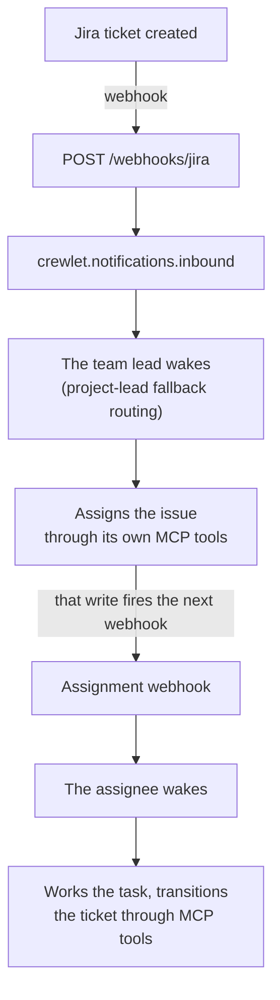

# Jira Integration

Crewlet integrates with Jira in two directions: agents control Jira via MCP tools, and Jira pushes events to agents via webhooks.

> **Prerequisites — the Atlassian side is set up by hand.** Atlassian offers no API for provisioning users, so the operator creates the Atlassian site (Cloud or Data Center) and each agent's Atlassian account and API token manually, then wires the tokens into `mcp_env` as shown below. Webhooks are registered the same way on both deployments (see [Webhooks](#webhooks-jira-pushes-to-agents)); the [Crewlet Forge app](https://github.com/crewlet/forge) is an optional alternative on Cloud.

---

## Setting it up from the dashboard

Atlassian appears as one tool on the Integrations screen, with Jira and
Confluence as sections, because one Atlassian account serves both. The first
field asks which Atlassian you run, and it decides every question after it:

**Atlassian Cloud** takes an organization id and an unscoped organization API
key, and nothing else about your sites. The engine reads them from the
organization: the site, its cloud id and its address are all discovered and
written into the config, so it does not ask you to copy values out of a
console it is already reading. It also creates one service account per agent
seat and mints that seat's token.

An address typed here would be worse than redundant. The config uses a site
address *instead of* the API gateway, and a service account's token
authenticates only at the gateway, so naming a site is what stops the seats
working. On Cloud the form does not offer the field at all.

**Atlassian Data Center** has no organization, no cloud id and no service
accounts, so there the address of each product is the only way in and it is
required, alongside that product's own token.

The engine generates the webhook credential each deployment needs (a signing
secret on Data Center, a URL token on Confluence Cloud) and the reconcile loop
registers the hook on its next tick, running the same pass
`crewlet jira provision` runs.

```yaml
integrations:
  atlassian:
    deployment: cloud            # or data_center; cloud is the default
    org_id: ${ATLASSIAN_ORG_ID}  # Cloud only, from admin.atlassian.com/o/<id>
    api_key: ${ATLASSIAN_ORG_API_KEY}
```

See [Running the provisioning pass](../reference/api-endpoints.md#running-the-provisioning-pass).

## Configuration

The `integrations.jira` block is **non-tool config** — the admin/service account for org-level REST calls (watcher lookups) and the inbound webhook secret. The Jira MCP *tool* server is a separate `mcp_servers` entry shared with Confluence (name it `atlassian`):

```yaml
integrations:
  jira:
    url: "${JIRA_URL}"                    # a Data Center instance, or a Cloud site
    # cloud_id: "${JIRA_CLOUD_ID}"        # an Atlassian Cloud id — give this OR url
    # site_url: "https://acme.atlassian.net"  # with cloud_id: the base for links people open
    token: "${JIRA_API_TOKEN}"            # API token (org read account)
    email: "${JIRA_EMAIL}"                # Cloud only — the account's email, for Basic auth
    webhook_secret: "${JIRA_WEBHOOK_SECRET}"  # Data Center: required, HMAC-SHA256

mcp_servers:
  - name: atlassian                     # shared by Jira + Confluence (one mcp-atlassian)
    shared: false                       # per-agent: each role supplies its own token
    command: uvx
    args: ["mcp-atlassian"]
    env:
      JIRA_URL: "${JIRA_URL}"           # declare explicitly — the engine does not inject it
```

> **Human-clickable links agents share:** with `cloud_id`, the `mcp-atlassian` tools return `api.atlassian.com/ex/jira/{cloud_id}/...` gateway URLs, which colleagues can't open. To have agents share a clickable `…atlassian.net/browse/{ISSUE-KEY}` link, set a [skill variable](../concepts/tool-skills.md#skill-variables) — `skill_variables.jira_base_url: "https://mycompany.atlassian.net"` — for your mention/link Tool Skill to reference. (The bundled `examples/tool-skills/platform-mentions.md` already references this variable.) Note Jira `browse` links are always *composed* by the agent (Jira tool results carry only REST self-links), so this prompt-layer variable is the primary fix here, not a fallback.

`url` and `cloud_id` are two ways to name one instance, so config validation refuses both together rather than resolving the ambiguity silently — the engine reads through the Cloud gateway when both are set, so the `url` would end up used for links only.

**Which REST version the engine speaks is derived, not declared.** Cloud serves `/rest/api/3` and names people by `accountId`; Data Center serves `/rest/api/2` — v3 is a 404 there — and names them by username. A `cloud_id`, or a host under `atlassian.net`, is Cloud; anything else is Data Center. Both identity fields are read wherever a person appears, so the same routing works on either.

**Which authentication scheme is used is decided by `email`.** With one, the engine sends `Basic base64(email:token)`, which is what Cloud requires; without one it sends a bearer token, which is what a Data Center personal access token wants. The same credential is rejected purely on which scheme carried it, so this field is not cosmetic.

**`site_url` is the base for links a person opens.** With a `cloud_id`, the REST base is `api.atlassian.com/ex/jira/{cloud_id}`, which is not somewhere a browser can go — so without `site_url` the engine omits the link from a notification rather than printing one that looks right and opens nothing. With a plain `url` it defaults to that.

On **Cloud**, `webhook_secret` is used exactly as it is on Data Center: the engine registers an admin webhook signed with it. Validation still does not *require* it for a Cloud config, because a company on the Forge relay has no HMAC in its path at all; what stops that being a silent gap is that the reconcile refuses to register a hook it cannot sign, and says so. The Forge route remains available and is verified by the app's invocation token against `integrations.forge_app_id`.

---

## MCP Server (Agents Control Jira)

The `atlassian` MCP server gives agents full Jira capabilities — creating issues, transitioning statuses, adding comments, managing assignees. Set `JIRA_URL` in the server's `env` — the engine does not derive it from `integrations.jira.url`. Naming the server `atlassian` also lets the engine enable the required `jira_users` toolset and scope the [Confluence knowledge search](confluence.md).

### Per-Unit Jira Projects

Declare the unit's Jira project under `integrations.jira.project` (its integration identity), and put each agent's token in `mcp_env.atlassian`:

```yaml
units:
  - name: Core
    type: team
    lead: CTO
    integrations:
      jira:
        project: "ENG"             # the unit's Jira project (integration identity)
    roles:
      - name: CTO
        mcp_env:
          atlassian: { JIRA_USERNAME: "${CTO_JIRA_USER}", JIRA_API_TOKEN: "${CTO_JIRA_TOKEN}" }
      - name: Engineer
        mcp_env:
          atlassian: { JIRA_USERNAME: "${ENG_JIRA_USER}", JIRA_API_TOKEN: "${ENG_JIRA_TOKEN}" }
```

(`mcp_env.atlassian` carries the `mcp-atlassian` server's env vars directly — `JIRA_USERNAME`, `JIRA_API_TOKEN`, the matching Confluence creds, and `JIRA_PROJECTS_FILTER` / `CONFLUENCE_SPACES_FILTER` for scoping — for any var the server reads. The unit's Jira project / Confluence space *identity* lives in the unit's `integrations.jira.project` / `integrations.confluence.space`, not in `mcp_env`.)

The project identity is set once on the unit's `integrations.jira.project` — it is integration identity (webhook routing + write home), not a tool credential, and it does not scope knowledge reads. The per-agent `mcp_env.atlassian` creds inherit `{**unit_mcp_env, **role_mcp_env}` (role-level overrides win), so each agent still authenticates as itself.

---

## Webhooks (Jira Pushes to Agents)

Both deployments register a webhook the same way, through the admin webhook API. On Cloud the **Crewlet Forge app** is an optional alternative.

### Jira Cloud — an admin webhook (the default)

**Cloud registers an ordinary webhook, exactly as Data Center does.** `crewlet jira provision -public-url https://your-engine.example.com` creates it, signs it with the secret in `integrations.jira.webhook_secret`, and the `/webhooks/jira` route verifies the `X-Hub-Signature` it sends.

This used to say Cloud needed the Forge app, on the premise that a Cloud webhook belongs to an app and refuses an API token. That is true of the **dynamic** webhook API (`/rest/api/3/webhook`), which answers `403 Only Connect and OAuth 2.0 apps can use this operation`. It is not true of the **admin** webhook API (`/rest/webhooks/1.0/webhook`), which is what the engine calls: a Jira administrator authenticates there with an ordinary API token, the hooks never expire, and every event and JQL filter is available.

The account whose token is in `integrations.jira.token` needs the **Administer Jira** global permission to register one.

Jira Cloud requires the URL to be **HTTPS with a certificate from a trusted CA**, and permits only a fixed set of ports (443 among them; **port 80 is rejected**). A tunnel such as `cloudflared` satisfies both; a self-signed certificate does not.

### Jira Cloud — the Forge app (optional)

The [Crewlet Forge app](https://github.com/crewlet/forge) remains supported and is the alternative when you would rather not expose an inbound URL to Jira directly, or you are already running it. It forwards these Jira issue events:

- `avi:jira:created:issue` — new ticket created
- `avi:jira:updated:issue` — ticket field changed (status, assignee, priority, etc.)
- `avi:jira:deleted:issue` — ticket deleted

Events are delivered via Forge Remote to `POST /webhooks/forge`. The Forge platform handles authentication automatically.


### Jira Data Center — Direct Webhook Registration

1. In Jira, go to **Settings** > **System** > **WebHooks**
2. Set URL to `https://your-server.com/webhooks/jira`
3. Select events: issue created / updated / deleted, and comment created / updated / deleted
4. Set a **Secret** for HMAC-SHA256 signature verification

Or let `crewlet jira provision -public-url https://your-server.com` register it for you — see [Provisioning](#provisioning).

Inbound requests are verified using **HMAC-SHA256** against the `X-Hub-Signature` header, at the route, before the delivery is recorded or published — the same point at which the GitHub and GitLab webhooks verify theirs. `POST /webhooks/jira` is exempt from the API's bearer token precisely *because* it authenticates by provider HMAC, so the check belongs there. Invalid or missing signatures are rejected with `401`.

**`integrations.public_base_url` is what a hook points at.** With none set, the reconcile registers nothing and the instance has nowhere to deliver to — so on Data Center that is reported as **degraded**, naming that field, rather than as a ready integration with no hook anywhere. Cloud is exempt: its events can arrive through the Forge app at an address this engine never registered, so silence there is a working company rather than a gap.

`webhook_secret` is therefore **required** for Data Center webhooks: without one the endpoint answers **503** with a `Retry-After`, exactly as its peers do, rather than accepting deliveries it cannot verify. That is deliberately not a 4xx — the sender's request is fine, what is missing is on this side, and a 4xx would tell it to discard a delivery nobody else has a copy of. The delivery waits at Jira and flows once the secret is set. Cloud is unaffected — those events arrive through the Forge app on `/webhooks/forge` and carry a JWT instead.

### Delivery deduplication

Jira states a per-delivery identifier on both deployments (`X-Atlassian-Webhook-Identifier`) and repeats it on its own retries, so the webhook edge claims each delivery fleet-wide before publishing it. A retry — Jira's own, or a replay an operator triggers from the admin page — is answered `200 {"status":"duplicate"}` and wakes nobody. The claim lasts five minutes. A Cloud event relayed through Forge carries no such header and is claimed on a **hash of the raw body** instead — the payload is what stays identical across a retry, and byte identity is deliberately preferred to derived coordinates, which can collapse two *different* events into one. See [Webhook deliveries are deduplicated at the edge](../reference/design-decisions.md#webhook-deliveries-are-deduplicated-at-the-edge).

### Routing strategy

Once an event passes signature verification and the delivery claim, the parser fans it out by the STRENGTH OF THE CLAIM ON THE RECIPIENT'S ATTENTION — because the first reason found for a person is the one that wins, and it is what the prompt renders. The actor is excluded from every step: they already know about their own change.

1. **@mentions** — every account named in a `mention` node inside the comment's [ADF](https://developer.atlassian.com/cloud/jira/platform/apis/document/structure/) body gets a copy with `routed_via = "mention"`. Jira's watcher list does not auto-include mentioned users, so this step is also the only one that covers a non-watcher who got @'d.
2. **Assignee** — the issue's assignee, if not already reached, gets `routed_via = "assignee"`.
3. **Watchers** — fetched from the Jira REST API with the `integrations.jira` org credential; each watcher not already reached gets `routed_via = "watcher"`. Without an org token this step is skipped and the integration still routes what the payload names.
4. **Project-lead fallback** — if steps 1–3 reached nobody in the org chart, the lead of the unit that owns the project (its `integrations.jira.project`) gets `routed_via = "project_lead_fallback"`. It does NOT fire when the actor is the issue's own assignee: somebody took the work in the open, so nothing has been lost.

Mentions lead deliberately. Jira adds a mentioned user to the watcher list, so both reasons are true on nearly every comment — and a fan-out that walked the watchers first would tell a colleague who was asked a direct question that they are merely "watching this issue".

A copy is only produced for somebody the engine can actually resolve: an agent seat whose Jira account is registered (see [Seat identity](#seat-identity)), or a human seat reached by the assignee's email address or by `contact.atlassian_account_id`. An ordinary Jira user who is not in the org chart is dropped rather than turned into an undeliverable notification.

The lead-fallback exists because a tracker's worst failure is not a misroute — it is a ticket filed into a project nobody watches, which produces no error anywhere and is discovered weeks later. A project with no lead in the org chart routes to nobody rather than to a guess, and logs `jira_project_has_no_lead` at boot.

### Lead-fallback prompt hint

When a lead receives an event via `project_lead_fallback`, the Jira notification prompt adds a `## Why You Received This` section that names the project, warns the lead that no one else is watching the issue, and lays out three explicit decisions:

- **Delegate** — look the right teammate up on the team and resolve their Jira account ID, then set the assignee (future updates route to them, not back to the lead).
- **Take it yourself** — assign the issue to yourself so the routing reflects reality.
- **Escalate** — if the issue is out of scope or the lead can't identify the right owner, hand it off to their own manager (named in the identity prompt) by commenting on the issue with an @mention or reassigning the issue to them. Lead-fallback fires only when nobody else is involved, so silently walking away would leave the issue unwatched and unhandled.

The hint is suppressed for `watcher` / `assignee` / `mention` routings — those carry their own signal of personal involvement and don't need the extra framing. The block deliberately describes the CAPABILITY ("set the assignee") rather than naming a tool, because the deployed MCP server's tool names are not knowable by the engine — see [Tool capabilities](../concepts/tool-capabilities.md).

The "if you have decided not to act, do not go quiet" rule is rendered only for `assignee` and `mention` routings. A watcher is not being asked for anything — watchers receive events because they once interacted — and telling one they owe an answer is precisely how a tracker fills up with "noted, thanks".

---

## Seat identity

A Jira webhook names people by account id, and nothing in the org chart declares which account a seat holds. Without that mapping every event names a stranger, every routing target is dropped, and the integration is silently inert.

So the engine **asks**: at boot and on every config apply it calls `/myself` with each seat's OWN credential and registers whatever account answers. The credential is read from `mcp_env.atlassian` or `mcp_env.jira` — Atlassian's own MCP server covers both products, so the documented entry is named `atlassian`; a Jira-only server is named `jira` — under `JIRA_API_TOKEN`, `JIRA_PERSONAL_TOKEN`, `JIRA_TOKEN`, `ATLASSIAN_API_TOKEN` or `Authorization`, with the account address under `JIRA_USERNAME`, `JIRA_EMAIL` or `ATLASSIAN_EMAIL`. The engine names no variable of its own: it reads the ones the seat's tools already use. Declaring the account id beside the token would be cheaper and is the wrong shape: a declaration that disagrees with the credential is a misroute nothing can detect.

Lookups are cached on the credential, so a config apply that changed something else costs nothing; a rotated token is a cache miss and costs exactly one request. A seat whose lookup fails is left unresolved rather than failing the boot, and logs `jira_seat_identity_unresolved` — it receives no Jira events until the next apply re-resolves it. A company where no seat resolved logs `jira_has_no_seat_identities`.

A **human** seat holds no tool credential and is never probed for one. Give them `contact.atlassian_account_id` (one id covers Jira and Confluence) and they are registered from config; failing that, an issue assigned to them still routes by the assignee's email address.

---

## Provisioning

```bash
crewlet jira provision company.yaml -secret-store -public-url https://engine.example.com
```

Jira issues no credentials on a provisioner's behalf — a Cloud API token is created by the person it belongs to, and a Data Center personal access token can only be minted for the calling user — so this command reports far more than it changes. It does the three things Jira genuinely allows, each of which answers a question that is otherwise invisible until an issue reaches nobody:

- **Which account each seat's credential authenticates as**, and which seats have none. A seat with no account id receives nothing, and nothing else in the engine says so.
- **Whether every project the org chart names exists**, and whether Jira's own project lead agrees with the org chart's. A disagreement is reported, never failed: a human manager owning a project while an agent triages it is an ordinary arrangement. A project the instance does not have is almost always a typo, and the typo is a routing gap nothing else reports.
- **The inbound webhook**, on Data Center: registered at `<public-url>/webhooks/jira`, subscribed to exactly the events the parser routes, with the whole body and an HMAC secret. If `webhook_secret` resolves to nothing, a fresh secret is minted into the `${VAR}` it points at and recorded in the sink you chose. A secret that already resolves is used as-is — re-registering with a fresh one would make the instance sign every delivery with a key the running engine does not hold. `-recreate-webhook` forces a rotation, which invalidates the secret every other deployment of this company holds.

On **Cloud** the webhook is registered exactly as it is on Data Center, through the admin webhook API. The account needs the *Administer Jira* global permission. If you are on the Forge relay instead, leave `-public-url` off and the step is skipped.

Without `-public-url` nothing is registered and the run says so. A hook pointing at the wrong host is worse than no hook, because the instance then reports a healthy integration that delivers into the void. A hook somebody else registered is reported and never touched.

Flags: `-secret-store` / `-env-file PATH` / `-print` (where a minted secret goes — exactly one is required), `-public-url URL`, `-recreate-webhook`, `-dry-run` (read and report, register nothing).

---

## How It Works

Task state lives in Jira — the engine mirrors nothing. Webhooks become `ExternalNotification` inbox events for the routed agents (watchers, assignee, @-mentions, project-lead fallback), and every write back to Jira happens through the agents' own MCP tools:



There is no engine-side sync layer, no completion-comment automation, and no reconciliation poller: each MCP-tool action an agent takes fires the next webhook, which wakes the next participant — the same loop a human teammate drives. A webhook delivery that is lost is recovered the way it would be for a human: the issue's next activity (a comment, a transition, a nudge from a colleague) re-notifies the routed agents.

See [Task Engine](../concepts/task-engine.md) for why the engine keeps no task state of its own.
