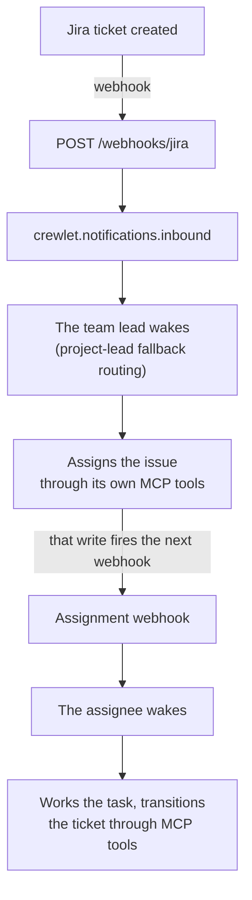

# Jira Integration

Crewlet integrates with Jira in two directions: agents control Jira via MCP tools, and Jira pushes events to agents via webhooks.

> **Prerequisites — on Data Center the Atlassian side is set up by hand.** There is no organization admin API on Data Center and a personal access token can only be minted for the calling user, so the operator creates the instance, each agent's account and each agent's token, then wires the tokens into `mcp_env` as shown below. On **Cloud** that is no longer true: `crewlet atlassian provision` creates one service account per agent seat, mints its credential into the `${VAR}` the seat's `mcp_env` already references and grants its Jira licence — see [Atlassian Organization](atlassian.md). Either way the site and its projects are yours to create, and the permissions an agent holds in a project stay yours to grant. Webhooks differ by deployment too: **Cloud** events arrive via the [Crewlet Forge app](https://github.com/crewlet/forge); **Data Center** uses direct webhook registration (see [Webhooks](#webhooks-jira-pushes-to-agents)).

---

## Configuration

The `integrations.jira` block is **non-tool config** — the admin/service account for org-level REST calls (watcher lookups) and the inbound webhook secret. The Jira MCP *tool* server is a separate `mcp_servers` entry shared with Confluence (name it `atlassian`):

```yaml
integrations:
  jira:
    url: "${JIRA_URL}"                    # a Data Center instance, or a Cloud site
    # cloud_id: "${JIRA_CLOUD_ID}"        # an Atlassian Cloud id — give this OR url
    # site_url: "https://acme.atlassian.net"  # with cloud_id: the base for links people open
    token: "${JIRA_ADMIN_TOKEN}"          # API token (org read account) — do not
                                          # reuse a name a seat's mcp_env reads
    email: "${JIRA_EMAIL}"                # Cloud only — the account's email, for Basic auth
    webhook_secret: "${JIRA_WEBHOOK_SECRET}"  # Data Center: required, HMAC-SHA256

mcp_servers:
  - name: atlassian                     # shared by Jira + Confluence (one mcp-atlassian)
    shared: false                       # per-agent: each role supplies its own token
    command: uvx
    args: ["mcp-atlassian"]
    env:
      JIRA_URL: "${JIRA_URL}"           # declare explicitly — the engine does not inject it
```

> **Human-clickable links agents share:** with `cloud_id`, the `mcp-atlassian` tools return `api.atlassian.com/ex/jira/{cloud_id}/...` gateway URLs, which colleagues can't open. To have agents share a clickable `…atlassian.net/browse/{ISSUE-KEY}` link, set a [skill variable](../concepts/tool-skills.md#skill-variables) — `skill_variables.jira_base_url: "https://mycompany.atlassian.net"` — for your mention/link Tool Skill to reference. (The bundled `examples/tool-skills/platform-mentions.md` already references this variable.) Note Jira `browse` links are always *composed* by the agent (Jira tool results carry only REST self-links), so this prompt-layer variable is the primary fix here, not a fallback.

`url` and `cloud_id` are two ways to name one instance, so config validation refuses both together rather than resolving the ambiguity silently — the engine reads through the Cloud gateway when both are set, so the `url` would end up used for links only.

**Which REST version the engine speaks is derived, not declared.** Cloud serves `/rest/api/3` and names people by `accountId`; Data Center serves `/rest/api/2` — v3 is a 404 there — and names them by username. A `cloud_id`, or a host under `atlassian.net`, is Cloud; anything else is Data Center. Both identity fields are read wherever a person appears, so the same routing works on either.

**Which authentication scheme is used is decided by `email`.** With one, the engine sends `Basic base64(email:token)`, which is what Cloud requires; without one it sends a bearer token, which is what a Data Center personal access token wants. The same credential is rejected purely on which scheme carried it, so this field is not cosmetic.

**`site_url` is the base for links a person opens.** With a `cloud_id`, the REST base is `api.atlassian.com/ex/jira/{cloud_id}`, which is not somewhere a browser can go — so without `site_url` the engine omits the link from a notification rather than printing one that looks right and opens nothing. With a plain `url` it defaults to that.

For **Cloud** webhooks, install the [Crewlet Forge app](https://github.com/crewlet/forge) which forwards events via Forge Remote to `POST /webhooks/forge`; that route is verified by the app's invocation token against `integrations.forge_app_id`. The `webhook_secret` field is only used for Data Center deployments, and validation does not require it for a Cloud config.

---

## MCP Server (Agents Control Jira)

The `atlassian` MCP server gives agents full Jira capabilities — creating issues, transitioning statuses, adding comments, managing assignees. Set `JIRA_URL` in the server's `env` — the engine does not derive it from `integrations.jira.url`. Naming the server `atlassian` also lets the engine enable the required `jira_users` toolset and scope the [Confluence knowledge search](confluence.md).

### Per-Unit Jira Projects

Declare the unit's Jira project under `integrations.jira.project` (its integration identity), and put each agent's token in `mcp_env.atlassian`:

```yaml
units:
  - name: Core
    type: team
    lead: CTO
    integrations:
      jira:
        project: "ENG"             # the unit's Jira project (integration identity)
    roles:
      - name: CTO
        mcp_env:
          atlassian: { JIRA_USERNAME: "${CTO_JIRA_USER}", JIRA_API_TOKEN: "${CTO_JIRA_TOKEN}" }
      - name: Engineer
        mcp_env:
          atlassian: { JIRA_USERNAME: "${ENG_JIRA_USER}", JIRA_API_TOKEN: "${ENG_JIRA_TOKEN}" }
```

(`mcp_env.atlassian` carries the `mcp-atlassian` server's env vars directly — `JIRA_USERNAME`, `JIRA_API_TOKEN`, the matching Confluence creds, and `JIRA_PROJECTS_FILTER` / `CONFLUENCE_SPACES_FILTER` for scoping — for any var the server reads. The unit's Jira project / Confluence space *identity* lives in the unit's `integrations.jira.project` / `integrations.confluence.space`, not in `mcp_env`.)

The project identity is set once on the unit's `integrations.jira.project` — it is integration identity (webhook routing + write home), not a tool credential, and it does not scope knowledge reads. The per-agent `mcp_env.atlassian` creds inherit `{**unit_mcp_env, **role_mcp_env}` (role-level overrides win), so each agent still authenticates as itself.

---

## Webhooks (Jira Pushes to Agents)

Jira Cloud and Data Center use different webhook models. Cloud uses the **Crewlet Forge app**; Data Center uses direct webhook registration.

### Jira Cloud — Forge App

Install the [Crewlet Forge app](https://github.com/crewlet/forge) from the Atlassian Marketplace (or via a private installation link). The Forge app currently forwards these Jira issue events to the Crewlet backend:

- `avi:jira:created:issue` — new ticket created
- `avi:jira:updated:issue` — ticket field changed (status, assignee, priority, etc.)
- `avi:jira:deleted:issue` — ticket deleted

Events are delivered via Forge Remote to `POST /webhooks/forge`. The Forge platform handles authentication automatically.


### Jira Data Center — Direct Webhook Registration

1. In Jira, go to **Settings** > **System** > **WebHooks**
2. Set URL to `https://your-server.com/webhooks/jira`
3. Select events: issue created / updated / deleted, and comment created / updated / deleted
4. Set a **Secret** for HMAC-SHA256 signature verification

Or let `crewlet jira provision -public-url https://your-server.com` register it for you — see [Provisioning](#provisioning).

Inbound requests are verified using **HMAC-SHA256** against the `X-Hub-Signature` header, at the route, before the delivery is recorded or published — the same point at which the GitHub and GitLab webhooks verify theirs. `POST /webhooks/jira` is exempt from the API's bearer token precisely *because* it authenticates by provider HMAC, so the check belongs there. Invalid or missing signatures are rejected with `401`.

`webhook_secret` is therefore **required** for Data Center webhooks: without one the endpoint answers **503** with a `Retry-After`, exactly as its peers do, rather than accepting deliveries it cannot verify. That is deliberately not a 4xx — the sender's request is fine, what is missing is on this side, and a 4xx would tell it to discard a delivery nobody else has a copy of. The delivery waits at Jira and flows once the secret is set. Cloud is unaffected — those events arrive through the Forge app on `/webhooks/forge` and carry a JWT instead.

### Delivery deduplication

Jira states a per-delivery identifier on both deployments (`X-Atlassian-Webhook-Identifier`) and repeats it on its own retries, so the webhook edge claims each delivery fleet-wide before publishing it. A retry — Jira's own, or a replay an operator triggers from the admin page — is answered `200 {"status":"duplicate"}` and wakes nobody. The claim lasts five minutes. A Cloud event relayed through Forge carries no such header and is claimed on a **hash of the raw body** instead — the payload is what stays identical across a retry, and byte identity is deliberately preferred to derived coordinates, which can collapse two *different* events into one. See [Webhook deliveries are deduplicated at the edge](../reference/design-decisions.md#webhook-deliveries-are-deduplicated-at-the-edge).

### Routing strategy

Once an event passes signature verification and the delivery claim, the parser fans it out by the STRENGTH OF THE CLAIM ON THE RECIPIENT'S ATTENTION — because the first reason found for a person is the one that wins, and it is what the prompt renders. The actor is excluded from every step: they already know about their own change.

1. **@mentions** — every account named in a `mention` node inside the comment's [ADF](https://developer.atlassian.com/cloud/jira/platform/apis/document/structure/) body gets a copy with `routed_via = "mention"`. Jira's watcher list does not auto-include mentioned users, so this step is also the only one that covers a non-watcher who got @'d.
2. **Assignee** — the issue's assignee, if not already reached, gets `routed_via = "assignee"`.
3. **Watchers** — fetched from the Jira REST API with the `integrations.jira` org credential; each watcher not already reached gets `routed_via = "watcher"`. Without an org token this step is skipped and the integration still routes what the payload names.
4. **Project-lead fallback** — if steps 1–3 reached nobody in the org chart, the lead of the unit that owns the project (its `integrations.jira.project`) gets `routed_via = "project_lead_fallback"`. It does NOT fire when the actor is the issue's own assignee: somebody took the work in the open, so nothing has been lost.

Mentions lead deliberately. Jira adds a mentioned user to the watcher list, so both reasons are true on nearly every comment — and a fan-out that walked the watchers first would tell a colleague who was asked a direct question that they are merely "watching this issue".

A copy is only produced for somebody the engine can actually resolve: an agent seat whose Jira account is registered (see [Seat identity](#seat-identity)), or a human seat reached by the assignee's email address or by `contact.atlassian_account_id`. An ordinary Jira user who is not in the org chart is dropped rather than turned into an undeliverable notification.

The lead-fallback exists because a tracker's worst failure is not a misroute — it is a ticket filed into a project nobody watches, which produces no error anywhere and is discovered weeks later. A project with no lead in the org chart routes to nobody rather than to a guess, and logs `jira_project_has_no_lead` at boot.

### Lead-fallback prompt hint

When a lead receives an event via `project_lead_fallback`, the Jira notification prompt adds a `## Why You Received This` section that names the project, warns the lead that no one else is watching the issue, and lays out three explicit decisions:

- **Delegate** — look the right teammate up on the team and resolve their Jira account ID, then set the assignee (future updates route to them, not back to the lead).
- **Take it yourself** — assign the issue to yourself so the routing reflects reality.
- **Escalate** — if the issue is out of scope or the lead can't identify the right owner, hand it off to their own manager (named in the identity prompt) by commenting on the issue with an @mention or reassigning the issue to them. Lead-fallback fires only when nobody else is involved, so silently walking away would leave the issue unwatched and unhandled.

The hint is suppressed for `watcher` / `assignee` / `mention` routings — those carry their own signal of personal involvement and don't need the extra framing. The block deliberately describes the CAPABILITY ("set the assignee") rather than naming a tool, because the deployed MCP server's tool names are not knowable by the engine — see [Tool capabilities](../concepts/tool-capabilities.md).

The "if you have decided not to act, do not go quiet" rule is rendered only for `assignee` and `mention` routings. A watcher is not being asked for anything — watchers receive events because they once interacted — and telling one they owe an answer is precisely how a tracker fills up with "noted, thanks".

---

## Seat identity

A Jira webhook names people by account id, and nothing in the org chart declares which account a seat holds. Without that mapping every event names a stranger, every routing target is dropped, and the integration is silently inert.

So the engine **asks**: at boot and on every config apply it calls `/myself` with each seat's OWN credential and registers whatever account answers. Declaring the account id beside the token would be cheaper and is the wrong shape: a declaration that disagrees with the credential is a misroute nothing can detect.

**One walk now resolves both products.** The credential is read once per seat, by one grammar shared with [Confluence](confluence.md) and with [`crewlet atlassian provision`](atlassian.md#the-seat-credential-contract): from `mcp_env.atlassian`, `mcp_env.jira` or `mcp_env.confluence` — Atlassian's own MCP server covers both products, so the documented entry is named `atlassian`, while a single-product deployment names its server for its product — under `ATLASSIAN_API_TOKEN`, `JIRA_API_TOKEN`, `JIRA_PERSONAL_TOKEN`, `JIRA_TOKEN`, `CONFLUENCE_API_TOKEN`, `CONFLUENCE_PERSONAL_TOKEN`, `CONFLUENCE_TOKEN` or `Authorization` (a leading `Bearer ` is stripped, so the HTTP-MCP shape resolves like any other), with the account address under `ATLASSIAN_EMAIL`, `JIRA_USERNAME`, `JIRA_EMAIL`, `CONFLUENCE_USERNAME` or `CONFLUENCE_EMAIL`. The block that **holds a token** is the one read, not the first that exists by name order — a company with both an `atlassian` and a `jira` entry has the credential in exactly one of them, and picking the empty one by position reports a working seat as having none. The engine names no variable of its own: it reads the ones the seat's tools already use.

**Both identity endpoints are asked, and each answer is registered in its own product's namespace.** Jira's `/myself` and Confluence's `/user/current` are called with the same seat credential, and that is what fixed the wiki: until this change nothing in the engine registered a Confluence identity at all, so Confluence's party namespace was permanently empty for agent seats — a page mentioning an agent resolved to nobody, the page-subscription ledger was never written, an agent was never suppressed as the actor of its own edit, and every page event fell through to the space lead. The parser had been correct the whole time; it was asking a registry nothing had ever written to.

Asking twice is not redundant. On Cloud both endpoints answer the same account id, so the second call confirms the first; on Data Center they answer *different* things — Jira's `name` against Confluence's `userKey` — and registering one product's answer under the other's namespace is exactly the misroute this exists to prevent. The namespaces stay separate for the same reason: merged, a company running only Jira would resolve the wiki's events too, against a credential Confluence never checked.

Lookups run concurrently, bounded by the number of *distinct* credentials, and are cached on the credential **and** the product — so a config apply that changed something else costs nothing, and a rotated token is a cache miss costing exactly one request per product. A seat whose lookup fails is left unresolved rather than failing the boot, and logs `atlassian_seat_identity_unresolved product=… seats=a,b error=…` — **the seats are named**, because one credential can serve several of them and the diagnosis this line exists to give is which handle stopped receiving events; a line naming only the product sends an operator grepping for a handle that is not in the log. It is emitted once per distinct credential, per product, so a company whose seats share one credential gets one line rather than one per seat. Those seats receive no events from that product until the next apply re-resolves them. A company where no seat resolved logs `jira_has_no_seat_identities`, and the wiki logs `confluence_has_no_seat_identities` separately: a company whose tracker identities all resolved and whose wiki identities all failed has one integration working and one inert, which a single total would report as healthy. Two seats whose credentials answer with the same account are refused with `atlassian_seat_identity_refused`, because otherwise that account's events go to whichever seat won the registration.

A **human** seat holds no tool credential and is never probed for one. Give them `contact.atlassian_account_id` (one id covers Jira and Confluence) and they are registered from config; failing that, an issue assigned to them still routes by the assignee's email address.

---

## Provisioning

```bash
crewlet jira provision company.yaml -secret-store -public-url https://engine.example.com
```

**This is the Data Center path, and on Data Center Jira issues no credentials on a provisioner's behalf** — there is no organization admin API, and a personal access token can only be minted for the calling user — so the command reports far more than it changes. On **Cloud** that refusal holds only for a *user* account: an organization API key created without scopes creates *service* accounts, mints their tokens and grants their product licences, which is what [`crewlet atlassian provision`](atlassian.md) does. This command still runs usefully against a Cloud site — it reports the same seat identities and the same project agreement — but the accounts come from the other one, and its third duty has nothing to do there.

The run opens by asking `/myself` with the org credential in `integrations.jira.token`, and a refusal ends it before anything is read or written: nothing else the report said would be trustworthy, and the one write this command makes should not land against an instance the engine cannot read back. It then does the three things Jira genuinely allows, each of which answers a question that is otherwise invisible until an issue reaches nobody:

- **Which account each seat's credential authenticates as**, and which seats have none. Every agent seat is asked concurrently, with its own credential, so a slow instance costs one round trip rather than one per seat; a seat whose lookup fails is reported unresolved rather than failing the run, because the finding *is* the report. A seat with no credential under `mcp_env.atlassian`, `mcp_env.jira` or `mcp_env.confluence` is named as receiving no Jira events at all — it receives nothing, and nothing else in the engine says so.
- **Whether every project the org chart names exists**, and whether Jira's own project lead agrees with the org chart's. A disagreement is reported, never failed: a human manager owning a project while an agent triages it is an ordinary arrangement, so both ideas of ownership are printed side by side and you decide whether they should agree. A project the instance does not have is almost always a typo, and the typo is a routing gap nothing else reports.
- **The inbound webhook**, on Data Center: registered at `<public-url>/webhooks/jira`, subscribed to exactly the six events the parser routes (`jira:issue_created` / `_updated` / `_deleted` and `comment_created` / `_updated` / `_deleted`), with the whole body — `excludeBody` is false, since a delivery with no payload is a wake-up naming nobody — and an HMAC secret. A hook already registered at that same URL is converged in place rather than duplicated; hooks pointing anywhere else belong to somebody else and are left alone.

**A fresh secret is not minted on every run, and that is the difference between a re-runnable command and an outage.** If `webhook_secret` resolves to nothing, a fresh secret is minted into the `${VAR}` it points at and recorded in the sink you chose. A secret that already resolves is used as it is: the engine is running with that value, and re-registering with a new one would make the instance sign every delivery with a key the running engine does not hold — every webhook refused at the edge, from a command whose whole promise is that it is safe to re-run. A `webhook_secret` that is neither resolvable nor a whole `${VAR}` reference fails the run naming the field, because there is nowhere to mint into. `-recreate-webhook` forces the rotation for an operator who has planned the restart, and it invalidates the secret every other deployment of this company holds.

On **Cloud** the webhook step is skipped with a note rather than attempted: a dynamic webhook there belongs to an app, so the endpoint refuses an API token however privileged it is. Cloud events arrive through the [Forge app](#jira-cloud--forge-app) on `/webhooks/forge`, verified by its invocation token against `integrations.forge_app_id` — there is no HMAC secret in that path at all.

Without `-public-url` nothing is registered and the run says so. A hook pointing at the wrong host is worse than no hook, because the instance then reports a healthy integration that delivers into the void.

### Flags

| Flag | Description |
|------|-------------|
| `company.yaml` (positional) | The Tier B company document — exactly one |
| `-public-url URL` | This deployment's **public base address**, e.g. `https://engine.example.com` — *not* a webhook path. The engine owns its inbound routes and derives `/webhooks/jira` itself, so there is no path to mistype. **Omit to register nothing** |
| `-recreate-webhook` | Delete and remake the hook to mint a fresh secret. It invalidates the secret every other deployment of this company holds, so it is a deliberate rotation rather than a repair |
| `-secret-store` | Record a minted webhook secret in the encrypted [secret store](../concepts/secret-store.md) — the engine reads it back directly, so there is nothing to source, and against a running node every peer reads it too. Needs a Tier A keyring (`-config`) |
| `-env-file PATH` | Record it into this `.env` file instead |
| `-print` | Print it to stdout and persist nothing |
| `-config PATH` | Tier A config naming this node's store and secret keyring (default `crewlet.yaml`). Read on **every** run, not only the ones that write: the company's `${VAR}`s resolve through the store ahead of the environment, and a run that saw only the environment would read an empty string for the webhook secret already rotated into the store — and empty is the signal to mint |
| `-api URL` | With `-secret-store`, the running node to record through; default is the `api.host:port` in `-config` |
| `-dry-run` | Read and report, and register nothing. The sink is not opened either, so nothing is created, locked or written: the `-env-file` sink creates its file at `0600` on open, and `-secret-store` probes the store's lock and may reach a running node |

Exactly one of `-secret-store`, `-env-file` and `-print` is required on any run that is not `-dry-run` — including a Cloud run that will mint nothing, since whether a secret has to be minted is not known until the instance has been read. Two are refused rather than ordered by precedence: writing to both doubles the number of copies of a live credential.

---

## How It Works

Task state lives in Jira — the engine mirrors nothing. Webhooks become `ExternalNotification` inbox events for the routed agents (watchers, assignee, @-mentions, project-lead fallback), and every write back to Jira happens through the agents' own MCP tools:



There is no engine-side sync layer, no completion-comment automation, and no reconciliation poller: each MCP-tool action an agent takes fires the next webhook, which wakes the next participant — the same loop a human teammate drives. A webhook delivery that is lost is recovered the way it would be for a human: the issue's next activity (a comment, a transition, a nudge from a colleague) re-notifies the routed agents.

See [Task Engine](../concepts/task-engine.md) for why the engine keeps no task state of its own.
