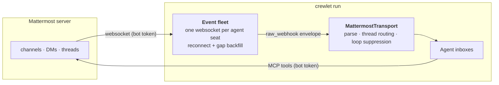
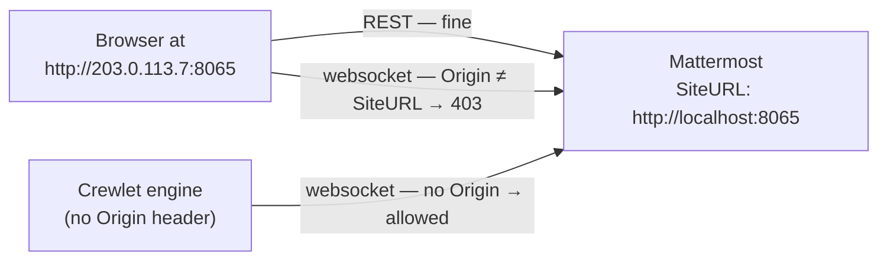

# Mattermost Integration

Mattermost is the **self-hosted, open-source** chat backend: one bot account
per agent, on a server you run. It is the alternative to
[Slack](slack.md) for orgs that want the conversational surface inside their
own infrastructure.

> **Prerequisites.** A Mattermost server you administer, and a **team** the
> agents will live in. Crewlet never creates top-level tenancy — create the
> server and the team yourself, then let
> [`crewlet mattermost provision`](#automated-setup-crewlet-mattermost-provision)
> fill it with agent bots.
>
> Unlike Slack, the engine does **not** need to be reachable from the chat
> server: it opens outbound websockets rather than receiving webhooks, so a
> Crewlet running on a laptop against a self-hosted Mattermost needs no
> tunnel and no public URL.
>
> That is a statement about the **engine**. The Mattermost **server** still
> has to know the address browsers reach it on — read [The Site
> URL](#the-site-url) before you deploy anywhere but localhost; getting it
> wrong costs every human live updates while the agents keep working.

---

## How this differs from Slack

One structural difference shapes the whole integration: **Mattermost has no
usable inbound webhook.**

Its outgoing webhooks fire only in *public* channels — the server returns
early for anything that is not `ChannelTypeOpen` — so DMs and private
channels would never be delivered at all. And their payload carries no
`root_id` (no thread attribution), no channel type and no mention list, so
even public-channel traffic could not be routed the way Slack's is.

The supported path for an external service is the **WebSocket event API**,
authenticated per user. So the engine holds **one connection per
Mattermost-enabled agent seat**, and each connection republishes what it
receives onto the same internal envelope every webhook route uses — which is
what lets coalescing, the prompt registry and the dashboard stay unaware that
this source arrived over a socket.



What this buys you, compared with Slack:

| | Slack | Mattermost |
|---|---|---|
| Credentials per agent | 2 (bot token + signing secret) | **1** (bot token) |
| Manual steps per agent | An OAuth **Allow** click, per app | **none** |
| Engine must be publicly reachable | yes (Events API) | **no** [^siteurl] |
| Mention detection | inferred from text markup | **server-computed** list |
| Channel vs DM | inferred (`channel_type`, `D`-prefix) | **server-stamped** |
| Working-status text | free text, per phase | fixed *"is typing…"* |

The last row is the one real regression — see
[Working status](#working-status).

[^siteurl]: The *engine* needs no public URL. The *server* still needs its
    [Site URL](#the-site-url) set to the address browsers use.

---

## The Site URL

One Mattermost setting decides whether the product works for the humans in
it, and it fails silently in both directions. Get this right first.

`ServiceSettings.SiteURL` must be **the address people type into their
browser** — scheme, host and port, exactly. Not `localhost` because the
server runs there; not an internal DNS name because the engine uses it. The
address in the address bar.

Two things read it, and both break when it is wrong:

- **The websocket origin check.** Mattermost accepts a websocket upgrade
  only from a browser whose `Origin` header matches SiteURL's host *and*
  scheme ([`App.OriginChecker`](https://github.com/mattermost/mattermost/blob/master/server/channels/app/server.go)).
  A mismatch is answered `403`, the web app retries and gives up, and it
  falls back to fetching messages when you navigate. Nothing is reported as
  broken — the symptom is *"I have to refresh to see the reply"*.
- **Every absolute URL the server and its plugins build.** Email links,
  OAuth redirects and the prepackaged plugins all use SiteURL. A browser
  loading `http://203.0.113.7:8065` with SiteURL still on localhost issues
  requests to `http://localhost:8065/plugins/…` — against the *reader's*
  machine, which refuses them.



**The engine is exempt.** The origin check passes any client that sends no
`Origin` header, which every non-browser client does, so Crewlet's per-seat
sockets keep working while the humans' web app is blind. An agent answers
your message; you just cannot see it until you reload. That asymmetry is
what makes this look like an engine bug when it is a server setting.

### Getting it right

The compose stack reads `MATTERMOST_PUBLIC_URL`, and
[`scripts/mattermost-dev-bootstrap.sh`](#local-testing) settles it for you:
it derives the address (explicit variable → the address you reached the host
on over SSH → `localhost`), makes the server agree, persists it to `.env`,
and refuses to finish while the two disagree.

```bash
MATTERMOST_PUBLIC_URL=http://203.0.113.7:8065 \
  docker compose --profile mattermost up -d --wait
scripts/mattermost-dev-bootstrap.sh
```

Verify it from anywhere, with no credential — this must print the address
you browse to:

```bash
curl -s "http://203.0.113.7:8065/api/v4/config/client?format=old" \
  | python3 -c 'import sys,json; print(json.load(sys.stdin)["SiteURL"])'
```

Or let the engine's own check do it, which also proves a browser-shaped
upgrade and every seat's socket:

```bash
crewlet mattermost doctor my_company.yaml
```

Two things that do **not** work, and cost an afternoon each:

- **Changing it in the System Console.** An `MM_*` environment variable
  outranks the stored config and is re-applied on every write, so the field
  is read-only and `PUT /api/v4/config/patch` silently reverts. For the
  compose stack the container has to be recreated with the new value.
- **Setting `AllowCorsFrom: "*"`.** It restores live updates by disabling
  the origin check, and in doing so grants credentialed cross-origin access
  to the whole REST API from any site a signed-in user visits. It also
  leaves SiteURL wrong, so the links and plugins stay broken. Use it only to
  name additional legitimate origins, explicitly, never `*`.

---

## Configure in YAML

`integrations.mattermost` enables the transport and the websocket fleet. The
Mattermost **MCP tool** server is a separate `mcp_servers` entry
(`shared: false`). Per agent, the same `${VAR}` names the token in both
places — one credential, three readers (websocket, REST, MCP), no secret
duplicated:

```yaml
integrations:
  mattermost:
    enabled: true
    url: "https://chat.nimbus.example"    # instance base URL (required)
    team: nimbus                          # team slug (required)
    typing_status: off                    # off (default) | addressed | always
    provisioning:              # consumed ONLY by the CLI, ignored by the engine
      username_prefix: ""      # e.g. "agent-" if humans share the server
      channels: [town-square, engineering]   # channels every bot joins
      display_name_suffix: " (AI)"

mcp_servers:
  - name: mattermost
    shared: false                        # per-agent identity
    command: uvx
    args: ["mcp-server-mattermost"]
    env:
      MATTERMOST_URL: "https://chat.nimbus.example"
    tool_prefix: "mattermost_"

units:
  - name: Core
    type: team
    lead: Engineer
    roles:
      - name: Engineer
        integrations:                              # per-agent transport identity
          mattermost:
            bot_token: "${MATTERMOST_TOKEN_ENGINEER}"
            channel: engineering                   # optional default channel
        mcp_env:
          mattermost:
            MATTERMOST_TOKEN: "${MATTERMOST_TOKEN_ENGINEER}"   # same token
```

Write this block **first**, with `${VAR}` placeholders — the provisioner
reads the placeholder names out of the YAML and mints exactly those
variables. A whole-value placeholder is required
(`"${MATTERMOST_TOKEN_ENGINEER}"`, not a literal token) so the provisioner
knows which variable to write into; a literal marks a manually managed bot,
which is reported and left untouched.

### Fields

| Field | Meaning |
|---|---|
| `url` | Instance base URL. Required when enabled. |
| `team` | Team slug agents belong to. Required — channels are team-scoped. |
| `typing_status` | `off` (default) / `addressed` / `always`. See [Working status](#working-status). |
| `provisioning.username_prefix` | Prepended to each handle to form the bot username. |
| `provisioning.channels` | Channels every agent bot is added to. |
| `provisioning.display_name_suffix` | Appended to each bot's display name. |

Per role, under `integrations.mattermost`:

| Field | Meaning |
|---|---|
| `bot_token` | The bot's personal access token. `${VAR}` ⇒ provisionable. |
| `username` | Bot username. Defaults to the handle (with the prefix applied). |
| `channel` | Optional default channel name for outbound notifications. |

There is deliberately **no `status_phrases`** here: Mattermost's indicator
wording belongs to the client, so no text the engine supplied would ever be
rendered. The setting exists only under `integrations.slack`.

---

## Automated Setup: `crewlet mattermost provision`

```
export MATTERMOST_ADMIN_TOKEN="..."      # a system-admin personal access token
crewlet mattermost provision company.yaml
```

For every Mattermost-enabled agent seat the command:

1. **finds or creates the bot account** at a deterministic username
   (`{username_prefix}{handle}`, or an explicit `username`);
2. **re-enables it** if a previous decommission disabled it — a disabled bot
   still owns its username, so creating over it fails with a conflict nothing
   else would explain;
3. keeps its **display name** current (`{role name}{display_name_suffix}`);
4. adds it to the **team** and to every configured **channel** — a bot only
   receives messages from channels it is a member of, so this is the step
   that makes the integration work at all;
5. mints its **personal access token** into the config's own `${VAR}`,
   write-through (Mattermost returns a token's value exactly once).

There is no app manifest, no local ledger and no OAuth click. Mattermost can
enumerate its own bots, so reconcile is stateless — delete nothing, re-run
freely. One seat failing is recorded as a `FAILED` line and the remaining
agents still provision; the command then exits non-zero, and re-running
resumes exactly the failed seats.

Before it writes anything, a preflight refuses the run when it cannot
finish: a credential that is not a system admin, a team that does not exist,
`ServiceSettings.EnableBotAccountCreation` or
`ServiceSettings.EnableUserAccessTokens` switched off (both default to
**false** on a fresh install, and both fail *late* — every bot created and
joined, then nothing minted), and a loopback [Site URL](#the-site-url) on a
server reached at a real address, which would leave every browser without
live updates. Membership is **verified**, never inferred from a status code:
Mattermost answers an add for an existing member with success, so a 4xx
there is a real failure, and a configured channel that does not exist fails
its seat rather than passing as a note — a bot hears nothing from a channel
it is not in.

"Already provisioned" is checked against the server as well as the env file.
"Already provisioned" is **proven by using the credential**, not inferred.
The reconcile takes the value the `${VAR}` actually holds and authenticates
with it: only a token that answers as *this seat's bot* counts. A `${VAR}`
holding a token that has since been revoked — by `--decommission`, by an
admin, by a restore from an older `.env` — is re-minted, so the documented
recovery below actually recovers; so is one that authenticates as a
different account, which is how a copy-pasted var gets caught.

The weaker test — "the bot has *some* live `crewlet-engine` token" — reads
as provisioned in exactly the case that matters. A run whose mint reached
the server but whose response was lost leaves a live token this tool never
saw; that token would then vouch for the dead value in the env file, on
every run, forever. A 5xx or a network failure during the check is *not* a
rejection: the seat is left exactly as it was, with a note, because
re-minting on "cannot tell" destroys a credential that works.

A seat's own `${VAR}`s are the only ones written. `MATTERMOST_ADMIN_TOKEN`
is excluded from the scan outright — it is the operator's credential, the
bootstrap writes it into the same `.env`, and a config that points a seat's
`mcp_env` credential key at it would otherwise have a bot token silently
replace a system-admin one.

A mint is **all or nothing for the seat**. When a seat names its token in
two different `${VAR}`s, a fresh token is written to *both*, and the token
it supersedes is revoked: a seat split across two credentials is a seat
where one consumer works and the other does not, with nothing in the report
to say which, and an unreferenced token left live on a bot account is one
nothing can ever name again. If a value cannot be persisted everywhere, the
new token is revoked *and* every `${VAR}` already written is cleared —
because a var holding a revoked token is indistinguishable, to the engine,
from a working one, and the seat's socket simply never opens. If it can be
persisted neither everywhere nor revoked, the report names the token id and
tells you to revoke it by hand.

That same promise is why a seat is **refused** rather than minted when its
bot's token list cannot be read at all — a 403 on the admin credential,
personal access tokens switched off, a proxy rewriting the path. A mint that
cannot enumerate what is already there cannot revoke what it supersedes, so
it would leave a live, non-expiring token referenced by no `${VAR}`, carrying
the same `crewlet-engine` description as the good one, invisible to
[`doctor`](#checking-an-install-crewlet-mattermost-doctor) and never revisited
— the next run finds every var populated and returns early. The seat fails
with the underlying cause, the rest of the fleet still provisions, and the
seat resumes on a re-run once the read works.

Two deliberate exceptions to that refusal:

- **A bot this run created.** Its token list is empty by construction, so
  nothing can be stranded, and refusing would abort a first-ever provision
  over a hazard that cannot exist. The mint proceeds with a note.
- **A seat whose recorded token already works.** It is proven directly, so
  the listing was only ever going to report surplus tokens; nothing is
  minted and nothing can be stranded.

If the mint call itself fails *after* the server created the token — a read
timeout on the response, a proxy that drops it — the value is live on the
account and readable by nobody. The reconcile takes an inventory before
minting precisely so it can identify that token by difference, and revokes
it; if even that cannot be done, the report says so with the id.

When the list *is* readable and shows more than one live `crewlet-engine`
token on a fully provisioned seat, the report says so. Nothing revokes them
automatically — only one is referenced by the config and the provisioner
cannot tell which of the others some other operator is relying on — but they
carry the same description as the live one, so this listing is the only thing
that distinguishes them.

### The admin token

The reconcile authenticates as a **system admin** — creating bot accounts and
minting their access tokens both require it. Generate one under
**Profile → Security → Personal Access Tokens** on a system-admin account.
An admin must first enable personal access tokens in
**System Console → Integrations → Integration Management**.

The token is an *operator* credential and is never read from the company
config: pass `--admin-token` or export `MATTERMOST_ADMIN_TOKEN`.

### Flags

| Flag | Description |
|------|-------------|
| `--admin-token TOKEN` | System-admin PAT (default: `$MATTERMOST_ADMIN_TOKEN`). |
| `--handles a,b` | Only provision these agent handles. |
| `--decommission a,b` | Disable these handles' bots and revoke their tokens. |
| `--dry-run` | Print the plan; create and modify nothing. Applies to `--decommission` too. |
| `--env-file PATH` | Env file minted tokens are written to (default `.env`). |
| `--secret-store` | Write minted tokens into the encrypted `secret_values` table instead. |
| `--print` | Print `export VAR=token` lines to stdout (and `unset VAR` when a mint is rolled back, so the stream stays sourceable). |

Afterwards, (re)start `crewlet run` so the engine reads the new credentials
and opens each seat's websocket.

### Decommissioning

`--decommission` disables the bot account and revokes its tokens. Disable
rather than delete: the account keeps its history, so channels it posted in
stay readable, and a later provision run re-enables it *and mints a fresh
token*, since the revoked one is gone.

The account is disabled first — deactivating it is what actually stops the
seat acting — and each token is then revoked on its own, so one failure
costs one token rather than the whole seat. What is left over is named in
the outcome (`error: 1 token(s) still active`) and exits non-zero.
`--dry-run` applies here too, and prints what it would disable.

### Seats and licensing

Mattermost's unlicensed server enforces a hard **active-user** cap. **Bot
accounts are excluded from that count**, so an agent fleet of any size does
not consume it — the provisioner reports the current human headroom in its
preflight so you can see where you stand:

```
note: server user limit: 12/250 active human users. Bot accounts are
      excluded from this count, so agent seats do not consume it.
```

Worth knowing that the exclusion is an implementation detail of the seat
query rather than a licensing commitment, and that the cap itself has been
lowered several times across releases. If your org approaches the human
limit, that is the number to watch — not the agent count.

---

## Checking an install: `crewlet mattermost doctor`

```
crewlet mattermost doctor my_company.yaml
```

Reads the same company YAML the engine boots from and checks the whole
inbound path, in the order it breaks:

| Check | Why it is here |
|---|---|
| `/system/ping` | Reachability, unauthenticated — a bad operator token must not make a healthy server look dead |
| `SiteURL` vs `integrations.mattermost.url` | The [one setting](#the-site-url) whose failure has no error message |
| A **browser-shaped** websocket upgrade | Sent *with* an `Origin` header, which is the only difference between a browser and the engine — this is the check that predicts what a human sees |
| Per seat: token, account, channel membership | A bot receives nothing from channels it has not joined |
| Per seat: a real authenticated websocket | The engine's only inbound path. A token can be valid for REST and still not open a socket |

Nothing is written and no admin credential is needed — the seat tokens
already in the config do the work, resolved the same way the engine resolves
them (secret store, then environment). The exit code is non-zero when any
check fails, so it drops into a deploy script.

Every cell distinguishes **checked and bad** from **never checked**. A `?`
in a websocket column, `(not checked)` for the Site URL, `<< not checked` on
the team — none of those is a failure, and reporting them as one sends you
after faults nobody observed. An unreachable server returns before the Site
URL, the browser socket and the team are ever queried; a seat whose token
did not resolve or was rejected never gets a socket dialled; and an install
without the `websockets` package (`pip install 'crewlet[mattermost]'`) can
open neither socket, which is reported once as its own problem rather than
as two failures. Everything that *can* be answered still is.

```
url           : http://203.0.113.7:8065
reachable     : yes (Mattermost 10.5.1)
site url      : http://203.0.113.7:8065
browser ws    : ok — upgraded with Origin: http://203.0.113.7:8065
team          : nimbus

SEAT               USERNAME               TOKEN   WS      CHANNELS
agent-pm           agent-pm               ok      ok      engineering,product,town-square
agent-swe          agent-swe              ok      ok      engineering,town-square

problems      : none
```

---

## How Mattermost Routing Works

### Inbound

1. A human posts in a channel the bot is a member of, or DMs it.
2. Mattermost pushes a `posted` event down that bot's websocket.
3. The fleet republishes it onto `crewlet.notifications.inbound`.
4. `MattermostTransport` parses it, applies thread routing and loop
   suppression, and produces a notification.
5. NotificationService resolves handle → agent and publishes to
   `crewlet.agent.{handle}.inbox`.

#### Which events wake an agent

Only `posted` events carrying user-visible content — **edits do not**, the
same call the [Slack](slack.md) transport makes: an edit of a message the
agent has already triaged is not a new request, and re-answering it costs
a full turn. Skipped with a recorded reason (a `NotificationSkipped`
event):

- **`system_*` posts** — joins, leaves, header/purpose changes, channel
  renames. They carry text, but the text is *about* the channel rather than
  addressed to anyone.
- **Deleted posts** (`delete_at` set).
- **The agent's own posts** — compared against its resolved user id. Its own
  thread replies still record participation, so replying subscribes it to
  what comes back.
- **Empty posts** — an upload with no comment renders as
  `(shared 2 files)` rather than a blank body, so a genuine post is never
  delivered empty.

### Reconnects and the gap

A connection that drops and comes back has missed whatever happened in
between, and this fleet covers the gap by re-reading rather than by asking
the server to replay it.

Each seat therefore records the newest post it has seen and, on reconnect,
re-reads every channel it is a member of since that point and replays the gap
in order within each channel — across channels the order is the channel list's,
which does not matter because each replayed post becomes its own agent turn. Every channel is read, not only ones with prior traffic — a message
in a channel the bot was invited to *during* the outage would otherwise be
invisible forever. Duplicates across the boundary are caught by a per-seat
de-duplication ring.

The replay is what the live socket would have delivered, and nothing more.
Mattermost's `since=` is *update*-based, and an update is not new content: a
reaction touches a post, and deleting a reply touches its thread root — so a
👍 landing during a reconnect would otherwise wake the agent to re-answer a
message it had already answered. Only posts **created** in the gap are
replayed. A seat that reconnects before it has seen any post still gets a
cursor from the moment it connected, so its first outage is replayable like
any other.

The window is bounded at **15 minutes**. Backfill exists to cover a blip — a
network drop, a rolling Mattermost restart, a brief engine pause — not to
catch up after an outage: every replayed message costs a full agent turn, and
an hour of replayed conversation would be both expensive and wrong, because
those conversations have moved on. A wider gap is logged with the amount
skipped rather than silently truncated:

```
mattermost_backfill_window_exceeded handle=engineer skipped_seconds=3612.4 window_seconds=900.0
```

Reconnect backoff is capped at 5 minutes and jittered by up to a quarter of
the delay — every seat drops at the same instant when the server restarts,
and each reconnect is a backfill walking that seat's channels, not one
request. A seat that cannot connect is a configuration problem an operator
has to see, so the retry stays visible in the logs rather than backing off
into silence. The schedule resets only after a connection that stayed *live*
for a minute: Mattermost closes without a close frame, so an ordinary
disconnect and a server hanging up on sight look identical otherwise.

> **Not yet used: Mattermost's reliable websockets.** The server can replay
> a dropped connection's missed events from a 128-event queue when the
> client reconnects with `connection_id` + `sequence_number` — exact, where
> a time-windowed re-read is approximate. It honours those parameters only
> when the upgrade request is already authenticated, and this fleet
> authenticates *after* the handshake, so adopting it means moving every
> seat to an `Authorization` header on the upgrade — a change to how every
> seat connects, and to how a revoked token surfaces.

### Outbound

All Mattermost capabilities — messaging, threading, search, reactions — come
from **MCP tools** powered by the agent's own bot token. Messages post with
the agent's own bot identity. `MattermostTransport.send()` exists as the
transport-agnostic fallback for notifications routed through the
notification service.

---

## Thread Routing

Identical in shape to Slack's, on Mattermost's own primitives. Top-level
channel messages are always delivered; thread replies only reach agents
**following** that thread.

Two signals decide, and each answers a different question.

**Whether the bot was addressed** is the server's answer. Mattermost
rewrites the `mentions` list *per connection*
(`addMentionsBroadcastHook`): the field is present only when that
connection's user was mentioned, and its value is then exactly that one
id. So it is authoritative and catches what no regex could — group
mentions, notification keywords, `@all` / `@channel` / `@here` resolved
against real membership.

**Why** is the message text's answer, and only the text's. A bare
`@channel` expands into every member's id, so by the list alone a
broadcast is indistinguishable from being named — and treating a
broadcast as a personal address is exactly what
[`typing_status: addressed`](#working-status) must not do.

**Follow triggers:**

1. **Direct mention** — the server says this bot is a target, and the text
   names it (`@agent-swe`). Also the reason when the server says it is a
   target for something the text cannot show, such as a group mention.
2. **Collective address** — the server says this bot is a target, and the
   text shows only `@all` / `@channel` / `@here`; recorded as
   `collective`, which is weaker than being named.
3. **DM** — a direct or group-DM channel always follows. There is nobody
   else the message could be for.
4. **Participation** — the agent posts in the thread.

The thread key is `root_id`, which is immutable and equals the parent post's
id — so the follow model maps 1:1 onto the one Slack uses. State is persisted
in PostgreSQL (`chat_thread_follows`, rows keyed `backend = 'mattermost'`) and
survives engine restarts.

For **backfilled** posts the mention list is unavailable (they are re-read
over REST), so the text alone decides — the same `@username` grammar, doing
both jobs.

---

## Working status

Mattermost's only working indicator is the composer typing line, whose
wording is fixed by the client. The engine can raise it, but cannot say
anything with it — so unlike Slack there are no per-phase phrases, and
`typing_status` **defaults to `off`**.

Two reasons for that default:

- It conveys only *busy*, where Slack's line carries the phase the agent is
  in. A fixed "is typing…" held for a five-minute turn tells a reader less
  than the absence of one would.
- It has to be re-asserted every few seconds rather than every 45, so a
  multi-minute turn costs one to two orders of magnitude more requests for
  strictly less information.

If you want it anyway, set `typing_status: addressed` (or `always`). The
heartbeat interval is **derived from the server's own
`TimeBetweenUserTypingUpdatesMilliseconds`** setting rather than hardcoded:
re-asserting faster than the server's throttle is silently dropped, and much
slower leaves a visible gap. Tune the server setting and the engine follows.

| Mode | Shows the status when… |
|---|---|
| `off` *(default)* | never |
| `addressed` | a DM, a direct mention, or a thread the agent already follows |
| `always` | every Mattermost-triggered turn |

---

## Reaching humans on Mattermost

When an agent escalates to a [human seat](../concepts/humans-in-the-org.md),
it DMs the human with **its own** bot token — the same credential it uses for
every other message. There is no org-level "system" account: the engine never
sends as itself.

Give the human seat a `contact.mattermost_user_id` — the **username**, not
the 26-character user id, because Mattermost mentions address a person by
name and the name is what an agent has to write for the mention to render:

```yaml
roles:
  - name: Jane Founder
    kind: human
    manages: [CEO]
    contact:
      mattermost_user_id: jane
```

---

## Local testing

Mattermost ships in this repo's `docker-compose.yml` behind a profile, like
GitLab and Plane — one compose file for everything, and `docker compose up`
leaves it out:

```bash
docker compose --profile mattermost up -d --wait
scripts/mattermost-dev-bootstrap.sh
```

The bootstrap waits for the server, creates the admin account (the **first**
user on a fresh install is auto-promoted to system admin — that is the
account the provisioner authenticates as), mints its personal access token
and writes `MATTERMOST_URL`, `MATTERMOST_PUBLIC_URL` and
`MATTERMOST_ADMIN_TOKEN` straight into `.env`, reconciles the [Site
URL](#the-site-url) with the address browsers will use, creates the `nimbus`
team and its channels, and proves a websocket upgrade succeeds. Credentials
are written the moment they exist, before any check that can abort —
Mattermost returns a token's value exactly once. Every step is idempotent,
so re-run it freely.

That same write-once rule is why a re-run *stops* rather than minting a
second token when it finds its `crewlet-dev-bootstrap` token on the server
but no working `MATTERMOST_ADMIN_TOKEN` in `.env` — because the value in
the file is missing, was revoked, or belongs to another server. A duplicate
minted there would be a live system-admin credential nobody can read. Revoke
the old token under **Profile → Security → Personal Access Tokens**, delete
the stale line from `.env`, and re-run; the script mints a fresh one. It
stops for the same reason when it cannot *read* the token list at all —
usually because personal access tokens are turned off under **System Console
→ Integrations → Integration Management** — or when the list comes back a
full page long, since the answer may be on the next one.

Credentials never travel through a process's arguments. `/proc/<pid>/cmdline`
is readable by every account on the machine, so the admin password and both
tokens reach `curl` through its config on stdin and reach the env-file writer
through the environment (`/proc/<pid>/environ` is owner-only). The env file
and its temp copy are created `0600` — the mode goes on at creation, never
by a `chmod` after the token is already on disk.

Provision the agent bots in the same run by pointing it at a company config:

```bash
COMPANY=my_company.yaml scripts/mattermost-dev-bootstrap.sh
```

### First run, end to end

The example org in `examples/nimbus.company.yaml` is **not** the shortest way
to try this. It sets `integrations.plane.enabled: true` and
`integrations.gitlab.enabled: true`, so loading it needs the whole Plane
stack and a GitLab — a lot of infrastructure to stand up before you can send
one chat message. Adding Mattermost to Nimbus is a supported thing to do
(chat backends run alongside each other, and alongside Slack), but do it
*after* you have seen the loop work.

For a first run, use a two-agent config that enables nothing but chat. Save
this as `mm-company.yaml`:

```yaml
name: "Mattermost Test Co"
mission: "Verify the Mattermost chat backend end to end"

providers:
  llm:
    default:
      type: anthropic
      model: claude-sonnet-5
      api_keys:
        - "${ANTHROPIC_API_KEY}"

integrations:
  mattermost:
    enabled: true
    url: "${MATTERMOST_URL}"     # written by the bootstrap
    team: nimbus                 # the team the bootstrap creates
    typing_status: addressed     # off by default; on here so you can see it
    provisioning:
      channels: [town-square, engineering, product]
      display_name_suffix: " (AI)"

mcp_servers:
  # How the agents reply. Without this they receive messages and plan a
  # response, but have no tool to send one with.
  - name: mattermost
    shared: false                # per-agent identity
    command: uvx
    args: ["mcp-server-mattermost"]
    env:
      MATTERMOST_URL: "${MATTERMOST_URL}"
    tool_prefix: "mattermost_"

roles:
  # You, in the chart, so escalation has a person to stop at. `founder` is
  # the admin username the bootstrap creates.
  - name: Founder
    kind: human
    manages: [Agent PM]
    contact:
      mattermost_user_id: founder

units:
  - name: Core
    type: team
    lead: Agent PM
    purpose: "Answer questions and coordinate work in chat"
    roles:
      - name: Agent PM
        goal: "Triage what arrives in chat and answer or delegate"
        backstory: "A crisp product manager who replies briefly and clearly"
        manages: [Agent SWE]
        integrations:
          mattermost:
            bot_token: "${MATTERMOST_TOKEN_PM}"
            channel: engineering
        mcp_env:
          mattermost:
            MATTERMOST_TOKEN: "${MATTERMOST_TOKEN_PM}"

      - name: Agent SWE
        goal: "Answer engineering questions asked in chat"
        backstory: "A pragmatic engineer who explains things without hedging"
        integrations:
          mattermost:
            bot_token: "${MATTERMOST_TOKEN_SWE}"
            channel: engineering
        mcp_env:
          mattermost:
            MATTERMOST_TOKEN: "${MATTERMOST_TOKEN_SWE}"
```

The role names are what name the bot accounts: handles derive from them, so
`Agent PM` becomes `agent-pm` and the bot is created as `@agent-pm`. Leave
`provisioning.username_prefix` unset here — with handles that already start
with `agent-`, a prefix would produce `@agent-agent-pm`.

Then, from the repo root:

```bash
# 1. Postgres + Pulsar, then Mattermost
docker compose up -d --wait
docker compose --profile mattermost up -d --wait

# 2. Admin account, PAT, team, channels -> .env
scripts/mattermost-dev-bootstrap.sh

# 3. Check the plan before it touches the server
set -a; . ./.env; set +a
crewlet mattermost provision mm-company.yaml --dry-run --print

# 4. Create the bots and mint their tokens into .env
crewlet mattermost provision mm-company.yaml

# 5. Prove the whole path before booting
crewlet mattermost doctor mm-company.yaml

# 6. Boot — one websocket per agent seat
export ANTHROPIC_API_KEY=sk-ant-...
crewlet run examples/nimbus.config.yaml --import-company mm-company.yaml
```

Step 3 prints one line per seat — handle, bot username, and the variables it
would mint. Step 4 writes `MATTERMOST_TOKEN_PM` and `MATTERMOST_TOKEN_SWE`
into `.env`, which the engine reads on boot; nothing has to be re-sourced.
Both steps are idempotent, so re-run either freely.

To watch it work, sign in as `founder` / `crewlet-dev-password` at the URL
the bootstrap printed (<http://localhost:8065> on a laptop; the public
address it settled on otherwise — anything else and the [Site
URL](#the-site-url) check will have already stopped you), open
`~engineering`, and post `@agent-pm what are you working on?`. Three things
should follow, in order:

1. The working-status indicator appears under `@agent-pm` (that is
   `typing_status: addressed`).
2. `@agent-pm` replies **in a thread** on your message. Reply in that thread
   without mentioning anyone — it answers again, because it is now following
   the thread.
3. The engine's dashboard shows the turn. Start the API with
   `crewlet run … --api-port 8000` and open <http://localhost:8000> —
   Activity shows the inbound notification with a Mattermost badge, and the
   agent's LLM calls are on its Agents page.

If a bot stays silent, check in this order:

0. `crewlet mattermost doctor mm-company.yaml` — this is what it is for; the
   checks below are what it automates.
1. `crewlet mattermost provision mm-company.yaml --dry-run` — does the seat
   exist, and is its token minted?
2. The engine log, for one `mattermost_ws_connected` line per seat. A
   `mattermost_ws_auth_rejected` line instead means that seat's token is
   wrong, revoked, or its bot is disabled — re-run the provisioner.
3. Whether `uvx mcp-server-mattermost` resolves. A missing MCP server is the
   one failure mode where the agent reasons about a reply and then has no
   tool to send it with, so the logs show a complete turn and the channel
   stays quiet.

Two settings the compose service sets are load-bearing rather than
convenience. Both default to `false` in the server's own config defaults,
and the paved path needs each:

| Setting | Needed by |
|---|---|
| `ServiceSettings.EnableBotAccountCreation` | `crewlet mattermost provision` — creating the bot accounts |
| `ServiceSettings.EnableUserAccessTokens` | `crewlet mattermost provision` — minting their tokens |

`TeamSettings.EnableOpenServer` is deliberately **not** set. The bootstrap
creates its admin over the API without it — Mattermost always allows the
first account on an empty install — and turning it on would leave public
signup enabled permanently, since an `MM_*` variable cannot be switched off
from the System Console.

If you point Crewlet at a Mattermost you host yourself, enable both under
**System Console → Integrations → Integration Management**;
`crewlet mattermost provision` refuses to start without them rather than
half-provisioning the fleet.

Unlike the GitLab and Plane loops, **nothing has to reach the engine**. Those
two POST webhooks into it, so they need `host.docker.internal` and a
reachable address; Mattermost never calls the engine at all. The whole loop
works behind NAT with no tunnel.

**On a remote host, set `MATTERMOST_PUBLIC_URL`** to the address browsers
use — see [The Site URL](#the-site-url), which is the one thing that has to
be right before anything a human sees works:

```bash
MATTERMOST_PUBLIC_URL=http://203.0.113.7:8065 docker compose --profile mattermost up -d --wait
scripts/mattermost-dev-bootstrap.sh
```

The bootstrap defaults it to the address you reached the host on over SSH,
so the second line is usually enough on its own; it prints which address it
chose and why. It then makes the server agree, opens a websocket to prove
the upgrade works, and stops with the fix if either check fails.

It writes the address it settled on to **both** `MATTERMOST_PUBLIC_URL` (read
by `docker compose`, so a later `up -d` keeps it) and `MATTERMOST_URL` (read
by the company config and the provisioner). They are the same value here
because the engine and the browsers reach the server the same way. Point
`MATTERMOST_URL` somewhere else only when the engine has a different route
to the server than people do — an internal DNS name, say — and never point
`MATTERMOST_PUBLIC_URL` anywhere but the address in the address bar.

---

## Troubleshooting

| Symptom | Cause | Fix |
|---|---|---|
| Messages only appear when you refresh; the console shows `WebSocket connection to 'ws://…/api/v4/websocket…' failed` and `disconnect_err_code=1006` | `ServiceSettings.SiteURL` does not match the address in the browser's address bar, so the [origin check](#the-site-url) rejects the upgrade | Set `MATTERMOST_PUBLIC_URL` and recreate the container |
| A plugin bundle requests `http://localhost:8065/plugins/…` and gets `ERR_CONNECTION_REFUSED` | The same wrong SiteURL — plugins build their URLs from it. (`mattermost-ai` is prepackaged and enabled by Mattermost's own defaults, so seeing it is normal.) | Same fix; these errors go away with it |
| Agents reply, but nobody sees it live | Both of the above at once: the engine's sockets are exempt from the origin check, browsers are not | Same fix |
| The websocket fails and the Site URL *is* correct | Something in front of Mattermost drops the `Upgrade` header | Forward `Upgrade` / `Connection` in the reverse proxy (`proxy_set_header Upgrade $http_upgrade; proxy_set_header Connection "upgrade";`) |
| One bot stays silent while others work | Its token was revoked, or its account disabled | `crewlet mattermost doctor <company.yaml>`, then re-run the provisioner |
| An agent receives messages but never answers in Mattermost | The `mcp-server-mattermost` MCP server is missing, so the turn completes with no tool to send with | Check `uvx mcp-server-mattermost` resolves |
| Every agent is deaf after a restart, and the log has `mattermost_ws_auth_rejected` | Personal access tokens were disabled server-wide, or the tokens were revoked | Re-enable under System Console → Integrations, re-run the provisioner |

`crewlet mattermost doctor <company.yaml>` checks all of the above in one
pass: reachability, the Site URL against your configured `url`, a
**browser-shaped** websocket upgrade (with an `Origin` header, which is what
distinguishes a browser from the engine), and one real authenticated socket
per seat. It exits non-zero when anything is wrong.

---

## Programmatic Setup

```python
from crewlet.notifications.transports.mattermost import (
    MattermostBotConfig,
    MattermostTransport,
)
from crewlet.notifications.typing_status import WorkingStatusMode

transport = MattermostTransport(
    base_url="https://chat.nimbus.example",
    team="nimbus",
    typing_status_mode=WorkingStatusMode.OFF,
)
transport.register_bot("engineer", MattermostBotConfig(
    bot_token="...",
    username="agent-engineer",
    channel="engineering",
))

engine = Engine(organization=org, notification_transports=[transport])
```

The engine registers per-agent bots from `role.integrations.mattermost`
during `start()`, and supplies the event queue the websocket fleet publishes
on.
