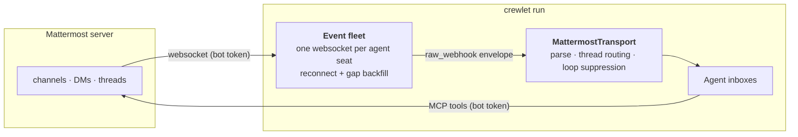

# Mattermost Integration

Mattermost is the **self-hosted, open-source** chat backend: one bot account
per agent, on a server you run. It is the alternative to
[Slack](slack.md) for orgs that want the conversational surface inside their
own infrastructure.

> **Prerequisites.** A Mattermost server you administer, and a **team** the
> agents will live in. Crewlet never creates top-level tenancy — create the
> server and the team yourself, then let
> [`crewlet mattermost provision`](#automated-setup-crewlet-mattermost-provision)
> fill it with agent bots.
>
> Unlike Slack, the engine does **not** need to be reachable from the chat
> server: it opens outbound websockets rather than receiving webhooks, so a
> Crewlet running on a laptop against a self-hosted Mattermost needs no
> tunnel and no public URL.

---

## How this differs from Slack

One structural difference shapes the whole integration: **Mattermost has no
usable inbound webhook.**

Its outgoing webhooks fire only in *public* channels — the server returns
early for anything that is not `ChannelTypeOpen` — so DMs and private
channels would never be delivered at all. And their payload carries no
`root_id` (no thread attribution), no channel type and no mention list, so
even public-channel traffic could not be routed the way Slack's is.

The supported path for an external service is the **WebSocket event API**,
authenticated per user. So the engine holds **one connection per
Mattermost-enabled agent seat**, and each connection republishes what it
receives onto the same internal envelope every webhook route uses — which is
what lets coalescing, the prompt registry and the dashboard stay unaware that
this source arrived over a socket.



What this buys you, compared with Slack:

| | Slack | Mattermost |
|---|---|---|
| Credentials per agent | 2 (bot token + signing secret) | **1** (bot token) |
| Manual steps per agent | An OAuth **Allow** click, per app | **none** |
| Engine must be publicly reachable | yes (Events API) | **no** |
| Mention detection | inferred from text markup | **server-computed** list |
| Channel vs DM | inferred (`channel_type`, `D`-prefix) | **server-stamped** |
| Working-status text | free text, per phase | fixed *"is typing…"* |

The last row is the one real regression — see
[Working status](#working-status).

---

## Configure in YAML

`integrations.mattermost` enables the transport and the websocket fleet. The
Mattermost **MCP tool** server is a separate `mcp_servers` entry
(`shared: false`). Per agent, the same `${VAR}` names the token in both
places — one credential, three readers (websocket, REST, MCP), no secret
duplicated:

```yaml
integrations:
  mattermost:
    enabled: true
    url: "https://chat.nimbus.example"    # instance base URL (required)
    team: nimbus                          # team slug (required)
    typing_status: off                    # off (default) | addressed | always
    provisioning:              # consumed ONLY by the CLI, ignored by the engine
      username_prefix: ""      # e.g. "agent-" if humans share the server
      channels: [town-square, engineering]   # channels every bot joins
      display_name_suffix: " (AI)"

mcp_servers:
  - name: mattermost
    shared: false                        # per-agent identity
    command: uvx
    args: ["mcp-server-mattermost"]
    env:
      MATTERMOST_URL: "https://chat.nimbus.example"
    tool_prefix: "mattermost_"

units:
  - name: Core
    type: team
    lead: Engineer
    roles:
      - name: Engineer
        integrations:                              # per-agent transport identity
          mattermost:
            bot_token: "${MATTERMOST_TOKEN_ENGINEER}"
            channel: engineering                   # optional default channel
        mcp_env:
          mattermost:
            MATTERMOST_TOKEN: "${MATTERMOST_TOKEN_ENGINEER}"   # same token
```

Write this block **first**, with `${VAR}` placeholders — the provisioner
reads the placeholder names out of the YAML and mints exactly those
variables. A whole-value placeholder is required
(`"${MATTERMOST_TOKEN_ENGINEER}"`, not a literal token) so the provisioner
knows which variable to write into; a literal marks a manually managed bot,
which is reported and left untouched.

### Fields

| Field | Meaning |
|---|---|
| `url` | Instance base URL. Required when enabled. |
| `team` | Team slug agents belong to. Required — channels are team-scoped. |
| `typing_status` | `off` (default) / `addressed` / `always`. See [Working status](#working-status). |
| `provisioning.username_prefix` | Prepended to each handle to form the bot username. |
| `provisioning.channels` | Channels every agent bot is added to. |
| `provisioning.display_name_suffix` | Appended to each bot's display name. |

Per role, under `integrations.mattermost`:

| Field | Meaning |
|---|---|
| `bot_token` | The bot's personal access token. `${VAR}` ⇒ provisionable. |
| `username` | Bot username. Defaults to the handle (with the prefix applied). |
| `channel` | Optional default channel name for outbound notifications. |

There is deliberately **no `status_phrases`** here: Mattermost's indicator
wording belongs to the client, so no text the engine supplied would ever be
rendered. The setting exists only under `integrations.slack`.

---

## Automated Setup: `crewlet mattermost provision`

```
export MATTERMOST_ADMIN_TOKEN="..."      # a system-admin personal access token
crewlet mattermost provision company.yaml
```

For every Mattermost-enabled agent seat the command:

1. **finds or creates the bot account** at a deterministic username
   (`{username_prefix}{handle}`, or an explicit `username`);
2. **re-enables it** if a previous decommission disabled it — a disabled bot
   still owns its username, so creating over it fails with a conflict nothing
   else would explain;
3. keeps its **display name** current (`{role name}{display_name_suffix}`);
4. adds it to the **team** and to every configured **channel** — a bot only
   receives messages from channels it is a member of, so this is the step
   that makes the integration work at all;
5. mints its **personal access token** into the config's own `${VAR}`,
   write-through (Mattermost returns a token's value exactly once).

There is no app manifest, no local ledger and no OAuth click. Mattermost can
enumerate its own bots, so reconcile is stateless — delete nothing, re-run
freely. One seat failing is recorded as a `FAILED` line and the remaining
agents still provision; the command then exits non-zero, and re-running
resumes exactly the failed seats.

### The admin token

The reconcile authenticates as a **system admin** — creating bot accounts and
minting their access tokens both require it. Generate one under
**Profile → Security → Personal Access Tokens** on a system-admin account.
An admin must first enable personal access tokens in
**System Console → Integrations → Integration Management**.

The token is an *operator* credential and is never read from the company
config: pass `--admin-token` or export `MATTERMOST_ADMIN_TOKEN`.

### Flags

| Flag | Description |
|------|-------------|
| `--admin-token TOKEN` | System-admin PAT (default: `$MATTERMOST_ADMIN_TOKEN`). |
| `--handles a,b` | Only provision these agent handles. |
| `--decommission a,b` | Disable these handles' bots and revoke their tokens. |
| `--dry-run` | Print the plan; create and modify nothing. |
| `--env-file PATH` | Env file minted tokens are written to (default `.env`). |
| `--secret-store` | Write minted tokens into the encrypted `secret_values` table instead. |
| `--print` | Print `export VAR=token` lines to stdout. |

Afterwards, (re)start `crewlet run` so the engine reads the new credentials
and opens each seat's websocket.

### Decommissioning

`--decommission` disables the bot account and revokes its tokens. Disable
rather than delete: the account keeps its history, so channels it posted in
stay readable, and a later provision run re-enables it. The revoked token is
gone, though — a restored seat is minted a fresh one.

### Seats and licensing

Mattermost's unlicensed server enforces a hard **active-user** cap. **Bot
accounts are excluded from that count**, so an agent fleet of any size does
not consume it — the provisioner reports the current human headroom in its
preflight so you can see where you stand:

```
note: server user limit: 12/250 active human users. Bot accounts are
      excluded from this count, so agent seats do not consume it.
```

Worth knowing that the exclusion is an implementation detail of the seat
query rather than a licensing commitment, and that the cap itself has been
lowered several times across releases. If your org approaches the human
limit, that is the number to watch — not the agent count.

---

## How Mattermost Routing Works

### Inbound

1. A human posts in a channel the bot is a member of, or DMs it.
2. Mattermost pushes a `posted` event down that bot's websocket.
3. The fleet republishes it onto `crewlet.notifications.inbound`.
4. `MattermostTransport` parses it, applies thread routing and loop
   suppression, and produces a notification.
5. NotificationService resolves handle → agent and publishes to
   `crewlet.agent.{handle}.inbox`.

#### Which events wake an agent

Only `posted` / `post_edited` events carrying user-visible content. Skipped
with a recorded reason (a `NotificationSkipped` event):

- **`system_*` posts** — joins, leaves, header/purpose changes, channel
  renames. They carry text, but the text is *about* the channel rather than
  addressed to anyone.
- **Deleted posts** (`delete_at` set).
- **The agent's own posts** — compared against its resolved user id. Its own
  thread replies still record participation, so replying subscribes it to
  what comes back.
- **Empty posts** — an upload with no comment renders as
  `(shared 2 files)` rather than a blank body, so a genuine post is never
  delivered empty.

### Reconnects and the gap

Mattermost's websocket **replays nothing**: a connection that drops and comes
back has simply missed whatever happened in between, with no cursor,
sequence gap or resume token to detect it with.

Each seat therefore records the newest post it has seen and, on reconnect,
re-reads every channel it is a member of since that point and replays the gap
in order. Every channel is read, not only ones with prior traffic — a message
in a channel the bot was invited to *during* the outage would otherwise be
invisible forever. Duplicates across the boundary are caught by a per-seat
de-duplication ring.

The window is bounded at **15 minutes**. Backfill exists to cover a blip — a
network drop, a rolling Mattermost restart, a brief engine pause — not to
catch up after an outage: every replayed message costs a full agent turn, and
an hour of replayed conversation would be both expensive and wrong, because
those conversations have moved on. A wider gap is logged with the amount
skipped rather than silently truncated:

```
mattermost_backfill_window_exceeded handle=engineer skipped_seconds=3612.4
```

Reconnect backoff is capped at 5 minutes. A seat that cannot connect is a
configuration problem an operator has to see, so the retry stays visible in
the logs rather than backing off into silence.

### Outbound

All Mattermost capabilities — messaging, threading, search, reactions — come
from **MCP tools** powered by the agent's own bot token. Messages post with
the agent's own bot identity. `MattermostTransport.send()` exists as the
transport-agnostic fallback for notifications routed through the
notification service.

---

## Thread Routing

Identical in shape to Slack's, on Mattermost's own primitives. Top-level
channel messages are always delivered; thread replies only reach agents
**following** that thread.

**Follow triggers:**

1. **Direct mention** — the server-computed `mentions` list contains the
   bot's user id. This is exact, and it resolves `@all` / `@channel` /
   `@here` against real channel membership.
2. **Collective address** — the server included this bot via a channel-wide
   mention; recorded as `collective`, which is weaker than being named.
3. **DM** — a direct or group-DM channel always follows. There is nobody
   else the message could be for.
4. **Participation** — the agent posts in the thread.

The thread key is `root_id`, which is immutable and equals the parent post's
id — so the follow model maps 1:1 onto the one Slack uses. State is persisted
in PostgreSQL (`chat_thread_follows`, rows keyed `backend = 'mattermost'`) and
survives engine restarts.

For **backfilled** posts the mention list is unavailable (they are re-read
over REST), so a literal `@username` grammar is used as the fallback.

---

## Working status

Mattermost's only working indicator is the composer typing line, whose
wording is fixed by the client. The engine can raise it, but cannot say
anything with it — so unlike Slack there are no per-phase phrases, and
`typing_status` **defaults to `off`**.

Two reasons for that default:

- It conveys only *busy*, where Slack's line carries the phase the agent is
  in. A fixed "is typing…" held for a five-minute turn tells a reader less
  than the absence of one would.
- It has to be re-asserted every few seconds rather than every 45, so a
  multi-minute turn costs one to two orders of magnitude more requests for
  strictly less information.

If you want it anyway, set `typing_status: addressed` (or `always`). The
heartbeat interval is **derived from the server's own
`TimeBetweenUserTypingUpdatesMilliseconds`** setting rather than hardcoded:
re-asserting faster than the server's throttle is silently dropped, and much
slower leaves a visible gap. Tune the server setting and the engine follows.

| Mode | Shows the status when… |
|---|---|
| `off` *(default)* | never |
| `addressed` | a DM, a direct mention, or a thread the agent already follows |
| `always` | every Mattermost-triggered turn |

---

## Reaching humans on Mattermost

When an agent escalates to a [human seat](../concepts/humans-in-the-org.md),
it DMs the human with **its own** bot token — the same credential it uses for
every other message. There is no org-level "system" account: the engine never
sends as itself.

Give the human seat a `contact.mattermost_user_id` — the **username**, not
the 26-character user id, because Mattermost mentions address a person by
name and the name is what an agent has to write for the mention to render:

```yaml
roles:
  - name: Jane Founder
    kind: human
    manages: [CEO]
    contact:
      mattermost_user_id: jane
```

---

## Local testing

Mattermost ships in this repo's `docker-compose.yml` behind a profile, like
GitLab and Plane — one compose file for everything, and `docker compose up`
leaves it out:

```bash
docker compose --profile mattermost up -d --wait
scripts/mattermost-dev-bootstrap.sh
```

The bootstrap waits for the server, creates the admin account (the **first**
user on a fresh install is auto-promoted to system admin — that is the
account the provisioner authenticates as), mints its personal access token,
creates the `nimbus` team and its channels, and writes `MATTERMOST_URL` +
`MATTERMOST_ADMIN_TOKEN` into `.env`. Every step is idempotent, so re-run it
freely.

Provision the agent bots in the same run by pointing it at a company config:

```bash
COMPANY=my_company.yaml scripts/mattermost-dev-bootstrap.sh
```

### First run, end to end

The example org in `examples/nimbus.company.yaml` is **not** the shortest way
to try this. It sets `integrations.plane.enabled: true` and
`integrations.gitlab.enabled: true`, so loading it needs the whole Plane
stack and a GitLab — a lot of infrastructure to stand up before you can send
one chat message. Adding Mattermost to Nimbus is a supported thing to do
(chat backends run alongside each other, and alongside Slack), but do it
*after* you have seen the loop work.

For a first run, use a two-agent config that enables nothing but chat. Save
this as `mm-company.yaml`:

```yaml
name: "Mattermost Test Co"
mission: "Verify the Mattermost chat backend end to end"

providers:
  llm:
    default:
      type: anthropic
      model: claude-sonnet-5
      api_keys:
        - "${ANTHROPIC_API_KEY}"

integrations:
  mattermost:
    enabled: true
    url: "${MATTERMOST_URL}"     # written by the bootstrap
    team: nimbus                 # the team the bootstrap creates
    typing_status: addressed     # off by default; on here so you can see it
    provisioning:
      channels: [town-square, engineering, product]
      display_name_suffix: " (AI)"

mcp_servers:
  # How the agents reply. Without this they receive messages and plan a
  # response, but have no tool to send one with.
  - name: mattermost
    shared: false                # per-agent identity
    command: uvx
    args: ["mcp-server-mattermost"]
    env:
      MATTERMOST_URL: "${MATTERMOST_URL}"
    tool_prefix: "mattermost_"

roles:
  # You, in the chart, so escalation has a person to stop at. `founder` is
  # the admin username the bootstrap creates.
  - name: Founder
    kind: human
    manages: [Agent PM]
    contact:
      mattermost_user_id: founder

units:
  - name: Core
    type: team
    lead: Agent PM
    purpose: "Answer questions and coordinate work in chat"
    roles:
      - name: Agent PM
        goal: "Triage what arrives in chat and answer or delegate"
        backstory: "A crisp product manager who replies briefly and clearly"
        manages: [Agent SWE]
        integrations:
          mattermost:
            bot_token: "${MATTERMOST_TOKEN_PM}"
            channel: engineering
        mcp_env:
          mattermost:
            MATTERMOST_TOKEN: "${MATTERMOST_TOKEN_PM}"

      - name: Agent SWE
        goal: "Answer engineering questions asked in chat"
        backstory: "A pragmatic engineer who explains things without hedging"
        integrations:
          mattermost:
            bot_token: "${MATTERMOST_TOKEN_SWE}"
            channel: engineering
        mcp_env:
          mattermost:
            MATTERMOST_TOKEN: "${MATTERMOST_TOKEN_SWE}"
```

The role names are what name the bot accounts: handles derive from them, so
`Agent PM` becomes `agent-pm` and the bot is created as `@agent-pm`. Leave
`provisioning.username_prefix` unset here — with handles that already start
with `agent-`, a prefix would produce `@agent-agent-pm`.

Then, from the repo root:

```bash
# 1. Postgres + Pulsar, then Mattermost
docker compose up -d --wait
docker compose --profile mattermost up -d --wait

# 2. Admin account, PAT, team, channels -> .env
scripts/mattermost-dev-bootstrap.sh

# 3. Check the plan before it touches the server
set -a; . ./.env; set +a
crewlet mattermost provision mm-company.yaml --dry-run --print

# 4. Create the bots and mint their tokens into .env
crewlet mattermost provision mm-company.yaml

# 5. Boot — one websocket per agent seat
export ANTHROPIC_API_KEY=sk-ant-...
crewlet run examples/nimbus.config.yaml --import-company mm-company.yaml
```

Step 3 prints one line per seat — handle, bot username, and the variables it
would mint. Step 4 writes `MATTERMOST_TOKEN_PM` and `MATTERMOST_TOKEN_SWE`
into `.env`, which the engine reads on boot; nothing has to be re-sourced.
Both steps are idempotent, so re-run either freely.

To watch it work, sign in at <http://localhost:8065> as `founder` /
`crewlet-dev-password`, open `~engineering`, and post `@agent-pm what are you
working on?`. Three things should follow, in order:

1. The working-status indicator appears under `@agent-pm` (that is
   `typing_status: addressed`).
2. `@agent-pm` replies **in a thread** on your message. Reply in that thread
   without mentioning anyone — it answers again, because it is now following
   the thread.
3. The engine's dashboard shows the turn. Start the API with
   `crewlet run … --api-port 8000` and open <http://localhost:8000> —
   Activity shows the inbound notification with a Mattermost badge, and the
   agent's LLM calls are on its Agents page.

If a bot stays silent, check in this order:

1. `crewlet mattermost provision mm-company.yaml --dry-run` — does the seat
   exist, and is its token minted?
2. The engine log, for one `mattermost_ws_connected` line per seat. A
   `mattermost_ws_auth_rejected` line instead means that seat's token is
   wrong, revoked, or its bot is disabled — re-run the provisioner.
3. Whether `uvx mcp-server-mattermost` resolves. A missing MCP server is the
   one failure mode where the agent reasons about a reply and then has no
   tool to send it with, so the logs show a complete turn and the channel
   stays quiet.

Three settings the compose service sets are load-bearing rather than
convenience. All three default to `false` in the server's own config
defaults, and the paved path needs each:

| Setting | Needed by |
|---|---|
| `ServiceSettings.EnableBotAccountCreation` | `crewlet mattermost provision` — creating the bot accounts |
| `ServiceSettings.EnableUserAccessTokens` | `crewlet mattermost provision` — minting their tokens |
| `TeamSettings.EnableOpenServer` | the bootstrap script — creating the admin over the API |

If you point Crewlet at a Mattermost you host yourself, enable the first two
under **System Console → Integrations → Integration Management** (the third
is only needed for the scripted first-run signup — create the admin by hand
instead and you can leave it closed).

Unlike the GitLab and Plane loops, **nothing has to reach the engine**. Those
two POST webhooks into it, so they need `host.docker.internal` and a
reachable address; Mattermost never calls the engine at all. The whole loop
works behind NAT with no tunnel.

On a remote host, set `MATTERMOST_PUBLIC_URL` (both the compose file and the
bootstrap read it) so the server's own links carry that address:

```bash
MATTERMOST_PUBLIC_URL=http://203.0.113.7:8065 docker compose --profile mattermost up -d --wait
MATTERMOST_PUBLIC_URL=http://203.0.113.7:8065 scripts/mattermost-dev-bootstrap.sh
```

---

## Programmatic Setup

```python
from crewlet.notifications.transports.mattermost import (
    MattermostBotConfig,
    MattermostTransport,
)
from crewlet.notifications.typing_status import WorkingStatusMode

transport = MattermostTransport(
    base_url="https://chat.nimbus.example",
    team="nimbus",
    typing_status_mode=WorkingStatusMode.OFF,
)
transport.register_bot("engineer", MattermostBotConfig(
    bot_token="...",
    username="agent-engineer",
    channel="engineering",
))

engine = Engine(organization=org, notification_transports=[transport])
```

The engine registers per-agent bots from `role.integrations.mattermost`
during `start()`, and supplies the event queue the websocket fleet publishes
on.
